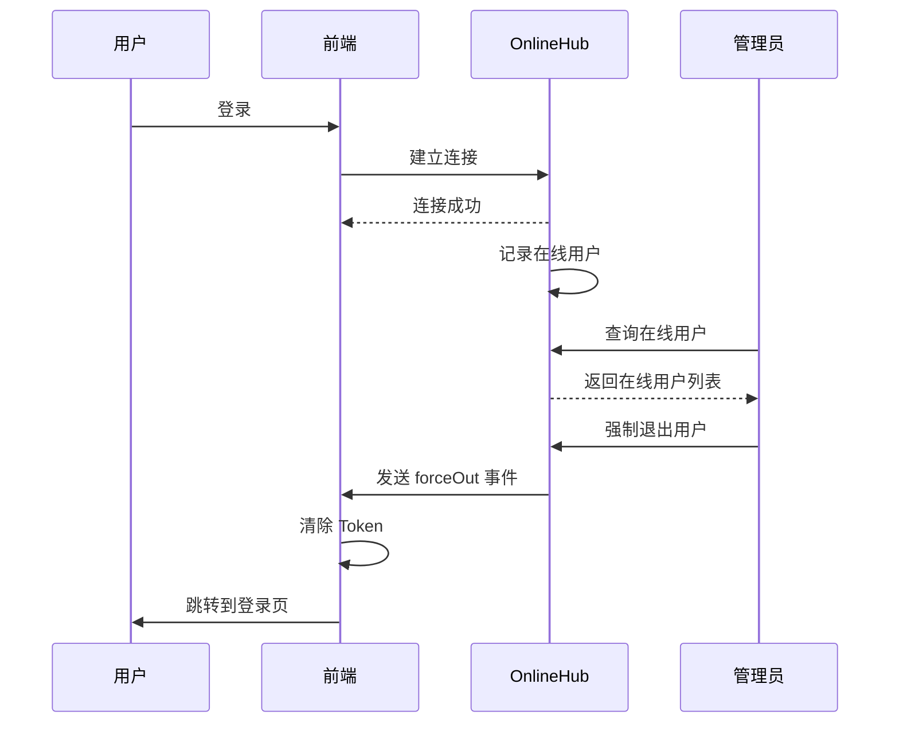

# 监控 API 文档

## 概述

本文档详细说明 RBAC 模块中的系统监控功能，包括在线用户管理、服务器监控、缓存监控和 SignalR Hub 实时通信。

## 基础路径

```
/api/app/rbac
```

---

## 在线用户管理

### 获取在线用户列表

**接口**: `GET /api/app/rbac/online`

**描述**: 获取当前在线用户列表，支持条件查询。

**权限**: `monitor:online:list`

**请求参数**:

```typescript
interface OnlineUserQuery {
  userName?: string;          // 用户名（模糊查询）
  ipaddr?: string;             // IP地址（模糊查询）
}
```

**响应示例**:
```json
{
  "result": {
    "totalCount": 5,
    "items": [
      {
        "connectionId": "3fa85f64-5717-4562-b3fc-2c963f66afa6",
        "userName": "admin",
        "nickName": "管理员",
        "ipaddr": "192.168.1.100",
        "browser": "Chrome 120",
        "os": "Windows 10",
        "loginTime": "2024-01-01T08:00:00Z",
        "location": "广东省深圳市"
      }
    ]
  }
}
```

---

### 强制退出用户

**接口**: `DELETE /api/app/rbac/online/{connectionId}`

**描述**: 强制指定用户下线。

**权限**: `monitor:online:force-out`

**路径参数**:

| 参数 | 类型 | 说明 |
|-----|------|------|
| connectionId | string | SignalR 连接ID |

**响应**: `boolean`（true=成功，false=失败）

**实现原理**:
1. 管理员调用强制退出接口
2. 后端通过 SignalR Hub 向指定连接发送 `forceOut` 事件
3. 前端收到事件后自动执行登出操作
4. 用户被强制退出到登录页面

---

## 服务器监控

### 获取服务器信息

**接口**: `GET /api/app/rbac/monitor-server/info`

**描述**: 获取服务器的运行状态和性能指标。

**权限**: `monitor:server:info`

**响应示例**:
```json
{
  "result": {
    "computer": {
      "computerName": "WEB-SERVER-01",
      "osName": "Windows Server 2019",
      "osArch": "64-bit",
      "processorCount": 8
    },
    "jvm": {
      "name": ".NET Runtime",
      "version": "8.0.0",
      "startTime": "2024-01-01T00:00:00Z",
      "runTime": "5 days 10 hours",
      "memory": {
        "total": 2147483648,
        "used": 1073741824,
        "free": 1073741824
      }
    },
    "disk": {
      "total": 107374182400,
      "used": 53687091200,
      "free": 53687091200,
      "usage": 50.0
    },
    "cpu": {
      "coreCount": 8,
      "usage": 45.5
    },
    "memory": {
      "total": 8589934592,
      "used": 5158993888,
      "free": 3430940704,
      "usage": 60.0
    }
  }
}
```

**数据结构说明**:

```typescript
interface ServerInfo {
  computer: {
    computerName: string;      // 计算机名称
    osName: string;            // 操作系统名称
    osArch: string;            // 操作系统架构
    processorCount: number;    // 处理器数量
  };
  jvm: {
    name: string;              // 运行时名称
    version: string;           // 运行时版本
    startTime: Date;           // 启动时间
    runTime: string;           // 运行时长
    memory: {
      total: number;           // 总内存（字节）
      used: number;            // 已用内存（字节）
      free: number;            // 可用内存（字节）
    };
  };
  disk: {
    total: number;             // 磁盘总空间（字节）
    used: number;              // 已用空间（字节）
    free: number;              // 可用空间（字节）
    usage: number;             // 使用率（百分比）
  };
  cpu: {
    coreCount: number;         // CPU核心数
    usage: number;             // CPU使用率（百分比）
  };
  memory: {
    total: number;             // 物理内存总空间（字节）
    used: number;              // 已用内存（字节）
    free: number;              // 可用内存（字节）
    usage: number;             // 内存使用率（百分比）
  };
}
```

---

## 缓存监控

缓存监控功能仅在使用 Redis 缓存时可用。如果后端使用内存缓存，这些接口将返回错误提示。

### 获取所有缓存名称

**接口**: `GET /api/app/rbac/monitor-cache/name`

**描述**: 获取 Redis 中所有缓存的名称分组列表。

**权限**: `monitor:cache:list`

**响应示例**:
```json
{
  "result": [
    {
      "cacheName": "UserInfo"
    },
    {
      "cacheName": "Permission"
    },
    {
      "cacheName": "Menu"
    },
    {
      "cacheName": "Dictionary"
    }
  ]
}
```

---

### 获取缓存键列表

**接口**: `GET /api/app/rbac/monitor-cache/key/{cacheName}`

**描述**: 获取指定缓存名称下的所有缓存键。

**权限**: `monitor:cache:list`

**路径参数**:

| 参数 | 类型 | 说明 |
|-----|------|------|
| cacheName | string | 缓存名称 |

**响应示例**:
```json
{
  "result": [
    "user:3fa85f64-5717-4562-b3fc-2c963f66afa6",
    "user:4fa85f64-5717-4562-b3fc-2c963f66afa7",
    "user:5fa85f64-5717-4562-b3fc-2c963f66afa8"
  ]
}
```

---

### 获取缓存值

**接口**: `GET /api/app/rbac/monitor-cache/value/{cacheName}/{cacheKey}`

**描述**: 获取指定缓存键的值。

**权限**: `monitor:cache:query`

**路径参数**:

| 参数 | 类型 | 说明 |
|-----|------|------|
| cacheName | string | 缓存名称 |
| cacheKey | string | 缓存键名 |

**响应示例**:
```json
{
  "result": {
    "cacheName": "UserInfo",
    "cacheKey": "3fa85f64-5717-4562-b3fc-2c963f66afa6",
    "cacheValue": "{\"userId\":\"...\",\"userName\":\"admin\",\"nickName\":\"管理员\"}"
  }
}
```

**数据结构说明**:

```typescript
interface MonitorCacheGetListOutputDto {
  cacheName: string;           // 缓存名称
  cacheKey: string;            // 缓存键名
  cacheValue: string;          // 缓存值（JSON字符串）
}
```

---

### 删除缓存键

**接口**: `DELETE /api/app/rbac/monitor-cache/key/{cacheName}`

**描述**: 删除指定缓存名称下的所有键。

**权限**: `monitor:cache:remove`

**路径参数**:

| 参数 | 类型 | 说明 |
|-----|------|------|
| cacheName | string | 缓存名称 |

**响应**: `boolean`（true=成功，false=失败）

---

### 删除缓存值

**接口**: `DELETE /api/app/rbac/monitor-cache/value/{cacheName}/{cacheKey}`

**描述**: 删除指定的缓存键。

**权限**: `monitor:cache:remove`

**路径参数**:

| 参数 | 类型 | 说明 |
|-----|------|------|
| cacheName | string | 缓存名称 |
| cacheKey | string | 缓存键名 |

**响应**: `boolean`（true=成功，false=失败）

---

### 清空所有缓存

**接口**: `DELETE /api/app/rbac/monitor-cache/clear`

**描述**: 清空所有 Redis 缓存数据。

**权限**: `monitor:cache:clear`

**警告**: 此操作将清空所有缓存数据，可能导致性能下降，请谨慎使用。

**响应**: `boolean`（true=成功，false=失败）

---

## SignalR Hub 实时通信

系统使用 SignalR 实现实时通信，支持在线用户管理和通知推送。

### OnlineHub

在线用户 Hub，用于管理在线用户连接和强制退出。

**连接地址**:
```
/hubs/online
```

#### 客户端事件

##### forceOut

**描述**: 当管理员强制退出用户时，客户端会收到此事件。

**事件参数**:
```typescript
{
  message: string;  // 强制退出消息（如"你已被强制退出！"）
}
```

**前端处理示例**:
```typescript
// 建立连接
const connection = new HubConnectionBuilder()
  .withUrl('/hubs/online')
  .build();

// 监听强制退出事件
connection.on('forceOut', (message: string) => {
  console.log('收到强制退出消息:', message);
  
  // 显示提示
  alert(message);
  
  // 清除本地存储的 Token
  localStorage.removeItem('token');
  localStorage.removeItem('refreshToken');
  
  // 跳转到登录页面
  window.location.href = '/login';
});

// 启动连接
connection.start().catch(err => console.error(err));
```

#### 在线用户管理流程



---

### NoticeHub

通知公告 Hub，用于实时推送通知公告。

**连接地址**:
```
/hubs/notice
```

#### 服务端方法

##### SendOnline

**描述**: 向所有在线用户发送上线通知。

**参数**:
```typescript
{
  noticeId: Guid;     // 通知ID
  title: string;      // 通知标题
  content: string;    // 通知内容
}
```

##### SendOffline

**描述**: 向所有在线用户发送下线通知。

**参数**: 同 `SendOnline`

#### 客户端事件

##### ReceiveNotice

**描述**: 接收服务器推送的通知。

**事件参数**:
```typescript
{
  noticeId: Guid;     // 通知ID
  title: string;      // 通知标题
  content: string;    // 通知内容
  createTime: Date;   // 创建时间
}
```

**前端处理示例**:
```typescript
// 建立连接
const connection = new HubConnectionBuilder()
  .withUrl('/hubs/notice')
  .build();

// 监听接收通知事件
connection.on('ReceiveNotice', (notice: any) => {
  console.log('收到新通知:', notice);
  
  // 显示通知提示
  showNotification({
    title: notice.title,
    message: notice.content,
    duration: 5000
  });
  
  // 刷新通知列表
  fetchNoticeList();
});

// 启动连接
connection.start().catch(err => console.error(err));
```

---

## 前端使用示例

### 获取在线用户列表

```typescript
const response = await fetch('/api/app/rbac/online', {
  headers: {
    'Authorization': `Bearer ${token}`
  }
});

const data = await response.json();
console.log(data.result.items);  // 在线用户列表
```

### 强制退出用户

```typescript
const response = await fetch(`/api/app/rbac/online/${connectionId}`, {
  method: 'DELETE',
  headers: {
    'Authorization': `Bearer ${token}`
  }
});

const result = await response.json();
console.log(result.result);  // true=成功，false=失败
```

### 获取服务器信息

```typescript
const response = await fetch('/api/app/rbac/monitor-server/info', {
  headers: {
    'Authorization': `Bearer ${token}`
  }
});

const serverInfo = await response.json();
console.log(serverInfo.result);  // 服务器信息
```

### 获取缓存名称列表

```typescript
const response = await fetch('/api/app/rbac/monitor-cache/name', {
  headers: {
    'Authorization': `Bearer ${token}`
  }
});

const data = await response.json();
console.log(data.result);  // 缓存名称列表
```

### 获取缓存键列表

```typescript
const response = await fetch('/api/app/rbac/monitor-cache/key/UserInfo', {
  headers: {
    'Authorization': `Bearer ${token}`
  }
});

const data = await response.json();
console.log(data.result);  // 缓存键列表
```

### 获取缓存值

```typescript
const response = await fetch('/api/app/rbac/monitor-cache/value/UserInfo/user-id', {
  headers: {
    'Authorization': `Bearer ${token}`
  }
});

const data = await response.json();
const cacheValue = JSON.parse(data.result.cacheValue);
console.log(cacheValue);  // 缓存值对象
```

### 删除缓存键

```typescript
const response = await fetch('/api/app/rbac/monitor-cache/value/UserInfo/user-id', {
  method: 'DELETE',
  headers: {
    'Authorization': `Bearer ${token}`
  }
});

const result = await response.json();
console.log(result.result);  // true=成功，false=失败
```

### 清空所有缓存

```typescript
if (confirm('确定要清空所有缓存吗？此操作可能导致系统性能下降。')) {
  const response = await fetch('/api/app/rbac/monitor-cache/clear', {
    method: 'DELETE',
    headers: {
      'Authorization': `Bearer ${token}`
    }
  });

  const result = await response.json();
  if (result.result) {
    alert('缓存清空成功');
  }
}
```

---

## SignalR 集成示例

### 完整的 SignalR 客户端实现

```typescript
import { HubConnectionBuilder, LogLevel } from '@microsoft/signalr';

class SignalRService {
  private onlineConnection: signalR.HubConnection;
  private noticeConnection: signalR.HubConnection;

  constructor() {
    // 初始化在线用户 Hub
    this.onlineConnection = new HubConnectionBuilder()
      .withUrl('/hubs/online', {
        accessTokenFactory: () => localStorage.getItem('token') || ''
      })
      .configureLogging(LogLevel.Information)
      .withAutomaticReconnect()
      .build();

    // 初始化通知 Hub
    this.noticeConnection = new HubConnectionBuilder()
      .withUrl('/hubs/notice', {
        accessTokenFactory: () => localStorage.getItem('token') || ''
      })
      .configureLogging(LogLevel.Information)
      .withAutomaticReconnect()
      .build();

    // 注册事件处理器
    this.registerEvents();
  }

  private registerEvents() {
    // 在线用户 Hub 事件
    this.onlineConnection.on('forceOut', (message: string) => {
      console.log('收到强制退出消息:', message);
      this.handleForceOut(message);
    });

    // 通知 Hub 事件
    this.noticeConnection.on('ReceiveNotice', (notice: any) => {
      console.log('收到新通知:', notice);
      this.handleReceiveNotice(notice);
    });
  }

  private handleForceOut(message: string) {
    alert(message);
    localStorage.removeItem('token');
    localStorage.removeItem('refreshToken');
    window.location.href = '/login';
  }

  private handleReceiveNotice(notice: any) {
    // 显示通知
    showNotification({
      title: notice.title,
      message: notice.content,
      duration: 5000
    });

    // 触发事件，让其他组件响应
    window.dispatchEvent(new CustomEvent('notice-received', { detail: notice }));
  }

  async start() {
    try {
      await this.onlineConnection.start();
      console.log('在线用户 Hub 连接成功');

      await this.noticeConnection.start();
      console.log('通知 Hub 连接成功');
    } catch (error) {
      console.error('SignalR 连接失败:', error);
    }
  }

  async stop() {
    try {
      await this.onlineConnection.stop();
      await this.noticeConnection.stop();
      console.log('SignalR 连接已关闭');
    } catch (error) {
      console.error('SignalR 关闭失败:', error);
    }
  }
}

// 创建全局实例
export const signalRService = new SignalRService();

// 在应用启动时连接
signalRService.start();
```

---

## 注意事项

1. **Redis 依赖**: 缓存监控功能需要后端使用 Redis 缓存，如果使用内存缓存，相关接口将不可用
2. **权限控制**: 监控功能需要相应的权限才能访问，请确保用户具有正确的权限
3. **强制退出**: 强制退出用户后，该用户的所有操作将失效，需要重新登录
4. **缓存清空**: 清空所有缓存可能导致系统性能下降，建议在非业务高峰期操作
5. **SignalR 连接**: SignalR 连接需要携带有效的 JWT Token，连接会自动重连
6. **实时通知**: 通知推送功能需要用户保持在线状态才能接收

---

## 相关文档

- [[AdminAPI索引]] - RBAC 管理端 API 总览
- [[用户角色菜单API]] - 用户、角色、菜单管理 API 文档
- [[系统配置API]] - 系统配置与日志 API 文档
- [[SignalR集成]] - SignalR 实时通信集成文档
- [[缓存系统设计]] - 缓存系统设计文档
