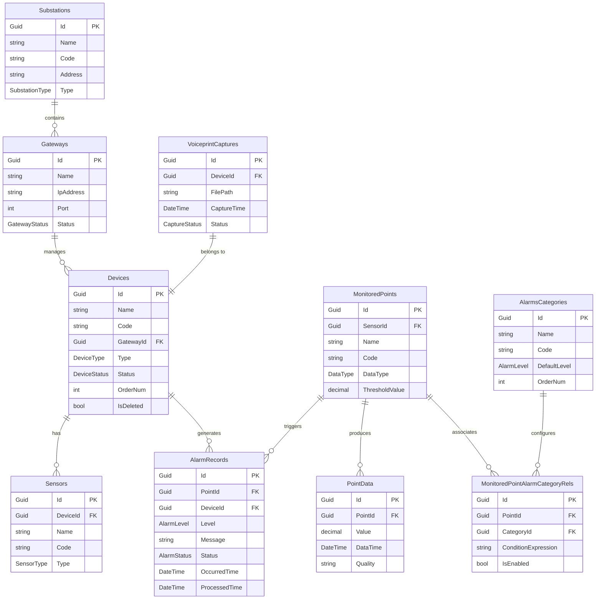

# 数据库设计

## 概述

IntelliSubstation 系统采用 **CodeFirst** 迁移机制，支持多种数据库类型，通过 SqlSugar ORM 实现数据访问层的抽象和统一。

## 数据库架构

### 支持的数据库

| 数据库类型 | 适用场景 | 连接字符串示例 |
|-----------|---------|---------------|
| **SQLite** | 边缘设备、低资源环境 | `Data Source=db/ast_intellisub.db` |
| **MySQL** | 生产环境、高性能需求 | `Server=localhost;Database=ast_intellisub;Uid=root;Pwd=password;` |
| **SQL Server** | 企业级应用 | `Server=.;Database=ast_intellisub;Trusted_Connection=True;` |
| **PostgreSQL** | 开源偏好、高级特性 | `Host=localhost;Database=ast_intellisub;Username=postgres;Password=password;` |
| **Oracle** | 大型企业级应用 | `Data Source=//localhost:1521/orcl;User Id=system;Password=password;` |
| **TDengine** | 时序数据（可选） | `taos://localhost:6030/ast_intellisub` |

### CodeFirst 迁移机制

**自动表创建：**

```csharp
// 在模块初始化时自动创建表
public override void OnApplicationInitializationAsync(ApplicationInitializationContext context)
{
    var db = context.ServiceProvider.GetRequiredService<ISqlSugarClient>();

    // CodeFirst 创建表（如果不存在）
    db.CodeFirst.InitTables<
        Device,
        AlarmRecord,
        VoiceprintCapture,
        PointData
    >();
}
```

**实体定义示例：**

```csharp
// 设备实体
[SugarTable("Devices")]
public class Device : Entity<Guid>, IOrderNum, IState
{
    [SugarColumn(IsPrimaryKey = true, IsIdentity = true)]
    public override Guid Id { get; set; }

    [SugarColumn(Length = 50)]
    public string Name { get; set; }

    [SugarColumn(Length = 50)]
    public string Code { get; set; }

    public Guid GatewayId { get; set; }

    public DeviceType Type { get; set; }

    public DeviceStatus Status { get; set; }

    public int OrderNum { get; set; }

    public bool IsDeleted { get; set; }
}

// 告警记录实体
[SugarTable("AlarmRecords")]
public class AlarmRecord : Entity<Guid>
{
    [SugarColumn(IsPrimaryKey = true, IsIdentity = true)]
    public override Guid Id { get; set; }

    public Guid? PointId { get; set; }

    public Guid? DeviceId { get; set; }

    public AlarmLevel Level { get; set; }

    [SugarColumn(Length = 500)]
    public string Message { get; set; }

    public AlarmStatus Status { get; set; }

    public DateTime OccurredTime { get; set; }

    public DateTime? ProcessedTime { get; set; }
}
```

## 核心表结构

### ERD 图



### 表详细说明

#### 1. 设备相关表

##### Devices（设备表）

| 字段名 | 类型 | 说明 | 约束 |
|--------|------|------|------|
| Id | Guid | 主键 | PK, Identity |
| Name | string(50) | 设备名称 | Not Null |
| Code | string(50) | 设备编码 | Unique |
| GatewayId | Guid | 所属网关 | FK |
| Type | int | 设备类型枚举 | - |
| Status | int | 设备状态枚举 | - |
| OrderNum | int | 排序号 | - |
| IsDeleted | bool | 是否删除 | Default: false |
| CreationTime | DateTime | 创建时间 | Auto |
| ExtraProperties | string | 扩展属性 | JSON |

**索引：**
- `IX_Devices_GatewayId` - 网关查询
- `IX_Devices_Code` - 编码唯一查询
- `IX_Devices_Status` - 状态筛选

##### Gateways（网关表）

| 字段名 | 类型 | 说明 | 约束 |
|--------|------|------|------|
| Id | Guid | 主键 | PK |
| Name | string(50) | 网关名称 | - |
| IpAddress | string(50) | IP 地址 | - |
| Port | int | 端口 | - |
| GatewayType | int | 网关类型 | - |
| Status | int | 在线状态 | - |

##### Substations（变电站表）

| 字段名 | 类型 | 说明 | 约束 |
|--------|------|------|------|
| Id | Guid | 主键 | PK |
| Name | string(100) | 变电站名称 | - |
| Code | string(50) | 变电站编码 | Unique |
| Address | string(200) | 地址 | - |
| Type | int | 变电站类型 | - |
| Capacity | int | 容量（MVA） | - |

##### Sensors（传感器表）

| 字段名 | 类型 | 说明 | 约束 |
|--------|------|------|------|
| Id | Guid | 主键 | PK |
| DeviceId | Guid | 所属设备 | FK |
| Name | string(50) | 传感器名称 | - |
| Code | string(50) | 传感器编码 | - |
| SensorType | int | 传感器类型 | - |
| Unit | string(10) | 计量单位 | - |

#### 2. 监测点位表

##### MonitoredPoints（监测点位表）

| 字段名 | 类型 | 说明 | 约束 |
|--------|------|------|------|
| Id | Guid | 主键 | PK |
| SensorId | Guid | 关联传感器 | FK |
| Name | string(50) | 点位名称 | - |
| Code | string(50) | 点位编码 | - |
| DataType | int | 数据类型 | - |
| UpperLimit | decimal | 上限值 | - |
| LowerLimit | decimal | 下限值 | - |
| Unit | string(10) | 单位 | - |
| IsEnabled | bool | 是否启用 | Default: true |

**关键特性：**
- 支持多数据类型（模拟量、数字量、字符串）
- 可配置告警阈值
- 支持启用/禁用

##### PointData（时序数据表）

| 字段名 | 类型 | 说明 | 约束 |
|--------|------|------|------|
| Id | Guid | 主键 | PK |
| PointId | Guid | 关联点位 | FK, Indexed |
| Value | decimal | 数值 | - |
| StrValue | string(200) | 字符串值 | - |
| DataTime | DateTime | 数据时间 | Indexed |
| Quality | string(20) | 数据质量 | - |
| CreationTime | DateTime | 入库时间 | Auto |

**数据保留策略：**
```csharp
// 配置数据保留期
public class PointDataCleanupOptions
{
    // 实时数据保留天数
    public int RealTimeDataRetentionDays { get; set; } = 7;

    // 历史数据保留天数
    public int HistoryDataRetentionDays { get; set; } = 90;

    // 归档数据保留天数
    public int ArchiveDataRetentionDays { get; set; } = 365;
}
```

**TDengine 集成（可选）：**
```sql
-- TDengine 超级表
CREATE STABLE point_data_stable (
    ts TIMESTAMP,
    val DOUBLE,
    quality NCHAR(20)
) TAGS (point_id BINARY(32), sensor_type INT);

-- 创建子表
CREATE TABLE point_data_001 USING point_data_stable TAGS ('001', 0);
```

#### 3. 告警相关表

##### AlarmRecords（告警记录表）

| 字段名 | 类型 | 说明 | 约束 |
|--------|------|------|------|
| Id | Guid | 主键 | PK |
| PointId | Guid? | 关联点位 | FK, Nullable |
| DeviceId | Guid? | 关联设备 | FK, Nullable |
| AlarmCategoryId | Guid | 告警分类 | FK |
| Level | int | 告警等级 | - |
| Message | string(500) | 告警消息 | - |
| Status | int | 处理状态 | - |
| OccurredTime | DateTime | 发生时间 | Indexed |
| ProcessedTime | DateTime? | 处理时间 | Nullable |
| ProcessedBy | Guid? | 处理人 | FK |
| ConfirmRemark | string(500) | 确认备注 | - |

**告警等级枚举：**
```csharp
public enum AlarmLevel
{
    Info = 0,       // 提示
    Warning = 1,    // 警告
    Critical = 2,   // 严重
    Emergency = 3   // 紧急
}
```

**处理状态枚举：**
```csharp
public enum AlarmStatus
{
    Pending = 0,        // 待处理
    Processing = 1,     // 处理中
    Resolved = 2,       // 已解决
    Ignored = 3,        // 已忽略
    FalseAlarm = 4      // 误报
}
```

##### AlarmsCategories（告警分类表）

| 字段名 | 类型 | 说明 | 约束 |
|--------|------|------|------|
| Id | Guid | 主键 | PK |
| Name | string(50) | 分类名称 | - |
| Code | string(50) | 分类编码 | Unique |
| Description | string(200) | 描述 | - |
| DefaultLevel | int | 默认等级 | - |
| OrderNum | int | 排序号 | - |

##### MonitoredPointAlarmCategoryRels（点位告警配置表）

| 字段名 | 类型 | 说明 | 约束 |
|--------|------|------|------|
| Id | Guid | 主键 | PK |
| PointId | Guid | 监测点位 | FK |
| AlarmCategoryId | Guid | 告警分类 | FK |
| ConditionExpression | string(500) | 告警条件表达式 | - |
| IsEnabled | bool | 是否启用 | - |
| Priority | int | 优先级 | - |

**告警条件表达式示例：**
```
// 温度告警
Value > UpperLimit OR Value < LowerLimit

// 温度上升速率告警
(Value - PrevValue) / TimeDiff > 5.0

// 三相不平衡告警
ABS(PhaseA - PhaseB) > 10 OR ABS(PhaseB - PhaseC) > 10
```

#### 4. 声纹相关表

##### VoiceprintCaptures（声纹采集表）

| 字段名 | 类型 | 说明 | 约束 |
|--------|------|------|------|
| Id | Guid | 主键 | PK |
| DeviceId | Guid | 关联设备 | FK |
| CaptureTaskId | Guid? | 采集任务ID | FK, Nullable |
| FilePath | string(500) | 文件路径 | - |
| FileSize | long | 文件大小（字节） | - |
| Duration | int | 时长（秒） | - |
| CaptureTime | DateTime | 采集时间 | Indexed |
| ProcessStatus | int | 处理状态 | - |
| ProcessResult | string(1000) | 处理结果（JSON） | - |

**处理状态枚举：**
```csharp
public enum CaptureStatus
{
    Pending = 0,      // 待处理
    Processing = 1,   // 处理中
    Completed = 2,    // 已完成
    Failed = 3,       // 处理失败
    Ignored = 4       // 已忽略
}
```

##### VoiceprintLibrary（标准声纹库表）

| 字段名 | 类型 | 说明 | 约束 |
|--------|------|------|------|
| Id | Guid | 主键 | PK |
| Name | string(100) | 声纹名称 | - |
| Category | string(50) | 声纹分类 | - |
| Description | string(500) | 描述 | - |
| FilePath | string(500) | 音频文件路径 | - |
| Features | string | 声纹特征向量 | JSON |
| CreatedTime | DateTime | 创建时间 | - |

#### 5. 巡检相关表

##### PatrolTasks（巡检任务表）

| 字段名 | 类型 | 说明 | 约束 |
|--------|------|------|------|
| Id | Guid | 主键 | PK |
| Name | string(100) | 任务名称 | - |
| Route | string(500) | 巡检路线（JSON） | - |
| CronExpression | string(100) | Cron 表达式 | - |
| IsEnabled | bool | 是否启用 | - |
| LastExecuteTime | DateTime? | 上次执行时间 | - |
| NextExecuteTime | DateTime? | 下次执行时间 | - |

##### PatrolRecords（巡检记录表）

| 字段名 | 类型 | 说明 | 约束 |
|--------|------|------|------|
| Id | Guid | 主键 | PK |
| TaskId | Guid | 关联任务 | FK |
| StartTime | DateTime | 开始时间 | - |
| EndTime | DateTime? | 结束时间 | - |
| Status | int | 执行状态 | - |
| TotalPoints | int | 总点位数 | - |
| CheckedPoints | int | 已检查点位 | - |
| AlarmCount | int | 告警数量 | - |
| Result | string(2000) | 执行结果（JSON） | - |

#### 6. 用户权限表（RBAC）

##### Users（用户表）

| 字段名 | 类型 | 说明 | 约束 |
|--------|------|------|------|
| Id | Guid | 主键 | PK |
| Username | string(50) | 用户名 | Unique |
| Password | string(100) | 密码（加密） | - |
| Nickname | string(50) | 昵称 | - |
| Email | string(100) | 邮箱 | - |
| Phone | string(20) | 手机号 | - |
| IsEnabled | bool | 是否启用 | - |

##### Roles（角色表）

| 字段名 | 类型 | 说明 | 约束 |
|--------|------|------|------|
| Id | Guid | 主键 | PK |
| Name | string(50) | 角色名称 | - |
| Code | string(50) | 角色编码 | Unique |
| Description | string(200) | 描述 | - |

##### UserRoles（用户角色关联表）

| 字段名 | 类型 | 说明 | 约束 |
|--------|------|------|------|
| UserId | Guid | 用户ID | FK, PK |
| RoleId | Guid | 角色ID | FK, PK |

##### Permissions（权限表）

| 字段名 | 类型 | 说明 | 约束 |
|--------|------|------|------|
| Id | Guid | 主键 | PK |
| Code | string(100) | 权限编码 | Unique |
| Name | string(50) | 权限名称 | - |
| Type | int | 权限类型 | - |

##### RolePermissions（角色权限关联表）

| 字段名 | 类型 | 说明 | 约束 |
|--------|------|------|------|
| RoleId | Guid | 角色ID | FK, PK |
| PermissionId | Guid | 权限ID | FK, PK |

## 数据库性能优化

### 索引策略

**高频查询索引：**
```sql
-- 告警查询（按时间、状态、等级）
CREATE INDEX IX_AlarmRecords_OccurredTime_Status_Level
ON AlarmRecords(OccurredTime DESC, Status, Level);

-- 时序数据查询（按点位、时间）
CREATE INDEX IX_PointData_PointId_DataTime
ON PointData(PointId, DataTime DESC);

-- 设备查询（按网关、状态）
CREATE INDEX IX_Devices_GatewayId_Status
ON Devices(GatewayId, Status);
```

### 分区策略（TDengine）

```sql
-- 按时间分区存储
CREATE STABLE point_data_stable (
    ts TIMESTAMP,
    val DOUBLE,
    quality NCHAR(20)
) TAGS (point_id BINARY(32));

-- 自动分区（按天）
-- TDengine 自动按时间分区，无需手动配置
```

### 数据清理策略

**定时清理过期数据：**
```csharp
// PointDataCleanupJob
public class PointDataCleanupJob
{
    protected override async Task ExecuteAsync()
    {
        var cutoffDate = DateTime.Now.AddDays(-_retentionDays);

        // 分批删除（避免锁表）
        const int batchSize = 1000;
        while (true)
        {
            var deleted = await _db.Delete<PointData>()
                .Where(x => x.DataTime < cutoffDate)
                .Take(batchSize)
                .ExecuteCommandAsync();

            if (deleted < batchSize) break;

            await Task.Delay(100); // 释放资源
        }
    }
}
```

## 多租户支持

### 租户隔离策略

**方案 1：分离数据库（推荐）**
```csharp
// 每个租户独立数据库
public class TenantDbContextProvider
{
    public ISqlSugarClient GetDbContext(Guid tenantId)
    {
        var connString = _configuration.GetConnectionString($"Tenant_{tenantId}");
        return new SqlSugarClient(new ConnectionConfig
        {
            ConnectionString = connString,
            DbType = DbType.Sqlite,
            IsAutoCloseConnection = true
        });
    }
}
```

**方案 2：共享数据库，租户标识列**
```csharp
[SugarTable("Devices")]
public class Device : Entity<Guid>, IMultiTenant
{
    public Guid TenantId { get; set; }  // 租户ID

    [TenantIdFilter]  // 自动过滤
    public override Guid Id { get; set; }
}
```

## 数据迁移与版本管理

### 版本控制

```csharp
// 数据库版本表
[SugarTable("__DatabaseVersion")]
public class DatabaseVersion
{
    public string Version { get; set; }  // 如 "1.0.0"
    public DateTime AppliedTime { get; set; }
    public string Description { get; set; }
}

// 迁移脚本
public class Migration_1_0_0_to_1_1_0
{
    public void Up(ISqlSugarClient db)
    {
        // 添加新列
        db.AddColumn("Devices", "NewColumn", "string(200)");

        // 创建新表
        db.CodeFirst.InitTables<NewEntity>();
    }
}
```

### 自动迁移

```csharp
// 应用启动时自动迁移
public override void OnApplicationInitializationAsync(ApplicationInitializationContext context)
{
    var db = context.ServiceProvider.GetRequiredService<ISqlSugarClient>();

    // 检查版本
    var currentVersion = GetCurrentVersion(db);
    var targetVersion = GetTargetVersion();

    // 执行迁移
    if (currentVersion != targetVersion)
    {
        Migrate(db, currentVersion, targetVersion);
    }
}
```

## 备份与恢复

### SQLite 备份

```bash
# 在线备份（通过 SQL）
sqlite3 ast_intellisub.db ".backup 'backup.db'"

# 文件复制备份
cp ast_intellisub.db ast_intellisub_backup_$(date +%Y%m%d).db
```

### MySQL 备份

```bash
# 备份
mysqldump -u root -p ast_intellisub > backup.sql

# 恢复
mysql -u root -p ast_intellisub < backup.sql
```

## 监控与维护

### 慢查询监控

```csharp
// SqlSugar 慢查询日志
public class SlowQueryInterceptor
{
    public void OnExecuting(SqlSugarClient db)
    {
        var startTime = DateTime.Now;

        db.QueryExecuted = (sql, pars) =>
        {
            var duration = DateTime.Now - startTime;
            if (duration.TotalMilliseconds > 1000)
            {
                _logger.LogWarning($"Slow Query: {duration.TotalMilliseconds}ms\nSQL: {sql}");
            }
        };
    }
}
```

### 数据库健康检查

```csharp
// 健康检查端点
public class DatabaseHealthCheck
{
    public async Task<HealthCheckResult> CheckHealthAsync()
    {
        try
        {
            await _db.Queryable<Device>().FirstAsync();
            return HealthCheckResult.Healthy("Database is healthy");
        }
        catch (Exception ex)
        {
            return HealthCheckResult.Unhealthy("Database is unhealthy", ex);
        }
    }
}
```
