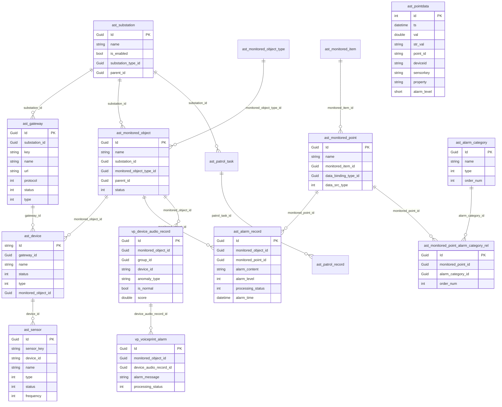

# 数据库设计

## 概述

IntelliSubstation 系统采用 **SqlSugar CodeFirst 初始化表结构**，通过 SqlSugar ORM 实现数据访问层的抽象与多数据库支持；当前没有独立的版本化迁移脚本目录。

实体表名遵循两套命名约定：

- **业务模块表**（`ast-intellisub` / `ast-intellisubdata` / `ast-voiceprint`）：表名使用前缀 + 蛇形命名，如 `ast_device`、`ast_pointdata`、`vp_device_audio_record`；列名通过 `[SugarColumn(ColumnName = "...")]` 显式映射为蛇形命名。
- **框架模块表**（`rbac` / `audit-logging` / `tenant-management` / `setting-management`）：表名使用帕斯卡单数命名，如 `User`、`Role`、`Menu`、`YiAuditLog`、`YiTenant`；列名默认使用属性名（帕斯卡命名）。

## 数据库架构

### 支持的数据库

`appsettings.json` 中 `DbList` 声明了候选数据库类型，`DbConnOptions.DbType` 指定实际使用的类型。

| 数据库类型 | 适用场景 | 连接字符串示例 |
|-----------|---------|---------------|
| **SQLite** | 边缘设备、低资源环境（默认） | `Data Source=db/ast_intellisub.db` |
| **MySQL** | 生产环境、高性能需求 | `Server=localhost;Database=ast_intellisub;Uid=root;Pwd=password;` |
| **SQL Server** | 企业级应用 | `Server=.;Database=ast_intellisub;Trusted_Connection=True;` |
| **PostgreSQL** | HighPerformance 模式默认 | `Host=localhost;Database=ast_intellisub;Username=postgres;Password=password;` |
| **Oracle** | 大型企业级应用 | `Data Source=//localhost:1521/orcl;User Id=system;Password=password;` |
| **TDengine** | 点位时序数据（可选） | `Host=localhost;Port=6030;Database=ast;Username=root;Password=taosdata;`（配置项 `DbConnOptions.TDengineUrl`） |

### 部署模式与数据库

`DbConnOptions.DeploymentMode` 控制数据库拓扑：

- **LowResource**（默认）：单一 SQLite 数据库承载业务数据与点位时序数据。
- **HighPerformance**：PostgreSQL（业务数据）+ TDengine（点位时序数据 `ast_pointdata` 超级表）。

### CodeFirst 初始化机制

- 通过 `DbConnOptions.EnabledCodeFirst = true` 开启自动建表。
- 主业务库由 `YiAbpSqlSugarCoreModule` 聚合各模块的 `*.SqlSugarCore` 实体并初始化。
- 点位时序表 `ast_pointdata` 标注了 `[IgnoreCodeFirst]`，**不**被主库 CodeFirst 扫描，而是由 `AstIntelliSubDataSqlSugarCoreModule` 单独初始化（以兼容 TDengine 超级表模式）。

**实体定义示例（业务模块，蛇形列名 + 显式映射）：**

```csharp
// 采集器设备表（注意：主键为 string 类型）
[SugarTable("ast_device")]
public class DeviceEntity : Entity<string>
{
    [SugarColumn(IsPrimaryKey = true)]
    public override string Id { get; protected set; }

    [SugarColumn(ColumnName = "gateway_id")]
    public Guid GatewayId { get; set; }

    [SugarColumn(ColumnName = "name")]
    public string Name { get; set; }

    [SugarColumn(ColumnName = "status")]
    public DeviceStatusEnum Status { get; set; }

    [SugarColumn(ColumnName = "type", DefaultValue = "0")]
    public DeviceTypeEnum Type { get; set; }

    [SugarColumn(ColumnName = "monitored_object_id")]
    public Guid? MonitoredObjectId { get; set; }
    // ... 摄像头相关字段（camera_*）等
}
```

## 核心表结构

### ERD 图



### 表详细说明

> 列名一栏给出实体映射的物理列名（业务模块为蛇形命名，框架模块为帕斯卡命名）。

#### 1. 站点与设备拓扑（ast-intellisub）

##### ast_substation（站点/变电站表）

| 列名 | 类型 | 说明 | 约束 |
|------|------|------|------|
| Id | Guid | 主键 | PK |
| name | string | 显示名称 | - |
| is_enabled | bool | 是否启用 | 默认 true |
| map_info | text | 站点地图信息（JSON） | 可空 |
| substation_type_id | Guid | 站点类型ID | FK → ast_substation_type |
| parent_id | Guid? | 父级站点ID | 自关联，可空 |
| creation_time / creator_id / last_modification_time / last_modifier_id | - | 审计字段 | - |

##### ast_gateway（网关表）

| 列名 | 类型 | 说明 | 约束 |
|------|------|------|------|
| Id | Guid | 主键 | PK |
| substation_id | Guid | 所属站点 | FK → ast_substation |
| key | string | 网关唯一标识 | - |
| name | string | 显示名称 | - |
| url | string | 网关地址 | - |
| protocol | int | 协议类型（枚举） | - |
| secret | string | 网关密钥 | - |
| status | int | 在线状态（0:离线,1:在线） | - |
| type | int | 类型（0:状态监测网关,1:视觉网关） | - |
| last_heartbeat_time | DateTime? | 最后心跳时间 | 可空 |

##### ast_device（采集器/设备表）

| 列名 | 类型 | 说明 | 约束 |
|------|------|------|------|
| Id | **string** | 主键（设备编号） | PK |
| gateway_id | Guid | 所属网关 | FK → ast_gateway |
| name | string | 显示名称 | - |
| status | int | 在线状态（枚举） | - |
| type / sub_type | int | 设备类型/子类型（枚举） | - |
| hardware_name | string? | 采集器硬件名称 | 可空 |
| nvr_id | string? | 所属录像机ID | 可空 |
| monitored_object_id | Guid? | 关联被监测对象 | 可空 |
| camera_* | - | 摄像头主机/账号/厂商/类型等字段 | 可空 |
| is_display | bool | 是否界面展示 | 默认 true |
| last_heartbeat_time | DateTime? | 最后心跳时间 | 可空 |

##### ast_sensor（传感器/点位采集表）

| 列名 | 类型 | 说明 | 约束 |
|------|------|------|------|
| Id | Guid | 主键 | PK |
| sensor_key | string | 传感器 key | - |
| device_id | **string** | 所属设备 | FK → ast_device |
| name | string | 显示名称 | - |
| type | int | 类型（0:传感器,1:预置点位） | - |
| status | int | 状态（枚举） | - |
| frequency | int? | 采集频率（毫秒） | 可空 |
| preset_no / preset_file_path / preset_ptz | - | 预置位相关 | 可空 |
| is_enabled | bool? | 是否展示 | 默认 false |

#### 2. 监测体系（ast-intellisub）

设备/传感器属于物理采集侧；监测体系（对象/项/点位）属于业务建模侧，二者通过数据绑定关联。

##### ast_monitored_object（被监测对象表）

| 列名 | 类型 | 说明 | 约束 |
|------|------|------|------|
| Id | Guid | 主键 | PK |
| name | string | 名称 | - |
| substation_id | Guid | 所属站点 | FK → ast_substation |
| monitored_object_type_id | Guid | 对象类型 | FK → ast_monitored_object_type |
| parent_id | Guid? | 父级对象 | 自关联，可空 |
| status | int | 状态 | 默认 Normal |
| order_num | int? | 排序号 | 可空 |

##### ast_monitored_item（被监测项表）

| 列名 | 类型 | 说明 | 约束 |
|------|------|------|------|
| Id | Guid | 主键 | PK |
| name | string | 显示名称 | - |
| description | string? | 描述 | 可空 |
| order_num | int? | 排序号 | 可空 |
| icon | string? | 图标 | 可空 |
| is_display | bool | 是否界面展示 | 默认 true |

##### ast_monitored_point（被监测点位表）

| 列名 | 类型 | 说明 | 约束 |
|------|------|------|------|
| Id | Guid | 主键 | PK |
| name | string | 显示名称 | - |
| description | string? | 描述 | 可空 |
| monitored_item_id | Guid | 所属监测项 | FK → ast_monitored_item |
| data_binding_type_id | Guid? | 数据绑定类型 | 可空 |
| data_src_type | int? | 数据来源类型（枚举） | 可空 |
| order_num | int? | 排序号 | 可空 |
| is_display | bool | 是否界面展示 | 默认 true |

> 告警阈值/条件不直接落在点位表上，而是通过 `ast_monitored_point_alarm_category_rel` 与告警类别、以及数据绑定/策略相关表（`ast_data_strategy` 等）配置。

#### 3. 点位时序数据（ast-intellisubdata）

##### ast_pointdata（点位时序数据表 / TDengine 超级表）

同一个实体在两种部署模式下落地为不同物理结构：SQLite 普通表（自增 `id` 主键），或 TDengine 超级表（以 `ts` 为时间主键，`deviceid` / `sensorkey` / `property` 为三级 Tag）。

| 列名 | 类型 | 说明 | 约束 |
|------|------|------|------|
| id | int | 自增主键（关系型数据库） | PK, Identity；TDengine 模式忽略 |
| ts | DateTime(TIMESTAMP) | 事件时间戳 | 非空；TDengine 主键 |
| val | double? | 数值型属性值 | 可空 |
| str_val | string(NCHAR) | 字符串型属性值 | 可空 |
| point_id | string(NCHAR36) | 关联业务点位ID | 非空 |
| group_id | string(NCHAR36) | 批次ID | 可空 |
| value_type | int | 值类型（0:int,1:float,2:string,3:json,4:enum） | 非空 |
| alarm_level | short | 告警级别（0:正常,1:预警,2:告警） | 默认 0 |
| ext_info | string(NCHAR) | 扩展信息 | 可空 |
| deviceid | string | 设备ID（Tag1） | 非空，SQLite 模式建索引 |
| sensorkey | string | 传感器键（Tag2） | 非空，SQLite 模式建索引 |
| property | string | 属性名（Tag3） | 非空，SQLite 模式建索引 |

**数据保留策略（`PointDataCleanupJob` / `PointDataCleanupOptions`）：**

```jsonc
// appsettings.json
"PointDataCleanup": {
  "Enabled": true,
  "CronExpression": "0 0 2 * * *", // 每天凌晨 2 点
  "RetentionDays": 30,             // 保留最近 30 天
  "BatchSize": 500,                // 分批删除，避免锁表
  "EnableDetailedLogging": false,
  "ExcludedSensorKeys": [ "jixie" ] // 永久保留数据的传感器
}
```

#### 4. 告警相关表（ast-intellisub）

##### ast_alarm_record（告警记录表）

| 列名 | 类型 | 说明 | 约束 |
|------|------|------|------|
| Id | Guid | 主键 | PK |
| monitored_object_id | Guid | 关联被监测对象 | FK → ast_monitored_object |
| monitored_point_id | Guid | 关联被监测点位 | FK → ast_monitored_point |
| alarm_content | text | 告警内容 | - |
| alarm_level | int | 告警级别（枚举） | - |
| processing_status | int | 处理状态（枚举） | - |
| alarm_time | DateTime | 告警时间 | - |
| remarks | string? | 备注 | 可空 |
| creation_time / creator_id / last_modification_time / last_modifier_id | - | 审计字段 | - |

**告警级别枚举（`AlarmLevelEnum`）：**
```csharp
public enum AlarmLevelEnum
{
    Normal = 0,   // 正常
    Warning = 1,  // 预警
    Alarm = 2     // 告警
}
```

**处理状态枚举（`AlarmStatusEnum`）：**
```csharp
public enum AlarmStatusEnum
{
    Unprocessed = 0, // 未处理
    Processing = 1,  // 处理中
    Processed = 2,   // 已处理
    Ignored = 3      // 已忽略
}
```

##### ast_alarm_category（告警类别表）

| 列名 | 类型 | 说明 | 约束 |
|------|------|------|------|
| Id | Guid | 主键 | PK |
| name | string(100) | 类别名称 | 非空 |
| type | int | 类别类型（枚举 `AlarmCategoryTypeEnum`） | - |
| order_num | int | 排序号 | - |
| creation_time / creator_id / last_modification_time / last_modifier_id | - | 审计字段 | - |

##### ast_monitored_point_alarm_category_rel（点位-告警类别关系表）

| 列名 | 类型 | 说明 | 约束 |
|------|------|------|------|
| Id | Guid | 主键 | PK |
| monitored_point_id | Guid | 监测点位 | FK → ast_monitored_point |
| alarm_category_id | Guid | 告警类别 | FK → ast_alarm_category |
| order_num | int | 排序号 | - |
| creation_time / creator_id | - | 创建审计字段 | - |

#### 5. 声纹相关表（ast-voiceprint）

##### vp_device_audio_record（设备声纹音频记录表）

| 列名 | 类型 | 说明 | 约束 |
|------|------|------|------|
| Id | Guid | 主键 | PK |
| monitored_object_id | Guid | 关联被监测对象 | FK |
| group_id | Guid | 采集任务批次 | 联合索引 |
| device_id | string(64) | 采集器（树莓派）编号 | 可空 |
| collected_at | DateTime | 采集完成时间 | - |
| duration_seconds | string(64) | 录制时长文本 | - |
| anomaly_type | string(64) | 识别异常类型编码 | 可空 |
| real_anomaly_type | string(64) | 校正后异常类型 | 可空 |
| is_normal | bool | 是否判定为正常 | - |
| score | double? | 识别得分（0~1） | 可空 |
| processed_file_path | string(512) | 识别后音频/特征文件路径 | 可空 |
| created_at / updated_at | DateTime | 创建/更新时间 | - |

##### vp_voiceprint_alarm（声纹告警记录表）

| 列名 | 类型 | 说明 | 约束 |
|------|------|------|------|
| Id | Guid | 主键 | PK |
| monitored_object_id | Guid | 关联被监测对象 | FK，索引 |
| device_audio_record_id | Guid | 对应音频记录 | FK → vp_device_audio_record |
| alarm_message | string(256) | 告警信息 | - |
| alarm_time | DateTime | 告警时间 | - |
| processing_status | int | 处理状态（枚举） | - |
| remark | string(512) | 备注 | 可空 |
| created_at / updated_at | DateTime | 创建/更新时间 | - |

**声纹告警处理状态枚举（`VoiceprintAlarmProcessingStatusEnum`）：**
```csharp
public enum VoiceprintAlarmProcessingStatusEnum
{
    Pending = 0,     // 未处理
    Processing = 1,  // 处理中
    Completed = 2,   // 已处理
    Ignored = 3      // 已忽略
}
```

##### vp_standard_audio_library（标准声纹库表）

| 列名 | 类型 | 说明 | 约束 |
|------|------|------|------|
| Id | Guid | 主键 | PK |
| audio_name | string(128) | 标准音频名称 | - |
| audio_type | string(64) | 音频类型/分类 | - |
| audio_file_path | string(512) | 音频文件路径 | - |
| audio_md5 | string(64) | 文件 MD5 | 可空 |
| description | string(256) | 描述 | 可空 |
| created_at / updated_at | DateTime | 创建/更新时间 | - |

##### vp_collector_comm_log（采集器通信日志表）

| 列名 | 类型 | 说明 | 约束 |
|------|------|------|------|
| Id | Guid | 主键 | PK |
| collector_device_id | string(64) | 采集器设备编号 | 联合索引 |
| monitored_object_id | Guid? | 关联被监测对象 | 可空 |
| group_id | Guid? | 采集任务批次 | 可空 |
| status | string(32) | 通信状态 | - |
| message | string(256) | 状态描述 | 可空 |
| occurred_at | DateTime | 状态发生时间 | 联合索引 |
| created_at | DateTime | 创建时间 | - |

#### 6. 巡视相关表（ast-intellisub）

##### ast_patrol_task（巡视任务计划表）

| 列名 | 类型 | 说明 | 约束 |
|------|------|------|------|
| Id | Guid | 主键 | PK |
| name | string | 任务名称 | - |
| substation_id | Guid | 所属变电站 | FK，索引 |
| patrol_type | int | 巡视类型（枚举） | 索引 |
| execution_type | int | 执行类型（枚举） | 索引 |
| cron_expression | string? | Hangfire Cron 表达式 | 可空 |
| is_enabled | bool | 是否启用 | 默认 true，索引 |
| start_date / start_time / days_of_week / repeat_interval / interval_unit / end_repeat_time | - | 调度配置 | - |
| next_execution_time | DateTime? | 下次执行时间 | 索引 |
| is_deleted | bool | 逻辑删除 | 索引 |

##### ast_patrol_record（巡视记录表）

| 列名 | 类型 | 说明 | 约束 |
|------|------|------|------|
| Id | Guid | 主键 | PK |
| patrol_task_id | Guid | 关联巡视任务 | FK，索引 |
| patrol_task_name | string | 任务名称（冗余） | - |
| scheduled_time | DateTime | 计划执行时间 | 索引 |
| start_time / end_time | DateTime? | 实际开始/完成时间 | 可空，索引 |
| status | int | 任务状态（枚举） | 索引 |
| overall_result | int? | 总体结果（枚举） | 可空 |
| total_point_count / completed_point_count | int | 巡视点位总数/已完成数 | - |
| is_stopped / is_manual_stopped / cancel_reason | - | 中止状态与原因 | - |

> 相关辅助表：`ast_patrol_record_item`（巡视记录明细）、`ast_patrol_task_monitored_point_rel`（巡视任务-监测点位关系）。

#### 7. 用户权限表（rbac，命名空间 Yi.Framework.Rbac）

RBAC 采用 **基于菜单/权限码** 的模型：权限以 `Menu.PermissionCode` 表达，通过 `RoleMenu` 授予角色，不存在独立的 `Permissions` / `RolePermissions` 表。

##### User（用户表）

| 列名 | 类型 | 说明 | 约束 |
|------|------|------|------|
| Id | Guid | 主键 | PK |
| UserName | string | 用户名 | 索引 |
| EncryPassword | 值对象 | 加密密码 + 盐值（MD5+SHA2，`IsOwnsOne`） | - |
| Nick / Name / Icon / Email / Phone(long) / Address / Introduction / Remark | - | 个人资料 | 多为可空 |
| Sex | int | 性别（枚举） | - |
| DeptId | Guid? | 所属部门 | FK → Dept，可空 |
| OrderNum / State / IsDeleted | - | 排序/状态/逻辑删除 | - |
| CreationTime / CreatorId / LastModificationTime / LastModifierId | - | 审计字段 | - |

##### Role（角色表）

| 列名 | 类型 | 说明 | 约束 |
|------|------|------|------|
| Id | Guid | 主键 | PK |
| RoleName | string | 角色名 | - |
| RoleCode | string | 角色编码 | - |
| DataScope | int | 数据范围（枚举 `DataScopeEnum`，默认 ALL） | - |
| Remark | string? | 描述 | 可空 |
| OrderNum / State / IsDeleted | - | 排序/状态/逻辑删除 | - |

##### Menu（菜单/权限表）

| 列名 | 类型 | 说明 | 约束 |
|------|------|------|------|
| Id | Guid | 主键 | PK |
| MenuName | string | 菜单名 | - |
| MenuType | int | 类型（目录/菜单/组件，枚举） | - |
| PermissionCode | string? | 权限码 | 可空 |
| ParentId | Guid | 父级菜单（顶级为 Guid.Empty） | - |
| Router / Component / RouterName / Query / MenuIcon | - | 前端路由相关 | 可空 |
| IsLink / IsCache / IsShow | bool | 外链/缓存/显示 | - |
| MenuSource | int | 菜单来源（枚举，默认 Ruoyi） | - |
| OrderNum / State / IsDeleted | - | 排序/状态/逻辑删除 | - |

##### 关系表与其它

| 表名 | 说明 | 关键列 |
|------|------|--------|
| UserRole | 用户-角色关系 | UserId, RoleId |
| RoleMenu | 角色-菜单(权限)关系 | RoleId, MenuId |
| RoleDept | 角色-部门数据范围关系 | RoleId, DeptId |
| UserPost | 用户-岗位关系 | UserId, PostId |
| Dept / Post | 部门 / 岗位 | - |
| Auth / Config / Dictionary / DictionaryType | 授权信息 / 参数配置 / 字典 | - |
| LoginLog / OperationLog | 登录日志 / 操作日志 | - |

> 其它框架模块表：审计日志 `YiAuditLog` / `YiAuditLogAction` / `YiEntityChange` / `YiEntityPropertyChange`（audit-logging）；多租户 `YiTenant`（tenant-management）；系统设置 `Setting`（setting-management）。

## 数据库性能优化

### 索引策略

部分高频查询/时序表已通过实体上的 `[SugarIndex]` 声明索引（如 `ast_patrol_task`、`ast_patrol_record`、`vp_device_audio_record`、`vp_collector_comm_log`）。可按以下方向补充：

```sql
-- 告警查询（按对象/点位、时间）
CREATE INDEX IX_ast_alarm_record_object_time
ON ast_alarm_record(monitored_object_id, alarm_time DESC);

-- 时序数据查询（SQLite 模式，按设备/传感器/属性 + 时间）
CREATE INDEX IX_ast_pointdata_tags_ts
ON ast_pointdata(deviceid, sensorkey, property, ts DESC);

-- 设备查询（按网关）
CREATE INDEX IX_ast_device_gateway
ON ast_device(gateway_id);
```

### 时序数据分区（TDengine）

```sql
-- 点位时序超级表（与 SQLite 统一表名 ast_pointdata）
-- Tag 结构对应实体：deviceid / sensorkey / property
CREATE STABLE ast_pointdata (
    ts TIMESTAMP,
    val DOUBLE,
    str_val NCHAR(4000)
) TAGS (deviceid NCHAR(64), sensorkey NCHAR(64), property NCHAR(64));

-- TDengine 自动按时间分区，无需手动配置
```

### 数据清理策略

`PointDataCleanupJob` 按 `RetentionDays` 分批删除过期点位数据，并跳过 `ExcludedSensorKeys` 指定的传感器：

```csharp
public class PointDataCleanupJob : HangfireBackgroundWorkerBase
{
    public override async Task DoWorkAsync(PeriodicBackgroundWorkerContext context)
    {
        var cutoff = DateTime.Now.AddDays(-_options.RetentionDays);

        // 分批删除，避免长事务锁表
        while (true)
        {
            var deleted = await _db.Deleteable<PointData>()
                .Where(x => x.Ts < cutoff)
                .Where(x => !_options.ExcludedSensorKeys.Contains(x.SensorKey))
                .ExecuteCommandAsync(_options.BatchSize);

            if (deleted < _options.BatchSize) break;
        }
    }
}
```

## 多租户支持

`DbConnOptions.EnabledSaasMultiTenancy` 控制是否开启 SaaS 多租户（默认关闭）。租户信息存储于 `YiTenant` 表，启用后可结合 ABP 多租户与 SqlSugar 实现按租户隔离。

```csharp
// 示例：实体实现 IMultiTenant 以支持共享库+租户列隔离
[SugarTable("ast_device")]
public class DeviceEntity : Entity<string>, IMultiTenant
{
    public Guid? TenantId { get; set; }
    // ...
}
```

## 备份与恢复

### SQLite 备份（LowResource 默认）

```bash
# 在线备份
sqlite3 db/ast_intellisub.db ".backup 'backup.db'"

# 文件复制备份
cp db/ast_intellisub.db db/ast_intellisub_backup_$(date +%Y%m%d).db
```

### PostgreSQL 备份（HighPerformance）

```bash
# 备份
pg_dump -U postgres ast_intellisub > backup.sql

# 恢复
psql -U postgres ast_intellisub < backup.sql
```

> `RbacOptions.EnableDataBaseBackup` 可开启内置的定时数据库备份能力。

## 监控与维护

### 慢查询日志

`DbConnOptions.EnabledSqlLog` 控制是否输出 SQL 日志（默认在 LowResource 下关闭）。可结合 SqlSugar 的 `Aop.OnLogExecuted` 记录慢查询：

```csharp
db.Aop.OnLogExecuted = (sql, pars) =>
{
    if (db.Ado.SqlExecutionTime.TotalMilliseconds > 1000)
    {
        _logger.LogWarning("Slow Query: {Ms}ms\nSQL: {Sql}",
            db.Ado.SqlExecutionTime.TotalMilliseconds, sql);
    }
};
```

### 数据库健康检查

```csharp
public async Task<HealthCheckResult> CheckHealthAsync()
{
    try
    {
        await _db.Queryable<DeviceEntity>().FirstAsync();
        return HealthCheckResult.Healthy("Database is healthy");
    }
    catch (Exception ex)
    {
        return HealthCheckResult.Unhealthy("Database is unhealthy", ex);
    }
}
```
