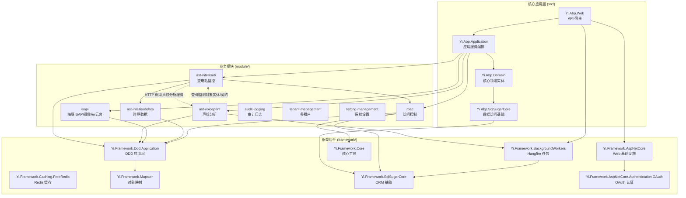

# 整体架构设计

## 项目概述

**IntelliSubstation Voiceprint Monitoring Backend** 是基于 .NET 8 ABP 框架构建的智能变电站监控系统，集成了声纹分析、IEC61850 数据上报和实时设备健康监测功能。

## 技术栈

### 核心框架
- **.NET 8** - 最新 LTS 版本，提供性能提升和跨平台支持
- **ABP Framework** - 企业级应用开发框架，提供模块化、多租户、认证授权等基础设施
- **SqlSugar ORM** - 轻量级 ORM，支持多种数据库
- **Hangfire** - 后台任务调度框架
- **Autofac** - 依赖注入容器
- **SignalR** - 实时通信（告警中心）

### 数据库支持
- SQLite（默认，适合边缘设备）
- MySQL
- SQL Server
- PostgreSQL
- Oracle
- TDengine（可选，用于时序数据）

### 认证授权
- JWT（主要认证方式）
- Refresh Token
- OAuth（QQ、Gitee）

## 模块化架构

项目采用清晰的模块化架构，遵循 DDD（领域驱动设计）分层原则：



> 业务监视内容与数据驱动方式总览见 [[Modules/ast-intellisub/变电站监视范围概览]]。

## 部署模式

系统支持两种部署模式，针对不同的硬件环境。当前通过 `DbConnOptions:DeploymentMode` 区分模式，TDengine 连接串放在 `DbConnOptions:TDengineUrl`。

### LowResource 模式（默认）

**适用场景：** ARM32/ARM64 边缘设备、资源受限环境

**特点：**
- SQLite 数据库（文件存储，无需独立数据库服务器）
- Hangfire 内存存储（轻量级，重启后任务丢失）
- 禁用 Swagger（减少栈溢出风险）
- 请求路径长度限制（200 字符，防止栈溢出）

**配置示例：**
```json
{
  "DbConnOptions": {
    "DeploymentMode": "LowResource",
    "Url": "Data Source=db/ast_intellisub.db",
    "DbType": "Sqlite"
  },
  "Hangfire": {
    "StorageMode": "Memory"
  },
  "App": {
    "EnableSwagger": false
  }
}
```

### HighPerformance 模式

**适用场景：** 数据中心、高性能服务器

**特点：**
- 完整数据库支持（MySQL/PostgreSQL/SQL Server）
- TDengine 时序数据库（可选，用于高频传感器数据）
- Hangfire 持久化存储（当前高性能配置默认 SQLite；启用 `Redis:IsEnabled` 后 Hangfire 优先使用 Redis）
- Swagger 启用（开发调试）

**配置示例：**
```json
{
  "DbConnOptions": {
    "DeploymentMode": "HighPerformance",
    "Url": "Host=localhost;Database=ast;Username=postgres;Password=password;",
    "DbType": "PostgreSQL",
    "TDengineUrl": "Host=localhost;Port=6030;Database=ast;Username=root;Password=taosdata;"
  },
  "Redis": {
    "IsEnabled": false,
    "Configuration": "localhost:6379"
  },
  "Hangfire": {
    "StorageMode": "SQLite",
    "SQLiteDbPath": "db/hangfire.db"
  },
  "App": {
    "EnableSwagger": true
  }
}
```

## DDD 分层架构

每个业务模块都遵循标准的 DDD 分层：

```
module/{module-name}/
├── {Module}.Domain.Shared/          # 领域共享层（常量、枚举）
├── {Module}.Domain/                 # 领域层（实体、值对象、领域服务）
├── {Module}.Application.Contracts/  # 应用服务契约（DTO、接口）
├── {Module}.Application/            # 应用层（应用服务、业务编排）
└── {Module}.SqlSugarCore/           # 数据访问层（仓储实现）
```

### 分层职责

| 层级 | 职责 | 特点 |
|------|------|------|
| Domain.Shared | 定义共享的常量、枚举、接口 | 无依赖，可被其他层引用 |
| Domain | 核心业务逻辑、实体、领域服务 | 独立于基础设施 |
| Application.Contracts | API 契约、DTO 定义 | 面向前端/客户端 |
| Application | 应用服务、业务编排、事件处理 | 协调领域对象完成业务 |
| SqlSugarCore | 数据访问实现 | 依赖 Domain，实现仓储接口 |

## API 路由约定

所有模块 API 都在 `/api/app/` 下，带服务名前缀：

```
/api/app/{service-name}/{controller}/{action}
```

**服务名映射：**（在 `src/Yi.Abp.Web/YiAbpWebModule.cs` 中通过 `ConventionalControllers.RemoteServiceName` 配置）
- `ast-intellisub` → 变电站监控 API（含 IEC61850 数据上报）
- `voiceprint` → 声纹分析 API
- `isapi` → 海康 ISAPI 摄像头/云台 API
- `rbac` → 认证授权 API

**示例：**
- `/api/app/ast-intellisub/device/list` - 获取设备列表
- `/api/app/voiceprint/...` - 声纹相关接口
- `/api/app/isapi/ptz-preset/...` - 海康摄像头云台预置位控制

## 后台任务系统

使用 Hangfire 实现定时任务，在 appsettings.json 中配置：

### 关键后台任务

> Cron 表达式为 6 段格式（含秒）。下表“默认频率”取自 `appsettings.json` 或对应 Options 的默认值；部分任务默认 `Enabled=false`，需在配置中开启后才会调度。

| 任务名称 | 所属模块 | 默认频率 | 默认启用 | 职责 |
|---------|---------|---------|---------|------|
| VoiceprintCaptureJob | ast-voiceprint | 每 10 分钟 | 是 | 下发声纹采集任务到边缘采集器 |
| VoiceprintProcessedCleanupJob | ast-voiceprint | 每天 17:40 | 是 | 清理已处理的音频文件 |
| PointDataCleanupJob | ast-intellisub | 每天 02:00 | 是 | 清除过期点位时序数据 |
| PointValueCacheCleanupJob | ast-intellisub | 每小时 | 是 | 清理点位实时值缓存 |
| GatewaySyncJob | ast-intellisub | 每小时 | 否 | 同步网关/设备数据 |
| CameraResourceCleanupJob | ast-intellisub | 每 10 分钟 | 否 | 清理摄像头快照等资源 |
| ISAPIResourceCleanupJob | ast-intellisub | 每 4 小时 | 否 | 清理 ISAPI 临时资源 |
| VisualGatewayHealthCheckJob | ast-intellisub | 每 2 分钟 | 否 | 视觉网关健康检查 |
| InfraredTemperatureCollectionJob | ast-intellisub | 每 3 分钟 | 否 | 红外测温数据采集 |
| EnvironmentDetectionCollectionJob | ast-intellisub | 每 30 秒 | 否 | 环境检测数据采集 |
| PatrolSystemCleanupJob | ast-intellisub | 每 30 分钟 | 否 | 巡视系统数据清理 |
| PatrolJobManager | ast-intellisub | 每 5 分钟 | 否 | 巡视任务调度管理 |

**访问 Hangfire 仪表板：** `/hangfire`

## 实时通信

使用 SignalR 实现告警中心的实时推送：

**Hub：** `AlarmNotificationHub`

**功能：**
- 实时告警推送
- 设备状态更新通知
- 巡检任务状态变更

## ARM32 兼容性优化

针对边缘设备的特定优化：

### 栈溢出防护
- 可禁用 Swagger（`App:EnableSwagger: false`）
- 请求路径长度限制（默认 200 字符）
- 优化递归调用深度

### 性能优化
- Hangfire 内存存储（减少 I/O）
- SQLite WAL 模式
- 响应压缩（Gzip/Brotli）

### 配置建议
```json
{
  "App": {
    "EnableSwagger": false,
    "MaxRequestPathLength": 200
  },
  "Hangfire": {
    "StorageMode": "Memory"
  },
  "DbConnOptions": {
    "DbType": "Sqlite"
  }
}
```

## 静态文件架构

系统支持三个前端 SPA 应用：

| 路径 | 用途 | 物理位置 |
|------|------|---------|
| `/admin` | 管理界面 | `wwwroot/admin/` |
| `/web` | Web 应用 | `wwwroot/web/` |
| `/` | 主应用 | `wwwroot/app/` |

每个应用都配置了 SPA 路由回退，支持前端路由。

## 配置系统

### 配置文件结构
- `appsettings.json` - 基础配置
- `appsettings.Development.json` - 开发环境
- `appsettings.Production.json` - 生产环境

### 关键配置节

```json
{
  "DbConnOptions": {
    "DeploymentMode": "LowResource",
    "Url": "Data Source=db/ast_intellisub.db",
    "DbType": "Sqlite"
  },
  "Hangfire": {
    "StorageMode": "Memory"
  },
  "VoiceprintCaptureJob": {
    "Enabled": true,
    "CronExpression": "0 */10 * * * *"
  },
  "Iec61850": {
    "EnableDataReport": false,
    "EnableAlarmReport": false,
    "ModelFileDirectory": ""
  },
  "Redis": {
    "IsEnabled": false,
    "Configuration": "localhost:6379"
  }
}
```

## 安全机制

### 认证
- JWT 主要认证
- Refresh Token 令牌刷新
- OAuth 第三方登录（QQ、Gitee）

### 令牌来源
- 查询字符串：`?access_token=xxx`
- Cookie：`Token=xxx`

### 授权
- 基于角色的访问控制（RBAC）
- 细粒度权限控制
- API 级别权限验证

### 速率限制
- 全局：每 60 秒 1000 个请求
- 滑动窗口算法
- 可配置例外路径

## 扩展性设计

### 模块化插件
- 业务模块按 ABP 模块化方式编译和聚合加载
- 通过 ABP `DependsOn` 显式声明模块依赖
- 宿主启动时统一注册模块和动态 API

### 多租户
- 基于 Header 的租户解析
- 数据隔离
- 租户级配置

### 国际化
- 多语言资源支持
- 本地化配置
- 时区处理
