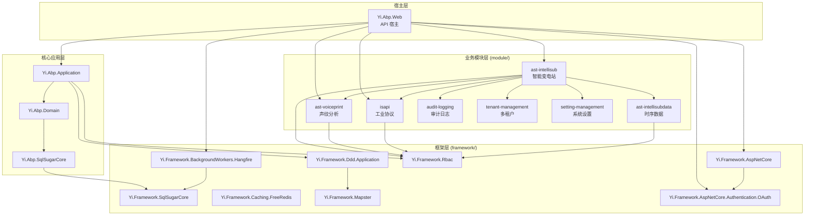

# 模块依赖关系

## 概述

IntelliSubstation 项目采用模块化架构，各模块之间通过 ABP Framework 的依赖注入系统和模块系统实现松耦合的依赖关系。

## 核心依赖层次



## 详细依赖关系

### 1. ast-intellisub（智能变电站模块）

**核心业务模块，依赖最多**

```csharp
[DependsOn(
    typeof(AstIntelliSubApplicationContractsModule),
    typeof(AstIntelliSubDomainModule),
    typeof(AstIntelliSubDataApplicationModule),    // 依赖时序数据模块
    typeof(YiFrameworkRbacApplicationModule),      // 依赖 RBAC 模块
    typeof(YiFrameworkDddApplicationModule),
    typeof(AbpAspNetCoreSignalRModule)             // SignalR 实时通信
)]
public class AstIntelliSubApplicationModule : AbpModule
```

**依赖说明：**
- **AstIntelliSubDataApplicationModule** - 传感器时序数据处理
- **YiFrameworkRbacApplicationModule** - 用户权限管理
- **SignalR** - 告警实时推送

### 2. ast-voiceprint（声纹分析模块）

**独立业务模块，可被其他模块调用**

```csharp
[DependsOn(
    typeof(AstVoiceprintApplicationContractsModule),
    typeof(AstVoiceprintDomainModule),
    typeof(YiFrameworkRbacApplicationModule)
)]
public class AstVoiceprintApplicationModule : AbpModule
```

**被依赖方：**
- ast-intellisub 调用声纹识别 API
- ast-intellisub 使用声纹告警策略

### 3. ast-intellisubdata（时序数据模块）

**数据采集与存储模块**

```csharp
[DependsOn(
    typeof(AstIntelliSubDataApplicationContractsModule),
    typeof(AstIntelliSubDataDomainModule),
    typeof(YiFrameworkRbacApplicationModule)
)]
public class AstIntelliSubDataApplicationModule : AbpModule
```

**特点：**
- 可选 TDengine 集成
- 高频数据采集
- 独立的数据保留策略

### 4. isapi（工业协议模块）

**协议集成模块**

```csharp
[DependsOn(
    typeof(ISAPIApplicationContractsModule),
    typeof(ISAPIDomainModule),
    typeof(YiFrameworkRbacApplicationModule)
)]
public class ISAPIApplicationModule : AbpModule
```

**职责：**
- IEC61850 协议支持
- IEC104 协议支持
- 模型文件解析

### 5. rbac（访问控制模块）

**基础模块，被所有业务模块依赖**

```csharp
[DependsOn(
    typeof(YiFrameworkRbacDomainModule),
    typeof(YiFrameworkRbacApplicationModule)
)]
```

**被依赖方：**
- ast-intellisub
- ast-voiceprint
- ast-intellisubdata
- isapi

**提供功能：**
- 用户管理
- 角色管理
- 权限管理
- 菜单管理
- JWT 认证

## 框架层依赖

### Yi.Framework.SqlSugarCore

**数据访问基础，被所有模块依赖**

```
被依赖方：
├── src/Yi.Abp.SqlSugarCore
├── module/ast-intellisub/Ast.IntelliSub.SqlSugarCore
├── module/ast-voiceprint/Ast.Voiceprint.SqlSugarCore
├── module/ast-intellisubdata/Ast.IntelliSubData.SqlSugarCore
└── module/isapi/ISAPI.SqlSugarCore
```

**提供功能：**
- 仓储模式抽象
- 工作单元模式
- 多数据库支持
- CodeFirst 迁移

### Yi.Framework.AspNetCore

**Web 基础设施**

```
被依赖方：
└── src/Yi.Abp.Web
```

**提供功能：**
- RESTful API 规范化
- 统一异常处理
- API 文档（Swagger）
- 请求日志

### Yi.Framework.BackgroundWorkers.Hangfire

**后台任务基础**

```
被依赖方：
└── src/Yi.Abp.Web
```

**提供功能：**
- 定时任务调度
- 任务持久化
- 任务监控面板
- 失败重试

### Yi.Framework.Ddd.Application

**DDD 应用层基础**

```
被依赖方：
├── module/ast-intellisub/Ast.IntelliSub.Application
├── module/ast-voiceprint/Ast.Voiceprint.Application
├── module/ast-intellisubdata/Ast.IntelliSubData.Application
└── module/rbac/Yi.Framework.Rbac.Application
```

**提供功能：**
- CRUD 基类
- 应用服务基类
- 对象映射

## 模块间通信

### 1. 直接依赖调用

**场景：** ast-intellisub 调用 ast-voiceprint

```csharp
// 在 ast-intellisub 中注入 voiceprint 服务
public class VoiceprintAlarmStrategy
{
    private readonly IVoiceprintRecognitionAppService _voiceprintService;

    public VoiceprintAlarmStrategy(IVoiceprintRecognitionAppService voiceprintService)
    {
        _voiceprintService = voiceprintService;
    }

    public async Task<AlarmResult> EvaluateAsync(DeviceData data)
    {
        // 调用声纹识别服务
        var result = await _voiceprintService.RecognizeAsync(data.AudioData);
        return ProcessRecognitionResult(result);
    }
}
```

### 2. 事件驱动通信

**场景：** 跨模块的事件处理

```csharp
// 定义事件
public class AlarmCreatedEvent
{
    public Guid AlarmId { get; set; }
    public string Message { get; set; }
}

// 订阅事件
public class AlarmNotificationHandler : IEventHandler<AlarmCreatedEvent>
{
    public async Task HandleEventAsync(AlarmCreatedEvent eventData)
    {
        // 通过 SignalR 推送告警
        await _alarmHub.Clients.All.SendAsync("ReceiveAlarm", eventData);
    }
}
```

### 3. 后台任务协调

**场景：** 模块间的任务调度

```csharp
// VoiceprintCaptureJob（ast-intellisub 模块）
public class VoiceprintCaptureJob
{
    protected override async Task ExecuteAsync()
    {
        // 1. 从边缘设备采集音频
        var audioData = await _deviceService.CollectAudioAsync();

        // 2. 调用声纹模块分析
        var result = await _voiceprintService.AnalyzeAsync(audioData);

        // 3. 存储时序数据
        await _pointDataService.RecordAsync(result);

        // 4. 触发告警评估
        await _alarmService.EvaluateAsync(result);
    }
}
```

## 依赖注入模式

### 模块加载顺序

ABP Framework 按以下顺序加载模块：

1. **核心框架层**（framework/）
   - Yi.Framework.Core
   - Yi.Framework.SqlSugarCore
   - Yi.Framework.AspNetCore

2. **基础设施层**（src/）
   - Yi.Abp.Domain
   - Yi.Abp.Application
   - Yi.Abp.SqlSugarCore

3. **业务模块层**（module/）
   - rbac（基础模块）
   - audit-logging
   - tenant-management
   - setting-management
   - ast-intellisubdata
   - ast-voiceprint
   - isapi
   - ast-intellisub（核心业务）

4. **宿主层**
   - Yi.Abp.Web

### 服务注册

```csharp
// 在模块中注册服务
public override void ConfigureServices(ServiceConfigurationContext context)
{
    // 注册应用服务
    context.Services.AddType<DeviceService>();

    // 注册后台服务
    context.Services.AddHostedService<ApplicationStartupService>();

    // 注册 HttpClient
    context.Services.AddHttpClient<Iec61850ApiService>();
}
```

## 依赖最佳实践

### 1. 依赖倒置原则

**✅ 正确：依赖接口而非实现**

```csharp
public class AlarmProcessingService
{
    private readonly IAlarmRepository _alarmRepository;
    private readonly IVoiceprintService _voiceprintService;

    public AlarmProcessingService(
        IAlarmRepository alarmRepository,
        IVoiceprintService voiceprintService)
    {
        _alarmRepository = alarmRepository;
        _voiceprintService = voiceprintService;
    }
}
```

**❌ 错误：直接依赖实现**

```csharp
public class AlarmProcessingService
{
    private readonly SqlSugarAlarmRepository _alarmRepository;  // 具体实现
    private readonly AstVoiceprintService _voiceprintService;  // 具体实现
}
```

### 2. 模块边界清晰

**✅ 正确：通过应用服务通信**

```csharp
// 模块 A 调用模块 B 的应用服务
public class ModuleAService
{
    private readonly IModuleBAppService _moduleBService;

    public async Task DoWork()
    {
        var data = await _moduleBService.GetDataAsync();
    }
}
```

**❌ 错误：跨模块直接访问领域层**

```csharp
// 模块 A 直接访问模块 B 的领域实体
public class ModuleAService
{
    private readonly IRepository<ModuleBEntity, Guid> _repository;

    public async Task DoWork()
    {
        var entity = await _repository.GetAsync();  // 违反模块边界
    }
}
```

### 3. 事件驱动解耦

**场景：** 告警创建后的多模块响应

```csharp
// 发布事件（ast-intellisub 模块）
public class AlarmRecordService
{
    public async Task CreateAsync(CreateAlarmDto input)
    {
        var alarm = await _repository.InsertAsync(input);

        // 发布事件，不关心谁在监听
        await _eventBus.PublishAsync(new AlarmCreatedEvent { AlarmId = alarm.Id });
    }
}

// 监听事件 - 通知模块（ast-intellisub）
public class AlarmNotificationHandler : IEventHandler<AlarmCreatedEvent>
{
    public async Task HandleEventAsync(AlarmCreatedEvent eventData)
    {
        await _alarmHub.SendAsync(eventData.AlarmId);
    }
}

// 监听事件 - 统计模块（ast-intellisub）
public class AlarmStatisticsHandler : IEventHandler<AlarmCreatedEvent>
{
    public async Task HandleEventAsync(AlarmCreatedEvent eventData)
    {
        await _statisticsService.UpdateAsync(eventData.AlarmId);
    }
}

// 监听事件 - 审计模块（audit-logging）
public class AlarmAuditHandler : IEventHandler<AlarmCreatedEvent>
{
    public async Task HandleEventAsync(AlarmCreatedEvent eventData)
    {
        await _auditLogService.LogAsync(eventData.AlarmId);
    }
}
```

## 循环依赖避免

### 问题场景

```
ast-intellisub → ast-voiceprint → ast-intellisub (循环依赖)
```

### 解决方案

1. **提取共享模块**

```
ast-intellisub → shared-contracts ← ast-voiceprint
```

2. **事件驱动**

```
ast-intellisub --(事件)--> ast-voiceprint
```

3. **接口分离**

```
ast-intellisub → IVoiceprintService (接口定义在 contracts 层)
                   ↑
ast-voiceprint ──┘
```

## 模块版本兼容性

### API 版本策略

```csharp
// 应用服务接口版本化
public interface IDeviceAppService : IApplicationService
{
    [Obsolete("Use GetListV2Async instead")]
    Task<PagedResultDto<DeviceDto>> GetListAsync(GetListInput input);

    Task<PagedResultDto<DeviceDtoV2>> GetListV2Async(GetListV2Input input);
}
```

### 数据库迁移兼容性

```csharp
// SqlSugar CodeFirst 自动迁移
public override void OnModelCreating(SqlSugarClient client)
{
    // 创建表（如果不存在）
    client.CodeFirst.InitTables(typeof(Device), typeof(Alarm));

    // 添加新列（自动处理）
    client.CodeFirst.SetStringDefaultLength(200);
}
```

## 模块独立性检查

### 测试模块独立性

```bash
# 测试 ast-voiceprint 模块是否可独立运行
cd module/ast-voiceprint/Ast.Voiceprint.Application.Tests
dotnet test

# 测试 ast-intellisubdata 模块是否可独立运行
cd module/ast-intellisubdata/Ast.IntelliSubData.Application.Tests
dotnet test
```

### 最小依赖集

**ast-voiceprint 模块最小依赖：**
```
依赖：
├── Yi.Framework.Rbac（认证）
├── Yi.Framework.SqlSugarCore（数据访问）
└── Yi.Framework.Ddd.Application（应用层基础）

无需依赖：
├── ast-intellisub（✓ 可独立运行）
└── ast-intellisubdata（✓ 可独立运行）
```
