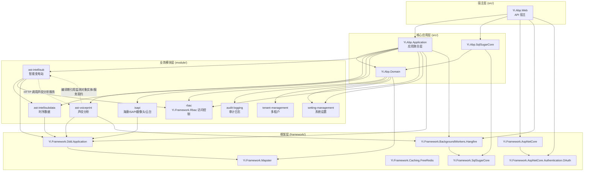

# 模块依赖关系

## 概述

IntelliSubstation 项目采用模块化架构，各模块之间通过 ABP Framework 的依赖注入系统和模块系统实现松耦合的依赖关系。

## 核心依赖层次

> 说明：业务模块在 `src/Yi.Abp.Application`（应用聚合层）统一被 `DependsOn`，再由 `src/Yi.Abp.Web` 宿主。`Web` 并不直接依赖各业务模块。



## 详细依赖关系

### 1. ast-intellisub（智能变电站模块）

**核心业务模块，依赖最多**

```csharp
[DependsOn(
    typeof(AstIntelliSubApplicationContractsModule),
    typeof(AstIntelliSubDomainModule),
    typeof(AstIntelliSubDataApplicationModule),    // 依赖时序数据模块
    typeof(YiFrameworkRbacApplicationModule),      // 依赖 RBAC 模块
    typeof(YiFrameworkDddApplicationModule),
    typeof(AbpAspNetCoreSignalRModule)             // SignalR 实时通信
)]
public class AstIntelliSubApplicationModule : AbpModule
```

**依赖说明：**
- **AstIntelliSubDataApplicationModule** - 传感器时序数据处理
- **YiFrameworkRbacApplicationModule** - 用户权限管理
- **SignalR** - 告警实时推送

### 2. ast-voiceprint（声纹分析模块）

**声纹业务模块；应用层存在对 ast-intellisub 监测对象实体/契约的编译期引用**

```csharp
[DependsOn(
    typeof(AstVoiceprintApplicationContractsModule),
    typeof(AstVoiceprintDomainModule),
    typeof(YiFrameworkDddApplicationModule),
    typeof(YiFrameworkBackgroundWorkersHangfireModule)  // 声纹采集/清理定时任务
)]
public class AstVoiceprintApplicationModule : AbpModule
```

**集成方式：**
- 由 `src/Yi.Abp.Application` 聚合并随宿主一起加载，对外暴露 `/api/app/voiceprint/*` 接口
- ast-intellisub 不直接依赖本模块，而是通过 HTTP 调用外部声纹分析服务（见 `VoiceprintRecognition` 配置）
- ast-voiceprint 的应用服务会查询/更新 `ast-intellisub` 中的监测对象，因此当前代码不是完全独立模块

### 3. ast-intellisubdata（时序数据模块）

**数据采集与存储模块**

```csharp
[DependsOn(
    typeof(AstIntelliSubDataApplicationContractsModule),
    typeof(AstIntelliSubDataDomainModule),
    typeof(YiFrameworkDddApplicationModule)
)]
public class AstIntelliSubDataApplicationModule : AbpModule
```

**特点：**
- 可选 TDengine 集成（点位时序数据超级表 `ast_pointdata`）
- 高频数据采集
- 独立的数据保留策略

**被依赖方：**
- ast-intellisub（依赖本模块进行点位时序数据读写）

### 4. isapi（海康 ISAPI 摄像头/云台模块）

**海康威视设备接入模块**

```csharp
[DependsOn(
    typeof(ISAPIApplicationContractsModule),
    typeof(ISAPIDomainModule),
    typeof(YiFrameworkDddApplicationModule)
)]
public class ISAPIApplicationModule : AbpModule
```

**职责：**
- 海康 ISAPI 协议接入（`HttpAuthenticatedClient`、`CHCNetSDK`）
- 云台（PTZ）预置位管理与控制
- 设备告警监听与解析、传感器同步

> 注意：当前代码中的 IEC61850 数据上报由 `ast-intellisub` 模块处理，不在本模块。

### 5. rbac（访问控制模块）

**基础认证授权模块（命名空间 `Yi.Framework.Rbac`，位于 `module/rbac`）**

```csharp
// 由 src 聚合层与 ast-intellisub 引用其应用层模块
typeof(YiFrameworkRbacApplicationModule)
// 数据访问层
typeof(YiFrameworkRbacSqlSugarCoreModule)
```

**被依赖方（应用层 `YiFrameworkRbacApplicationModule`）：**
- src/Yi.Abp.Application（聚合层）
- ast-intellisub

> 注意：ast-voiceprint、ast-intellisubdata、isapi 这三个模块**并不**直接依赖 RBAC，它们只依赖 `Yi.Framework.Ddd.Application`；鉴权由宿主统一处理。

**提供功能：**
- 用户管理
- 角色管理
- 权限管理
- 菜单管理
- JWT 认证

## 框架层依赖

### Yi.Framework.SqlSugarCore

**数据访问基础，被所有模块依赖**

```
被依赖方：
├── src/Yi.Abp.SqlSugarCore
├── module/ast-intellisub/Ast.IntelliSub.SqlSugarCore
├── module/ast-voiceprint/Ast.Voiceprint.SqlSugarCore
├── module/ast-intellisubdata/Ast.IntelliSubData.SqlSugarCore
└── module/isapi/ISAPI.SqlSugarCore
```

**提供功能：**
- 仓储模式抽象
- 工作单元模式
- 多数据库支持
- CodeFirst 迁移

### Yi.Framework.AspNetCore

**Web 基础设施**

```
被依赖方：
├── src/Yi.Abp.Web
├── src/Yi.Abp.Application
└── module/ast-voiceprint/Ast.Voiceprint.Application
```

**提供功能：**
- RESTful API 规范化
- 统一异常处理
- API 文档（Swagger）
- 请求日志

### Yi.Framework.BackgroundWorkers.Hangfire

**后台任务基础**

```
被依赖方：
└── src/Yi.Abp.Web
```

**提供功能：**
- 定时任务调度
- 任务持久化
- 任务监控面板
- 失败重试

### Yi.Framework.Ddd.Application

**DDD 应用层基础**

```
被依赖方：
├── src/Yi.Abp.Application
├── module/ast-intellisub/Ast.IntelliSub.Application
├── module/ast-voiceprint/Ast.Voiceprint.Application
├── module/ast-intellisubdata/Ast.IntelliSubData.Application
├── module/isapi/ISAPI.Application
└── module/rbac/Yi.Framework.Rbac.Application
```

**提供功能：**
- CRUD 基类
- 应用服务基类
- 对象映射

## 模块间通信

### 1. 直接依赖调用

**场景：** ast-intellisub 依赖 ast-intellisubdata（真实模块依赖），直接注入其应用服务

```csharp
// ast-intellisub 通过 [DependsOn] 引用 ast-intellisubdata 后，可直接注入其服务
public class PointValueProcessor
{
    private readonly IPointDataAppService _pointDataService;

    public PointValueProcessor(IPointDataAppService pointDataService)
    {
        _pointDataService = pointDataService;
    }

    public async Task RecordAsync(PointValueDto value)
    {
        // 写入点位时序数据（ast_pointdata）
        await _pointDataService.RecordAsync(value);
    }
}
```

> 跨进程的声纹分析（ast-intellisub → 声纹分析服务）不属于此类，它通过 HTTP 调用，而非模块依赖。

### 2. 事件驱动通信

**场景：** 跨模块的事件处理

```csharp
// 定义事件
public class AlarmCreatedEvent
{
    public Guid AlarmId { get; set; }
    public string Message { get; set; }
}

// 订阅事件
public class AlarmNotificationHandler : IEventHandler<AlarmCreatedEvent>
{
    public async Task HandleEventAsync(AlarmCreatedEvent eventData)
    {
        // 通过 SignalR 推送告警
        await _alarmHub.Clients.All.SendAsync("ReceiveAlarm", eventData);
    }
}
```

### 3. 后台任务协调

**场景：** 模块间的任务调度

```csharp
// VoiceprintCaptureJob（ast-voiceprint 模块，Hangfire 定时任务）
public class VoiceprintCaptureJob : HangfireBackgroundWorkerBase
{
    public override async Task DoWorkAsync(PeriodicBackgroundWorkerContext context)
    {
        // 1. 按配置向边缘采集器下发采集指令
        await _captureService.DispatchCaptureCommandsAsync();

        // 2. 采集器回传音频后，由声纹分析服务识别并落库
        //    告警/统计等跨模块响应通过事件总线解耦（见上文事件驱动通信）
    }
}
```

## 依赖注入模式

### 模块加载顺序

ABP Framework 按以下顺序加载模块：

1. **核心框架层**（framework/）
   - Yi.Framework.Core
   - Yi.Framework.SqlSugarCore
   - Yi.Framework.AspNetCore

2. **基础设施层**（src/）
   - Yi.Abp.Domain
   - Yi.Abp.Application
   - Yi.Abp.SqlSugarCore

3. **业务模块层**（module/）
   - rbac（基础模块）
   - audit-logging
   - tenant-management
   - setting-management
   - ast-intellisubdata
   - ast-voiceprint
   - isapi
   - ast-intellisub（核心业务）

4. **宿主层**
   - Yi.Abp.Web

### 服务注册

```csharp
// 在模块中注册服务
public override void ConfigureServices(ServiceConfigurationContext context)
{
    // 注册应用服务
    context.Services.AddType<DeviceService>();

    // 注册后台服务
    context.Services.AddHostedService<ApplicationStartupService>();

    // 注册 HttpClient
    context.Services.AddHttpClient<Iec61850ApiService>();
}
```

## 依赖最佳实践

### 1. 依赖倒置原则

**✅ 正确：依赖接口而非实现**

```csharp
public class AlarmProcessingService
{
    private readonly IAlarmRepository _alarmRepository;
    private readonly IVoiceprintService _voiceprintService;

    public AlarmProcessingService(
        IAlarmRepository alarmRepository,
        IVoiceprintService voiceprintService)
    {
        _alarmRepository = alarmRepository;
        _voiceprintService = voiceprintService;
    }
}
```

**❌ 错误：直接依赖实现**

```csharp
public class AlarmProcessingService
{
    private readonly SqlSugarAlarmRepository _alarmRepository;  // 具体实现
    private readonly AstVoiceprintService _voiceprintService;  // 具体实现
}
```

### 2. 模块边界清晰

**✅ 正确：通过应用服务通信**

```csharp
// 模块 A 调用模块 B 的应用服务
public class ModuleAService
{
    private readonly IModuleBAppService _moduleBService;

    public async Task DoWork()
    {
        var data = await _moduleBService.GetDataAsync();
    }
}
```

**❌ 错误：跨模块直接访问领域层**

```csharp
// 模块 A 直接访问模块 B 的领域实体
public class ModuleAService
{
    private readonly IRepository<ModuleBEntity, Guid> _repository;

    public async Task DoWork()
    {
        var entity = await _repository.GetAsync();  // 违反模块边界
    }
}
```

### 3. 事件驱动解耦

**场景：** 告警创建后的多模块响应

```csharp
// 发布事件（ast-intellisub 模块）
public class AlarmRecordService
{
    public async Task CreateAsync(CreateAlarmDto input)
    {
        var alarm = await _repository.InsertAsync(input);

        // 发布事件，不关心谁在监听
        await _eventBus.PublishAsync(new AlarmCreatedEvent { AlarmId = alarm.Id });
    }
}

// 监听事件 - 通知模块（ast-intellisub）
public class AlarmNotificationHandler : IEventHandler<AlarmCreatedEvent>
{
    public async Task HandleEventAsync(AlarmCreatedEvent eventData)
    {
        await _alarmHub.SendAsync(eventData.AlarmId);
    }
}

// 监听事件 - 统计模块（ast-intellisub）
public class AlarmStatisticsHandler : IEventHandler<AlarmCreatedEvent>
{
    public async Task HandleEventAsync(AlarmCreatedEvent eventData)
    {
        await _statisticsService.UpdateAsync(eventData.AlarmId);
    }
}

// 监听事件 - 审计模块（audit-logging）
public class AlarmAuditHandler : IEventHandler<AlarmCreatedEvent>
{
    public async Task HandleEventAsync(AlarmCreatedEvent eventData)
    {
        await _auditLogService.LogAsync(eventData.AlarmId);
    }
}
```

## 循环依赖避免

### 问题场景

```
ast-intellisub → ast-voiceprint → ast-intellisub (循环依赖)
```

### 解决方案

1. **提取共享模块/共享契约**

```
ast-intellisub → shared-contracts ← ast-voiceprint
```

2. **事件驱动**

```
ast-intellisub --(事件)--> ast-voiceprint
```

3. **接口分离**

```
ast-intellisub → IVoiceprintService (接口定义在共享 contracts 层)
                   ↑
ast-voiceprint ──┘
```

> 当前 `ast-voiceprint` 直接引用 `Ast.IntelliSub.Domain` 和 `Ast.IntelliSub.Application.Contracts`，如果后续要求模块独立发布，应优先把监测对象只读查询和声纹所需 DTO 抽到稳定的共享契约层。

## 模块版本兼容性

### API 版本策略

```csharp
// 应用服务接口版本化
public interface IDeviceAppService : IApplicationService
{
    [Obsolete("Use GetListV2Async instead")]
    Task<PagedResultDto<DeviceDto>> GetListAsync(GetListInput input);

    Task<PagedResultDto<DeviceDtoV2>> GetListV2Async(GetListV2Input input);
}
```

### 数据库迁移兼容性

```csharp
// SqlSugar CodeFirst 初始化/补齐表结构
public override void ConfigureServices(ServiceConfigurationContext context)
{
    context.Services.AddYiDbContext<YiDbContext>();
}
```

## 模块独立性检查

### 测试模块独立性

```bash
# 测试项目集中在 test/ 目录下：
#   test/Yi.Abp.Test            - 核心/应用层测试
#   test/Yi.Framework.Rbac.Test - RBAC 模块测试
#   test/Ast.IntelliSub.Test    - 变电站监控模块测试

cd test/Ast.IntelliSub.Test
dotnet test
```

### 最小依赖集

**ast-voiceprint 模块最小依赖：**
```
依赖：
├── Yi.Framework.Ddd.Application（应用层基础）
├── Yi.Framework.BackgroundWorkers.Hangfire（声纹采集/清理任务）
├── Yi.Framework.SqlSugarCore（数据访问层 Ast.Voiceprint.SqlSugarCore 使用）
├── Ast.IntelliSub.Application.Contracts（当前应用层编译期引用）
└── Ast.IntelliSub.Domain（当前应用层查询监测对象实体）

无需依赖：
└── ast-intellisubdata（可独立于时序数据模块运行）
```
