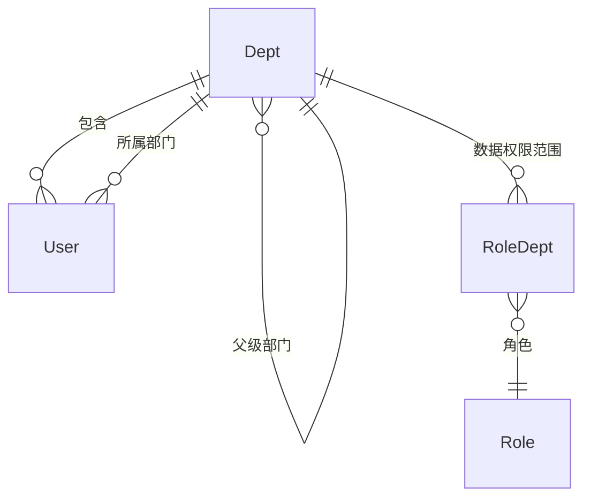

# DeptAggregateRoot

## 概述

部门实体，RBAC 核心实体之一，表示组织架构中的部门/组织单位。继承自 `AggregateRoot<Guid>`，实现软删除、审计、排序和状态接口。

## 表信息

| 属性 | 值 |
|-----|-----|
| **表名** | `Dept` |
| **主键** | `Id` (Guid) |
| **聚合类型** | AggregateRoot（支持领域事件） |
| **树形结构** | 通过 `ParentId` 构建父子关系 |

## 字段列表

| 字段名 | 类型 | 说明 | 默认值 | 约束 |
|--------|------|------|--------|------|
| `Id` | Guid | 主键 | - | Primary Key |
| `DeptName` | string | 部门名称 | - | Required |
| `DeptCode` | string? | 部门编码（唯一标识） | null | Unique |
| `ParentId` | Guid | 父级部门ID（根部门为空Guid） | Guid.Empty | Foreign Key → Dept.Id |
| `Leader` | string? | 部门负责人姓名 | null | - |
| `Remark` | string? | 部门描述/备注 | null | - |
| `State` | bool | 状态（启用/禁用） | true | - |
| `OrderNum` | int | 排序序号 | 0 | - |
| `IsDeleted` | bool | 逻辑删除标记 | false | Soft Delete |
| `CreationTime` | DateTime | 创建时间 | DateTime.Now | Audit |
| `CreatorId` | Guid? | 创建者ID | null | Audit |
| `LastModificationTime` | DateTime? | 最后修改时间 | null | Audit |
| `LastModifierId` | Guid? | 最后修改者ID | null | Audit |

## 关联实体

### ER 关系



### 导航属性

| 属性 | 关联实体 | 关系类型 | 说明 |
|------|----------|----------|------|
| `Children` | `List<DeptAggregateRoot>?` | 一对多 | 子部门列表（运行时构建） |
| `Parent` | `DeptAggregateRoot?` | 多对一 | 父级部门（通过 `ParentId`） |

### 反向导航

- `UserAggregateRoot.Dept` → 用户所属部门
- `UserAggregateRoot.DeptId` → 外键关联
- `RoleAggregateRoot.Depts` → 角色数据权限部门列表（通过 `RoleDept`）

## 业务规则

### 树形结构约束
- 根部门 `ParentId = Guid.Empty`
- 禁止循环引用（父级不能是自己的子孙）
- 删除父部门需处理子部门：
  - **方案1**：级联删除子部门
  - **方案2**：将子部门提升到根级别
  - 当前实现：需要业务层处理

### 唯一性约束
- `DeptCode` 全局唯一（部门编码）
- 同一父级下 `DeptName` 建议唯一

### 状态管理
- `State = true`：部门启用，可分配用户
- `State = false`：部门禁用，无法添加新用户
- `IsDeleted = true`：逻辑删除，需处理关联用户

### 级联关系
- 删除部门时需处理：
  - **用户**：将用户 `DeptId` 设为 null 或转移到其他部门
  - **角色数据权限**：清理 `RoleDept` 关联记录
  - **子部门**：按业务规则处理（删除或提升）

### 部门与用户关系
- 用户必须属于一个部门（`DeptId` 可为 null，表示未分配）
- 部门可包含多个用户（一对多）
- 用户部门变更影响数据权限范围

## 使用服务

### 主要消费服务

| 服务 | 模块 | 读写类型 | 主要操作 |
|------|------|----------|----------|
| `DeptService` | Yi.Framework.Rbac.Application | Read/Write | CRUD、树形结构查询 |
| `UserService` | Yi.Framework.Rbac.Application | Read | 用户所属部门查询 |
| `RoleService` | Yi.Framework.Rbac.Application | Read | 角色数据权限配置 |
| `DataService` | Ast.IntelliSub.Application | Read | 数据权限过滤 |

### 关键方法

```csharp
// 构建部门树
var depts = await deptRepository.GetListAsync();
var deptTree = TreeHelper.SetTree(depts);

// 查询部门用户
var users = await userRepository.GetListAsync(u => u.DeptId == deptId);

// 获取部门及其所有子部门ID（递归）
var deptIds = await deptService.GetDeptAndChildIdsAsync(deptId);

// 根据角色数据权限过滤数据
if (role.DataScope == DataScopeEnum.DEPT)
{
    data = data.Where(d => d.DeptId == user.DeptId);
}
```

## 数据权限实现

### 部门树递归查询

```csharp
public async Task<List<Guid>> GetDeptAndChildIdsAsync(Guid deptId)
{
    var allDepts = await deptRepository.GetListAsync();
    var deptIds = new List<Guid> { deptId };
    
    // 递归查找子部门
    void FindChildIds(Guid parentId)
    {
        var children = allDepts.Where(d => d.ParentId == parentId);
        foreach (var child in children)
        {
            deptIds.Add(child.Id);
            FindChildIds(child.Id);
        }
    }
    
    FindChildIds(deptId);
    return deptIds;
}
```

### 数据权限过滤示例

```csharp
// 根据用户角色数据权限过滤巡检任务
public async Task<List<PatrolTask>> GetTasksByUserAsync(Guid userId)
{
    var user = await userRepository.GetAsync(userId, includeDetails: true);
    var roles = user.Roles;
    
    var query = taskRepository.WhereQueryable();
    
    foreach (var role in roles)
    {
        switch (role.DataScope)
        {
            case DataScopeEnum.ALL:
                return await query.ToListAsync();
            case DataScopeEnum.DEPT:
                query = query.Where(t => t.CreatorId == userId);
                break;
            case DataScopeEnum.DEPT_AND_CHILD:
                var deptIds = await GetDeptAndChildIdsAsync(user.DeptId ?? Guid.Empty);
                query = query.Where(t => deptIds.Contains(t.Creator.DeptId ?? Guid.Empty));
                break;
            case DataScopeEnum.CUSTOM:
                var customDeptIds = role.Depts.Select(d => d.Id).ToList();
                query = query.Where(t => customDeptIds.Contains(t.Creator.DeptId ?? Guid.Empty));
                break;
            case DataScopeEnum.SELF:
                query = query.Where(t => t.CreatorId == userId);
                break;
        }
    }
    
    return await query.ToListAsync();
}
```

## 数据种子

部门种子数据通常由业务模块初始化，预置常见组织架构：
- 总部/公司根部门
- 技术部、运维部、监控中心等子部门

种子位置：`module/ast-intellisub/Ast.IntelliSub.SqlSugarCore/DataSeeds/`

## 扩展说明

### 部门编码规范

部门编码通常采用层级结构：
- 根部门：`1000`
- 一级部门：`1100`、`1200`、`1300`
- 二级部门：`1110`、`1120`、`1210`

### 多租户支持

当前实现为单租户设计，部门全局唯一。如需多租户，可添加 `TenantId` 字段。

### 审计跟踪

所有部门变更（结构调整、负责人变更）都记录审计信息。
