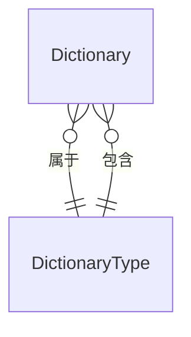

# DictionaryEntity

## 概述

字典数据实体，RBAC 核心实体之一，表示系统字典的具体选项/值。继承自 `Entity<Guid>`，实现软删除、审计、排序和状态接口。

## 表信息

| 属性 | 值 |
|-----|-----|
| **表名** | `Dictionary` |
| **主键** | `Id` (Guid) |
| **实体类型** | Entity（不支持领域事件） |
| **业务键** | `DictType` + `DictValue`（组合唯一） |

## 字段列表

| 字段名 | 类型 | 说明 | 默认值 | 约束 |
|--------|------|------|--------|------|
| `Id` | Guid | 主键 | - | Primary Key |
| `DictType` | string | 字典类型编码 | string.Empty | Foreign Key → DictionaryType.DictType |
| `DictLabel` | string? | 字典标签（显示文本） | null | - |
| `DictValue` | string | 字典值（实际存储值） | string.Empty | - |
| `IsDefault` | bool | 是否为默认选项 | false | - |
| `ListClass` | string? | 列表标签样式类 | null | - |
| `CssClass` | string? | CSS 样式类 | null | - |
| `Remark` | string? | 选项描述/备注 | null | - |
| `State` | bool | 状态（启用/禁用） | true | - |
| `OrderNum` | int | 排序序号 | 0 | - |
| `IsDeleted` | bool | 逻辑删除标记 | false | Soft Delete |
| `CreationTime` | DateTime | 创建时间 | - | Audit |
| `CreatorId` | Guid? | 创建者ID | null | Audit |
| `LastModificationTime` | DateTime? | 最后修改时间 | null | Audit |
| `LastModifierId` | Guid? | 最后修改者ID | null | Audit |

## 关联实体

### ER 关系



### 导航属性

| 属性 | 关联实体 | 关系类型 | 说明 |
|------|----------|----------|------|
| 无直接导航属性 | - | - | 通过 `DictType` 字段关联 |

### 关联字段

- `DictType` → `DictionaryTypeAggregateRoot.DictType`（逻辑外键）

## 业务规则

### 唯一性约束
- `(DictType, DictValue)` 组合唯一（同一类型下值唯一）
- 建议业务层确保 `(DictType, DictLabel)` 唯一

### 状态管理
- `State = true`：字典项启用，可被业务使用
- `State = false`：字典项禁用，不出现在选项列表
- `IsDeleted = true`：逻辑删除

### 默认值约束
- 每个字典类型下只能有一个 `IsDefault = true` 的项
- 新增默认项时，需将原有默认项设为 `false`

### 级联关系
- 字典类型删除时，相关字典项需处理：
  - **方案1**：级联删除所有字典项
  - **方案2**：阻止删除，需先清理字典项

### 样式配置
- `ListClass`：用于列表视图的标签样式（如 Vue Element 的 `tag-success`）
- `CssClass`：自定义 CSS 样式类
- 常见样式：
  - `tag-success` - 绿色（正常）
  - `tag-danger` - 红色（异常）
  - `tag-warning` - 橙色（警告）
  - `tag-info` - 蓝色（信息）

## 使用服务

### 主要消费服务

| 服务 | 模块 | 读写类型 | 主要操作 |
|------|------|----------|----------|
| `DictionaryService` | Yi.Framework.Rbac.Application | Read/Write | CRUD、按类型查询 |
| `DataDictionaryService` | Ast.IntelliSub.Application | Read | 业务字典查询 |

### 关键方法

```csharp
// 获取指定类型的所有启用字典项
var items = await dictionaryService.GetItemsByTypeAsync("DEVICE_STATUS");

// 获取字典项标签
var item = await dictionaryService.GetItemAsync("DEVICE_STATUS", "NORMAL");
var label = item.DictLabel; // "正常"

// 获取带样式的字典项（用于前端展示）
var styledItems = await dictionaryService.GetStyledItemsAsync("ALARM_LEVEL");
// 返回：[{ value: "HIGH", label: "高", listClass: "tag-danger" }, ...]
```

## 典型业务场景

### 设备状态字典示例

**DictType: `DEVICE_STATUS`**

| DictValue | DictLabel | ListClass | IsDefault | State |
|-----------|-----------|-----------|-----------|-------|
| `ONLINE` | 在线 | `tag-success` | true | true |
| `OFFLINE` | 离线 | `tag-info` | false | true |
| `FAULT` | 故障 | `tag-danger` | false | true |
| `MAINTENANCE` | 维护中 | `tag-warning` | false | true |

### 告警级别字典示例

**DictType: `ALARM_LEVEL`**

| DictValue | DictLabel | ListClass | IsDefault | State |
|-----------|-----------|-----------|-----------|-------|
| `INFO` | 信息 | `tag-info` | true | true |
| `WARNING` | 警告 | `tag-warning` | false | true |
| `ERROR` | 错误 | `tag-danger` | false | true |
| `CRITICAL` | 严重 | `tag-danger` | false | true |

### 业务应用示例

```csharp
// 前端 API 接口
[HttpGet("dict/{dictType}")]
public async Task<IActionResult> GetDictionary(string dictType)
{
    var items = await _dictionaryService.GetItemsByTypeAsync(dictType);
    
    return Ok(items.Select(d => new
    {
        value = d.DictValue,
        label = d.DictLabel,
        style = d.ListClass,
        isDefault = d.IsDefault
    }));
}

// 前端 Vue 组件使用
const deviceStatusOptions = await fetchDictItems('DEVICE_STATUS');
// 返回：[
//   { value: "ONLINE", label: "在线", style: "tag-success", isDefault: true },
//   { value: "OFFLINE", label: "离线", style: "tag-info", isDefault: false },
//   ...
// ]
```

## 数据种子

字典数据种子通常与字典类型一起初始化：

种子位置：`module/rbac/Yi.Framework.Rbac.SqlSugarCore/DataSeeds/`

预置字典数据示例：
- 用户性别（男、女、未知）
- 用户状态（正常、禁用）
- 是否选项（是、否）
- 设备状态（业务模块扩展）

## 扩展说明

### 字典值类型

字典值存储为字符串，业务层可按需转换：
- **字符串**：直接使用 `DictValue`
- **数值**：`int.Parse(DictValue)` 或 `Enum.Parse()`
- **布尔**：`DictValue == "1"` 或 `DictValue == "true"`

### 国际化支持

字典标签支持多语言：
- 当前实现：单语言存储在 `DictLabel`
- 扩展方案：添加 `DictLabelEn`、`DictLabelZh` 等字段

### 字典缓存

字典数据通常具有以下特点，适合缓存：
- **读多写少**：频繁查询，很少修改
- **全局共享**：所有用户看到相同选项
- **相对稳定**：初始化后很少变化

建议缓存策略：
- Redis 缓存，按 `DictType` 分组
- 缓存失效：字典项增删改时清空对应类型缓存
- 缓存预热：系统启动时加载常用字典

### 审计跟踪

所有字典数据变更都记录审计信息，确保数据变更可追溯。

### 与枚举的区别

| 特性 | 字典数据 | 枚举 (Enum) |
|------|---------|------------|
| 可修改性 | 动态配置，无需重新部署 | 编译时定义，需重新编译 |
| 扩展性 | 可随时添加新选项 | 修改需改动代码 |
| 适用场景 | 业务选项、用户可配置 | 系统常量、固定选项 |
| 示例 | 设备状态、告警级别 | 性别、数据权限范围 |
