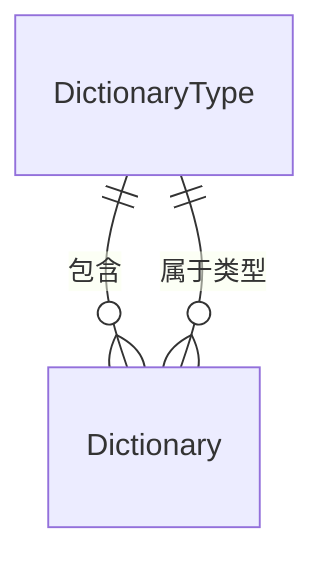

# DictionaryTypeAggregateRoot

## 概述

字典类型实体，RBAC 核心实体之一，表示系统字典的分类/类型。继承自 `AggregateRoot<Guid>`，实现软删除、审计和排序接口。

## 表信息

| 属性 | 值 |
|-----|-----|
| **表名** | `DictionaryType` |
| **主键** | `Id` (Guid) |
| **聚合类型** | AggregateRoot（支持领域事件） |
| **业务键** | `DictType`（唯一标识） |

## 字段列表

| 字段名 | 类型 | 说明 | 默认值 | 约束 |
|--------|------|------|--------|------|
| `Id` | Guid | 主键 | - | Primary Key |
| `DictName` | string | 字典类型名称 | string.Empty | Required |
| `DictType` | string | 字典类型编码（唯一标识） | string.Empty | Unique |
| `Remark` | string? | 类型描述/备注 | null | - |
| `State` | bool? | 状态（启用/禁用） | true | - |
| `OrderNum` | int | 排序序号 | 0 | - |
| `IsDeleted` | bool | 逻辑删除标记 | false | Soft Delete |
| `CreationTime` | DateTime | 创建时间 | - | Audit |
| `CreatorId` | Guid? | 创建者ID | null | Audit |
| `LastModificationTime` | DateTime? | 最后修改时间 | null | Audit |
| `LastModifierId` | Guid? | 最后修改者ID | null | Audit |

## 关联实体

### ER 关系



### 导航属性

| 属性 | 关联实体 | 关系类型 | 说明 |
|------|----------|----------|------|
| 无直接导航属性 | - | - | 通过 `DictionaryEntity.DictType` 关联 |

### 反向导航

- `DictionaryEntity` 通过 `DictType` 字段关联到此实体

## 业务规则

### 唯一性约束
- `DictType` 全局唯一（字典类型编码）
- `DictName` 建议唯一（字典类型名称）

### 状态管理
- `State = true`：字典类型启用，可添加字典项
- `State = false`：字典类型禁用，不显示选项
- `IsDeleted = true`：逻辑删除，需处理关联字典项

### 级联关系
- 删除字典类型时需处理 `Dictionary` 关联记录：
  - **方案1**：级联删除所有字典项
  - **方案2**：阻止删除，需先清理字典项
  - 当前实现：需要业务层处理

### 字典类型与字典项关系
- 一个字典类型包含多个字典项（一对多）
- 字典项通过 `DictType` 字段关联
- 字典类型删除时，字典项失去归属

## 使用服务

### 主要消费服务

| 服务 | 模块 | 读写类型 | 主要操作 |
|------|------|----------|----------|
| `DictionaryService` | Yi.Framework.Rbac.Application | Read/Write | CRUD、字典项管理 |
| `DataDictionaryService` | Ast.IntelliSub.Application | Read | 业务字典查询 |

### 关键方法

```csharp
// 获取字典类型及其所有字典项
var dictTypes = await dictionaryService.GetListWithItemsAsync();

// 根据类型编码获取字典项
var dictItems = await dictionaryService.GetItemsByTypeAsync("DEVICE_STATUS");

// 创建字典类型
await dictionaryService.CreateAsync(new DictionaryTypeAggregateRoot
{
    DictName = "设备状态",
    DictType = "DEVICE_STATUS",
    Remark = "设备运行状态分类"
});
```

## 典型业务场景

### 系统预置字典类型

| DictType | DictName | 说明 |
|----------|----------|------|
| `DEVICE_STATUS` | 设备状态 | 设备运行状态（正常、异常、离线） |
| `TASK_STATUS` | 任务状态 | 巡检任务状态（待执行、进行中、已完成） |
| `ALARM_LEVEL` | 告警级别 | 告警严重程度（信息、警告、严重） |
| `SEX` | 性别 | 用户性别 |
| `USER_STATE` | 用户状态 | 用户账号状态 |
| `YES_NO` | 是否 | 布尔值选项 |

### 字典类型应用

```csharp
// 前端下拉框数据获取
[HttpGet("dict-items/{dictType}")]
public async Task<List<DictionaryEntity>> GetDictItems(string dictType)
{
    return await _dictionaryService.GetItemsByTypeAsync(dictType);
}

// 业务逻辑中使用字典
public async Task UpdateDeviceStatusAsync(Guid deviceId, string status)
{
    var device = await deviceRepository.GetAsync(deviceId);
    
    // 验证状态值是否合法
    var validStatuses = await _dictionaryService.GetItemsByTypeAsync("DEVICE_STATUS");
    if (!validStatuses.Any(d => d.DictValue == status))
    {
        throw new BusinessException("无效的设备状态");
    }
    
    device.Status = status;
    await deviceRepository.UpdateAsync(device);
}
```

## 数据种子

字典类型种子数据通常在系统初始化时创建，预置常用字典类型：

种子位置：`module/rbac/Yi.Framework.Rbac.SqlSugarCore/DataSeeds/`

预置字典类型示例：
- 用户性别
- 用户状态
- 是否选项
- 设备状态（业务模块）

## 扩展说明

### 字典类型编码规范

字典类型编码采用全大写英文单词，用下划线分隔：
- `DEVICE_STATUS` - 设备状态
- `TASK_STATUS` - 任务状态
- `ALARM_LEVEL` - 告警级别
- `PATROL_TYPE` - 巡检类型

### 字典系统优势

- **集中管理**：统一管理系统所有枚举值
- **动态配置**：无需重新部署即可修改选项
- **多语言支持**：通过 `DictLabel` 实现国际化
- **业务解耦**：业务逻辑不硬编码选项值

### 字典项扩展属性

字典项支持额外的样式配置：
- `ListClass`：标签样式类（如 `tag-success`、`tag-danger`）
- `CssClass`：CSS 样式类
- `IsDefault`：是否为默认选项

### 审计跟踪

所有字典类型变更都记录审计信息，确保数据变更可追溯。
