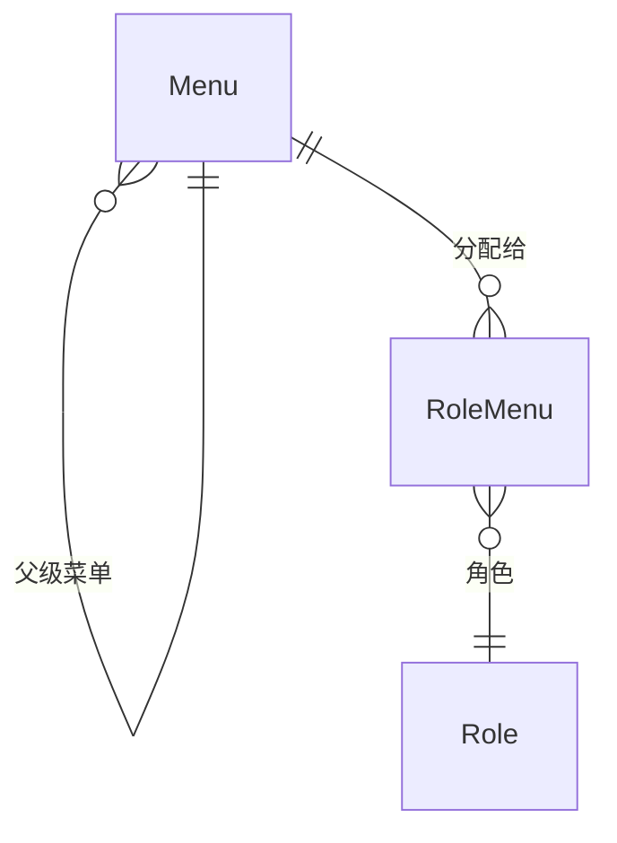

# MenuAggregateRoot

## 概述

菜单实体，RBAC 核心实体之一，表示系统的菜单、按钮、路由等前端资源。继承自 `AggregateRoot<Guid>`，实现软删除、审计、排序和状态接口。

## 表信息

| 属性 | 值 |
|-----|-----|
| **表名** | `Menu` |
| **主键** | `Id` (Guid) |
| **聚合类型** | AggregateRoot（支持领域事件） |
| **树形结构** | 通过 `ParentId` 构建父子关系 |

## 字段列表

| 字段名 | 类型 | 说明 | 默认值 | 约束 |
|--------|------|------|--------|------|
| `Id` | Guid | 主键 | - | Primary Key |
| `MenuName` | string | 菜单名称 | - | Required |
| `MenuType` | MenuTypeEnum | 菜单类型 | MenuTypeEnum.Menu | - |
| `ParentId` | Guid | 父级菜单ID（根菜单为空Guid） | Guid.Empty | Foreign Key → Menu.Id |
| `Router` | string? | 前端路由路径 | null | - |
| `RouterName` | string? | 路由名称 | null | - |
| `Component` | string? | 前端组件路径 | null | - |
| `PermissionCode` | string? | 权限编码（后端鉴权） | null | - |
| `MenuIcon` | string? | 菜单图标 | null | - |
| `IsLink` | bool | 是否外部链接 | false | - |
| `IsCache` | bool | 是否缓存路由 | false | - |
| `IsShow` | bool | 是否显示 | true | - |
| `MenuSource` | MenuSourceEnum | 菜单来源（前端框架） | MenuSourceEnum.Ruoyi | - |
| `Query` | string? | 路由参数 | null | - |
| `Remark` | string? | 备注 | null | - |
| `State` | bool | 状态（启用/禁用） | - | - |
| `OrderNum` | int | 排序序号 | 0 | - |
| `IsDeleted` | bool | 逻辑删除标记 | false | Soft Delete |
| `CreationTime` | DateTime | 创建时间 | DateTime.Now | Audit |
| `CreatorId` | Guid? | 创建者ID | null | Audit |
| `LastModificationTime` | DateTime? | 最后修改时间 | null | Audit |
| `LastModifierId` | Guid? | 最后修改者ID | null | Audit |

## 菜单类型 (MenuTypeEnum)

| 枚举值 | 说明 | 前端表现 | 权限编码 |
|--------|------|----------|----------|
| `Catalogue` | 目录 | 多级菜单父级，不对应具体页面 | 可选 |
| `Menu` | 菜单 | 具体页面，对应路由和组件 | 可选 |
| `Button` | 按钮 | 页面内操作按钮，无路由 | 必需 |
| `Component` | 组件 | 通用组件，不参与路由构建 | 可选 |

## 菜单来源 (MenuSourceEnum)

| 枚举值 | 说明 | 路由构建方法 |
|--------|------|--------------|
| `Ruoyi` | 若依框架 | `Vue3RuoYiRouterBuild()` |
| `Pure` | PureAdmin 框架 | `Vue3PureRouterBuild()` |

## 关联实体

### ER 关系



### 导航属性

| 属性 | 关联实体 | 关系类型 | 说明 |
|------|----------|----------|------|
| `Children` | `List<MenuAggregateRoot>?` | 一对多 | 子菜单列表（运行时构建） |
| `Parent` | `MenuAggregateRoot?` | 多对一 | 父级菜单（通过 `ParentId`） |

### 中间表导航

- `RoleMenuEntity.MenuId` → `MenuAggregateRoot`
- 通过 `RoleAggregateRoot.Menus` 反向导航

## 业务规则

### 树形结构约束
- 根菜单 `ParentId = Guid.Empty`
- 禁止循环引用（父级不能是自己的子孙）
- 删除父菜单需级联删除子菜单

### 唯一性约束
- 同一父级下 `MenuName` 建议唯一
- `PermissionCode` 全局唯一（用于后端鉴权）

### 状态管理
- `State = true`：菜单启用，参与权限计算
- `State = false`：菜单禁用，不分配给角色
- `IsDeleted = true`：逻辑删除，需清理 `RoleMenu` 关联

### 前端路由规则
| 菜单类型 | IsShow | Component | 行为 |
|----------|--------|-----------|------|
| Catalogue | true | Layout/ParentView | 目录容器 |
| Menu | true | 具体组件路径 | 页面路由 |
| Button | - | - | 仅权限检查，无路由 |
| Component | - | - | 不参与路由构建 |

### 菜单与权限分离
- **菜单**：前端可见性、路由可访问性
- **权限**：后端 API 调用鉴权
- 关系：菜单类型为 `Button` 时，必须有 `PermissionCode`

## 使用服务

### 主要消费服务

| 服务 | 模块 | 读写类型 | 主要操作 |
|------|------|----------|----------|
| `MenuService` | Yi.Framework.Rbac.Application | Read/Write | CRUD、树形结构查询、权限分配 |
| `RoleService` | Yi.Framework.Rbac.Application | Read | 角色菜单权限查询 |
| `AuthService` | Yi.Framework.Rbac.Application | Read | 用户菜单树构建 |

### 关键方法

```csharp
// 构建若依框架路由
var menus = await menuService.GetUserMenusAsync(userId);
var routers = menus.Vue3RuoYiRouterBuild();

// 构建Pure框架路由
var pureRouters = menus.Vue3PureRouterBuild();

// 权限检查
var hasPermission = await menuService.HasPermissionAsync(userId, "user:create");
```

## 路由构建

### 若依路由结构

```typescript
interface Vue3Router {
  id: Guid;
  parentId: Guid;
  name: string;        // 路由名称（首字母大写）
  path: string;        // 路由路径
  component: string;   // 组件路径
  redirect: string;    // 重定向
  meta: {
    title: string;     // 菜单名称
    icon: string;      // 菜单图标
    noCache: boolean;  // 是否缓存
    link?: string;     // 外部链接
  };
  hidden: boolean;    // 是否隐藏
  alwaysShow: boolean;// 总是显示
  orderNum: number;   // 排序
}
```

### Pure 路由结构

```typescript
interface Vue3PureRouter {
  id: Guid;
  parentId: Guid;
  path: string;
  name: string;
  component?: string;
  meta: {
    title: string;
    icon: string;
    showLink: boolean;
    frameSrc?: string;  // iframe 外链
    auths: string[];    // 权限编码列表
  };
  children?: Vue3PureRouter[];
}
```

## 数据种子

- 若依菜单：`module/rbac/Yi.Framework.Rbac.SqlSugarCore/DataSeeds/MenuRuoYiDataSeed.cs`
- Pure 菜单：`module/rbac/Yi.Framework.Rbac.SqlSugarCore/DataSeeds/MenuPureDataSeed.cs`
- 种子包含系统管理、基础功能等预置菜单

## 扩展说明

### 菜单类型与前端框架适配

当前实现支持两种前端框架：
- **若依**：基于目录-菜单-按钮三层结构
- **Pure**：扁平化路由结构，支持动态导入

### 权限编码规范

权限编码采用 `资源:操作` 格式：
- `user:create` - 创建用户
- `user:update` - 更新用户
- `user:delete` - 删除用户
- `user:list` - 查询用户列表

### 性能优化

菜单查询使用 SqlSugar 的 `Navigate` 特性一次性加载关联数据，避免 N+1 查询。

树形结构通过 `TreeHelper.SetTree()` 内存构建，避免递归数据库查询。
