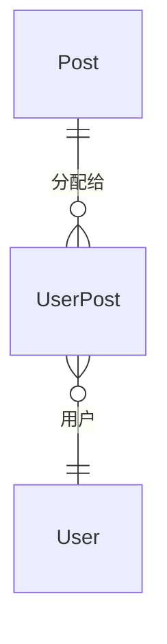

# PostAggregateRoot

## 概述

岗位实体，RBAC 核心实体之一，表示组织架构中的岗位/职位。继承自 `AggregateRoot<Guid>`，实现软删除、审计、排序和状态接口。

## 表信息

| 属性 | 值 |
|-----|-----|
| **表名** | `Post` |
| **主键** | `Id` (Guid) |
| **聚合类型** | AggregateRoot（支持领域事件） |

## 字段列表

| 字段名 | 类型 | 说明 | 默认值 | 约束 |
|--------|------|------|--------|------|
| `Id` | Guid | 主键 | - | Primary Key |
| `PostCode` | string | 岗位编码（唯一标识） | string.Empty | Unique |
| `PostName` | string | 岗位名称 | string.Empty | Required |
| `Remark` | string? | 岗位描述/备注 | null | - |
| `State` | bool | 状态（启用/禁用） | true | - |
| `OrderNum` | int | 排序序号 | 0 | - |
| `IsDeleted` | bool | 逻辑删除标记 | false | Soft Delete |
| `CreationTime` | DateTime | 创建时间 | DateTime.Now | Audit |
| `CreatorId` | Guid? | 创建者ID | null | Audit |
| `LastModificationTime` | DateTime? | 最后修改时间 | null | Audit |
| `LastModifierId` | Guid? | 最后修改者ID | null | Audit |

## 关联实体

### ER 关系



### 导航属性

| 属性 | 关联实体 | 关系类型 | 中间表 |
|------|----------|----------|--------|
| 无直接导航属性 | - | - | - |

### 反向导航

- `UserAggregateRoot.Posts` → 用户岗位列表（通过 `UserPost`）
- `UserPostEntity.PostId` → `PostAggregateRoot`

## 业务规则

### 唯一性约束
- `PostCode` 全局唯一（岗位编码）
- `PostName` 建议唯一（岗位名称）

### 状态管理
- `State = true`：岗位启用，可分配给用户
- `State = false`：岗位禁用，无法分配给新用户
- `IsDeleted = true`：逻辑删除，需清理 `UserPost` 关联

### 用户岗位关系
- 用户可担任多个岗位（多对多关系）
- 岗位可分配给多个用户
- 通过 `UserPost` 中间表维护关联

### 级联关系
- 删除岗位时需清理 `UserPost` 关联记录
- 不影响用户实体，仅解除岗位绑定

### 岗位与角色区别

| 特性 | 岗位 (Post) | 角色 (Role) |
|------|------------|------------|
| 用途 | 表示职位、职称 | 表示权限集合 |
| 关系 | 用户-岗位（多对多） | 用户-角色（多对多） |
| 权限 | 无直接权限 | 包含菜单权限、数据权限 |
| 示例 | 巡检员、值班长、技术主管 | 管理员、普通用户、只读用户 |
| 可变性 | 相对稳定，组织架构相关 | 灵活配置，权限管理相关 |

## 使用服务

### 主要消费服务

| 服务 | 模块 | 读写类型 | 主要操作 |
|------|------|----------|----------|
| `PostService` | Yi.Framework.Rbac.Application | Read/Write | CRUD、岗位分配 |
| `UserService` | Yi.Framework.Rbac.Application | Read | 用户岗位查询 |
| `PatrolTaskService` | Ast.IntelliSub.Application | Read | 任务分配、执行人岗位过滤 |

### 关键方法

```csharp
// 获取用户岗位
var user = await userRepository.GetAsync(userId, includeDetails: true);
var posts = user.Posts;

// 分配岗位给用户
await userService.AssignPostsAsync(userId, new[] { postId1, postId2 });

// 根据岗位过滤任务
var tasks = await taskService.GetTasksByPostAsync(postId);
```

## 典型业务场景

### 岗位配置示例

| 岗位编码 | 岗位名称 | 说明 |
|---------|---------|------|
| `PATROL_INSPECTOR` | 巡检员 | 负责设备巡检任务 |
| `PATROL_LEADER` | 巡检组长 | 审核巡检报告 |
| `STATION_MASTER` | 站长 | 管理变电站整体事务 |
| `MAINTENANCE_ENG` | 维护工程师 | 设备维护和故障处理 |
| `DATA_ANALYST` | 数据分析师 | 分析监测数据 |

### 岗位与业务流程

```csharp
// 示例：巡检任务分配逻辑
public async Task AssignPatrolTaskAsync(Guid taskId, Guid? postCode = null)
{
    var task = await taskRepository.GetAsync(taskId);
    
    // 如果指定岗位，查找该岗位下的用户
    if (postCode.HasValue)
    {
        var postUsers = await userRepository.GetListAsync(
            u => u.Posts.Any(p => p.PostCode == postCode.ToString()) && u.State
        );
        // 分配给该岗位的某个用户
        task.AssignedTo = postUsers.First().Id;
    }
    
    await taskRepository.UpdateAsync(task);
}
```

## 数据种子

岗位种子数据通常由业务模块初始化，预置常见岗位：

种子位置：`module/ast-intellisub/Ast.IntelliSub.SqlSugarCore/DataSeeds/`

预置岗位示例：
- 巡检员
- 值班长
- 站长
- 技术主管

## 扩展说明

### 岗位编码规范

岗位编码采用全大写英文单词，用下划线分隔：
- `PATROL_INSPECTOR` - 巡检员
- `PATROL_LEADER` - 巡检组长
- `STATION_MASTER` - 站长

### 岗位与权限分离

岗位本身不携带权限，仅作为用户分类标签。权限由角色系统管理。

典型使用场景：
- 根据岗位分配工作任务
- 根据岗位统计人员配置
- 根据岗位生成组织架构报表

### 审计跟踪

所有岗位变更（创建、修改、删除、分配）都记录审计信息。
