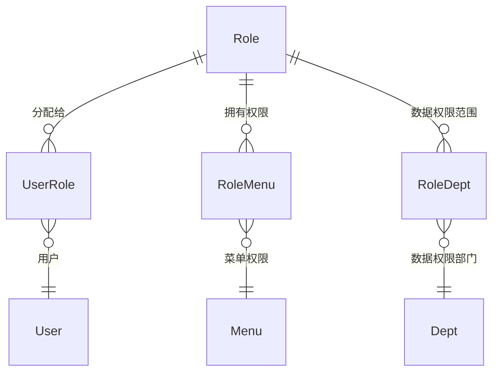

# RoleAggregateRoot

## 概述

角色实体，RBAC 核心实体之一，表示系统中的角色权限集合。继承自 `AggregateRoot<Guid>`，实现软删除、审计、排序和状态接口。

## 表信息

| 属性 | 值 |
|-----|-----|
| **表名** | `Role` |
| **主键** | `Id` (Guid) |
| **聚合类型** | AggregateRoot（支持领域事件） |

## 字段列表

| 字段名 | 类型 | 说明 | 默认值 | 约束 |
|--------|------|------|--------|------|
| `Id` | Guid | 主键 | - | Primary Key |
| `RoleName` | string | 角色名称 | string.Empty | Required |
| `RoleCode` | string | 角色编码（唯一标识） | string.Empty | Unique |
| `DataScope` | DataScopeEnum | 数据权限范围 | DataScopeEnum.ALL | - |
| `Remark` | string? | 角色描述/备注 | null | - |
| `State` | bool | 状态（启用/禁用） | true | - |
| `OrderNum` | int | 排序序号 | 0 | - |
| `IsDeleted` | bool | 逻辑删除标记 | false | Soft Delete |
| `CreationTime` | DateTime | 创建时间 | DateTime.Now | Audit |
| `CreatorId` | Guid? | 创建者ID | null | Audit |
| `LastModificationTime` | DateTime? | 最后修改时间 | null | Audit |
| `LastModifierId` | Guid? | 最后修改者ID | null | Audit |

## 数据权限范围 (DataScopeEnum)

| 枚举值 | 说明 | 权限范围 |
|--------|------|----------|
| `ALL` | 全部数据 | 可访问所有数据 |
| `CUSTOM` | 自定义数据 | 仅访问指定部门数据 |
| `DEPT` | 本部门数据 | 仅访问所在部门数据 |
| `DEPT_AND_CHILD` | 本部门及子部门 | 访问部门树及下级数据 |
| `SELF` | 仅本人数据 | 仅访问自己创建的数据 |

## 关联实体

### ER 关系



### 导航属性

| 属性 | 关联实体 | 关系类型 | 中间表 |
|------|----------|----------|--------|
| `Menus` | `List<MenuAggregateRoot>?` | 多对多 | `RoleMenuEntity` |
| `Depts` | `List<DeptAggregateRoot>?` | 多对多 | `RoleDeptEntity` |

### 反向导航

通过中间表反向导航：
- `RoleMenuEntity.RoleId` → `RoleAggregateRoot`
- `RoleDeptEntity.RoleId` → `RoleAggregateRoot`
- `UserRoleEntity.RoleId` → `RoleAggregateRoot`

## 业务规则

### 唯一性约束
- `RoleCode` 全局唯一（角色编码）
- `RoleName` 建议唯一（角色名称）

### 数据权限逻辑
1. **全部数据 (ALL)**：无限制访问
2. **自定义 (CUSTOM)**：通过 `RoleDept` 关联指定可访问部门
3. **本部门 (DEPT)**：根据用户所属 `DeptId` 过滤
4. **本部门及子部门 (DEPT_AND_CHILD)**：根据部门树向下递归过滤
5. **本人数据 (SELF)**：根据 `CreatorId = CurrentUserId` 过滤

### 状态管理
- `State = true`：角色启用，可分配给用户
- `State = false`：角色禁用，已有用户失去该角色权限
- `IsDeleted = true`：逻辑删除，需清理所有关联记录

### 级联关系
- 删除角色时需清理：
  - `UserRole` 关联（解除用户角色绑定）
  - `RoleMenu` 关联（删除菜单权限）
  - `RoleDept` 关联（删除数据权限配置）

## 使用服务

### 主要消费服务

| 服务 | 模块 | 读写类型 | 主要操作 |
|------|------|----------|----------|
| `RoleService` | Yi.Framework.Rbac.Application | Read/Write | CRUD、菜单权限分配、数据权限配置 |
| `UserService` | Yi.Framework.Rbac.Application | Read | 用户角色查询 |
| `MenuService` | Yi.Framework.Rbac.Application | Read | 角色菜单权限查询 |
| `DataService` | Ast.IntelliSub.Application | Read | 数据权限过滤 |

### 关键方法

```csharp
// 更新角色数据权限范围
await roleService.UpdateDataScopeAsync(roleId, DataScopeEnum.CUSTOM, deptIds);

// 获取角色菜单权限
var menus = await roleRepository.GetListAsync(includeDetails: true);
var roleMenus = menus.First().Menus;

// 查询角色用户
var users = await userRepository.GetListAsync(u => u.Roles.Any(r => r.Id == roleId));
```

## 数据种子

- 种子数据位置：`module/rbac/Yi.Framework.Rbac.SqlSugarCore/DataSeeds/RoleDataSeed.cs`
- 预置角色：
  - **超级管理员**：全部数据权限，所有菜单权限
  - **普通用户**：本人数据权限，基础菜单权限

## 扩展说明

### 数据权限实现

服务层通过 `DataScope` 和 `RoleDept` 实现数据过滤：

```csharp
// 示例：根据用户角色过滤数据
public async Task<List<TEntity>> GetDataByUser(Guid userId)
{
    var user = await userRepository.GetAsync(userId, includeDetails: true);
    var roles = user.Roles;
    
    foreach (var role in roles)
    {
        switch (role.DataScope)
        {
            case DataScopeEnum.ALL:
                return await repository.GetListAsync(); // 全部
            case DataScopeEnum.DEPT:
                return await repository.GetListAsync(x => x.DeptId == user.DeptId);
            case DataScopeEnum.SELF:
                return await repository.GetListAsync(x => x.CreatorId == userId);
        }
    }
}
```

### 角色继承

当前实现不支持角色继承，每个角色的权限独立配置。

### 审计跟踪

所有角色变更（权限分配、数据范围修改）都记录审计信息（`CreatorId`、`LastModifierId`）。
