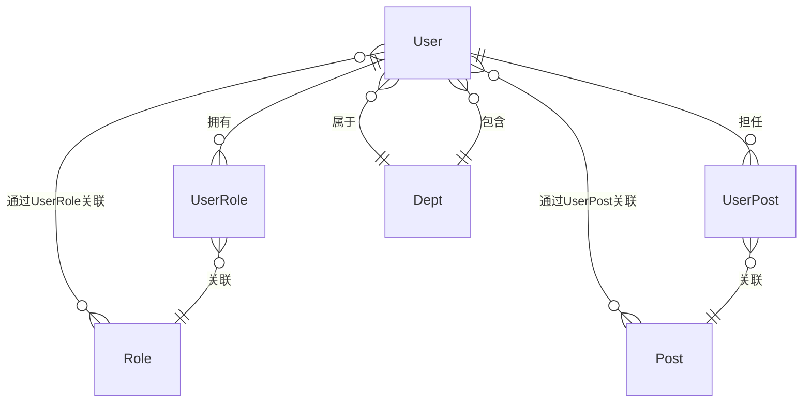

# UserAggregateRoot

## 概述

用户实体，RBAC 核心实体之一，表示系统中的用户账号。继承自 `AggregateRoot<Guid>`，实现软删除、审计、排序和状态接口。

## 表信息

| 属性 | 值 |
|-----|-----|
| **表名** | `User` |
| **主键** | `Id` (Guid) |
| **索引** | `index_UserName` (UserName, ASC) |

## 字段列表

| 字段名 | 类型 | 说明 | 默认值 | 约束 |
|--------|------|------|--------|------|
| `Id` | Guid | 主键 | - | Primary Key |
| `UserName` | string | 用户名（登录账号） | string.Empty | Required, Indexed |
| `Name` | string? | 真实姓名 | null | - |
| `Nick` | string? | 昵称（显示名称） | "萌新-{UserName}" | - |
| `Phone` | long? | 电话号码 | null | - |
| `Email` | string? | 邮箱地址 | null | - |
| `Icon` | string? | 头像URL | null | - |
| `Age` | int? | 年龄 | null | - |
| `Sex` | SexEnum | 性别 | SexEnum.Unknown | - |
| `Address` | string? | 地址 | null | - |
| `Ip` | string? | IP地址 | null | - |
| `Introduction` | string? | 个人简介 | null | - |
| `Remark` | string? | 备注 | null | - |
| `DeptId` | Guid? | 部门ID（外键） | null | Foreign Key → Dept.Id |
| `EncryPassword.Password` | string | 加密后的密码 | string.Empty | Owned Type |
| `EncryPassword.Salt` | string | 密码盐值 | - | Owned Type |
| `State` | bool | 状态（启用/禁用） | true | - |
| `OrderNum` | int | 排序序号 | 0 | - |
| `IsDeleted` | bool | 逻辑删除标记 | false | Soft Delete |
| `CreationTime` | DateTime | 创建时间 | DateTime.Now | Audit |
| `CreatorId` | Guid? | 创建者ID | null | Audit |
| `LastModificationTime` | DateTime? | 最后修改时间 | null | Audit |
| `LastModifierId` | Guid? | 最后修改者ID | null | Audit |

## 关联实体

### ER 关系



### 导航属性

| 属性 | 关联实体 | 关系类型 | 中间表 |
|------|----------|----------|--------|
| `Roles` | `List<RoleAggregateRoot>` | 多对多 | `UserRoleEntity` |
| `Posts` | `List<PostAggregateRoot>` | 多对多 | `UserPostEntity` |
| `Dept` | `DeptAggregateRoot?` | 多对一 | 直接外键 `DeptId` |

## 业务规则

### 密码安全
- 密码使用 **SHA256 + 盐值** 加密存储
- 盐值由 `MD5Helper.GenerateSalt()` 随机生成
- 密码不可逆，仅能通过 `JudgePassword()` 验证

### 状态管理
- `State = true`：用户可用，可正常登录
- `State = false`：用户禁用，无法登录
- `IsDeleted = true`：逻辑删除，不参与业务查询

### 唯一性约束
- `UserName` 全局唯一（登录账号）
- 建议业务层确保 `Phone`、`Email` 唯一

### 级联关系
- 用户删除时需清理 `UserRole`、`UserPost` 关联记录
- 部门删除不影响用户（仅解除关联）

## 使用服务

### 主要消费服务

| 服务 | 模块 | 读写类型 | 主要操作 |
|------|------|----------|----------|
| `UserService` | Yi.Framework.Rbac.Application | Read/Write | CRUD、密码管理、角色分配 |
| `AuthService` | Yi.Framework.Rbac.Application | Read | 登录验证、Token生成 |
| `PatrolTaskService` | Ast.IntelliSub.Application | Read | 任务分配、执行人查询 |

### 关键方法

```csharp
// 密码加密
user.BuildPassword(password);

// 密码验证
bool isValid = user.JudgePassword(inputPassword);

// 角色查询（通过导航属性）
var roles = await userRepository.GetListAsync(includeDetails: true);
var userRoles = roles.First().Roles;

// 部门查询
var dept = user.Dept;
```

## 数据种子

- 种子数据位置：`Yi.Framework.Rbac.SqlSugarCore/DataSeeds/`
- 默认管理员用户：用户名 `admin`，密码需通过初始化脚本设置

## 扩展说明

### 构造函数
```csharp
// 创建用户时自动加密密码
var user = new UserAggregateRoot("johndoe", "plainPassword", 13800138000, "John Doe");
```

### 密码值对象
密码和盐值封装在 `EncryPasswordValueObject` 中，通过 SqlSugar 的 `IsOwnsOne` 映射为同表字段。

### 索引优化
`UserName` 字段存在升序索引，加速登录查询。
