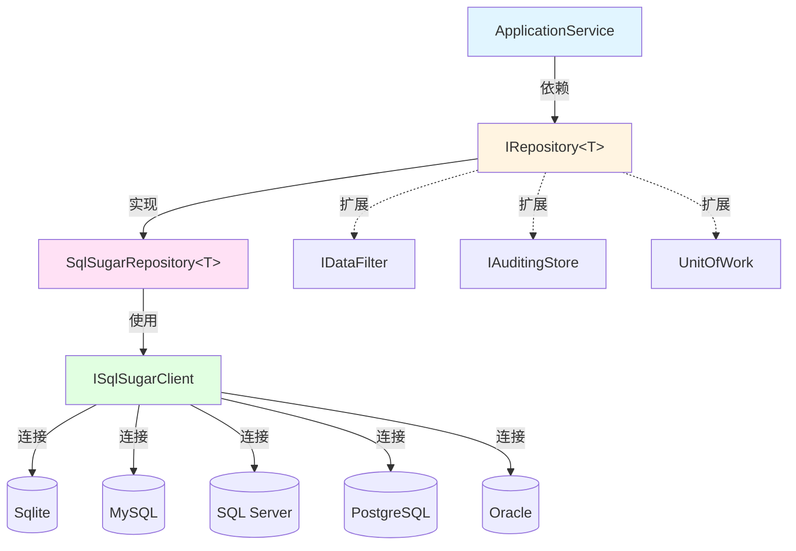

# ABP 仓储模式

## 问题背景

### 业务场景

在开发 IntelliSubstation Voiceprint Monitoring Backend 时，我们需要访问多种数据库：

- **SQLite** - 低资源模式（ARM32 边缘设备）
- **MySQL** - 标准生产环境
- **SQL Server** - 企业级部署
- **PostgreSQL** - 云原生环境
- **Oracle** - 大型企业集成

同时需要支持：
- 多租户数据过滤
- 工作单元管理
- 软删除
- 审计日志

### 技术挑战

1. **数据访问耦合** - 业务代码直接依赖特定 ORM（如 EF Core）
2. **单元测试困难** - 数据库依赖导致测试难以隔离
3. **数据库切换成本高** - 更换数据库需要修改大量代码
4. **横切关注点混杂** - 审计、软删除、数据过滤散落在各处

---

## 设计方案

### 为什么这样设计

#### 方案 A：直接使用 EF Core / SqlSugar

**原理**：在 ApplicationService 中直接使用 DbContext

```csharp
// ❌ 不推荐
public class DeviceAppService
{
    private readonly MyDbContext _context;

    public async Task<DeviceDto> GetAsync(Guid id)
    {
        return await _context.Devices.FindAsync(id);
    }
}
```

**优点**：
- 简单直接
- 性能最优

**缺点**：
- 业务代码与 ORM 强耦合
- 无法方便地切换数据库
- 单元测试需要真实数据库
- 横切关注点（软删除、审计）难以统一处理

**结论**：适合小型项目，不适合企业级应用

#### 方案 B：ABP 仓储模式（采用）

**原理**：通过 `IRepository<T>` 接口抽象数据访问

```csharp
// ✅ 推荐
public class DeviceAppService
{
    private readonly IRepository<Device, Guid> _repository;

    public async Task<DeviceDto> GetAsync(Guid id)
    {
        var device = await _repository.GetAsync(id);
        return ObjectMapper.Map<Device, DeviceDto>(device);
    }
}
```

**优点**：
- **数据库无关** - 同样代码支持多种数据库
- **可测试** - 易于使用内存数据库或 Mock
- **统一管理** - 软删除、审计、数据过滤自动处理
- **类型安全** - 强类型 API，编译时检查

**代价**：
- 抽象层带来轻微性能开销
- 需要学习 ABP 仓储 API

**结论**：适合企业级、多数据库、可测试需求的项目

---

## 技术细节

### 核心机制

#### 仓储接口定义

ABP 提供 `IRepository<TEntity, TKey>` 和 `IRepository<TEntity>` 接口：

```csharp
public interface IRepository<TEntity, TKey> : IRepository<TEntity>
    where TEntity : class, IEntity<TKey>
{
    Task<TEntity> GetAsync(TKey id, bool includeDetails = true, CancellationToken cancellationToken = default);
    Task<TEntity?> FindAsync(TKey id, bool includeDetails = true, CancellationToken cancellationToken = default);
    Task DeleteAsync(TKey id, bool autoSave = false, CancellationToken cancellationToken = default);
    // ... 更多方法
}

public interface IRepository<TEntity> : IReadOnlyRepository<TEntity>
    where TEntity : class, IEntity
{
    Task<TEntity> InsertAsync(TEntity entity, bool autoSave = false, CancellationToken cancellationToken = default);
    Task<TEntity> UpdateAsync(TEntity entity, bool autoSave = false, CancellationToken cancellationToken = default);
    Task DeleteAsync(TEntity entity, bool autoSave = false, CancellationToken cancellationToken = default);
    // ... 更多方法
}
```

#### SqlSugar 仓储实现

本项目使用 SqlSugar ORM，实现了 `SqlSugarRepository<T, TKey>`：

```csharp
public class SqlSugarRepository<TEntity, TKey> : SqlSugarRepository<TEntity>, ISqlSugarRepository<TEntity, TKey>, IRepository<TEntity, TKey>
    where TEntity : class, IEntity<TKey>, new()
{
    public SqlSugarRepository(ISugarDbContextProvider<ISqlSugarDbContext> sugarDbContextProvider)
        : base(sugarDbContextProvider)
    {
    }

    public virtual async Task<TEntity?> FindAsync(TKey id, bool includeDetails = true, CancellationToken cancellationToken = default)
    {
        return await GetByIdAsync(id);
    }

    public virtual async Task<TEntity> GetAsync(TKey id, bool includeDetails = true, CancellationToken cancellationToken = default)
    {
        return await GetByIdAsync(id);
    }

    public virtual async Task DeleteAsync(TKey id, bool autoSave = false, CancellationToken cancellationToken = default)
    {
        await DeleteByIdAsync(id);
    }
}
```

#### 仓储注册

模块中自动注册仓储：

```csharp
public class MySqlSugarCoreModule : AbpModule
{
    public override void ConfigureServices(ServiceConfigurationContext context)
    {
        // 自动注册所有仓储
        var repositories = Assembly.GetExecutingAssembly()
            .GetTypes()
            .Where(t => t.IsGenericType && t.GetGenericTypeDefinition() == typeof(SqlSugarRepository<,>));

        foreach (var repository in repositories)
        {
            services.AddTransient(repository);
        }
    }
}
```

### 使用示例

#### 基本 CRUD 操作

```csharp
public class DeviceAppService : ApplicationService
{
    private readonly IRepository<Device, Guid> _repository;

    // 查询
    public async Task<DeviceDto> GetAsync(Guid id)
    {
        var device = await _repository.GetAsync(id);
        return ObjectMapper.Map<Device, DeviceDto>(device);
    }

    // 查询列表
    public async Task<List<DeviceDto>> GetListAsync()
    {
        var devices = await _repository.GetListAsync();
        return ObjectMapper.Map<List<Device>, List<DeviceDto>>(devices);
    }

    // 条件查询
    public async Task<DeviceDto> GetByNameAsync(string name)
    {
        var device = await _repository.FirstOrDefaultAsync(d => d.Name == name);
        return ObjectMapper.Map<Device, DeviceDto>(device);
    }

    // 插入
    public async Task<DeviceDto> CreateAsync(CreateDeviceDto input)
    {
        var device = ObjectMapper.Map<CreateDeviceDto, Device>(input);
        await _repository.InsertAsync(device);
        return ObjectMapper.Map<Device, DeviceDto>(device);
    }

    // 更新
    public async Task<DeviceDto> UpdateAsync(Guid id, UpdateDeviceDto input)
    {
        var device = await _repository.GetAsync(id);
        ObjectMapper.Map(input, device);
        await _repository.UpdateAsync(device);
        return ObjectMapper.Map<Device, DeviceDto>(device);
    }

    // 删除
    public async Task DeleteAsync(Guid id)
    {
        await _repository.DeleteAsync(id);
    }
}
```

#### 高级查询

```csharp
// 使用 ISqlSugarRepository 直接访问 SqlSugar API
public class DeviceAppService
{
    private readonly ISqlSugarRepository<Device, Guid> _repository;

    public async Task<PagedResultDto<DeviceDto>> GetFilteredAsync(DeviceFilter filter)
    {
        var query = _repository._DbQueryable;

        // 过滤条件
        if (!string.IsNullOrEmpty(filter.Name))
        {
            query = query.Where(d => d.Name.Contains(filter.Name));
        }

        if (filter.Status.HasValue)
        {
            query = query.Where(d => d.Status == filter.Status.Value);
        }

        // 排序
        query = query.OrderByDescending(d => d.CreationTime);

        // 分页
        var totalCount = await query.CountAsync();
        var items = await query.ToPageListAsync(filter.SkipCount, filter.MaxResultCount);

        return new PagedResultDto<DeviceDto>(totalCount, ObjectMapper.Map<List<Device>, List<DeviceDto>>(items));
    }
}
```

#### 工作单元模式

```csharp
public class MyApplicationService : ApplicationService
{
    private readonly IRepository<Order, Guid> _orderRepository;
    private readonly IRepository<OrderItem, Guid> _itemRepository;
    private readonly IUnitOfWorkManager _unitOfWorkManager;

    public async Task CreateOrderWithItemsAsync(CreateOrderDto input)
    {
        // 使用 UnitOfWork 确保事务一致性
        using (var uow = _unitOfWorkManager.Begin())
        {
            // 创建订单
            var order = await _orderRepository.InsertAsync(new Order { ... });

            // 创建订单项
            foreach (var itemDto in input.Items)
            {
                await _itemRepository.InsertAsync(new OrderItem
                {
                    OrderId = order.Id,
                    // ...
                });
            }

            // 提交事务
            await uow.CompleteAsync();
        }
    }
}
```

### 数据结构

```csharp
// 实体基类
public abstract class Entity : IEntity
{
    public Guid Id { get; protected set; }
}

public abstract class Entity<TKey> : IEntity<TKey>
{
    [Key]
    public TKey Id { get; protected set; }
}

// 审计实体
public abstract class FullAuditedEntity : Entity, IFullAuditedObject
{
    public DateTime CreationTime { get; set; }
    public Guid? CreatorId { get; set; }
    public DateTime? LastModificationTime { get; set; }
    public Guid? LastModifierId { get; set; }
    public DateTime? DeletionTime { get; set; }
    public Guid? DeleterId { get; set; }
    public bool IsDeleted { get; set; }
}

// 示例实体
public class Device : FullAuditedEntity<Guid>
{
    public string Name { get; set; }
    public string Code { get; set; }
    public DeviceStatus Status { get; set; }
    public string Location { get; set; }
}
```

### 配置示例

#### appsettings.json

```json
{
  "DbConnOptions": {
    "DeploymentMode": "LowResource",
    "Url": "Data Source=db/ast_intellisub.db",
    "DbType": "Sqlite"
  }
}
```

#### 模块配置

```csharp
[DependsOn(
    typeof(AbpEntityFrameworkCoreModule),
    typeof(YiFrameworkSqlSugarCoreModule)
)]
public class AstIntelliSubSqlSugarCoreModule : AbpModule
{
    public override void ConfigureServices(ServiceConfigurationContext context)
    {
        Configure<DbConnOptions>(context.Services.Configuration.GetSection("DbConnOptions"));
    }
}
```

---

## 架构图



---

## DDD 分层视角

| 层 | 职责 | 示例 |
|----|------|------|
| **Application** | 应用服务编排，调用仓储 | DeviceAppService |
| **Domain** | 领域实体和仓储接口定义 | Device, IRepository<T> |
| **Infrastructure** | 技术实现，具体仓储实现 | SqlSugarRepository<T> |

**依赖关系**：
- Application → Domain（依赖接口）
- Infrastructure → Domain（实现接口）
- Web → Application（调用应用服务）

---

## 相关概念

- [[工作单元模式]] - 事务管理
- [[数据过滤器]] - 多租户、软删除
- [[SqlSugar ORM]] - 底层数据库访问

---

## ABP 集成

### 模块集成

```csharp
[DependsOn(
    typeof(AbpDddDomainModule),
    typeof(YiFrameworkSqlSugarCoreModule)
)]
public class AstIntelliSubDomainModule : AbpModule
{
    public override void ConfigureServices(ServiceConfigurationContext context)
    {
        // 配置仓储
    }
}
```

### 最佳实践

1. **优先使用标准仓储 API** - `GetAsync`, `InsertAsync`, `UpdateAsync`
2. **需要复杂查询时** - 注入 `ISqlSugarRepository<T, TKey>` 访问 SqlSugar API
3. **使用 UnitOfWork** - 确保事务一致性
4. **避免 N+1 查询** - 使用 Include 或批量加载

---

## 参考资料

- [ABP Framework 仓储文档](https://docs.abp.io/en/abp/latest/Repositories)
- 相关源码：
  - `framework/Yi.Framework.SqlSugarCore/Repositories/SqlSugarRepository.cs`
  - `framework/Yi.Framework.SqlSugarCore.Abstractions/ISqlSugarRepository.cs`
  - `module/ast-intellisub/Ast.IntelliSub.Domain/Devices/Device.cs`

---
**状态**：🟡 学习中
