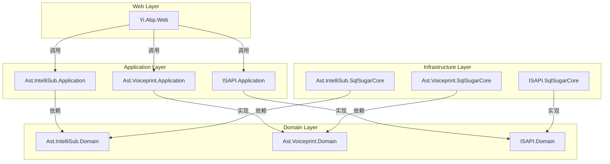
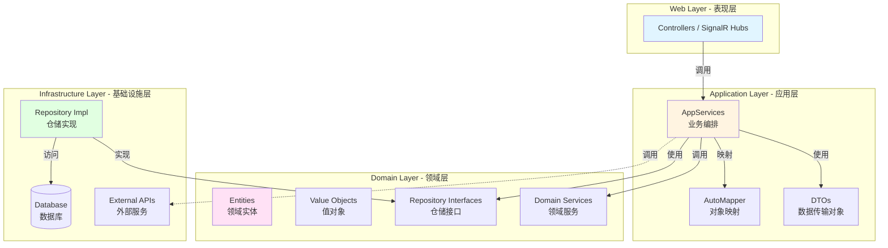
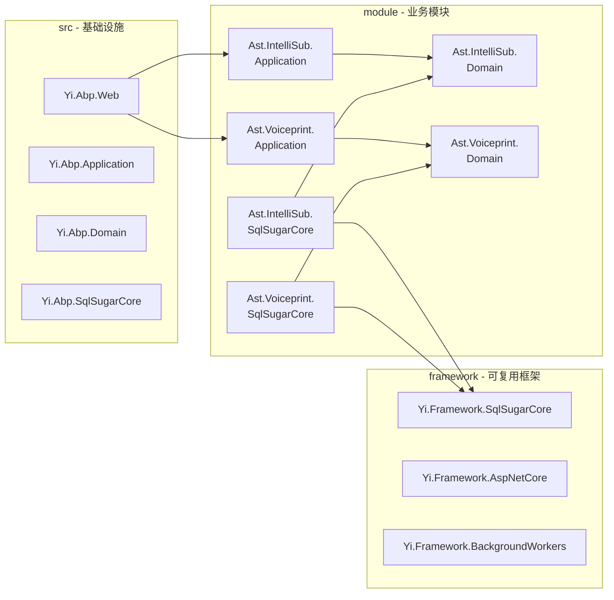

# DDD 分层架构

## 问题背景

### 业务场景

IntelliSubstation Voiceprint Monitoring Backend 是一个复杂的企业级应用，需要：

- **多业务域** - 变电站监控、声纹分析、IEC61850 协议、RBAC 等
- **高可维护性** - 业务规则频繁变更，需要快速响应
- **可测试性** - 自动化测试覆盖率要求高
- **团队协作** - 多开发人员并行开发不同模块
- **技术栈演进** - 框架升级、数据库更换不影响业务逻辑

### 技术挑战

1. **业务逻辑与技术实现混杂** - 难以理解和维护
2. **依赖关系混乱** - 修改一处影响面大
3. **难以测试** - 业务逻辑依赖基础设施
4. **无法独立演进** - 各层耦合严重

---

## 设计方案

### 为什么这样设计

#### 方案 A：传统三层架构

**原理**：UI → BLL → DAL

```
┌─────────────┐
│   Web UI    │
└──────┬──────┘
       │
┌──────▼──────┐
│  BLL 层     │  ← 业务逻辑和数据访问混杂
└──────┬──────┘
       │
┌──────▼──────┐
│  DAL 层     │
└─────────────┘
```

**优点**：
- 简单直观
- 快速上手

**缺点**：
- 业务逻辑和技术实现混杂
- BLL 层容易出现 "上帝类"
- 依赖方向混乱（BLL 可能依赖 DAL，DAL 也可能调用 BLL）
- 难以应对复杂业务域

**结论**：适合简单应用，不适合领域驱动设计

#### 方案 B：ABP DDD 分层架构（采用）

**原理**：严格按照 DDD 原则分层，依赖关系单向

```
┌─────────────┐
│   Web 层    │  ← 表现层，调用 Application
└──────┬──────┘
       │
┌──────▼──────┐
│ Application │  ← 应用服务，业务编排
└──────┬──────┘
       │
┌──────▼──────┐
│   Domain    │  ← 领域模型，核心业务逻辑
└──────┬──────┘
       │
┌──────▼──────┐
│Infrastruct  │  ← 技术实现，不包含业务
│   ure       │
└─────────────┘
```

**优点**：
- **关注点分离** - 每层职责清晰
- **依赖单向** - 依赖方向：Web → Application → Domain ← Infrastructure
- **可测试性** - 核心业务逻辑不依赖技术实现
- **可独立演进** - 各层可以独立替换
- **符合 DDD** - 领域模型纯净

**代价**：
- 学习曲线较陡
- 初期开发速度较慢
- 文件数量较多

**结论**：适合复杂业务域、企业级应用、团队协作

---

## 技术细节

### 核心机制

#### 依赖规则

**关键原则**：
- 上层可以依赖下层
- 下层不能依赖上层
- Infrastructure 和 Domain 都可以依赖第三方库

**依赖关系**：
```
Web → Application → Domain
Infrastructure → Domain
```

#### 各层职责

##### 1. Domain 层（领域层）

**职责**：
- 定义领域实体（Entity）
- 定义值对象（Value Object）
- 定义领域服务接口
- 定义仓储接口
- 实现核心业务规则

**特点**：
- **最稳定** - 不依赖任何其他层
- **纯业务** - 不包含技术实现细节
- **可复用** - 可被不同应用复用

**示例结构**：
```
Ast.IntelliSub.Domain/
├── Devices/
│   ├── Device.cs              # 实体
│   ├── IDeviceManager.cs     # 领域服务接口
│   └── IDeviceRepository.cs   # 仓储接口
├── InspectionRoutes/
│   └── InspectionRoute.cs     # 聚合根
└── Exceptions/
    └── DeviceNotFoundException.cs
```

**代码示例**：
```csharp
// 领域实体
public class Device : FullAuditedAggregateRoot<Guid>
{
    public string Name { get; private set; }
    public string Code { get; private set; }
    public DeviceStatus Status { get; private set; }

    private Device() { } // for ORM

    public Device(Guid id, string name, string code)
    {
        Id = id;
        Name = name;
        Code = code;
        Status = DeviceStatus.Online;
    }

    // 业务方法
    public void Offline()
    {
        if (Status == DeviceStatus.Offline)
        {
            throw new DeviceAlreadyOfflineException();
        }
        Status = DeviceStatus.Offline;
    }
}

// 仓储接口
public interface IDeviceRepository : IRepository<Device, Guid>
{
    Task<Device> GetByCodeAsync(string code);
    Task<List<Device>> GetOnlineDevicesAsync();
}
```

##### 2. Application 层（应用层）

**职责**：
- 编排业务流程
- 调用 Domain 层服务
- 数据传输对象（DTO）转换
- 权限验证
- 事务边界管理

**特点**：
- **薄应用层** - 不包含核心业务逻辑
- **编排者** - 协调多个领域对象完成用例
- **暴露接口** - 定义 API 契约

**示例结构**：
```
Ast.IntelliSub.Application/
├── Devices/
│   ├── DeviceAppService.cs              # 应用服务
│   ├── CreateDeviceDto.cs               # 输入 DTO
│   ├── UpdateDeviceDto.cs               # 输入 DTO
│   └── DeviceDto.cs                     # 输出 DTO
└── Profiles/
    └── DeviceProfile.cs                 # 对象映射配置
```

**代码示例**：
```csharp
public class DeviceAppService : ApplicationService
{
    private readonly IDeviceRepository _deviceRepository;
    private readonly DeviceManager _deviceManager;

    public async Task<DeviceDto> CreateAsync(CreateDeviceDto input)
    {
        // 1. 验证输入
        Check.NotNullOrWhiteSpace(input.Name, nameof(input.Name));

        // 2. 调用领域服务
        var device = await _deviceManager.CreateAsync(
            GuidGenerator.Create(),
            input.Name,
            input.Code
        );

        // 3. 持久化
        await _deviceRepository.InsertAsync(device);

        // 4. 返回 DTO
        return ObjectMapper.Map<Device, DeviceDto>(device);
    }
}
```

##### 3. Infrastructure 层（基础设施层）

**职责**：
- 实现仓储接口
- 技术实现（数据库访问、外部 API）
- 数据持久化
- 横切关注点（审计、缓存）

**特点**：
- **技术实现** - 不包含业务逻辑
- **可替换** - 可以替换技术栈
- **依赖 Domain** - 实现 Domain 定义的接口

**示例结构**：
```
Ast.IntelliSub.SqlSugarCore/
├── Repositories/
│   └── DeviceRepository.cs              # 仓储实现
└── DbContext/
    └── IntelliSubDbContext.cs           # 数据库上下文
```

**代码示例**：
```csharp
public class DeviceRepository : SqlSugarRepository<Device, Guid>, IDeviceRepository
{
    public DeviceRepository(ISugarDbContextProvider<ISqlSugarDbContext> sugarDbContextProvider)
        : base(sugarDbContextProvider)
    {
    }

    public async Task<Device> GetByCodeAsync(string code)
    {
        return await _DbQueryable.FirstOrDefaultAsync(d => d.Code == code);
    }

    public async Task<List<Device>> GetOnlineDevicesAsync()
    {
        return await _DbQueryable
            .Where(d => d.Status == DeviceStatus.Online)
            .ToListAsync();
    }
}
```

##### 4. Web 层（表现层）

**职责**：
- HTTP API 暴露
- 路由配置
- 认证和授权
- 模型验证

**特点**：
- **薄控制器** - 仅调用 Application 服务
- **无业务逻辑** - 所有业务在 Application 层

**示例结构**：
```
Ast.IntelliSub.HttpApi/
└── Controllers/
    └── DeviceController.cs              # HTTP API
```

**代码示例**：
```csharp
[Route("api/app/devices")]
public class DeviceController : AbpController
{
    private readonly IDeviceAppService _deviceAppService;

    [HttpPost]
    public Task<DeviceDto> CreateAsync(CreateDeviceDto input)
    {
        return _deviceAppService.CreateAsync(input);
    }

    [HttpGet("{id}")]
    public Task<DeviceDto> GetAsync(Guid id)
    {
        return _deviceAppService.GetAsync(id);
    }
}
```

### 项目结构映射



### 配置示例

#### 模块依赖配置

```csharp
// Web 层模块
[DependsOn(
    typeof(AbpAspNetCoreMvcModule),
    typeof(AstIntelliSubApplicationModule),
    typeof(AstVoiceprintApplicationModule)
)]
public class YiAbpWebModule : AbpModule
{
    public override void ConfigureServices(ServiceConfigurationContext context)
    {
        // 配置 MVC
    }
}

// Application 层模块
[DependsOn(
    typeof(AbpAutoMapperModule),
    typeof(AstIntelliSubDomainModule),
    typeof(AstVoiceprintDomainModule)
)]
public class AstIntelliSubApplicationModule : AbpModule
{
    public override void ConfigureServices(ServiceConfigurationContext context)
    {
        // 配置 AutoMapper
        Configure<AbpAutoMapperOptions>(options =>
        {
            options.AddMaps<AstIntelliSubApplicationModule>();
        });
    }
}

// Infrastructure 层模块
[DependsOn(
    typeof(AstIntelliSubDomainModule),
    typeof(YiFrameworkSqlSugarCoreModule)
)]
public class AstIntelliSubSqlSugarCoreModule : AbpModule
{
    public override void ConfigureServices(ServiceConfigurationContext context)
    {
        // 配置数据库
    }
}
```

---

## 架构图

### 整体架构



### 模块组织



---

## DDD 分层视角

### 依赖关系矩阵

| 层 | Web | Application | Domain | Infrastructure |
|----|-----|-------------|--------|----------------|
| **Web** | - | ✓ 依赖 | ✗ 不可直接依赖 | ✗ 不可直接依赖 |
| **Application** | - | - | ✓ 依赖 | ✗ 不可直接依赖 |
| **Domain** | - | - | - | ✗ 不可依赖 |
| **Infrastructure** | - | - | ✓ 依赖 | - |

### 各层代码示例对比

```csharp
// ❌ 错误：Web 层直接访问数据库
public class DeviceController : Controller
{
    private readonly MyDbContext _context;

    public IActionResult Get(Guid id)
    {
        var device = _context.Devices.Find(id); // 违反分层原则
        return Ok(device);
    }
}

// ✅ 正确：Web 层调用 Application 服务
public class DeviceController : AbpController
{
    private readonly IDeviceAppService _service;

    public async Task<IActionResult> GetAsync(Guid id)
    {
        var device = await _service.GetAsync(id); // 符合分层原则
        return Ok(device);
    }
}
```

---

## 相关概念

- [[ABP仓储模式]] - 数据访问抽象
- [[领域驱动设计]] - DDD 核心思想
- [[模块化架构]] - 模块组织方式

---

## ABP 集成

### 模块集成

```csharp
// Web 模块依赖 Application 模块
[DependsOn(
    typeof(AbpAspNetCoreMvcModule),
    typeof(AstIntelliSubApplicationModule)
)]
public class YiAbpWebModule : AbpModule
{
    // 配置
}
```

### 最佳实践

1. **遵守依赖规则** - 绝不允许下层依赖上层
2. **Domain 层纯净** - 不依赖任何技术框架
3. **Application 层薄** - 只做编排，不包含业务规则
4. **Infrastructure 层可替换** - 技术实现可以随时更换
5. **Web 层薄** - 仅暴露 API，无业务逻辑

---

## 参考资料

- [ABP Framework 文档 - 分层架构](https://docs.abp.io/en/abp/latest/Architecture/Layers)
- [领域驱动设计（DDD）](https://domainlanguage.com/ddd/)
- 相关源码：`src/`, `module/`, `framework/`

---
**状态**：🟡 学习中
