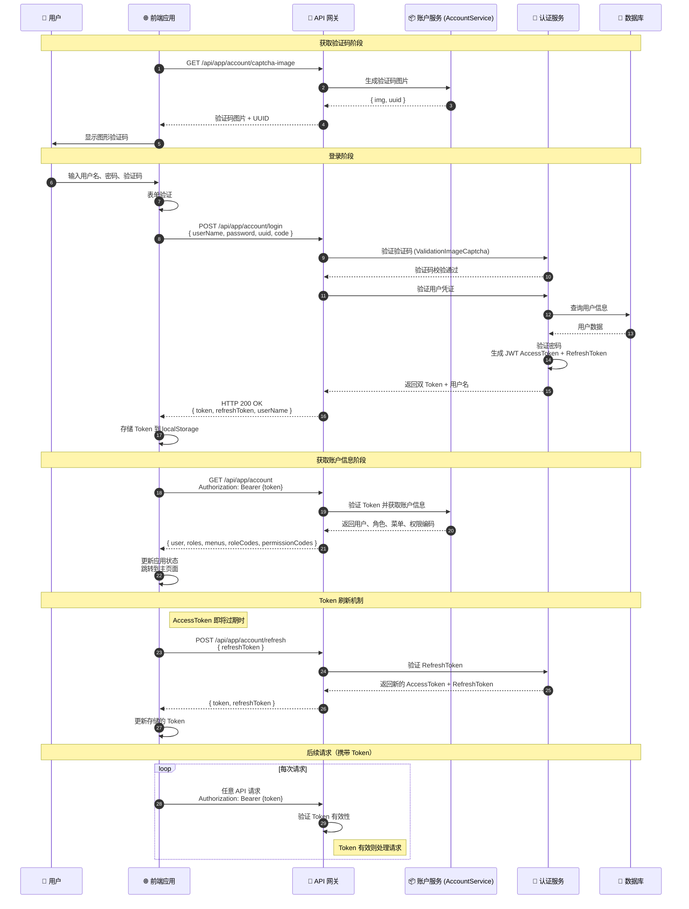

# 用户登录认证流程时序图

## 流程说明

用户通过前端登录界面输入用户名、密码和图形验证码，后端验证身份后返回 JWT AccessToken 和 RefreshToken，前端存储 Token 并用于后续所有 API 调用。系统同时支持通过 RefreshToken 刷新 AccessToken 以实现无缝续期。

## 时序图



## 关键接口

| 接口 | 方法 | 说明 |
|-----|------|-----|
| `/api/app/account/captcha-image` | GET | 获取图形验证码（图片+UUID） |
| `/api/app/account/login` | POST | 用户登录，返回 AccessToken + RefreshToken |
| `/api/app/account` | GET | 获取当前账户完整信息（用户、角色、菜单、权限） |
| `/api/app/account/refresh` | POST | 通过 RefreshToken 刷新 AccessToken |

## 请求/响应数据结构

### 登录请求 (LoginInputVo)

```json
{
  "userName": "string - 用户名",
  "password": "string - 密码",
  "uuid": "string? - 验证码UUID (来自captcha-image)",
  "code": "string? - 验证码"
}
```

### 登录响应 (LoginOutputDto)

```json
{
  "token": "string - JWT AccessToken",
  "refreshToken": "string - 刷新Token",
  "userName": "string - 用户名"
}
```

### 账户信息响应 (UserRoleMenuDto)

```json
{
  "user": { "id", "name", "userName", "email", "phone", "icon", "sex", ... },
  "roles": [{ "id", "name", "code", ... }],
  "menus": [{ "id", "name", "path", "icon", ... }],
  "roleCodes": ["string"],
  "permissionCodes": ["string"]
}
```

## 认证机制

- **JWT AccessToken** — 主要认证凭证，短期有效
- **JWT RefreshToken** — 用于刷新 AccessToken，长期有效
- **OAuth** — 支持 QQ 和 Gitee OAuth 提供商登录
- **令牌传递** — QueryString (`?access_token=`) 或 Cookie (`Token=`)

## 前端使用位置

> **注意**: 以下文件位于前端仓库 `intelli-substation-voiceprint-frontend`，不在当前后端仓库中。

- `src/hooks/account/useAccount.tsx` - 登录 Hook
- `src/types/ApiTypeMap.d.ts` - 账户类型定义

## 相关文档

- [认证系统](../Modules/rbac/认证系统.md)
- [认证系统 - JWT + OAuth](../../../../CLAUDE.md#认证)
