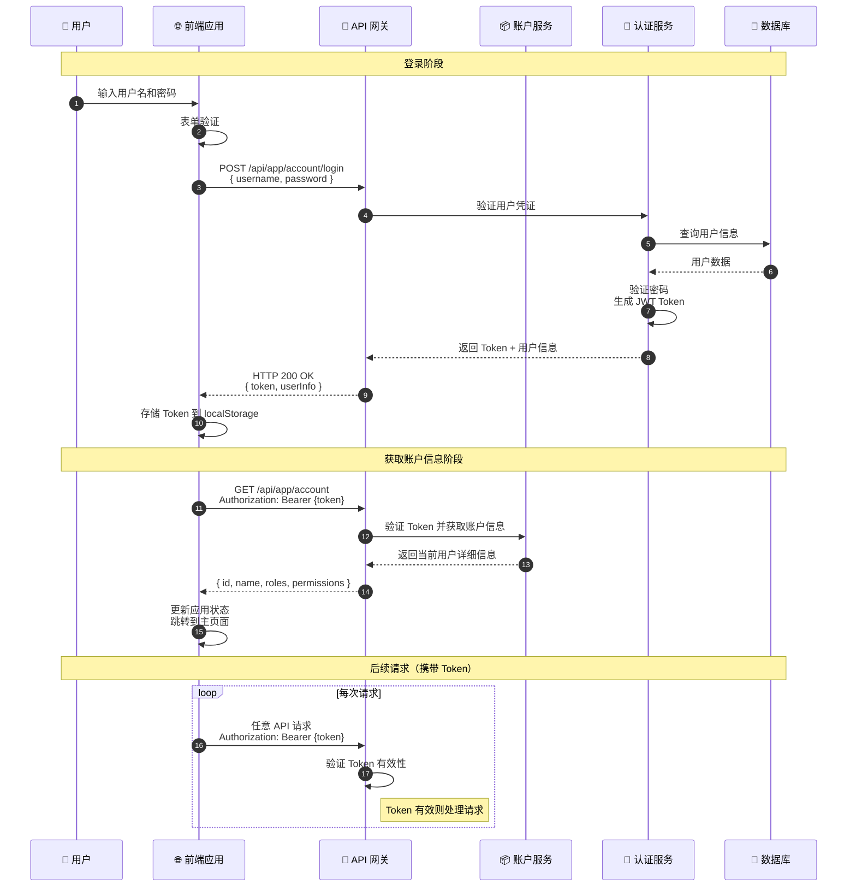

# 用户登录认证流程时序图

## 流程说明

用户通过前端登录界面输入用户名和密码，后端验证身份后返回 JWT Token，前端存储 Token 并用于后续所有 API 调用。

## 时序图

## 关键接口

| 接口 | 方法 | 说明 |
|-----|------|-----|
| `/api/app/account/login` | POST | 用户登录，返回 JWT Token |
| `/api/app/account` | GET | 获取当前账户信息 |

## 前端使用位置

- `src/hooks/account/useAccount.tsx` - 登录 Hook
- `src/types/ApiTypeMap.d.ts` - 账户类型定义

## 相关文档

- [认证系统](../Modules/rbac/认证系统.md)
- [JWT + OAuth 认证](../../../CLAUDE.md#认证)
