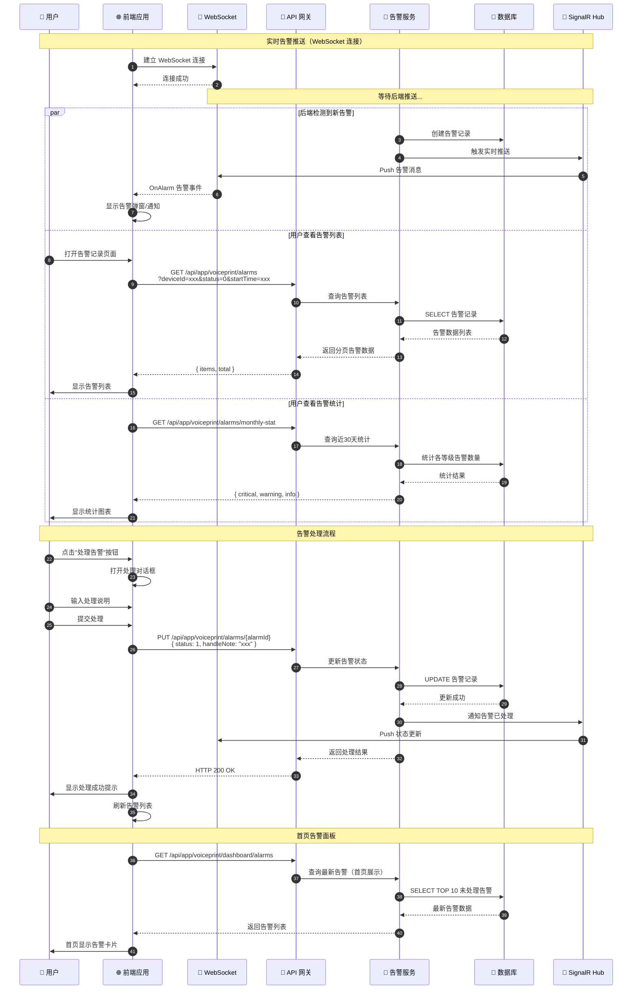

# 告警管理流程时序图

## 流程说明

告警管理包括：实时告警推送、告警列表查询、告警统计、告警处理等流程。系统通过 WebSocket 实时推送告警，同时支持用户主动查询和处理告警。

## 时序图

## 关键接口

| 接口 | 方法 | 说明 |
|-----|------|-----|
| `/api/app/voiceprint/alarms/monthly-stat` | GET | 近30天告警统计 |
| `/api/app/voiceprint/alarms/device-options` | GET | 报警筛选设备下拉选项 |
| `/api/app/voiceprint/alarms` | GET | 报警记录列表 |
| `/api/app/voiceprint/alarms/{alarmId}` | PUT | 处理告警（更新状态） |
| `/api/app/voiceprint/dashboard/alarms` | GET | 首页报警信息 |

## 前端使用位置

- `src/hooks/alarm-record/useAlarmStatistic.ts` - 告警统计
- `src/hooks/alarm-record/useAlarmDeviceOptions.tsx` - 设备选项
- `src/hooks/alarm-record/useAlarmList.ts` - 告警列表
- `src/hooks/alarm-record/useAlarmActions.tsx` - 告警操作
- `src/hooks/alarm-record/useDashboardAlarmList.tsx` - 首页告警
- `src/request/utils/wsRequest.ts` - WebSocket 配置

## 相关文档

- [设备告警流程](../Modules/ast-intellisub/设备告警流程.md)
- [告警中心](../../../CLAUDE.md#告警中心)
