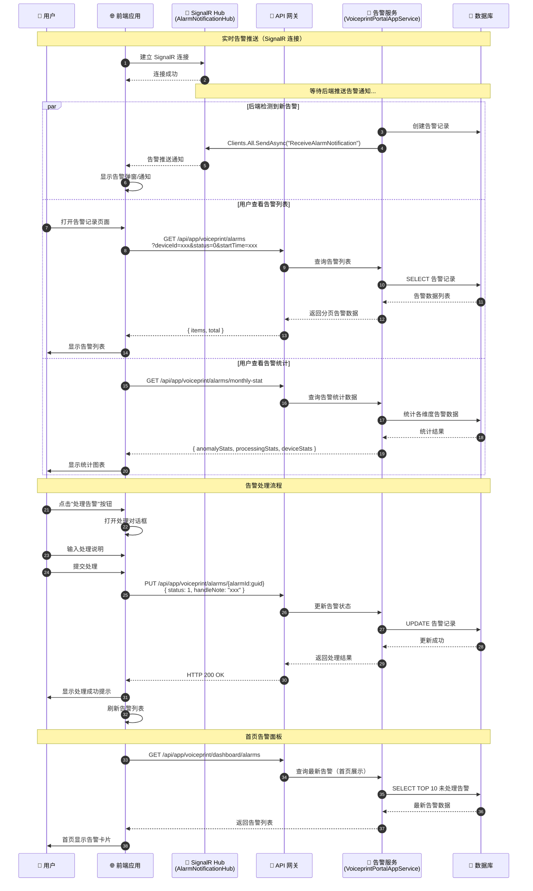

# 告警管理流程时序图

## 流程说明

告警管理包括：实时告警推送（通过 SignalR Hub）、告警列表查询、告警统计、告警处理等流程。系统通过 SignalR Hub（`AlarmNotificationHub`）实时推送告警，同时支持用户主动查询和处理告警。

## 时序图



## 关键接口

| 接口 | 方法 | 说明 |
|-----|------|-----|
| `/api/app/voiceprint/alarms/monthly-stat` | GET | 告警统计（返回 anomalyStats, processingStats, deviceStats 三维度数据） |
| `/api/app/voiceprint/alarms/device-options` | GET | 报警筛选设备下拉选项 |
| `/api/app/voiceprint/alarms` | GET | 报警记录列表（分页） |
| `/api/app/voiceprint/alarms/{alarmId:guid}` | PUT | 处理告警（更新状态和备注） |
| `/api/app/voiceprint/dashboard/alarms` | GET | 首页报警信息（最新未处理告警） |

## 告警统计响应结构 (VoiceprintMonthlyStatDto)

```json
{
  "anomalyStats": [{ "key": "异常类型", "value": 数量 }],
  "processingStats": [{ "key": "处理状态", "value": 数量 }],
  "deviceStats": [{ "deviceName": "设备名", "alarmCount": 数量 }]
}
```

## 实时推送机制

- **SignalR Hub**: `AlarmNotificationHub`（位于 `AlarmNotificationHub.cs`）
- **推送方法**: `Clients.All.SendAsync("ReceiveAlarmNotification", notification)`
- **后端服务**: `AlarmNotificationService` 通过 `IHubContext<AlarmNotificationHub>` 触发推送

## 前端使用位置

- `src/hooks/alarm-record/useAlarmStatistic.ts` - 告警统计
- `src/hooks/alarm-record/useAlarmDeviceOptions.tsx` - 设备选项
- `src/hooks/alarm-record/useAlarmList.ts` - 告警列表
- `src/hooks/alarm-record/useAlarmActions.tsx` - 告警操作
- `src/hooks/alarm-record/useDashboardAlarmList.tsx` - 首页告警
- `src/request/utils/wsRequest.ts` - SignalR 连接配置

## 相关文档

- [设备告警流程](../Modules/ast-intellisub/设备告警流程.md)
- [告警通知 Hub](../Modules/ast-intellisub/Alarm/AlarmNotificationHub.md)
