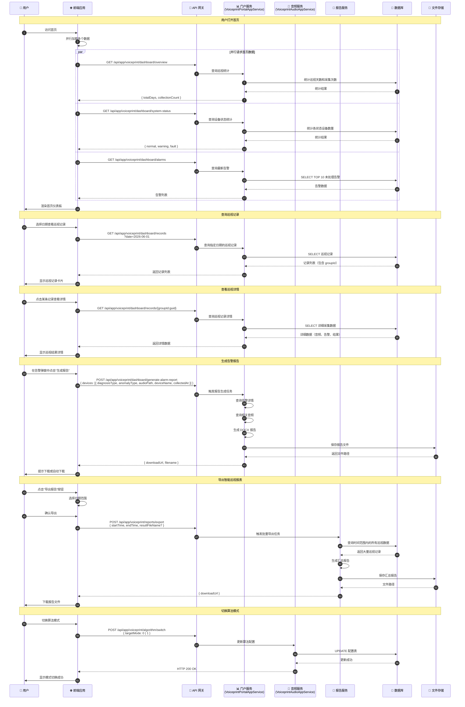

# 仪表板与巡视流程时序图

## 流程说明

仪表板是系统首页，展示巡视统计、设备状态、告警信息等核心数据。巡视流程包括：巡视记录查询、巡视结果查看、报告生成和导出等功能。

> **实现说明**: 仪表板和巡视相关 API 均实现在 `VoiceprintPortalAppService` 类中。

## 时序图



## 关键接口

| 接口 | 方法 | 说明 |
|-----|------|-----|
| `/api/app/voiceprint/dashboard/overview` | GET | 巡视统计（总天数、采集次数） |
| `/api/app/voiceprint/dashboard/records` | GET | 获取指定日期的巡视记录 |
| `/api/app/voiceprint/dashboard/records/{groupId:guid}` | GET | 巡视记录详情 |
| `/api/app/voiceprint/dashboard/system-status` | GET | 电子沙盘（设备状态统计） |
| `/api/app/voiceprint/dashboard/alarms` | GET | 首页报警信息 |
| `/api/app/voiceprint/dashboard/generate-alarm-report` | POST | 根据告警生成单次声纹分析报表 |
| `/api/app/voiceprint/reports/export` | POST | 导出智能巡视报表（按时间范围） |
| `/api/app/voiceprint/algorithm/switch` | POST | 切换算法模式 |

## 请求/响应数据结构

### 告警报告生成 (VoiceprintAlarmReportGenerateInput)

```json
{
  "devices": [{
    "diagnosisType": "string - 诊断类型",
    "anomalyType": "string - 异常类型",
    "audioPath": "string - 音频路径",
    "deviceName": "string - 设备名称",
    "collectedAt": "DateTime - 采集时间"
  }]
}
```

### 报表导出 (VoiceprintReportExportInput)

```json
{
  "startTime": "DateTime - 开始时间",
  "endTime": "DateTime - 结束时间",
  "resultFileName": "string? - 可选，输出文件名"
}
```

### 算法模式切换 (VoiceprintAlgorithmSwitchInput)

```json
{
  "targetMode": 0 | 1
}
```
- `targetMode = 0`: 恢复原模式/定时流程
- `targetMode = 1`: 手动增强模式/60秒采集

## 前端使用位置

- `src/hooks/patrol/usePatrolStatistic.ts` - 巡视统计
- `src/hooks/patrol/usePatrolRecord.ts` - 巡视记录
- `src/hooks/patrol/usePatrolResult.ts` - 巡视结果
- `src/hooks/ledger/useDeviceStatistics.ts` - 设备统计
- `src/hooks/alarm-record/useDashboardAlarmList.tsx` - 首页告警
- `src/hooks/report/useReport.tsx` - 报告导出
- `src/pages/system/_components/header/CollectIcon.tsx` - 算法切换

## 相关文档

- [VoiceprintPortalAppService](../Modules/ast-voiceprint/VoiceprintPortalAppService.md)
- [VoiceprintAudioAppService](../Modules/ast-voiceprint/VoiceprintAudioAppService.md)
- [声纹采集服务](../Modules/ast-voiceprint/声纹采集服务.md)
- [声纹分析流程](../Modules/ast-voiceprint/声纹分析流程.md)
