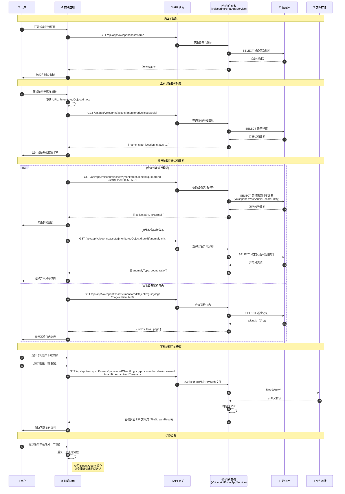

# 设备台账查询流程时序图

## 流程说明

设备台账模块展示变电站设备的层次结构、基础信息、运行趋势、异常分布、巡检日志等。用户可以通过设备树选择设备，查看详细信息和下载相关音频。

> **实现说明**: 设备台账相关 API 均实现在 `VoiceprintPortalAppService` 类中，数据源为关系数据库（通过 SqlSugar ORM）。

## 时序图



## 关键接口

| 接口 | 方法 | 说明 |
|-----|------|-----|
| `/api/app/voiceprint/assets/tree` | GET | 获取设备台账树 |
| `/api/app/voiceprint/assets/{monitoredObjectId:guid}` | GET | 设备基础信息 |
| `/api/app/voiceprint/assets/{monitoredObjectId:guid}/trend` | GET | 设备运行趋势（参数: startTime） |
| `/api/app/voiceprint/assets/{monitoredObjectId:guid}/anomaly-mix` | GET | 设备异常分布（无需时间参数） |
| `/api/app/voiceprint/assets/{monitoredObjectId:guid}/logs` | GET | 设备巡检日志（默认 pageSize=50） |
| `/api/app/voiceprint/assets/{monitoredObjectId:guid}/processed-audios/download` | GET | 下载处理后的音频（参数: startTime, endTime），直接返回 ZIP 文件流 |

## 请求/响应数据结构

### 趋势接口响应

```json
[{ "collectedAt": "DateTime", "isNormal": "bool" }]
```

### 异常分布接口响应

```json
[{ "anomalyType": "string", "count": "int", "ratio": "double" }]
```

> **注意**: 异常分布接口不接受时间参数，直接查询全部历史记录进行分组统计。

## 数据源说明

- **设备树、设备详情、异常分布、巡检日志**: 均通过 SqlSugar ORM 查询主关系数据库（SQLite/MySQL/SQL Server 等）
- **运行趋势**: 从 `VoiceprintDeviceAudioRecordEntity` 表查询，同样使用关系数据库
- **音频文件**: 从文件存储系统读取，打包 ZIP 后以 `FileStreamResult` 直接返回

## 前端使用位置

- `src/hooks/assets/useAssetTree.ts` - 设备树
- `src/hooks/assets/useDeviceInfo.ts` - 设备基础信息
- `src/hooks/ledger/useDeviceTrend.ts` - 设备运行趋势
- `src/hooks/ledger/useAnomalStat.ts` - 异常分布
- `src/hooks/ledger/useLogList.ts` - 巡检日志
- `src/hooks/ledger/useDownloadAudio.ts` - 音频下载

## 相关文档

- [VoiceprintPortalAppService](../Modules/ast-voiceprint/VoiceprintPortalAppService.md)
- [DeviceService](../Modules/ast-intellisub/DeviceService.md)
- [AssetsAPI](../API/Assets/AssetsAPI.md)
- [传感器数据管理服务](../Modules/ast-intellisubdata/传感器数据管理服务.md)
- [TDengine 集成](../Modules/ast-intellisubdata/TDengine集成.md)
