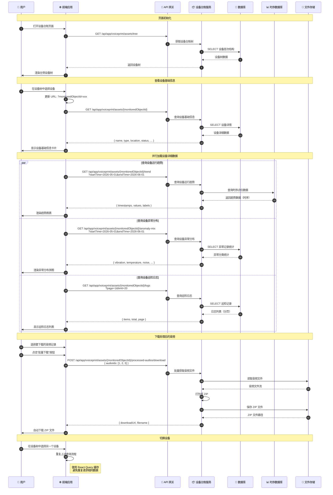

# 设备台账查询流程时序图

## 流程说明

设备台账模块展示变电站设备的层次结构、基础信息、运行趋势、异常分布、巡检日志等。用户可以通过设备树选择设备，查看详细信息和下载相关音频。

## 时序图

## 关键接口

| 接口 | 方法 | 说明 |
|-----|------|-----|
| `/api/app/voiceprint/assets/tree` | GET | 获取设备台账树 |
| `/api/app/voiceprint/assets/{monitoredObjectId}` | GET | 设备基础信息 |
| `/api/app/voiceprint/assets/{monitoredObjectId}/trend` | GET | 设备运行趋势 |
| `/api/app/voiceprint/assets/{monitoredObjectId}/anomaly-mix` | GET | 设备异常分布 |
| `/api/app/voiceprint/assets/{monitoredObjectId}/logs` | GET | 设备巡检日志 |
| `/api/app/voiceprint/assets/{monitoredObjectId}/processed-audios/download` | POST | 批量下载处理后的音频 |

## 前端使用位置

- `src/hooks/ledger/useDeviceTree.ts` - 设备树
- `src/hooks/ledger/useMonitoredObjectAttr.ts` - 设备基础信息
- `src/hooks/ledger/useDeviceTrend.ts` - 设备运行趋势
- `src/hooks/ledger/useAnomalStat.ts` - 异常分布
- `src/hooks/ledger/useLogList.ts` - 巡检日志
- `src/hooks/ledger/useDownloadAudio.ts` - 音频下载

## 相关文档

- [设备管理服务](../Modules/ast-intellisub/设备管理服务.md)
- [传感器数据管理服务](../Modules/ast-intellisubdata/传感器数据管理服务.md)
- [TDengine 集成](../Modules/ast-intellisubdata/TDengine集成.md)
