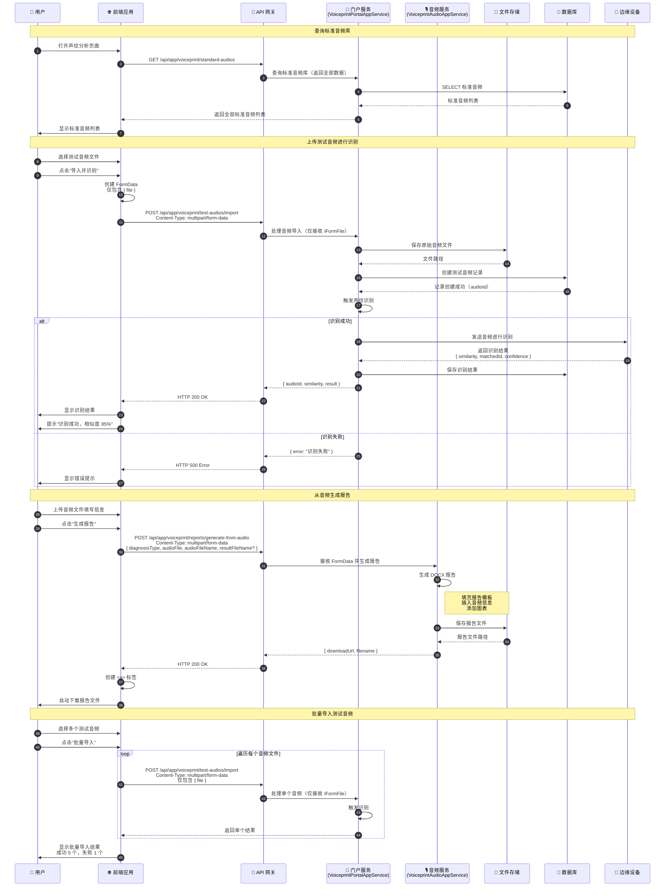

# 声纹分析流程时序图

## 流程说明

声纹分析模块包括：标准音频库管理、测试音频导入与识别、从音频生成报告等功能。用户可以上传测试音频进行声纹比对，并生成分析报告。

> **实现说明**: 标准音频库和测试音频导入通过 `VoiceprintPortalAppService` 实现，报告生成和文件上传通过 `VoiceprintAudioAppService` 实现。

## 时序图

## 关键接口

| 接口 | 方法 | 说明 |
|-----|------|-----|
| `/api/app/voiceprint/standard-audios` | GET | 标准音频库列表（返回全部数据，无分页参数） |
| `/api/app/voiceprint/test-audios/import` | POST | 导入测试音频并触发识别（仅接收 file 参数） |
| `/api/app/voiceprint/reports/generate-from-audio` | POST | 从音频生成报告（multipart/form-data 格式） |

## 请求/响应数据结构

### 测试音频导入

- **请求格式**: `multipart/form-data`
- **参数**: 仅 `file` (IFormFile)，无 `deviceId` 或 `deviceName` 参数

### 从音频生成报告 (VoiceprintAudioReportGenerateInput)

- **请求格式**: `multipart/form-data`（通过 `[FromForm]` 绑定）
- **字段**:
  - `diagnosisType` (string) - 诊断类型
  - `audioFile` (IFormFile) - 音频文件
  - `audioFileName` (string) - 音频文件名
  - `resultFileName` (string?) - 可选，输出报告文件名

## 前端使用位置

> **注意**: 以下文件位于前端仓库 `intelli-substation-voiceprint-frontend`，不在当前后端仓库中。

- `src/hooks/voiceprint/useSampleList.tsx` - 标准音频列表
- `src/hooks/voiceprint/useAnalyze.tsx` - 音频识别
- `src/hooks/voiceprint/useGenerateReportFromAudio.tsx` - 从音频生成报告

## 相关文档

- [VoiceprintPortalAppService](../Modules/ast-voiceprint/VoiceprintPortalAppService.md)
- [VoiceprintAudioAppService](../Modules/ast-voiceprint/VoiceprintAudioAppService.md)
- [声纹分析流程](../Modules/ast-voiceprint/声纹分析流程.md)
- [声纹采集服务](../Modules/ast-voiceprint/声纹采集服务.md)
