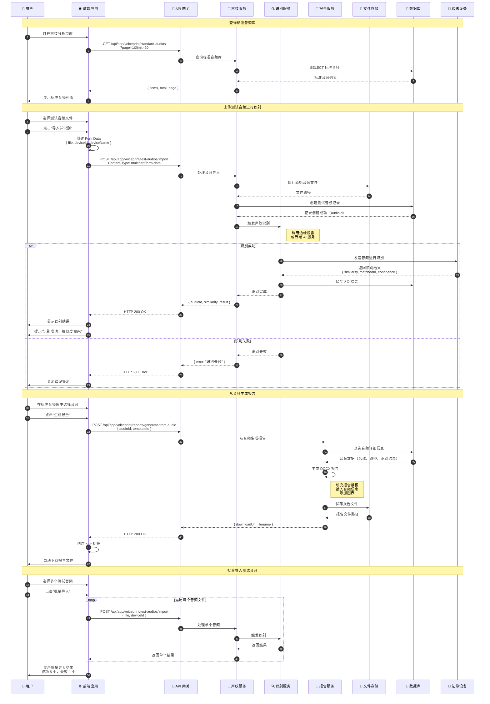

# 声纹分析流程时序图

## 流程说明

声纹分析模块包括：标准音频库管理、测试音频导入与识别、从音频生成报告等功能。用户可以上传测试音频进行声纹比对，并生成分析报告。

## 时序图

## 关键接口

| 接口 | 方法 | 说明 |
|-----|------|-----|
| `/api/app/voiceprint/standard-audios` | GET | 标准音频库列表 |
| `/api/app/voiceprint/test-audios/import` | POST | 导入测试音频并触发识别 |
| `/api/app/voiceprint/reports/generate-from-audio` | POST | 从音频生成报告并返回下载路径 |

## 前端使用位置

- `src/hooks/voiceprint/useSampleList.tsx` - 标准音频列表
- `src/hooks/voiceprint/useAnalyze.tsx` - 音频识别
- `src/hooks/voiceprint/useGenerateReportFromAudio.tsx` - 从音频生成报告

## 相关文档

- [声纹分析流程](../Modules/ast-voiceprint/声纹分析流程.md)
- [声纹采集服务](../Modules/ast-voiceprint/声纹采集服务.md)
- [报告生成](../Modules/ast-voiceprint/声纹分析流程.md#报告生成)
