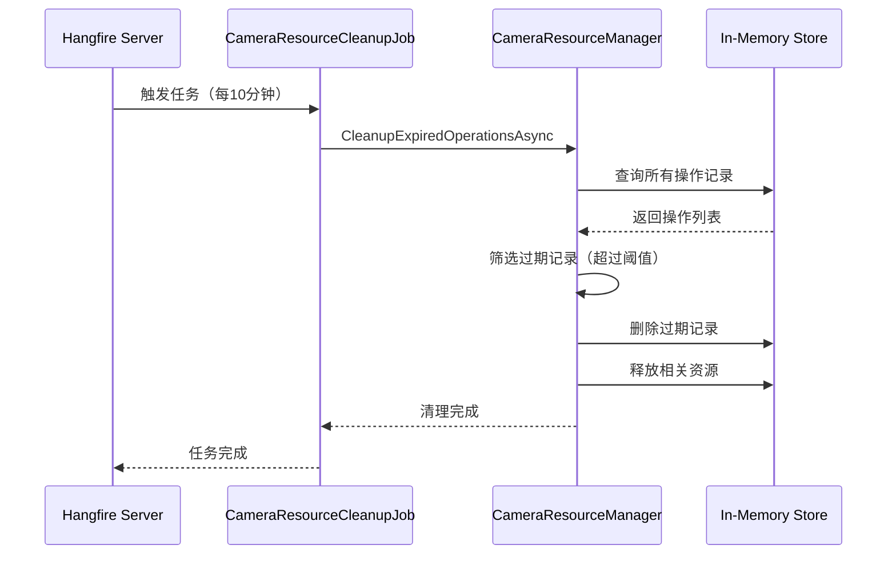

# CameraResourceCleanupJob — 摄像头资源清理任务

## 概述

**功能**：定期清理过期的摄像头操作记录，释放占用的系统资源

**触发方式**：Cron表达式

**Cron表达式**：`0 */10 * * * *` (每10分钟，可配置)

**存储模式**：Memory / SQLite / Redis (通过Hangfire配置)

---

## 任务配置

### appsettings.json 配置

```json
{
  "CameraResourceCleanup": {
    "Enabled": true,
    "CronExpression": "0 */10 * * * *",
    "ExpirationMinutes": 30
  }
}
```

### 配置选项说明

| 选项 | 类型 | 默认值 | 说明 |
|------|------|--------|------|
| `Enabled` | bool | true | 是否启用任务 |
| `CronExpression` | string | "0 */10 * * * *" | Cron表达式 |
| `ExpirationMinutes` | int | 30 | 过期操作清理时间阈值（分钟）|

---

## 任务执行流程



---

## 任务实现

### 任务类

```csharp
public class CameraResourceCleanupJob : HangfireBackgroundWorkerBase, ITransientDependency
{
    private readonly CameraResourceManager _resourceManager;
    private readonly CameraResourceCleanupOptions _options;

    public CameraResourceCleanupJob(
        CameraResourceManager resourceManager,
        IOptions<CameraResourceCleanupOptions> options)
    {
        _resourceManager = resourceManager;
        _options = options.Value;

        RecurringJobId = "camera-resource-cleanup";
        CronExpression = _options.CronExpression;
    }

    public override async Task DoWorkAsync(CancellationToken cancellationToken = default)
    {
        Logger.LogInformation("开始执行摄像头资源清理作业");

        try
        {
            // 使用配置中的过期时间阈值
            await _resourceManager.CleanupExpiredOperationsAsync(
                TimeSpan.FromMinutes(_options.ExpirationMinutes));

            Logger.LogInformation("摄像头资源清理作业执行完成");
        }
        catch (Exception ex)
        {
            Logger.LogError(ex, "摄像头资源清理作业执行失败");
            throw;
        }
    }
}
```

---

## 清理规则

### 过期操作检测

操作记录创建时间超过 `ExpirationMinutes` 配置的阈值（默认30分钟）将被清理：

```csharp
var expirationThreshold = TimeSpan.FromMinutes(_options.ExpirationMinutes);
var now = DateTime.Now;
var cutoffTime = now.Subtract(expirationThreshold);

// 查询所有操作记录
var allOperations = _operationStore.Values.ToList();

// 筛选过期记录
var expiredOperations = allOperations.Where(op =>
    op.CreatedTime < cutoffTime
).ToList();
```

### 清理操作

对于检测到的过期操作记录，执行以下清理操作：

1. **删除操作记录**：从内存存储中删除操作记录
2. **释放资源**：释放操作占用的摄像头资源
3. **记录日志**：记录清理数量和时间

```csharp
foreach (var expiredOp in expiredOperations)
{
    // 删除操作记录
    _operationStore.TryRemove(expiredOp.OperationId, out _);

    // 释放摄像头资源
    if (_cameraLocks.TryGetValue(expiredOp.CameraId, out var lockEntry))
    {
        if (lockEntry.OperationId == expiredOp.OperationId)
        {
            _cameraLocks.TryRemove(expiredOp.CameraId, out _);
        }
    }

    Logger.LogDebug("清理过期摄像头操作: OperationId={OperationId}, CameraId={CameraId}",
        expiredOp.OperationId, expiredOp.CameraId);
}
```

---

## 资源管理器

### CameraResourceManager

摄像头资源管理器负责管理摄像头操作的生命周期：

```csharp
public class CameraResourceManager
{
    // 操作存储：OperationId -> OperationInfo
    private readonly ConcurrentDictionary<string, CameraOperationInfo> _operationStore;

    // 摄像头锁：CameraId -> LockEntry
    private readonly ConcurrentDictionary<string, CameraLockEntry> _cameraLocks;

    /// <summary>
    /// 清理过期的操作记录
    /// </summary>
    public async Task CleanupExpiredOperationsAsync(TimeSpan expirationThreshold)
    {
        var now = DateTime.Now;
        var cutoffTime = now.Subtract(expirationThreshold);

        // 筛选过期记录
        var expiredOperations = _operationStore.Values
            .Where(op => op.CreatedTime < cutoffTime)
            .ToList();

        foreach (var expiredOp in expiredOperations)
        {
            // 删除操作记录
            _operationStore.TryRemove(expiredOp.OperationId, out _);

            // 释放摄像头锁
            if (_cameraLocks.TryGetValue(expiredOp.CameraId, out var lockEntry))
            {
                if (lockEntry.OperationId == expiredOp.OperationId)
                {
                    _cameraLocks.TryRemove(expiredOp.CameraId, out _);
                }
            }
        }

        Logger.LogInformation("摄像头资源清理完成，清理: {Count} 条", expiredOperations.Count);
    }
}
```

---

## 依赖服务

- [[CameraResourceManager]] - 摄像头资源管理器
- [[CameraResourceCleanupOptions]] - 任务配置选项

---

## 相关任务

- [[ISAPIResourceCleanupJob]] - ISAPI 资源清理任务
- [[VisualGatewayHealthCheckJob]] - 视觉网关健康检查任务

---

## Cron 表达式说明

| 表达式 | 说明 |
|--------|------|
| `0 */10 * * * *` | 每10分钟执行（默认） |
| `0 */5 * * * *` | 每5分钟执行 |
| `0 0 * * * *` | 每小时执行 |
| `0 0 */2 * * *` | 每2小时执行 |

---

## 监控和日志

### 日志记录

```csharp
Logger.LogInformation("开始执行摄像头资源清理作业");
Logger.LogInformation("摄像头资源清理作业执行完成");
Logger.LogDebug("清理过期摄像头操作: OperationId={OperationId}, CameraId={CameraId}");
Logger.LogInformation("摄像头资源清理完成，清理: {Count} 条");
Logger.LogError(ex, "摄像头资源清理作业执行失败");
```

### Hangfire Dashboard

访问路径：`/hangfire`

查看任务执行历史、状态和性能指标。

---

## 性能考虑

### 执行时长

- 正常执行：< 1秒
- 大量过期记录：可能超过5秒

### 资源占用

- 内存：低（仅操作记录管理）
- CPU：低（简单的筛选和删除操作）

### 优化策略

- **并发安全**：使用 ConcurrentDictionary 确保线程安全
- **批量清理**：一次性清理所有过期记录
- **资源释放**：确保释放摄像头锁，避免资源泄漏

---

## 异常处理

### 清理异常

```csharp
try
{
    await _resourceManager.CleanupExpiredOperationsAsync(
        TimeSpan.FromMinutes(_options.ExpirationMinutes));
}
catch (Exception ex)
{
    Logger.LogError(ex, "摄像头资源清理作业执行失败");
    throw;
}
```

---

## 注意事项

1. **过期阈值**：根据实际操作时长合理设置过期阈值
2. **执行频率**：默认每10分钟执行，可根据需要调整
3. **资源释放**：确保清理操作正确释放摄像头锁
4. **日志监控**：定期检查日志，监控清理情况
5. **并发安全**：操作记录存储使用线程安全的数据结构

---

## 相关文档

- [[CameraResourceManager]] - 摄像头资源管理器文档
- [[CameraOperationInfo]] - 摄像头操作信息实体
- [[ISAPIResourceCleanupJob]] - ISAPI 资源清理任务文档

---

**状态**：🟡 学习中
