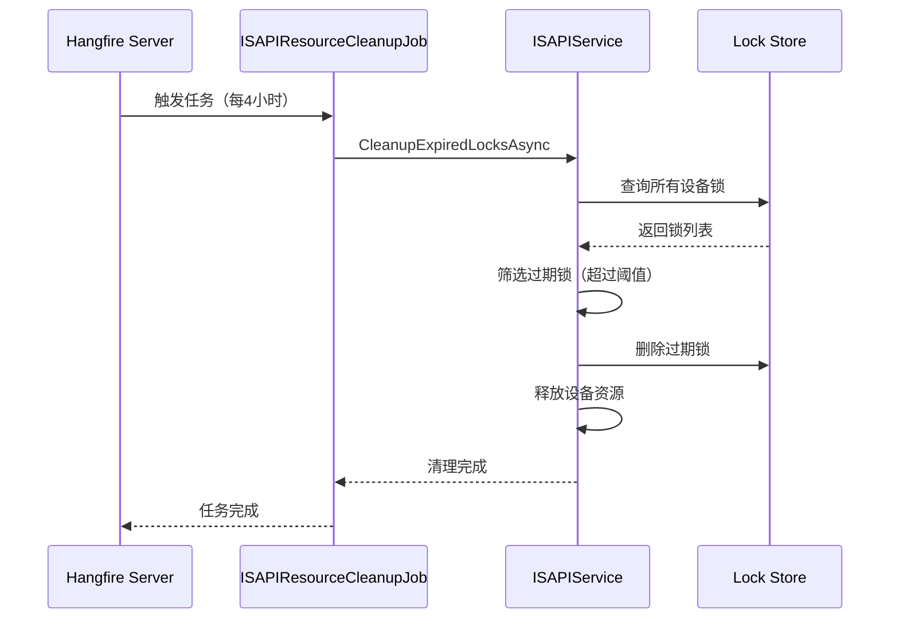

# ISAPIResourceCleanupJob — ISAPI 资源清理任务

## 概述

**功能**：定期清理过期的 ISAPI 设备锁，释放占用的设备资源

**触发方式**：Cron表达式

**Cron表达式**：`0 0 */4 * * *` (每4小时，可配置)

**存储模式**：Memory / SQLite / Redis (通过Hangfire配置)

---

## 任务配置

### appsettings.json 配置

```json
{
  "ISAPIResourceCleanup": {
    "Enabled": true,
    "CronExpression": "0 0 */4 * * *",
    "LockExpirationHours": 12
  }
}
```

### 配置选项说明

| 选项 | 类型 | 默认值 | 说明 |
|------|------|--------|------|
| `Enabled` | bool | true | 是否启用任务 |
| `CronExpression` | string | "0 0 */4 * * *" | Cron表达式 |
| `LockExpirationHours` | int | 12 | 设备锁过期时间阈值（小时）|

---

## 任务执行流程



---

## 任务实现

### 任务类

```csharp
public class ISAPIResourceCleanupJob : HangfireBackgroundWorkerBase, ITransientDependency
{
    private readonly ISAPIResourceCleanupOptions _options;

    public ISAPIResourceCleanupJob(IOptions<ISAPIResourceCleanupOptions> options)
    {
        _options = options.Value;

        // 配置定时作业
        RecurringJobId = "isapi-resource-cleanup";
        CronExpression = _options.CronExpression;
    }

    public override async Task DoWorkAsync(CancellationToken cancellationToken = default)
    {
        Logger.LogInformation("开始执行 ISAPI 资源清理作业");

        try
        {
            // 使用配置中的过期时间阈值
            await ISAPIService.CleanupExpiredLocksAsync(
                TimeSpan.FromHours(_options.LockExpirationHours));

            Logger.LogInformation("ISAPI 资源清理作业执行完成");
        }
        catch (Exception ex)
        {
            Logger.LogError(ex, "ISAPI 资源清理作业执行失败");
            throw;
        }
    }
}
```

---

## 清理规则

### 过期锁检测

设备锁创建时间超过 `LockExpirationHours` 配置的阈值（默认12小时）将被清理：

```csharp
var expirationThreshold = TimeSpan.FromHours(_options.LockExpirationHours);
var now = DateTime.Now;
var cutoffTime = now.Subtract(expirationThreshold);

// 查询所有设备锁
var allLocks = _deviceLockStore.Values.ToList();

// 筛选过期锁
var expiredLocks = allLocks.Where(lock =>
    lock.CreatedTime < cutoffTime
).ToList();
```

### 清理操作

对于检测到的过期锁，执行以下清理操作：

1. **删除锁记录**：从内存存储中删除锁记录
2. **释放设备**：释放锁占用的 ISAPI 设备资源
3. **记录日志**：记录清理数量和时间

```csharp
foreach (var expiredLock in expiredLocks)
{
    // 删除锁记录
    _deviceLockStore.TryRemove(expiredLock.DeviceId, out _);

    // 释放设备资源
    if (_deviceResources.TryGetValue(expiredLock.DeviceId, out var resource))
    {
        await resource.ReleaseAsync();
        _deviceResources.TryRemove(expiredLock.DeviceId, out _);
    }

    Logger.LogDebug("清理过期 ISAPI 设备锁: DeviceId={DeviceId}, LockId={LockId}",
        expiredLock.DeviceId, expiredLock.LockId);
}
```

---

## ISAPI 服务

### ISAPIService

ISAPI 服务负责管理 ISAPI 设备锁的生命周期：

```csharp
public class ISAPIService
{
    // 设备锁存储：DeviceId -> LockEntry
    private readonly ConcurrentDictionary<string, DeviceLockEntry> _deviceLockStore;

    // 设备资源存储：DeviceId -> DeviceResource
    private readonly ConcurrentDictionary<string, ISAPIDeviceResource> _deviceResources;

    /// <summary>
    /// 清理过期的设备锁
    /// </summary>
    public async Task CleanupExpiredLocksAsync(TimeSpan expirationThreshold)
    {
        var now = DateTime.Now;
        var cutoffTime = now.Subtract(expirationThreshold);

        // 筛选过期锁
        var expiredLocks = _deviceLockStore.Values
            .Where(lock => lock.CreatedTime < cutoffTime)
            .ToList();

        foreach (var expiredLock in expiredLocks)
        {
            // 删除锁记录
            _deviceLockStore.TryRemove(expiredLock.DeviceId, out _);

            // 释放设备资源
            if (_deviceResources.TryGetValue(expiredLock.DeviceId, out var resource))
            {
                await resource.ReleaseAsync();
                _deviceResources.TryRemove(expiredLock.DeviceId, out _);
            }
        }

        Logger.LogInformation("ISAPI 设备锁清理完成，清理: {Count} 条", expiredLocks.Count);
    }
}
```

---

## 依赖服务

- [[ISAPIService]] - ISAPI 服务
- [[ISAPIResourceCleanupOptions]] - 任务配置选项

---

## 相关任务

- [[CameraResourceCleanupJob]] - 摄像头资源清理任务
- [[VisualGatewayHealthCheckJob]] - 视觉网关健康检查任务

---

## Cron 表达式说明

| 表达式 | 说明 |
|--------|------|
| `0 0 */4 * * *` | 每4小时执行（默认） |
| `0 0 */2 * * *` | 每2小时执行 |
| `0 0 * * * *` | 每小时执行 |
| `0 0 0 * * *` | 每天执行 |

---

## 监控和日志

### 日志记录

```csharp
Logger.LogInformation("开始执行 ISAPI 资源清理作业");
Logger.LogInformation("ISAPI 资源清理作业执行完成");
Logger.LogDebug("清理过期 ISAPI 设备锁: DeviceId={DeviceId}, LockId={LockId}");
Logger.LogInformation("ISAPI 设备锁清理完成，清理: {Count} 条");
Logger.LogError(ex, "ISAPI 资源清理作业执行失败");
```

### Hangfire Dashboard

访问路径：`/hangfire`

查看任务执行历史、状态和性能指标。

---

## 性能考虑

### 执行时长

- 正常执行：< 1秒
- 大量过期锁：可能超过5秒

### 资源占用

- 内存：低（仅锁记录管理）
- CPU：低（简单的筛选和删除操作）

### 优化策略

- **并发安全**：使用 ConcurrentDictionary 确保线程安全
- **批量清理**：一次性清理所有过期锁
- **资源释放**：确保释放设备资源，避免资源泄漏

---

## 异常处理

### 清理异常

```csharp
try
{
    await ISAPIService.CleanupExpiredLocksAsync(
        TimeSpan.FromHours(_options.LockExpirationHours));
}
catch (Exception ex)
{
    Logger.LogError(ex, "ISAPI 资源清理作业执行失败");
    throw;
}
```

---

## 注意事项

1. **过期阈值**：根据实际设备使用时长合理设置过期阈值
2. **执行频率**：默认每4小时执行，可根据需要调整
3. **资源释放**：确保清理操作正确释放设备资源
4. **日志监控**：定期检查日志，监控清理情况
5. **并发安全**：设备锁存储使用线程安全的数据结构

---

## 相关文档

- [[ISAPIService]] - ISAPI 服务文档
- [[DeviceLockEntry]] - 设备锁实体
- [[CameraResourceCleanupJob]] - 摄像头资源清理任务文档

---

**状态**：🟡 学习中
