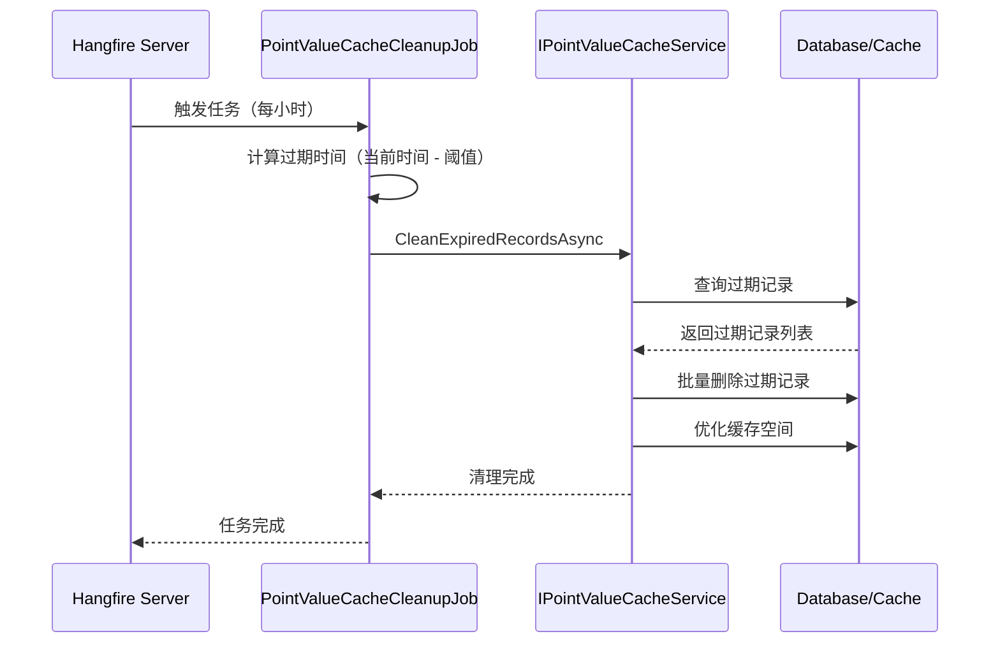

# PointValueCacheCleanupJob — 点位值缓存清理任务

## 概述

**功能**：定期清理过期的点位值缓存记录，释放内存空间

**触发方式**：Cron表达式

**Cron表达式**：`0 0 * * * *` (每小时，可配置)

**存储模式**：Memory / SQLite / Redis (通过Hangfire配置)

---

## 任务配置

### appsettings.json 配置

```json
{
  "PointValueCacheCleanup": {
    "Enabled": true,
    "CronExpression": "0 0 * * * *",
    "CacheExpirationHours": 24
  }
}
```

### 配置选项说明

| 选项 | 类型 | 默认值 | 说明 |
|------|------|--------|------|
| `Enabled` | bool | true | 是否启用任务 |
| `CronExpression` | string | "0 0 * * * *" | Cron表达式 |
| `CacheExpirationHours` | int | 24 | 缓存过期时间（小时）|

---

## 任务执行流程



---

## 任务实现

### 任务类

```csharp
public class PointValueCacheCleanupJob : HangfireBackgroundWorkerBase, ITransientDependency
{
    private readonly IPointValueCacheService _cacheService;
    private readonly PointValueCacheCleanupOptions _options;

    public PointValueCacheCleanupJob(
        IPointValueCacheService cacheService,
        IOptions<PointValueCacheCleanupOptions> options)
    {
        _cacheService = cacheService;
        _options = options.Value;

        // 配置定时作业
        RecurringJobId = "point-value-cache-cleanup";
        CronExpression = _options.CronExpression;
    }

    public override async Task DoWorkAsync(CancellationToken cancellationToken = default)
    {
        Logger.LogInformation("开始执行点位值缓存清理作业");

        try
        {
            // 使用配置中的过期时间阈值
            var expiredBefore = DateTime.Now.AddHours(-_options.CacheExpirationHours);
            await _cacheService.CleanExpiredRecordsAsync(expiredBefore);

            Logger.LogInformation("点位值缓存清理作业执行完成");
        }
        catch (Exception ex)
        {
            Logger.LogError(ex, "点位值缓存清理作业执行失败");
            throw;
        }
    }
}
```

---

## 清理规则

### 过期记录检测

缓存记录创建时间超过 `CacheExpirationHours` 配置的阈值（默认24小时）将被清理：

```csharp
var expirationThreshold = TimeSpan.FromHours(_options.CacheExpirationHours);
var expiredBefore = DateTime.Now.Subtract(expirationThreshold);

// 查询过期记录
var expiredRecords = await _pointValueCacheRepository.GetListAsync(
    record => record.CreatedTime < expiredBefore
);
```

### 清理操作

对于检测到的过期记录，执行以下清理操作：

1. **删除缓存记录**：从数据库或缓存中删除过期记录
2. **释放空间**：优化缓存存储空间
3. **记录统计**：记录清理数量和释放空间

```csharp
public async Task CleanExpiredRecordsAsync(DateTime expiredBefore)
{
    // 批量删除过期记录
    var deletedCount = await _pointValueCacheRepository.DeleteAsync(
        record => record.CreatedTime < expiredBefore
    );

    Logger.LogInformation("点位值缓存清理完成，删除: {Count} 条", deletedCount);
}
```

---

## 点位值缓存服务

### IPointValueCacheService

点位值缓存服务负责管理点位值的缓存生命周期：

```csharp
public interface IPointValueCacheService
{
    /// <summary>
    /// 清理过期的缓存记录
    /// </summary>
    /// <param name="expiredBefore">过期时间点（早于此时间的记录将被清理）</param>
    Task CleanExpiredRecordsAsync(DateTime expiredBefore);
}

public class PointValueCacheService : IPointValueCacheService
{
    private readonly IRepository<PointValueCache, Guid> _cacheRepository;

    public async Task CleanExpiredRecordsAsync(DateTime expiredBefore)
    {
        // 批量删除过期记录
        var deletedCount = await _cacheRepository.DeleteAsync(
            record => record.CreatedTime < expiredBefore
        );

        Logger.LogInformation("点位值缓存清理完成，删除: {Count} 条，截止时间: {ExpiredBefore}",
            deletedCount, expiredBefore);
    }
}
```

---

## 依赖服务

- [[IPointValueCacheService]] - 点位值缓存服务
- [[PointValueCacheCleanupOptions]] - 任务配置选项

---

## 相关任务

- [[PointDataCleanupJob]] - 点位数据清理任务
- [[VoiceprintCaptureJob]] - 声纹采集任务

---

## Cron 表达式说明

| 表达式 | 说明 |
|--------|------|
| `0 0 * * * *` | 每小时执行（默认） |
| `0 0 */2 * * *` | 每2小时执行 |
| `0 0 */6 * * *` | 每6小时执行 |
| `0 0 0 * * *` | 每天执行 |

---

## 监控和日志

### 日志记录

```csharp
Logger.LogInformation("开始执行点位值缓存清理作业");
Logger.LogInformation("点位值缓存清理作业执行完成");
Logger.LogInformation("点位值缓存清理完成，删除: {Count} 条，截止时间: {ExpiredBefore}");
Logger.LogError(ex, "点位值缓存清理作业执行失败");
```

### Hangfire Dashboard

访问路径：`/hangfire`

查看任务执行历史、状态和性能指标。

---

## 性能考虑

### 执行时长

- 正常执行：< 5秒
- 大量过期记录：可能超过30秒

### 资源占用

- 数据库查询：查询和删除过期缓存记录
- 内存占用：低（仅记录管理）
- 磁盘 I/O：中等（数据库删除操作）

### 优化策略

- **批量删除**：一次性删除所有过期记录
- **索引优化**：在 CreatedTime 字段上创建索引
- **分批处理**：大批量删除时分批处理，避免长时间锁表

---

## 缓存策略

### 分级缓存

根据数据类型设置不同的缓存过期时间：

```csharp
// 实时数据：短缓存
var realtimeCacheExpiration = DateTime.Now.AddHours(-1);

// 历史数据：长缓存
var historyCacheExpiration = DateTime.Now.AddHours(-24);

// 告警数据：更长缓存
var alarmCacheExpiration = DateTime.Now.AddHours(-72);
```

### 缓存优化

```sql
-- 创建索引优化查询
CREATE INDEX IX_PointValueCache_CreatedTime ON PointValueCache(CreatedTime);

-- 分区表（可选）
CREATE PARTITION FUNCTION PointValueCachePartitionFunc (datetime)
AS RANGE RIGHT FOR VALUES ('2026-01-01', '2026-02-01', ...);
```

---

## 异常处理

### 清理异常

```csharp
try
{
    var expiredBefore = DateTime.Now.AddHours(-_options.CacheExpirationHours);
    await _cacheService.CleanExpiredRecordsAsync(expiredBefore);
}
catch (Exception ex)
{
    Logger.LogError(ex, "点位值缓存清理作业执行失败");
    throw;
}
```

---

## 注意事项

1. **过期阈值**：根据实际缓存使用情况合理设置过期阈值
2. **执行频率**：默认每小时执行，可根据需要调整
3. **空间监控**：定期检查缓存空间使用情况
4. **索引维护**：确保在 CreatedTime 字段上有索引
5. **分批处理**：大批量删除时分批处理，避免影响系统性能

---

## 数据安全

### 备份考虑

- 删除前确认缓存数据不重要
- 重要数据应归档到历史表
- 支持数据恢复机制

---

## 相关文档

- [[IPointValueCacheService]] - 点位值缓存服务文档
- [[PointValueCache]] - 点位值缓存实体
- [[PointDataCleanupJob]] - 点位数据清理任务文档

---

**状态**：🟡 学习中
