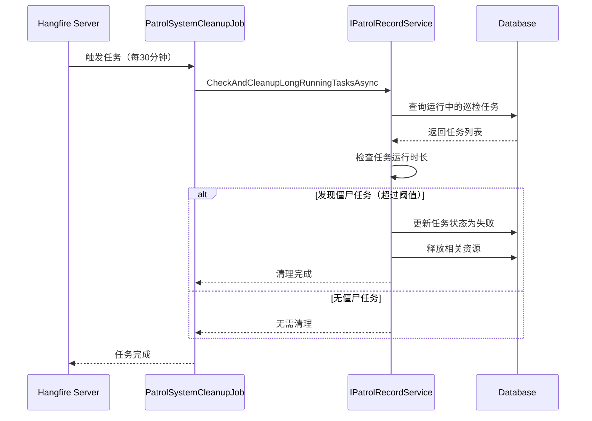

# PatrolSystemCleanupJob — 巡检系统清理任务

## 概述

**功能**：定期检查和清理长时间运行的巡检任务，防止僵尸任务占用系统资源

**触发方式**：Cron表达式

**Cron表达式**：`0 */30 * * * *` (每30分钟，可配置)

**存储模式**：Memory / SQLite / Redis (通过Hangfire配置)

---

## 任务配置

### appsettings.json 配置

```json
{
  "PatrolSystemCleanup": {
    "Enabled": true,
    "CronExpression": "0 */30 * * * *",
    "ZombieTaskThresholdHours": 2
  }
}
```

### 配置选项说明

| 选项 | 类型 | 默认值 | 说明 |
|------|------|--------|------|
| `Enabled` | bool | true | 是否启用任务 |
| `CronExpression` | string | "0 */30 * * * *" | Cron表达式 |
| `ZombieTaskThresholdHours` | int | 2 | 僵尸任务检测阈值（小时）|

---

## 任务执行流程



---

## 任务实现

### 任务类

```csharp
public class PatrolSystemCleanupJob : HangfireBackgroundWorkerBase, ITransientDependency
{
    private readonly IPatrolRecordService _patrolRecordService;
    private readonly PatrolSystemCleanupOptions _options;

    public PatrolSystemCleanupJob(
        IPatrolRecordService patrolRecordService,
        IOptions<PatrolSystemCleanupOptions> options)
    {
        _patrolRecordService = patrolRecordService;
        _options = options.Value;

        RecurringJobId = "patrol-system-cleanup";
        CronExpression = _options.CronExpression;
    }

    public override async Task DoWorkAsync(CancellationToken cancellationToken = default)
    {
        Logger.LogInformation("开始执行巡视系统清理作业");

        try
        {
            await _patrolRecordService.CheckAndCleanupLongRunningTasksAsync();
            Logger.LogInformation("巡视系统清理作业执行完成");
        }
        catch (Exception ex)
        {
            Logger.LogError(ex, "巡视系统清理作业执行失败");
            throw;
        }
    }
}
```

---

## 清理规则

### 僵尸任务检测

任务运行时长超过 `ZombieTaskThresholdHours` 配置的阈值（默认2小时）将被视为僵尸任务：

```csharp
var zombieThreshold = TimeSpan.FromHours(_options.ZombieTaskThresholdHours);
var now = DateTime.Now;

// 查询运行中的任务
var runningTasks = await _patrolRecordRepository.GetListAsync(
    t => t.Status == PatrolTaskStatus.Running
);

// 检测僵尸任务
var zombieTasks = runningTasks.Where(t =>
    (now - t.StartTime) > zombieThreshold
).ToList();
```

### 清理操作

对于检测到的僵尸任务，执行以下清理操作：

1. **更新任务状态**：将任务状态标记为失败
2. **释放资源**：清理任务占用的设备资源
3. **记录日志**：记录清理原因和时间

```csharp
foreach (var zombieTask in zombieTasks)
{
    zombieTask.Status = PatrolTaskStatus.Failed;
    zombieTask.ErrorMessage = $"任务超时自动清理：运行时长超过 {_options.ZombieTaskThresholdHours} 小时";
    zombieTask.EndTime = now;

    await _patrolRecordRepository.UpdateAsync(zombieTask);

    Logger.LogWarning("清理僵尸任务: TaskId={TaskId}, RunTime={RunTime}",
        zombieTask.Id, (now - zombieTask.StartTime));
}
```

---

## 任务管理器

### PatrolSystemCleanupJobManager

提供静态方法用于手动管理任务：

```csharp
public static class PatrolSystemCleanupJobManager
{
    private const string JobId = "patrol-system-cleanup";

    /// <summary>
    /// 立即执行清理作业
    /// </summary>
    public static void ExecuteNow()
    {
        BackgroundJob.Enqueue<PatrolSystemCleanupJob>(job => job.DoWorkAsync(default));
    }

    /// <summary>
    /// 停止定时清理作业
    /// </summary>
    public static void StopCleanupJob()
    {
        RecurringJob.RemoveIfExists(JobId);
    }
}
```

---

## 依赖服务

- [[IPatrolRecordService]] - 巡检记录服务
- [[PatrolRecordRepository]] - 巡检记录仓储
- [[PatrolSystemCleanupOptions]] - 任务配置选项

---

## 相关任务

- [[PatrolJob]] - 巡检任务调度
- [[PointDataCleanupJob]] - 点位数据清理任务

---

## Cron 表达式说明

| 表达式 | 说明 |
|--------|------|
| `0 */30 * * * *` | 每30分钟执行（默认） |
| `0 0 * * * *` | 每小时执行 |
| `0 0 */2 * * *` | 每2小时执行 |
| `0 0 0 * * *` | 每天执行 |

---

## 监控和日志

### 日志记录

```csharp
Logger.LogInformation("开始执行巡视系统清理作业");
Logger.LogInformation("巡视系统清理作业执行完成");
Logger.LogWarning("清理僵尸任务: TaskId={TaskId}, RunTime={RunTime}");
Logger.LogError(ex, "巡视系统清理作业执行失败");
```

### Hangfire Dashboard

访问路径：`/hangfire`

查看任务执行历史、状态和性能指标。

---

## 性能考虑

### 执行时长

- 正常执行：< 5秒
- 大量僵尸任务：可能超过10秒

### 资源占用

- 数据库查询：查询运行中的巡检任务
- 内存占用：低（仅任务状态管理）

---

## 异常处理

### 检查异常

```csharp
try
{
    await _patrolRecordService.CheckAndCleanupLongRunningTasksAsync();
}
catch (Exception ex)
{
    Logger.LogError(ex, "巡视系统清理作业执行失败");
    throw;
}
```

---

## 注意事项

1. **任务阈值**：根据实际巡检任务执行时长合理设置僵尸任务阈值
2. **执行频率**：默认每30分钟执行，可根据需要调整
3. **资源清理**：确保清理操作不会影响正在执行的任务
4. **日志监控**：定期检查日志，监控僵尸任务清理情况

---

## 相关文档

- [[IPatrolRecordService]] - 巡检记录服务文档
- [[PatrolRecord]] - 巡检记录实体
- [[PatrolJob]] - 巡检任务调度文档

---

**状态**：🟡 学习中
