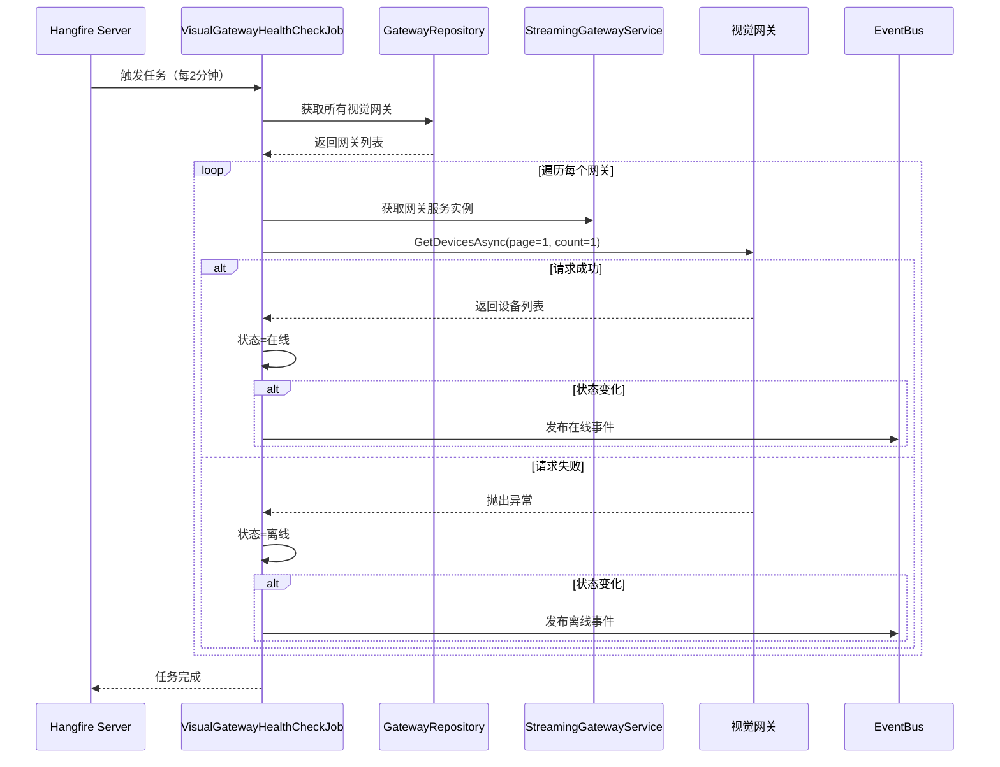

# VisualGatewayHealthCheckJob — 视觉网关健康检查任务

## 概述

**功能**：定期检查视觉网关的连接状态，通过调用 GetDevicesAsync 接口来判断网关是否在线

**触发方式**：Cron表达式

**Cron表达式**：`0 */2 * * * *` (每2分钟，可配置)

**存储模式**：Memory / SQLite / Redis (通过Hangfire配置)

---

## 任务配置

### appsettings.json 配置

```json
{
  "VisualGatewayHealthCheck": {
    "Enabled": true,
    "CronExpression": "0 */2 * * * *",
    "TimeoutSeconds": 30
  }
}
```

### 配置选项说明

| 选项 | 类型 | 默认值 | 说明 |
|------|------|--------|------|
| `Enabled` | bool | true | 是否启用任务 |
| `CronExpression` | string | "0 */2 * * * *" | Cron表达式 |
| `TimeoutSeconds` | int | 30 | 健康检查超时时间（秒）|

---

## 任务执行流程



---

## 任务实现

### 任务类

```csharp
public class VisualGatewayHealthCheckJob : HangfireBackgroundWorkerBase, ITransientDependency
{
    private readonly ISqlSugarRepository<GatewayAggregateRoot, Guid> _gatewayRepository;
    private readonly IStreamingGatewayService _streamingGatewayService;
    private readonly ILocalEventBus _localEventBus;
    private readonly VisualGatewayHealthCheckOptions _options;

    public VisualGatewayHealthCheckJob(
        ISqlSugarRepository<GatewayAggregateRoot, Guid> gatewayRepository,
        IStreamingGatewayService streamingGatewayService,
        ILocalEventBus localEventBus,
        IOptions<VisualGatewayHealthCheckOptions> options)
    {
        _gatewayRepository = gatewayRepository;
        _streamingGatewayService = streamingGatewayService;
        _localEventBus = localEventBus;
        _options = options.Value;

        RecurringJobId = "visual-gateway-health-check";
        CronExpression = _options.CronExpression;
    }

    public override async Task DoWorkAsync(CancellationToken cancellationToken = default)
    {
        Logger.LogInformation("开始执行视觉网关健康检查作业");

        var visualGateways = await _gatewayRepository.GetListAsync(
            g => g.Type == GatewayTypeEnum.Vision);

        if (!visualGateways.Any())
        {
            Logger.LogDebug("未找到任何视觉网关，跳过健康检查");
            return;
        }

        // 并行检查所有视觉网关
        var checkTasks = visualGateways.Select(gateway =>
            CheckGatewayHealthAsync(gateway, cancellationToken));

        await Task.WhenAll(checkTasks);

        Logger.LogInformation("视觉网关健康检查作业执行完成");
    }
}
```

---

## 健康检查逻辑

### 检查单个网关

```csharp
private async Task CheckGatewayHealthAsync(GatewayAggregateRoot gateway, CancellationToken cancellationToken)
{
    try
    {
        // 获取流媒体服务实例
        var streamingService = await _streamingGatewayService.GetStreamingServiceAsync(gatewayId);

        // 尝试获取设备列表（只获取第一页第一个设备，减少网络开销）
        var devicesResult = await streamingService.GetDevicesAsync(page: 1, count: 1);

        // 成功获取设备列表，网关在线
        var newStatus = GatewayStatusEnum.Online;

        if (currentStatus != newStatus)
        {
            await _localEventBus.PublishAsync(new GatewayStatusChangedEventArgs
            {
                GatewayId = gatewayId,
                GatewayName = gatewayName,
                Status = newStatus,
                ChangeTime = DateTime.Now,
                Reason = "健康检查成功，网关响应正常"
            });
        }
    }
    catch (HttpRequestException ex)
    {
        // HTTP请求异常：网络问题、服务器错误、API业务错误、身份认证失败等
        var reason = ex.Message.Contains("401") || ex.Message.Contains("Unauthorized")
            ? $"身份认证失败: {ex.Message}"
            : $"HTTP请求失败: {ex.Message}";

        await PublishOfflineEventAsync(gatewayId, gatewayName, currentStatus, reason, cancellationToken);
    }
    catch (TaskCanceledException ex)
    {
        // 超时异常
        await PublishOfflineEventAsync(gatewayId, gatewayName, currentStatus,
            $"请求超时: {ex.Message}", cancellationToken);
    }
}
```

---

## 检查项

### 连接检查

- **检查方法**：调用 GetDevicesAsync 接口
- **超时时间**：30秒（可配置）
- **检查内容**：是否能成功获取设备列表

### 状态判断

| 场景 | 状态 | 说明 |
|------|------|------|
| 成功获取设备列表 | 在线 | 网关正常响应 |
| HTTP 请求失败 | 离线 | 网络问题或服务器错误 |
| 请求超时 | 离线 | 网关响应超时 |
| 身份认证失败 | 离线 | 认证信息无效 |
| API 响应异常 | 离线 | 网关 API 异常 |

### 异常类型

```csharp
// HTTP请求异常：网络问题、服务器错误、API业务错误、身份认证失败等
catch (HttpRequestException ex)

// 超时异常
catch (TaskCanceledException ex)

// API响应解析异常或数据为空
catch (InvalidOperationException ex)

// 其他未预期的异常
catch (Exception ex)
```

---

## 任务管理器

### VisualGatewayHealthCheckJobManager

提供静态方法用于手动管理任务：

```csharp
public static class VisualGatewayHealthCheckJobManager
{
    private const string JobId = "visual-gateway-health-check";

    /// <summary>
    /// 启动视觉网关健康检查作业
    /// </summary>
    public static void StartHealthCheckJob()
    {
        RecurringJob.AddOrUpdate(JobId,
            () => ExecuteHealthCheckAsync(),
            "0 */2 * * * *");
    }

    /// <summary>
    /// 停止视觉网关健康检查作业
    /// </summary>
    public static void StopHealthCheckJob()
    {
        RecurringJob.RemoveIfExists(JobId);
    }

    /// <summary>
    /// 立即执行一次健康检查
    /// </summary>
    public static void TriggerHealthCheckNow()
    {
        BackgroundJob.Enqueue(() => ExecuteHealthCheckAsync());
    }
}
```

---

## 依赖服务

- [[IStreamingGatewayService]] - 流媒体网关服务
- [[ISqlSugarRepository<GatewayAggregateRoot>]] - 网关仓储
- [[ILocalEventBus]] - 本地事件总线
- [[VisualGatewayHealthCheckOptions]] - 任务配置选项

---

## 相关任务

- [[GatewaySyncJob]] - 网关同步任务
- [[CameraResourceCleanupJob]] - 摄像头资源清理任务

---

## Cron 表达式说明

| 表达式 | 说明 |
|--------|------|
| `0 */2 * * * *` | 每2分钟执行（默认） |
| `0 */5 * * * *` | 每5分钟执行 |
| `0 */10 * * * *` | 每10分钟执行 |
| `0 0 * * * *` | 每小时执行 |

---

## 监控和日志

### 日志记录

```csharp
Logger.LogInformation("开始执行视觉网关健康检查作业");
Logger.LogInformation("发现 {Count} 个视觉网关，开始健康检查");
Logger.LogInformation("视觉网关状态变更为在线: {GatewayName}");
Logger.LogWarning("视觉网关HTTP请求失败: {GatewayName}, 错误: {Message}");
Logger.LogWarning("视觉网关状态变更为离线: {GatewayName}, 原因: {Reason}");
```

### Hangfire Dashboard

访问路径：`/hangfire`

查看任务执行历史、状态和性能指标。

---

## 性能考虑

### 执行时长

- 单个网关检查：< 1秒
- 多个网关并行检查：取决于网关数量

### 优化策略

- **并行检查**：使用 Task.WhenAll 并行检查多个网关
- **减少开销**：只获取第一页第一个设备，不获取完整设备列表
- **超时控制**：配置合理的超时时间，避免长时间等待

### 资源占用

- 内存：低（并行检查多个网关）
- 网络：每个网关约 100-200 字节

---

## 事件发布

### GatewayStatusChangedEventArgs

当网关状态发生变化时，发布本地事件：

```csharp
await _localEventBus.PublishAsync(new GatewayStatusChangedEventArgs
{
    GatewayId = gatewayId,
    GatewayName = gatewayName,
    Status = newStatus,
    ChangeTime = DateTime.Now,
    Reason = "健康检查成功，网关响应正常"
});
```

---

## 注意事项

1. **检查频率**：默认每2分钟检查一次，可根据网络状况调整
2. **超时设置**：根据网络延迟合理设置超时时间
3. **并行检查**：多个网关并行检查，提高效率
4. **状态变化**：只在状态发生变化时发布事件
5. **异常处理**：区分不同类型的异常，记录详细的失败原因

---

## 相关文档

- [[IStreamingGatewayService]] - 流媒体网关服务文档
- [[GatewayAggregateRoot]] - 网关聚合根实体
- [[GatewaySyncJob]] - 网关同步任务文档

---

**状态**：🟡 学习中
