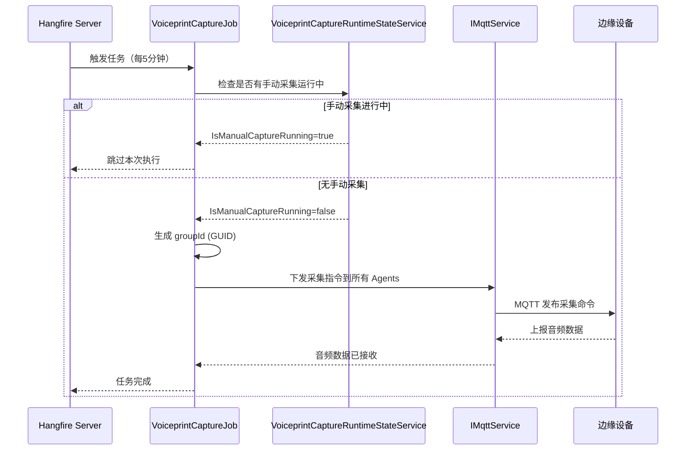

# VoiceprintCaptureJob

## 任务概述

**功能**：从边缘设备采集音频数据用于声纹识别分析

**触发方式**：Cron表达式

**Cron表达式**：`0 */5 * * * *` (每5分钟，可配置)

**存储模式**：Memory / SQLite / Redis (通过Hangfire配置)

---

## 任务配置

### appsettings.json 配置

```json
{
  "Hangfire": {
    "StorageMode": "Memory",
    "DashboardEnabled": true
  },
  "VoiceprintCaptureJob": {
    "Enabled": true,
    "CronExpression": "0 */10 * * * *",
    "DurationSeconds": 10,
    "ManualCaptureTimeoutMinutes": 10,
    "Agents": [
      {
        "GatewayId": "guid",
        "DeviceId": "guid"
      }
    ]
  }
}
```

### 配置选项说明

| 选项 | 类型 | 默认值 | 说明 |
|------|------|--------|------|
| `Enabled` | bool | true | 是否启用任务 |
| `CronExpression` | string | "0 */5 * * * *" | Cron表达式 |
| `DurationSeconds` | int | 10 | 录音时长（秒），范围1-300 |
| `Agents` | List | [] | 待下发的采集终端列表 |
| `ManualCaptureTimeoutMinutes` | int | 10 | 手动采集超时时间（分钟） |

---

## 任务执行流程



---

## 任务实现

### 任务类

```csharp
[DisableConcurrentExecution(timeoutInSeconds: 5 * 60)]
public class VoiceprintCaptureJob : HangfireBackgroundWorkerBase, ITransientDependency
{
    private readonly IMqttService _mqttService;
    private readonly VoiceprintCaptureJobOptions _options;
    private readonly VoiceprintRecognitionOptions _recognitionOptions;
    private readonly IGuidGenerator _guidGenerator;
    private readonly VoiceprintCaptureRuntimeStateService _runtimeState;
    private readonly IHttpClientFactory _httpClientFactory;

    public VoiceprintCaptureJob(
        IMqttService mqttService,
        IOptions<VoiceprintCaptureJobOptions> options,
        IOptions<VoiceprintRecognitionOptions> recognitionOptions,
        IGuidGenerator guidGenerator,
        VoiceprintCaptureRuntimeStateService runtimeState,
        IHttpClientFactory httpClientFactory)
    {
        _mqttService = mqttService;
        _options = options.Value;
        _recognitionOptions = recognitionOptions.Value;
        _guidGenerator = guidGenerator;
        _runtimeState = runtimeState;
        _httpClientFactory = httpClientFactory;

        RecurringJobId = "voiceprint-audio-capture";
        CronExpression = _options.CronExpression;
    }

    public override async Task DoWorkAsync(CancellationToken cancellationToken = default)
    {
        // 1. 检查并恢复超时的手动采集
        if (_runtimeState.TryRecoverTimeout(out var recoveredGroupId, out var timeoutReason))
        {
            Logger.LogWarning("Voiceprint 手动采集超时，自动恢复定时任务: groupId={GroupId}, reason={Reason}", recoveredGroupId, timeoutReason);
            await TrySwitchAnalysisToOriginalAsync($"job-timeout-recover:{recoveredGroupId}");
        }

        // 2. 检查手动采集状态
        if (_runtimeState.IsManualCaptureRunning)
        {
            Logger.LogInformation("VoiceprintCaptureJob 跳过本轮执行：手动采集批次运行中，groupId={GroupId}", _runtimeState.CurrentGroupId);
            return;
        }

        // 3. 检查任务启用状态
        if (!_options.Enabled)
        {
            Logger.LogInformation("VoiceprintCaptureJob 已禁用，跳过执行");
            return;
        }

        // 4. 检查 Agent 配置
        if (_options.Agents == null || !_options.Agents.Any())
        {
            Logger.LogWarning("VoiceprintCaptureJob 未配置 Agents，无法下发采集指令");
            return;
        }

        // 5. 下发采集指令
        var groupId = _guidGenerator.Create();
        var occurredAt = DateTime.Now;

        Logger.LogInformation("VoiceprintCaptureJob 下发采集指令，groupId={GroupId}, occurredAt={OccurredAt:o}, agents={Count}",
            groupId, occurredAt, _options.Agents.Count);

        foreach (var agent in _options.Agents)
        {
            if (agent.GatewayId == Guid.Empty)
            {
                Logger.LogWarning("Agent GatewayId 为空，跳过该 Agent");
                continue;
            }

            try
            {
                await _mqttService.PublishVoiceprintCaptureCommandAsync(
                    agent.GatewayId,
                    agent.DeviceId,
                    groupId,
                    occurredAt,
                    _options.DurationSeconds
                );

                Logger.LogInformation("VoiceprintCaptureJob 下发采集指令成功: gatewayId={GatewayId}, deviceId={DeviceId}, groupId={GroupId}",
                    agent.GatewayId, agent.DeviceId, groupId);
            }
            catch (Exception ex)
            {
                Logger.LogError(ex, "VoiceprintCaptureJob 下发采集指令失败: gatewayId={GatewayId}, deviceId={DeviceId}",
                    agent.GatewayId, agent.DeviceId);
            }
        }
    }
}
```

---

## 关键逻辑

### 并发控制

使用 `[DisableConcurrentExecution]` 特性防止任务重叠执行：

```csharp
[DisableConcurrentExecution(timeoutInSeconds: 5 * 60)]
public class VoiceprintCaptureJob : HangfireBackgroundWorkerBase
```

- 超时时间：5分钟
- 如果前一次执行超过5分钟未完成，新的执行将被阻止

### 手动采集优先级

定时任务会检测手动采集状态，避免冲突：

```csharp
if (_runtimeState.IsManualCaptureRunning)
{
    Logger.LogInformation("VoiceprintCaptureJob 跳过本轮执行：手动采集批次运行中");
    return;
}
```

### 超时恢复机制

自动检测并恢复超时的手动采集：

```csharp
if (_runtimeState.TryRecoverTimeout(out var recoveredGroupId, out var timeoutReason))
{
    Logger.LogWarning("Voiceprint 手动采集超时，自动恢复定时任务");
    await TrySwitchAnalysisToOriginalAsync($"job-timeout-recover:{recoveredGroupId}");
}
```

### 算法切换支持

支持在采集完成后自动切换回原算法：

```csharp
private async Task TrySwitchAnalysisToOriginalAsync(string trigger)
{
    if (string.IsNullOrWhiteSpace(_recognitionOptions.AlgorithmSwitchApiUrl))
    {
        Logger.LogWarning("Voiceprint 自动切回原算法跳过：AlgorithmSwitchApiUrl 未配置");
        return;
    }

    try
    {
        var client = _httpClientFactory.CreateClient(nameof(VoiceprintCaptureJob));
        client.Timeout = TimeSpan.FromSeconds(Math.Max(1, _recognitionOptions.AlgorithmSwitchTimeoutSeconds));
        using var content = new StringContent(JsonSerializer.Serialize(new { targetMode = "original" }), Encoding.UTF8, "application/json");
        using var response = await client.PostAsync(_recognitionOptions.AlgorithmSwitchApiUrl, content);

        if (response.IsSuccessStatusCode)
        {
            Logger.LogInformation("Voiceprint 自动切回原算法成功: trigger={Trigger}", trigger);
        }
    }
    catch (Exception ex)
    {
        Logger.LogError(ex, "Voiceprint 自动切回原算法失败: trigger={Trigger}", trigger);
    }
}
```

---

## 错误处理

### Agent 级别异常处理

每个 Agent 的采集指令下发独立处理，单个失败不影响其他：

```csharp
foreach (var agent in _options.Agents)
{
    try
    {
        await _mqttService.PublishVoiceprintCaptureCommandAsync(...);
        Logger.LogInformation("下发成功");
    }
    catch (Exception ex)
    {
        Logger.LogError(ex, "下发失败");
        // 继续处理下一个 Agent
    }
}
```

### 配置验证

```csharp
// 检查任务是否启用
if (!_options.Enabled)
{
    Logger.LogInformation("任务已禁用");
    return;
}

// 检查 Agent 配置
if (_options.Agents == null || !_options.Agents.Any())
{
    Logger.LogWarning("未配置 Agents");
    return;
}
```

---

## 监控和日志

### 日志记录

```csharp
Logger.LogInformation("VoiceprintCaptureJob 下发采集指令，groupId={GroupId}, agents={Count}", groupId, agents.Count);
Logger.LogInformation("下发成功: gatewayId={GatewayId}, deviceId={DeviceId}", gatewayId, deviceId);
Logger.LogError(ex, "下发失败: gatewayId={GatewayId}", gatewayId);
```

### Hangfire Dashboard

访问路径：`/hangfire`

查看任务执行历史、状态和性能指标。

---

## 性能考虑

### 执行时长

- 正常执行：< 1秒（仅下发指令）
- 实际采集由边缘设备执行，不占用服务器资源

### 资源占用

- 内存：低（仅状态管理）
- 网络：MQTT 发布消息，每个 Agent 约 100-200 字节

### 并发控制

- 使用 `[DisableConcurrentExecution]` 防止并发
- 超时保护：5分钟

---

## 相关服务

- [[IMqttService]] - MQTT 服务，用于下发采集指令
- [[VoiceprintCaptureRuntimeStateService]] - 运行时状态管理
- [[VoiceprintRecognitionOptions]] - 声纹识别配置选项
- [[VoiceprintCaptureJobOptions]] - 任务配置选项

---

## 相关任务

- [[VoiceprintProcessedCleanupJob]] - 清理已处理的音频文件
- [[PointDataCleanupJob]] - 清除旧传感器数据

---

## Cron 表达式说明

| 表达式 | 说明 |
|--------|------|
| `0 */5 * * * *` | 每5分钟执行（默认） |
| `0 */10 * * * *` | 每10分钟执行 |
| `0 0 * * * *` | 每小时执行 |
| `0 0 0 * * *` | 每天执行 |

---

**状态**：🟡 学习中
