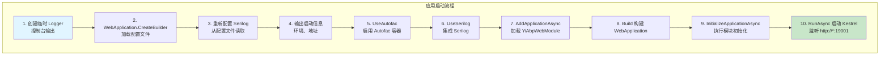

# Program 启动流程

## 概述

`Program.cs` 是 IntelliSubstation Voiceprint Monitoring Backend 的应用入口点，负责应用初始化、模块加载和 HTTP 服务器启动。源码位于 `src/Yi.Abp.Web/Program.cs`。

## 完整启动流程



## 源码解析

### 1. 临时 Logger 创建

```csharp
Log.Logger = new LoggerConfiguration()
    .WriteTo.Console()
    .CreateLogger();
```

**目的**：在配置加载前提供基础的日志输出，用于记录启动阶段的问题。

### 2. 创建 WebApplicationBuilder

```csharp
var builder = WebApplication.CreateBuilder(args);
```

**执行内容**：
- 加载 `appsettings.json` 和环境特定配置（如 `appsettings.Production.json`）
- 配置 Kestrel HTTP 服务器
- 初始化依赖注入容器
- 设置托管环境（Development/Production）

### 3. 重新配置 Serilog

```csharp
Log.Logger = new LoggerConfiguration()
    .ReadFrom.Configuration(builder.Configuration)
    .Enrich.With(new ShortSourceContextEnricher())
    .CreateLogger();
```

**配置来源**：`appsettings.json` 中的 `Serilog` 节：

```json
"Serilog": {
  "MinimumLevel": {
    "Default": "Information",
    "Override": {
      "Microsoft": "Warning",
      "Hangfire": "Information"
    }
  },
  "WriteTo": [
    {
      "Name": "Async",
      "Args": {
        "configure": [
          {
            "Name": "File",
            "Args": {
              "path": "logs/all/log-.txt",
              "rollingInterval": "Day",
              "retainedFileCountLimit": 10
            }
          }
        ]
      }
    }
  ]
}
```

**ShortSourceContextEnricher**：自定义日志增强器，提取短类名（不含命名空间）：

```csharp
public class ShortSourceContextEnricher : ILogEventEnricher
{
    public void Enrich(LogEvent logEvent, ILogEventPropertyFactory propertyFactory)
    {
        if (logEvent.Properties.TryGetValue("SourceContext", out var sourceContext) && 
            sourceContext is ScalarValue sv)
        {
            var fullName = sv.Value?.ToString() ?? "";
            var shortName = fullName.Contains('.') ? 
                fullName.Substring(fullName.LastIndexOf('.') + 1) : fullName;
            var property = propertyFactory.CreateProperty("ShortSourceContext", shortName);
            logEvent.AddPropertyIfAbsent(property);
        }
    }
}
```

### 4. 输出启动信息

```csharp
Log.Information("IntelliSubstation Start");
Log.Information($"当前主机启动环境-【{builder.Environment.EnvironmentName}】");
Log.Information($"当前主机启动地址-【{builder.Configuration["App:SelfUrl"]}】");
```

**示例输出**：

```
[2024-01-15 10:30:00.123] [INF] [Program] IntelliSubstation Start
[2024-01-15 10:30:00.145] [INF] [Program] 当前主机启动环境-【Production】
[2024-01-15 10:30:00.156] [INF] [Program] 当前主机启动地址-【http://*:19001】
```

### 5. 配置 WebHost

```csharp
builder.WebHost.UseUrls(builder.Configuration["App:SelfUrl"]);
```

**配置来源**：`appsettings.json` 中的 `App:SelfUrl`：

```json
"App": {
  "SelfUrl": "http://*:19001"
}
```

**说明**：
- `*` 通配符表示监听所有网络接口
- 默认端口 19001
- 生产环境通常使用 `http://0.0.0.0:19001` 或 `http://*:19001`

### 6. 启用 Autofac

```csharp
builder.Host.UseAutofac();
```

**作用**：将 ASP.NET Core 默认的 DI 容器替换为 Autofac，提供更强大的依赖注入功能。

### 7. 启用 Serilog

```csharp
builder.Host.UseSerilog();
```

**作用**：将 Serilog 集成到 ASP.NET Core 日志系统。

### 8. 加载 ABP 模块

```csharp
await builder.Services.AddApplicationAsync<YiAbpWebModule>();
```

**执行内容**：
1. 扫描模块依赖链
2. 按依赖顺序加载模块
3. 执行所有模块的 `PreConfigureServices`
4. 执行所有模块的 `ConfigureServices`
5. 执行所有模块的 `PostConfigureServices`

**YiAbpWebModule 依赖**（详见 [YiAbpWebModule.md](./YiAbpWebModule.md)）：
- YiAbpSqlSugarCoreModule
- YiAbpApplicationModule
- AbpAspNetCoreMvcModule
- AbpAutofacModule
- AbpSwashbuckleModule
- AbpAspNetCoreSerilogModule
- YiFrameworkBackgroundWorkersHangfireModule
- AbpAspNetCoreAuthenticationJwtBearerModule
- YiFrameworkAspNetCoreModule
- YiFrameworkAspNetCoreAuthenticationOAuthModule

### 9. 构建应用

```csharp
var app = builder.Build();
```

**执行内容**：
- 冻结服务容器
- 注册所有中间件
- 准备 HTTP 请求管道

### 10. 初始化应用

```csharp
await app.InitializeApplicationAsync();
```

**执行内容**：
1. 执行所有模块的 `OnApplicationInitialization`
2. 配置中间件管道（详见 [YiAbpWebModule.md](./YiAbpWebModule.md)）
3. 启动后台任务（Hangfire Server）

### 11. 启动应用

```csharp
await app.RunAsync();
```

**执行内容**：
- 启动 Kestrel HTTP 服务器
- 开始监听请求
- 应用进入运行状态

### 异常处理

```csharp
try
{
    // ... 启动逻辑
}
catch (Exception ex)
{
    Log.Fatal(ex, "IntelliSubstation 系统异常:" + ex.Message);
}
finally
{
    Log.CloseAndFlush();
}
```

**行为**：
- 捕获启动阶段的所有未处理异常
- 记录 Fatal 级别日志
- 确保日志缓冲区刷新到文件

## 启动日志示例

```
[2024-01-15 10:30:00.123] [INF] [Program] IntelliSubstation Start
[2024-01-15 10:30:00.145] [INF] [Program] 当前主机启动环境-【Production】
[2024-01-15 10:30:00.156] [INF] [Program] 当前主机启动地址-【http://*:19001】
[2024-01-15 10:30:00.234] [INF] [YiAbpWebModule] ==========Hangfire 存储配置==========
[2024-01-15 10:30:00.245] [INF] [YiAbpWebModule] 存储模式: Memory（内存）
[2024-01-15 10:30:00.256] [INF] [YiAbpWebModule] 特性: 轻量级、高性能、重启后任务丢失
[2024-01-15 10:30:00.267] [INF] [YiAbpWebModule] 适用场景: 低资源设备（ARM32/ARM64）
[2024-01-15 10:30:00.278] [INF] [YiAbpWebModule] 任务过期时间: 6小时
[2024-01-15 10:30:00.289] [INF] [YiAbpWebModule] =====================================
[2024-01-15 10:30:01.456] [INF] [Kestrel] Kestrel started
[2024-01-15 10:30:01.567] [INF] [Program] Application started. Press Ctrl+C to shut down.
```

## 配置文件加载顺序

ASP.NET Core 按以下顺序加载配置（后者覆盖前者）：

1. `appsettings.json` — 基础配置
2. `appsettings.{Environment}.json` — 环境特定配置
3. 环境变量
4. 命令行参数

**项目中的配置文件**：

| 文件 | 用途 |
|------|------|
| `appsettings.json` | 默认配置（开发环境） |
| `appsettings.LowResource.json` | 低资源配置（ARM32/边缘设备） |
| `appsettings.HighPerformance.json` | 高性能配置（数据中心） |

详见 [部署模式文档](./部署模式.md)。

## Hangfire 存储配置

Program.cs 不直接配置 Hangfire 存储，存储模式由 `YiAbpWebModule.ConfigureServices` 读取配置决定：

```csharp
var hangfireStorageMode = configuration["Hangfire:StorageMode"] ?? "Memory";
```

**启动日志示例**：

```
==========Hangfire 存储配置==========
存储模式: Memory（内存）
特性: 轻量级、高性能、重启后任务丢失
适用场景: 低资源设备（ARM32/ARM64）
任务过期时间: 6小时
=====================================
```

## 常见启动问题

### 1. 配置文件未找到

**现象**：应用启动时配置项为空

**解决**：确保 `appsettings.json` 文件存在且已设置为"复制到输出目录"

### 2. 端口已被占用

**现象**：`Address already in use`

**解决**：修改 `appsettings.json` 中的 `App:SelfUrl` 或停止占用端口的进程

### 3. SQLite 数据库文件权限问题

**现象**：`Permission denied` 或 `Unable to open database file`

**解决**：确保应用程序对 `db/` 目录有读写权限

### 4. ARM32 栈溢出

**现象**：`Stack overflow` 或 `Segmentation fault`

**解决**：
- 设置 `App:EnableSwagger: false`
- 减小 `App:MaxRequestPathLength`（默认 200）

## 相关文档

- [Host README](./README.md) — 宿主层概览
- [YiAbpWebModule 详细配置](./YiAbpWebModule.md)
- [部署模式详解](./部署模式.md)
- [静态资源与 SPA 回退](./静态资源与SPA回退.md)
