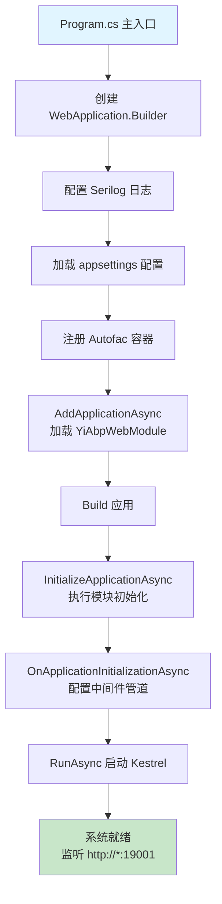
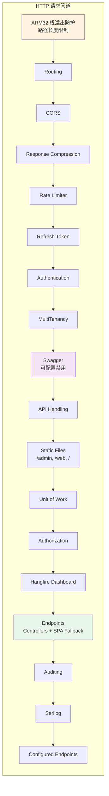

# Host 应用宿主层

## 概述

**Host 层**（`src/Yi.Abp.Web/`）是 IntelliSubstation Voiceprint Monitoring Backend 的应用宿主层，负责：

- 应用启动和初始化
- ASP.NET Core HTTP 请求管道配置
- 中间件组装（CORS、JWT、Swagger、Hangfire）
- 前端 SPA 静态资源服务和路由回退
- 部署模式切换（LowResource / HighPerformance）

## 目录结构

```
src/Yi.Abp.Web/
├── Program.cs                    # 应用入口点
├── YiAbpWebModule.cs            # ABP 模块配置
├── Options/
│   └── FrontendAppOptions.cs    # 前端应用配置选项
├── appsettings.json              # 默认配置（开发环境）
├── appsettings.LowResource.json  # 低资源配置（ARM32/边缘设备）
└── appsettings.HighPerformance.json  # 高性能配置（数据中心）
```

## 启动流程



## 关键组件

### 1. YiAbpWebModule
模块配置中心，负责：
- **PreConfigureServices**: 动态 API 路由约定（`/api/app/{service-name}`）
- **ConfigureServices**: 中间件服务注册（CORS、JWT、Swagger、Hangfire、速率限制）
- **OnApplicationInitializationAsync**: HTTP 管道组装

### 2. Program.cs
应用入口点，执行：
- Serilog 初始化
- ABP 模块加载
- 应用启动和运行

### 3. FrontendAppOptions
前端应用配置（Admin、Web、App 三个 SPA）

## 中间件管道顺序



## 部署模式

系统支持两种部署模式，通过 `DbConnOptions:DeploymentMode` 切换：

| 模式 | 数据库 | Hangfire 存储 | Redis | 适用场景 |
|-----|--------|--------------|-------|---------|
| **LowResource** | SQLite | Memory | 禁用 | ARM32/ARM64 边缘设备 |
| **HighPerformance** | PostgreSQL/MySQL | SQLite/Redis | 可选 | 数据中心、高并发场景 |

详见 [部署模式文档](./部署模式.md)。

## 前端集成

系统支持三个前端 SPA 应用，每个独立部署并配置路由回退：

- **`/admin`** — 管理端（`wwwroot/admin/`）
- **`/web`** — Web 应用（`wwwroot/web/`）
- **`/`** — 主应用（`wwwroot/app/`）

详见 [静态资源与 SPA 回退文档](./静态资源与SPA回退.md)。

## ARM32 平台优化

针对 ARM32 边缘设备（1 MB 栈空间）的特殊优化：

1. **Swagger 可配置禁用**（`App:EnableSwagger: false`）
   - 减少栈溢出风险
   - 生产环境推荐关闭

2. **请求路径长度限制**（默认 200 字符）
   - 防止 ABP 虚拟文件系统 `PathNavigatesAboveRoot` 递归过深
   - 超过限制返回 414 状态码

3. **Hangfire 内存存储**
   - SQLite 模式可能在低资源设备上产生性能问题
   - Memory 模式重启后任务丢失，但性能最好

## 相关文档

- [YiAbpWebModule 详细配置](./YiAbpWebModule.md)
- [Program 启动流程](./Program启动流程.md)
- [部署模式详解](./部署模式.md)
- [静态资源与 SPA 回退](./静态资源与SPA回退.md)
- [../README.md](../README.md) — 文档总索引
