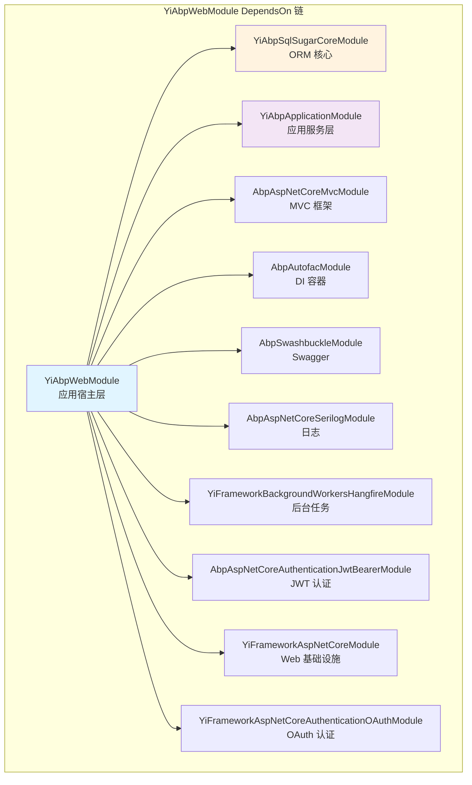

# YiAbpWebModule 模块配置

## 概述

`YiAbpWebModule` 是应用宿主层的核心 ABP 模块，负责配置整个 HTTP 请求管道和相关服务。源码位于 `src/Yi.Abp.Web/YiAbpWebModule.cs`。

## 模块依赖链



### 依赖说明

| 依赖模块 | 作用 |
|---------|------|
| `YiAbpSqlSugarCoreModule` | SqlSugar ORM 核心功能 |
| `YiAbpApplicationModule` | 应用服务层（DDD 分层） |
| `AbpAspNetCoreMvcModule` | ASP.NET Core MVC 框架 |
| `AbpAutofacModule` | Autofac 依赖注入容器 |
| `AbpSwashbuckleModule` | Swagger/OpenAPI 文档 |
| `AbpAspNetCoreSerilogModule` | Serilog 结构化日志 |
| `YiFrameworkBackgroundWorkersHangfireModule` | Hangfire 后台任务 |
| `AbpAspNetCoreAuthenticationJwtBearerModule` | JWT Bearer 认证 |
| `YiFrameworkAspNetCoreModule` | Web 基础设施（扩展） |
| `YiFrameworkAspNetCoreAuthenticationOAuthModule` | OAuth 认证（QQ、Gitee） |

## 配置阶段

### PreConfigureServices

**执行时机**：在所有模块 `ConfigureServices` 之前

**主要功能**：配置动态 API 路由约定

```csharp
PreConfigure<AbpAspNetCoreMvcOptions>(options =>
{
    // 为各应用模块创建约定控制器，指定服务名前缀
    options.ConventionalControllers.Create(typeof(AstIntelliSubApplicationModule).Assembly,
        options => options.RemoteServiceName = "ast-intellisub");
    options.ConventionalControllers.Create(typeof(YiFrameworkRbacApplicationModule).Assembly,
        options => options.RemoteServiceName = "rbac");
    options.ConventionalControllers.Create(typeof(ISAPIApplicationModule).Assembly,
        options => options.RemoteServiceName = "isapi");
    options.ConventionalControllers.Create(typeof(AstVoiceprintApplicationModule).Assembly,
        options => options.RemoteServiceName = "voiceprint");

    // 统一前缀：所有 API 路由都在 /api/app 下
    options.ConventionalControllers.ConventionalControllerSettings.ForEach(x => x.RootPath = "api/app");
});
```

**路由格式**：
```
/api/app/{service-name}/{controller}/{action}
```

**示例**：
- 变电站监控：`/api/app/ast-intellisub/equipment/list`
- RBAC 权限：`/api/app/rbac/user/login`
- 工业协议：`/api/app/isapi/data/report`
- 声纹分析：`/api/app/voiceprint/audio/process`

### ConfigureServices

**执行时机**：模块加载阶段

**主要配置**：

#### 1. 审计日志配置

```csharp
// 默认关闭审计日志（避免大量日志）
Configure<AbpAuditingOptions>(options =>
{
    options.IsEnabled = false;
});

// 忽略特定路径
Configure<AbpAspNetCoreAuditingOptions>(options =>
{
    options.IgnoredUrls.Add("/api/app/file/");
    options.IgnoredUrls.Add("/hangfire");
});
```

#### 2. JSON 序列化配置

使用微软原生 `System.Text.Json`，避免 Newtonsoft.Json 的已知问题：

```csharp
Configure<JsonOptions>(options =>
{
    options.JsonSerializerOptions.TypeInfoResolver = new DefaultJsonTypeInfoResolver();
    options.JsonSerializerOptions.Converters.Add(new DatetimeJsonConverter());
    options.JsonSerializerOptions.Converters.Add(new JsonStringEnumConverter());
});
```

#### 3. Swagger 配置

```csharp
var enableSwagger = configuration.GetValue<bool>("App:EnableSwagger", true);
if (enableSwagger)
{
    context.Services.AddYiSwaggerGen<YiAbpWebModule>(options =>
    {
        options.SwaggerDoc("default",
            new OpenApiInfo { Title = "Yi.Framework.Abp", Version = "v1", Description = "集大成者" });
    });
}
```

**ARM32 优化**：生产环境建议设置 `App:EnableSwagger: false` 减少栈溢出风险。

#### 4. CORS 跨域配置

```csharp
var corsOrigins = configuration["App:CorsOrigins"]!
    .Split(";", StringSplitOptions.RemoveEmptyEntries)
    .Select(o => o.Trim().RemovePostFix("/"))
    .ToArray();

bool allowAllOrigins = corsOrigins.Contains("*");

options.AddPolicy(DefaultCorsPolicyName, builder =>
{
    if (allowAllOrigins)
    {
        builder.AllowAnyOrigin().AllowAnyHeader().AllowAnyMethod();
    }
    else
    {
        builder.WithOrigins(corsOrigins)
            .WithAbpExposedHeaders()
            .SetIsOriginAllowedToAllowWildcardSubdomains()
            .AllowAnyHeader().AllowAnyMethod()
            .AllowCredentials();
    }
});
```

#### 5. JWT 认证配置

系统配置了两个 JWT Scheme：

| Scheme | 用途 | Token 来源 |
|--------|------|-----------|
| `JwtBearerDefaults.AuthenticationScheme` | 主要认证 | Query `?access_token=` 或 Cookie `Token=` |
| `TokenTypeConst.Refresh` | 刷新令牌 | Header `refresh_token:` 或 Query `?refresh_token=` |

```csharp
context.Services.AddAuthentication(JwtBearerDefaults.AuthenticationScheme)
    .AddJwtBearer(options => { /* 主 JWT 配置 */ })
    .AddJwtBearer(TokenTypeConst.Refresh, options => { /* 刷新 JWT 配置 */ })
    .AddQQ(options => { configuration.GetSection("OAuth:QQ").Bind(options); })
    .AddGitee(options => { configuration.GetSection("OAuth:Gitee").Bind(options); });
```

#### 6. Hangfire 存储模式

根据配置自动选择存储：

```csharp
var redisConfiguration = configuration["Redis:Configuration"];
bool.TryParse(configuration["Redis:IsEnabled"], out var redisEnabled);
var hangfireStorageMode = configuration["Hangfire:StorageMode"] ?? "Memory";

if (redisEnabled)
{
    // Redis 存储（高性能）
    service.AddHangfire(config => config.UseRedisStorage(redis, ...));
}
else if (hangfireStorageMode.Equals("SQLite", StringComparison.OrdinalIgnoreCase))
{
    // SQLite 持久化存储
    service.AddHangfire(config => config.UseSQLiteStorage(hangfireDbPath, ...));
}
else
{
    // 内存存储（默认，适合低资源环境）
    service.AddHangfire(config => config.UseMemoryStorage(...));
}
```

详见 [部署模式文档](./部署模式.md)。

#### 7. 速率限制

全局滑动窗口限流：每 60 秒限制 1000 个请求（分 6 段）：

```csharp
service.AddRateLimiter(_ =>
{
    _.GlobalLimiter = PartitionedRateLimiter.CreateChained(
        PartitionedRateLimiter.Create<HttpContext, string>(httpContext =>
        {
            var userAgent = httpContext.Request.Headers.UserAgent.ToString();
            return RateLimitPartition.GetSlidingWindowLimiter(userAgent, _ =>
                new SlidingWindowRateLimiterOptions
                {
                    PermitLimit = 1000,
                    Window = TimeSpan.FromSeconds(60),
                    SegmentsPerWindow = 6
                });
        }));
});
```

#### 8. 响应压缩

启用 Gzip 和 Brotli 压缩：

```csharp
context.Services.AddResponseCompression(options =>
{
    options.Providers.Add<GzipCompressionProvider>();
    options.Providers.Add<BrotliCompressionProvider>();
    options.MimeTypes = ResponseCompressionDefaults.MimeTypes.Concat(new[]
    {
        "text/html", "text/css", "application/javascript", "application/json"
    });
});
```

### OnApplicationInitializationAsync

**执行时机**：应用启动后，HTTP 管道组装阶段

**中间件顺序**（按执行顺序）：


### ARM32 栈溢出防护

```csharp
var maxPathLength = configuration.GetValue<int>("App:MaxRequestPathLength", 200);

app.Use(async (ctx, next) =>
{
    if (ctx.Request.Path.Value?.Length > maxPathLength)
    {
        logger.LogWarning("拒绝过长的请求路径（ARM32 栈溢出防护）");
        ctx.Response.StatusCode = StatusCodes.Status414UriTooLong;
        await ctx.Response.WriteAsync("Request path too long (ARM32 stack overflow protection)");
        return;
    }
    await next();
});
```

**原因**：ABP 虚拟文件系统的 `PathNavigatesAboveRoot` 在处理长路径时可能导致递归过深，在 ARM32 1 MB 栈空间上触发栈溢出。

## 前端应用配置

通过 `FrontendAppsOptions` 配置三个 SPA 应用：

```csharp
Configure<FrontendAppsOptions>(configuration.GetSection("FrontendApps"));
```

**appsettings.json 配置**：

```json
"FrontendApps": {
  "App": {
    "PhysicalPath": "wwwroot/app",
    "RequestPath": "",
    "DefaultFile": "index.html"
  },
  "Admin": {
    "PhysicalPath": "wwwroot/admin",
    "RequestPath": "/admin",
    "DefaultFile": "index.html"
  },
  "Web": {
    "PhysicalPath": "wwwroot/web",
    "RequestPath": "/web",
    "DefaultFile": "index.html"
  }
}
```

详见 [静态资源与 SPA 回退文档](./静态资源与SPA回退.md)。

## 相关文档

- [Host README](./README.md) — 宿主层概览
- [Program 启动流程](./Program启动流程.md)
- [部署模式详解](./部署模式.md)
- [静态资源与 SPA 回退](./静态资源与SPA回退.md)
