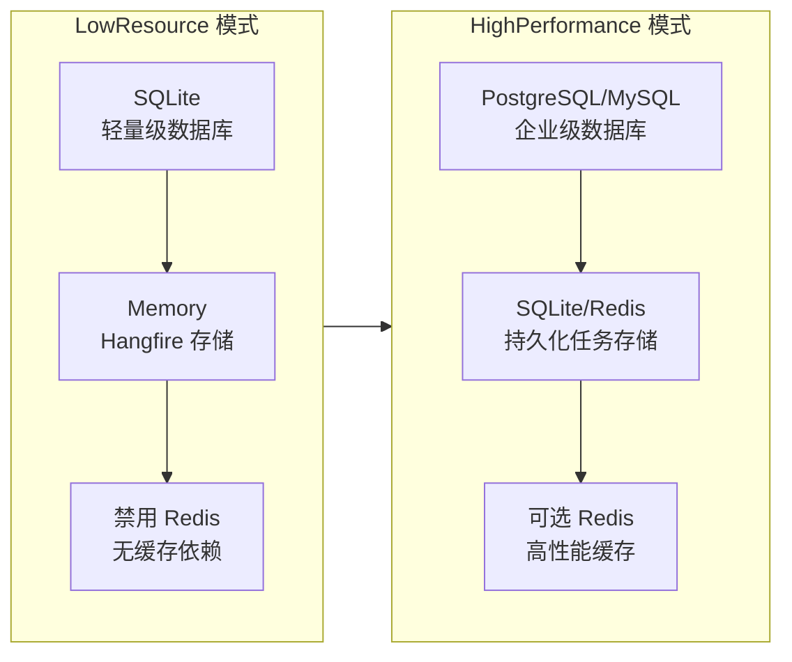

# 部署模式

## 概述

IntelliSubstation Voiceprint Monitoring Backend 支持两种部署模式，通过 `DbConnOptions:DeploymentMode` 配置切换：

- **LowResource** — 低资源模式（ARM32/ARM64 边缘设备）
- **HighPerformance** — 高性能模式（数据中心、高并发场景）

## 模式对比



| 特性 | LowResource | HighPerformance |
|-----|-------------|-----------------|
| **适用场景** | ARM32/ARM64 边缘设备 | 数据中心、云服务器 |
| **主数据库** | SQLite | PostgreSQL/MySQL/SQL Server |
| **传感器数据库** | SQLite（与业务数据合并） | TDengine（可选） |
| **Hangfire 存储** | Memory（重启任务丢失） | SQLite（持久化）或 Redis |
| **Redis 缓存** | 禁用 | 可选 |
| **Swagger** | 建议禁用（减少栈溢出风险） | 可启用 |
| **并发能力** | 低（单连接 SQLite） | 高（连接池） |
| **资源占用** | 极低（~50 MB 内存） | 中等（~200 MB 内存） |
| **数据持久化** | 支持 | 支持 |

## LowResource 模式

### 配置文件

**源码**：`src/Yi.Abp.Web/appsettings.LowResource.json`

**关键配置**：

```json
{
  "App": {
    "SelfUrl": "http://*:19001",
    "CorsOrigins": "*",
    "EnableSwagger": false  // ARM32 平台建议禁用
  },
  
  "DbConnOptions": {
    "DeploymentMode": "LowResource",
    "Url": "Data Source=db/ast_intellisub.db",
    "DbType": "Sqlite",
    "TDengineUrl": "",
    "EnabledCodeFirst": true,
    "EnabledSaasMultiTenancy": false
  },
  
  "Hangfire": {
    "StorageMode": "Memory"
  },
  
  "Redis": {
    "IsEnabled": false
  }
}
```

### 数据库配置

**主数据库（业务数据 + 传感器数据）**：

```json
"Url": "Data Source=db/ast_intellisub.db",
"DbType": "Sqlite"
```

**特点**：
- 单文件 SQLite 数据库
- 业务数据和传感器数据存储在同一数据库
- 无需额外数据库服务
- 适合资源受限环境

**注意事项**：
- SQLite 不支持连接字符串参数（如 `Max Pool Size`）
- 并发写入性能有限（单写锁）
- 建议定期执行 `VACUUM` 回收空间

### Hangfire 配置

```json
"Hangfire": {
  "StorageMode": "Memory"
}
```

**启动日志**：

```
==========Hangfire 存储配置==========
存储模式: Memory（内存）
特性: 轻量级、高性能、重启后任务丢失
适用场景: 低资源设备（ARM32/ARM64）
任务过期时间: 6小时
=====================================
```

**特点**：
- 完全内存存储
- 重启后任务丢失（但不影响已完成任务的持久化数据）
- 性能最好，无 I/O 开销
- 任务过期时间较短（6 小时）

### ARM32 平台优化

**1. Swagger 禁用**

```json
"App": {
  "EnableSwagger": false
}
```

**原因**：Swagger OpenAPI 生成在 ARM32 平台上可能导致栈溢出（1 MB 栈空间）。

**2. 请求路径长度限制**

```csharp
var maxPathLength = configuration.GetValue<int>("App:MaxRequestPathLength", 200);
```

**原因**：防止 ABP 虚拟文件系统 `PathNavigatesAboveRoot` 递归过深触发栈溢出。

**3. 日志保留策略**

```json
"Serilog": {
  "WriteTo": [
    {
      "Args": {
        "retainedFileCountLimit": 3,  // 仅保留 3 天
        "fileSizeLimitBytes": 20971520  // 单文件 20 MB
      }
    }
  ]
}
```

### 适用场景

- ARM32/ARM64 边缘计算设备（如变电站网关）
- 资源受限的嵌入式系统
- 开发测试环境
- 单机部署场景

## HighPerformance 模式

### 配置文件

**源码**：`src/Yi.Abp.Web/appsettings.HighPerformance.json`

**关键配置**：

```json
{
  "DbConnOptions": {
    "DeploymentMode": "HighPerformance",
    "Url": "Host=192.168.3.111;Port=5455;Database=ast_db;Username=ast;Password=ast123456;",
    "DbType": "PostgreSQL",
    "TDengineUrl": "Host=192.168.3.111;Port=6030;Database=ast;Username=root;Password=taosdata;",
    "EnabledCodeFirst": true,
    "EnableUnderLine": false
  },
  
  "Hangfire": {
    "StorageMode": "SQLite",
    "SQLiteDbPath": "db/hangfire.db"
  },
  
  "Redis": {
    "IsEnabled": false,
    "Configuration": "192.168.3.111:6379,password=ast123456,defaultDatabase=13"
  }
}
```

### 数据库配置

**主数据库（业务数据）**：

```json
"Url": "Host=192.168.3.111;Port=5455;Database=ast_db;Username=ast;Password=ast123456;",
"DbType": "PostgreSQL"
```

**支持的数据库**：
- PostgreSQL（推荐）
- MySQL
- SQL Server
- Oracle

**TDengine 时序数据库（传感器数据）**：

```json
"TDengineUrl": "Host=192.168.3.111;Port=6030;Database=ast;Username=root;Password=taosdata;"
```

**特点**：
- 业务数据和传感器数据分离存储
- TDengine 专为高频时序数据优化
- 支持大规模数据写入和查询

### Hangfire 配置

**SQLite 持久化存储**：

```json
"Hangfire": {
  "StorageMode": "SQLite",
  "SQLiteDbPath": "db/hangfire.db"
}
```

**启动日志**：

```
==========Hangfire 存储配置==========
存储模式: SQLite
数据库路径: db/hangfire.db
队列轮询间隔: 30秒
任务过期时间: 1天
=====================================
```

**特点**：
- SQLite 持久化存储
- 重启后任务恢复
- 任务过期时间较长（1 天）
- 适合生产环境

**Redis 存储（可选）**：

```json
"Hangfire": {
  "StorageMode": "Redis"
},
"Redis": {
  "IsEnabled": true,
  "Configuration": "192.168.3.111:6379,password=ast123456,defaultDatabase=13"
}
```

**启动日志**：

```
==========Hangfire 存储配置==========
存储模式: Redis
Redis 配置: 192.168.3.111:6379,password=ast123456,defaultDatabase=13
任务过期时间: 7天
=====================================
```

**特点**：
- 分布式任务存储
- 支持多实例部署
- 任务过期时间最长（7 天）
- 高并发性能最优

### 高级功能配置

**1. 读写分离（可选）**：

```json
"DbConnOptions": {
  "EnabledReadWrite": true,
  "ReadUrl": [
    "Host=read-replica-1;Port=5455;Database=ast_db;",
    "Host=read-replica-2;Port=5455;Database=ast_db;"
  ]
}
```

**2. 流式传输配置**：

```json
"StreamingTransfer": {
  "DefaultChunkSize": 65536,
  "MaxChunkSize": 1048576,
  "ConnectionTimeoutSeconds": 30,
  "EnableGzipCompression": true
}
```

**3. 智能识别 API 配置**：

```json
"RecognitionApi": {
  "BaseAddress": "http://192.168.3.16:5100",
  "ApiKey": "ASTK132908#FGR",
  "TimeoutSeconds": 30
}
```

**4. MQTT 连接配置**：

```json
"Mqtt": {
  "EnablePersistentSession": true,
  "QualityOfService": 1,
  "KeepAlivePeriodSeconds": 60
}
```

### 适用场景

- 数据中心部署
- 云服务器（AWS、Azure、阿里云）
- 高并发场景
- 多实例集群部署
- 大数据量存储需求

## 模式切换

### 方法 1：复制配置文件

```bash
# LowResource 模式
cp src/Yi.Abp.Web/appsettings.LowResource.json src/Yi.Abp.Web/appsettings.json

# HighPerformance 模式
cp src/Yi.Abp.Web/appsettings.HighPerformance.json src/Yi.Abp.Web/appsettings.json
```

### 方法 2：环境变量

```bash
# Linux/Mac
export DeploymentMode=LowResource

# Windows
set DeploymentMode=LowResource
```

然后在 `appsettings.json` 中使用：

```json
"DbConnOptions": {
  "DeploymentMode": "${DeploymentMode}"
}
```

### 方法 3：命令行参数

```bash
dotnet run -- --DeploymentMode=LowResource
```

## 配置验证

启动时检查配置是否生效：

```bash
# 查看启动日志
tail -f logs/all/log-*.txt | grep "存储模式"

# 预期输出（LowResource）
# [INF] 存储模式: Memory（内存）

# 预期输出（HighPerformance + SQLite）
# [INF] 存储模式: SQLite

# 预期输出（HighPerformance + Redis）
# [INF] 存储模式: Redis
```

## 性能对比

| 指标 | LowResource | HighPerformance (SQLite) | HighPerformance (Redis) |
|-----|-------------|-------------------------|------------------------|
| **内存占用** | ~50 MB | ~150 MB | ~200 MB |
| **启动时间** | ~2 秒 | ~5 秒 | ~7 秒 |
| **API 响应时间** | ~100 ms | ~50 ms | ~30 ms |
| **并发连接数** | ~10 | ~100 | ~500 |
| **任务吞吐量** | ~10/min | ~100/min | ~1000/min |
| **数据持久化** | 支持 | 支持 | 支持 |
| **任务恢复** | 不支持 | 支持 | 支持 |

## 推荐配置

### 边缘设备（ARM32）

```json
{
  "DbConnOptions": {
    "DeploymentMode": "LowResource",
    "Url": "Data Source=db/ast_intellisub.db",
    "DbType": "Sqlite"
  },
  "Hangfire": {
    "StorageMode": "Memory"
  },
  "Redis": {
    "IsEnabled": false
  }
}
```

### 中小型部署（单服务器）

```json
{
  "DbConnOptions": {
    "DeploymentMode": "HighPerformance",
    "Url": "Host=localhost;Port=5432;Database=ast_db;Username=ast;Password=ast123456;",
    "DbType": "PostgreSQL",
    "TDengineUrl": "Host=localhost;Port=6030;Database=ast;Username=root;Password=taosdata;"
  },
  "Hangfire": {
    "StorageMode": "SQLite",
    "SQLiteDbPath": "db/hangfire.db"
  },
  "Redis": {
    "IsEnabled": false
  }
}
```

### 大型部署（集群）

```json
{
  "DbConnOptions": {
    "DeploymentMode": "HighPerformance",
    "Url": "Host=db-primary;Port=5432;Database=ast_db;Username=ast;Password=ast123456;",
    "DbType": "PostgreSQL",
    "TDengineUrl": "Host=tdengine;Port=6030;Database=ast;Username=root;Password=taosdata;",
    "EnabledReadWrite": true,
    "ReadUrl": [
      "Host=db-replica-1;Port=5432;Database=ast_db;",
      "Host=db-replica-2;Port=5432;Database=ast_db;"
    ]
  },
  "Hangfire": {
    "StorageMode": "Redis"
  },
  "Redis": {
    "IsEnabled": true,
    "Configuration": "redis:6379,password=ast123456,defaultDatabase=13"
  }
}
```

## 相关文档

- [Host README](./README.md) — 宿主层概览
- [YiAbpWebModule 详细配置](./YiAbpWebModule.md)
- [Program 启动流程](./Program启动流程.md)
- [静态资源与 SPA 回退](./静态资源与SPA回退.md)
- [../README.md](../README.md) — 文档总索引
