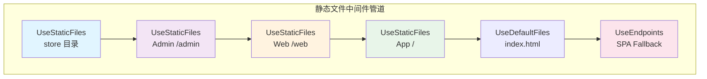
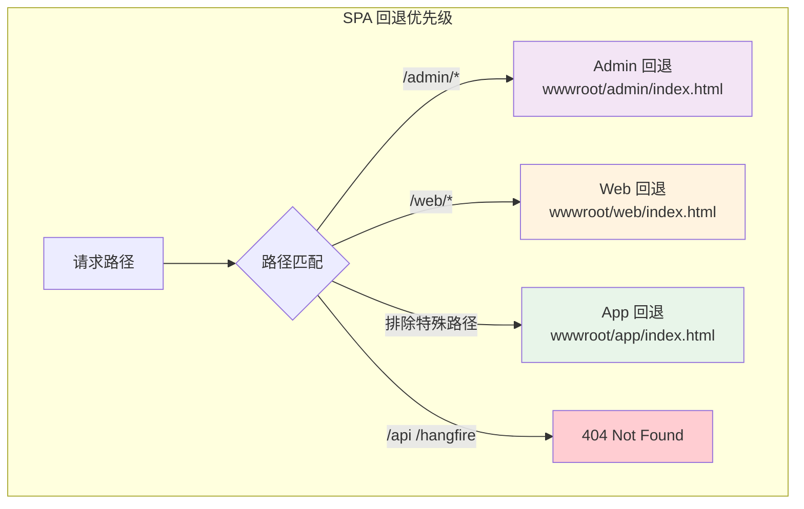
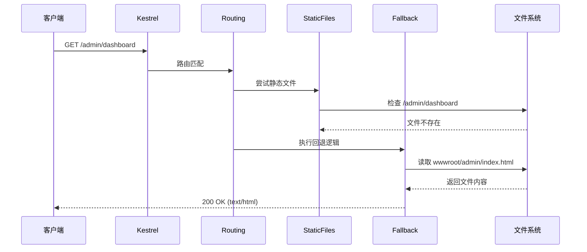
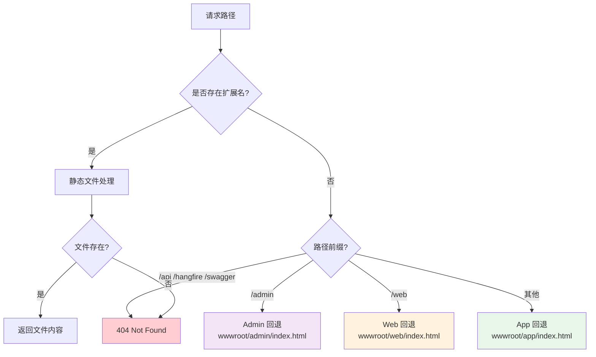

# 静态资源与 SPA 回退

## 概述

系统支持三个前端 SPA（Single Page Application）应用，每个独立部署并配置路由回退。源码位于 `src/Yi.Abp.Web/YiAbpWebModule.cs` 和 `src/Yi.Abp.Web/Options/FrontendAppOptions.cs`。

## 前端应用配置

### 配置结构

**appsettings.json 配置**：

```json
"FrontendApps": {
  "App": {
    "PhysicalPath": "wwwroot/app",
    "RequestPath": "",
    "DefaultFile": "index.html"
  },
  "Admin": {
    "PhysicalPath": "wwwroot/admin",
    "RequestPath": "/admin",
    "DefaultFile": "index.html"
  },
  "Web": {
    "PhysicalPath": "wwwroot/web",
    "RequestPath": "/web",
    "DefaultFile": "index.html"
  }
}
```

### 应用说明

| 应用 | 访问路径 | 物理路径 | 用途 |
|-----|---------|---------|------|
| **App** | `/` 或 `/*` | `wwwroot/app/` | 主应用（巡检监控） |
| **Admin** | `/admin/*` | `wwwroot/admin/` | 管理端（系统配置） |
| **Web** | `/web/*` | `wwwroot/web/` | Web 应用（数据展示） |

### 目录结构

```
src/Yi.Abp.Web/
├── wwwroot/
│   ├── app/                    # 主应用 SPA
│   │   └── index.html
│   ├── admin/                  # 管理端 SPA
│   │   └── index.html
│   ├── web/                    # Web 应用 SPA
│   │   └── index.html
│   ├── audio/                   # 声纹音频文件
│   └── store/                   # 通用存储目录
```

## FrontendAppOptions 配置选项

### 源码解析

**位置**：`src/Yi.Abp.Web/Options/FrontendAppOptions.cs`

```csharp
public class FrontendAppConfig
{
    /// <summary>
    /// 物理路径（相对路径或绝对路径）
    /// </summary>
    public string PhysicalPath { get; set; } = string.Empty;

    /// <summary>
    /// URL 访问路径
    /// </summary>
    public string RequestPath { get; set; } = string.Empty;

    /// <summary>
    /// 默认首页文件
    /// </summary>
    public string DefaultFile { get; set; } = "index.html";

    /// <summary>
    /// 获取完整的物理路径
    /// </summary>
    public string GetFullPhysicalPath()
    {
        if (string.IsNullOrWhiteSpace(PhysicalPath))
            throw new ArgumentException("PhysicalPath cannot be null or empty");

        if (Path.IsPathRooted(PhysicalPath))
            return PhysicalPath;  // 绝对路径直接返回
        else
            return Path.Combine(AppDomain.CurrentDomain.BaseDirectory, PhysicalPath);  // 相对路径基于应用根目录
    }

    /// <summary>
    /// 获取默认文件的完整路径
    /// </summary>
    public string GetDefaultFilePath()
    {
        return Path.Combine(GetFullPhysicalPath(), DefaultFile);
    }
}
```

### 路径处理逻辑

**相对路径**：基于应用程序根目录（`AppDomain.CurrentDomain.BaseDirectory`）

```csharp
// 配置: "PhysicalPath": "wwwroot/app"
// 实际路径: /path/to/application/wwwroot/app
```

**绝对路径**：直接使用完整路径

```csharp
// 配置: "PhysicalPath": "/var/www/app"
// 实际路径: /var/www/app
```

## 中间件管道配置

### 静态文件服务配置

**执行顺序**（`OnApplicationInitializationAsync`）：

```csharp
// 1. store 目录（通用存储）
var baseStorePath = Path.Combine(AppDomain.CurrentDomain.BaseDirectory, "store");
Directory.CreateDirectory(baseStorePath);
app.UseStaticFiles(new StaticFileOptions
{
    FileProvider = new PhysicalFileProvider(baseStorePath),
    RequestPath = ""
});

// 2. Admin 管理端（优先级最高，先配置）
var adminPhysicalPath = frontendAppsOptions.Admin.GetFullPhysicalPath();
Directory.CreateDirectory(adminPhysicalPath);
app.UseStaticFiles(new StaticFileOptions
{
    FileProvider = new PhysicalFileProvider(adminPhysicalPath),
    RequestPath = frontendAppsOptions.Admin.RequestPath  // /admin
});

// 3. Web 应用
var webPhysicalPath = frontendAppsOptions.Web.GetFullPhysicalPath();
Directory.CreateDirectory(webPhysicalPath);
app.UseStaticFiles(new StaticFileOptions
{
    FileProvider = new PhysicalFileProvider(webPhysicalPath),
    RequestPath = frontendAppsOptions.Web.RequestPath  // /web
});

// 4. App 应用（主应用）
var appPhysicalPath = frontendAppsOptions.App.GetFullPhysicalPath();
Directory.CreateDirectory(appPhysicalPath);
app.UseStaticFiles(new StaticFileOptions
{
    FileProvider = new PhysicalFileProvider(appPhysicalPath),
    RequestPath = frontendAppsOptions.App.RequestPath  // 空（根路径）
});

// 5. 默认文件
app.UseDefaultFiles();
```

### 中间件管道流程



## SPA 路由回退

### 回退机制

单页应用（SPA）使用客户端路由（如 Vue Router、React Router），需要服务器端配置路由回退：

**问题**：用户刷新 `/admin/dashboard` 时，服务器尝试查找 `/admin/dashboard/index.html`（不存在）。

**解决**：对于非文件请求，返回 `index.html`，由前端路由处理。

### 配置实现

**位置**：`YiAbpWebModule.OnApplicationInitializationAsync`

#### Admin 管理端回退

```csharp
endpoints.MapFallback("admin/{*path:nonfile}", async context =>
{
    var adminIndexPath = frontendAppsOptions.Admin.GetDefaultFilePath();
    if (File.Exists(adminIndexPath))
    {
        context.Response.ContentType = "text/html; charset=utf-8";
        await context.Response.SendFileAsync(adminIndexPath);
    }
    else
    {
        context.Response.StatusCode = 404;
    }
});
```

**匹配规则**：
- 路径模式：`/admin/{*path:nonfile}`
- `{*path:nonfile}`：匹配非文件路径（无扩展名）
- 示例：`/admin/dashboard` → 返回 `wwwroot/admin/index.html`

#### Web 应用回退

```csharp
endpoints.MapFallback("web/{*path:nonfile}", async context =>
{
    var webIndexPath = frontendAppsOptions.Web.GetDefaultFilePath();
    if (File.Exists(webIndexPath))
    {
        context.Response.ContentType = "text/html; charset=utf-8";
        await context.Response.SendFileAsync(webIndexPath);
    }
    else
    {
        context.Response.StatusCode = 404;
    }
});
```

**匹配规则**：
- 路径模式：`/web/{*path:nonfile}`
- 示例：`/web/chart/sensor` → 返回 `wwwroot/web/index.html`

#### App 应用回退（全局）

```csharp
endpoints.MapFallback(async context =>
{
    // 排除特殊路径
    if (context.Request.Path.StartsWithSegments("/api") ||
        context.Request.Path.StartsWithSegments("/admin") ||
        context.Request.Path.StartsWithSegments("/web") ||
        context.Request.Path.StartsWithSegments("/hangfire") ||
        context.Request.Path.StartsWithSegments("/swagger"))
    {
        context.Response.StatusCode = 404;
        return;
    }

    var appIndexPath = frontendAppsOptions.App.GetDefaultFilePath();
    if (File.Exists(appIndexPath))
    {
        context.Response.ContentType = "text/html; charset=utf-8";
        await context.Response.SendFileAsync(appIndexPath);
    }
    else
    {
        context.Response.StatusCode = 404;
    }
});
```

**匹配规则**：
- 路径模式：`{*path}`（全局回退）
- 排除路径：`/api`, `/admin`, `/web`, `/hangfire`, `/swagger`
- 示例：`/equipment/list` → 返回 `wwwroot/app/index.html`

### 回退优先级



## 请求处理流程

### 完整流程示例

**请求**：`GET /admin/dashboard`



### 路径决策树



## 特殊路径处理

### 排除路径（不回退）

以下路径不触发 SPA 回退，直接返回 404（如果不存在）：

| 路径模式 | 用途 |
|---------|------|
| `/api/*` | REST API 端点 |
| `/admin` | Admin 管理端（由 `/admin/{*path:nonfile}` 处理） |
| `/web` | Web 应用（由 `/web/{*path:nonfile}` 处理） |
| `/hangfire` | Hangfire 仪表板 |
| `/swagger` | Swagger UI |

### 静态资源路径

静态资源（CSS、JS、图片）由 `UseStaticFiles` 中间件处理，不触发回退：

```
/admin/static/css/main.css    → 静态文件（存在则返回）
/admin/static/js/app.js       → 静态文件（存在则返回）
/admin/images/logo.png        → 静态文件（存在则返回）
```

## 配置示例

### 自定义路径

**修改 Admin 应用路径**：

```json
"FrontendApps": {
  "Admin": {
    "PhysicalPath": "wwwroot/admin-panel",
    "RequestPath": "/admin-panel",
    "DefaultFile": "index.html"
  }
}
```

**访问路径**：`/admin-panel/dashboard`

### 自定义默认文件

**使用不同的入口文件**：

```json
"FrontendApps": {
  "App": {
    "PhysicalPath": "wwwroot/app",
    "RequestPath": "",
    "DefaultFile": "app.html"
  }
}
```

### 绝对路径部署

**部署到系统目录**：

```json
"FrontendApps": {
  "App": {
    "PhysicalPath": "/var/www/ast-intellisub/app",
    "RequestPath": "",
    "DefaultFile": "index.html"
  }
}
```

## 常见问题

### 1. SPA 刷新 404

**现象**：前端路由正常，刷新页面返回 404

**原因**：SPA 回退未配置或路径不匹配

**解决**：检查 `MapFallback` 配置和 `{*path:nonfile}` 路径模式

### 2. 静态资源 404

**现象**：CSS、JS 文件返回 404

**原因**：静态文件中间件未配置或物理路径错误

**解决**：检查 `PhysicalPath` 和 `RequestPath` 配置

### 3. 路径冲突

**现象**：多个应用配置相同路径

**解决**：确保 `RequestPath` 唯一

### 4. 文件编码问题

**现象**：中文乱码

**解决**：确保 `index.html` 使用 UTF-8 编码

## 调试技巧

### 启用详细日志

```json
"Serilog": {
  "MinimumLevel": {
    "Default": "Debug",
    "Override": {
      "Microsoft.AspNetCore.StaticFiles": "Debug"
    }
  }
}
```

### 测试静态文件

```bash
# 测试 Admin 应用
curl http://localhost:19001/admin/

# 测试 Web 应用
curl http://localhost:19001/web/

# 测试 App 应用
curl http://localhost:19001/

# 测试 SPA 回退
curl http://localhost:19001/admin/dashboard  # 应返回 index.html
```

## 相关文档

- [Host README](./README.md) — 宿主层概览
- [YiAbpWebModule 详细配置](./YiAbpWebModule.md)
- [Program 启动流程](./Program启动流程.md)
- [部署模式详解](./部署模式.md)
- [../README.md](../README.md) — 文档总索引
