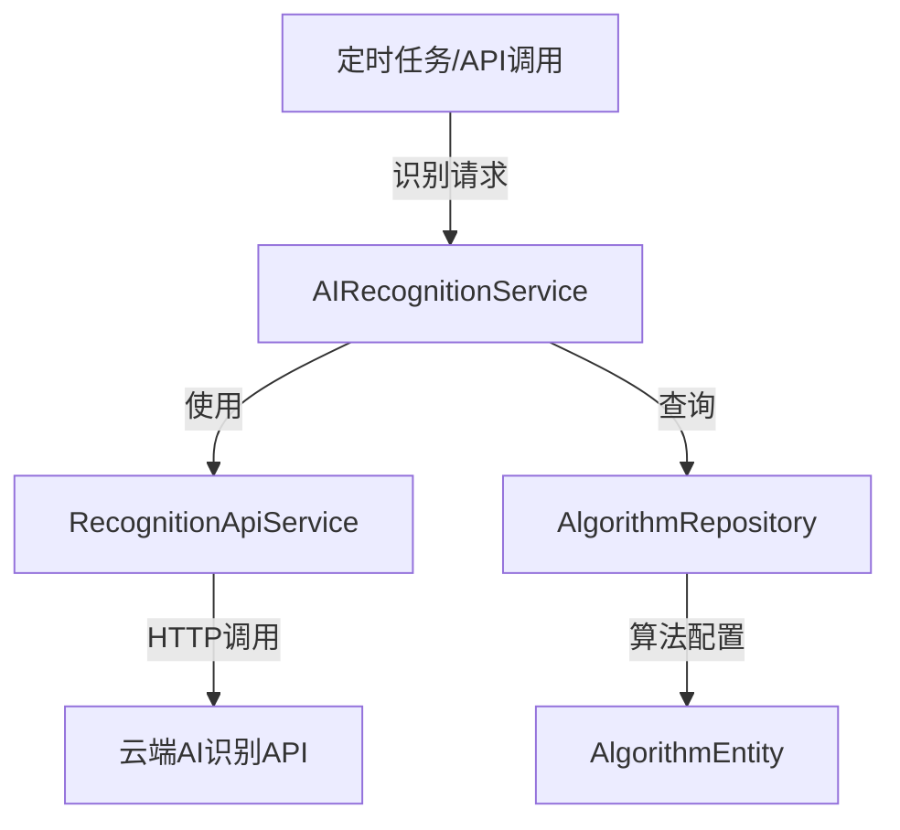
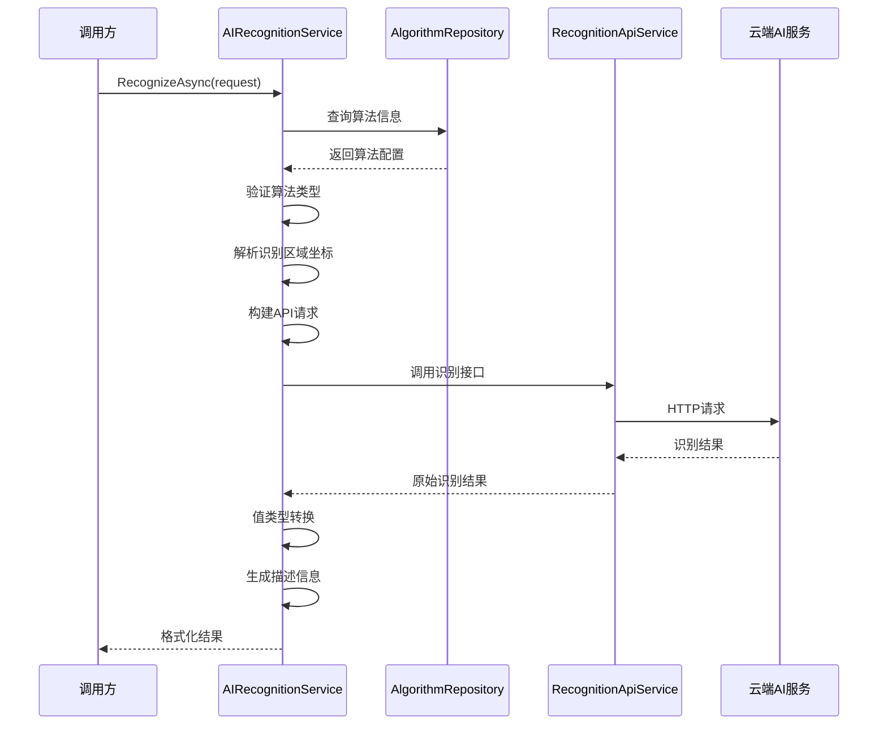
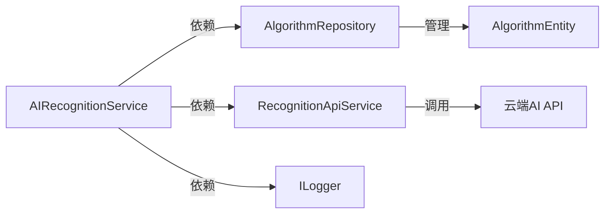

# AIRecognitionService

## 概述

AI识别服务，提供声纹识别、图像识别、异常检测等AI功能的统一调用接口。该服务基于RecognitionApiService实现实际的AI识别功能，支持单次识别和批量识别。

**位置**：`module/ast-intellisub/Ast.IntelliSub.Application/Services/AI/AIRecognitionService.cs`
**层**：Application
**模块**：ast-intellisub
**依赖注入**：Transient

---

## 架构位置



## 核心职责

1. 声纹识别处理
2. 图像识别（仪表读数、状态识别等）
3. 异常检测分析
4. 批量识别任务处理
5. 识别结果格式化和类型转换

## 主要接口

### 单次识别

```csharp
/// 执行AI识别
Task<AIRecognitionResultDto> RecognizeAsync(AIRecognitionRequestDto request);
```

**请求参数**：
- `AlgorithmId` (Guid): 算法ID
- `ImageUrl` (string): 图片URL
- `RecognitionArea` (string): 识别区域JSON坐标

**返回结果**：
- `Value`: 识别值
- `Unit`: 单位
- `ValueType`: 值类型
- `IsUnrecognizable`: 是否无法识别
- `Description`: 描述信息
- `Confidence`: 置信度

### 批量识别

```csharp
/// 批量执行AI识别（用于定时任务）
Task<List<AIBatchRecognitionResultDto>> BatchRecognizeAsync(
    string imageUrl, 
    List<AIBatchRecognitionTaskDto> tasks);
```

**特点**：
- 支持单个图片多次识别任务
- 自动过滤不支持的算法类型
- 独立错误处理，单个任务失败不影响其他任务

---

## 识别流程



### 识别步骤详解

1. **获取算法信息**：根据AlgorithmId查询算法配置
2. **类型验证**：跳过特殊算法类型（如红外测温）
3. **区域解析**：将JSON格式的识别区域转换为ROI坐标
4. **构建请求**：组装RecognitionApiService请求参数
5. **调用API**：通过RecognitionApiService调用云端识别服务
6. **结果转换**：将原始结果转换为业务DTO，包括：
   - 值类型转换（Int/Float/String/Enum/Json）
   - 枚举描述解析
   - 置信度处理

---

## 支持的识别类型

### 值类型支持

| 值类型 | 说明 | 转换逻辑 |
|--------|------|----------|
| `Int` | 整数 | Convert.ToInt32() |
| `Float` | 浮点数 | Convert.ToDouble() |
| `String` | 字符串 | value.ToString() |
| `Enum` | 枚举 | Convert.ToInt32() + 描述解析 |
| `Json` | JSON对象 | JsonSerializer.Serialize() |

### 枚举描述解析

支持格式：`"0:灭,1:亮,2:故障"`

```csharp
// 解析逻辑
var enumPairs = unit.Split(',').ToDictionary(
    parts => int.Parse(parts[0]), 
    parts => parts[1]
);
```

### 特殊算法类型

以下算法类型不支持通用识别接口：
- `InfraredTemperatureMeasurement` (红外测温) - 需要特殊处理

---

## 边缘设备对接

### 图片URL处理

服务支持以下图片来源：
1. **HTTP/HTTPS URL**：直接使用
2. **本地文件路径**：自动转换为HTTP可访问URL
3. **Base64编码**：直接传递给识别API

### 识别区域配置

识别区域通过JSON格式指定：

```json
{
  "x": 100,
  "y": 50,
  "width": 200,
  "height": 80
}
```

**特殊值**：
- `width: -1, height: -1` 表示全图识别

---

## 云端API对接

### RecognitionApiService集成

AIRecognitionService通过RecognitionApiService与云端AI服务通信：

```csharp
// 内部调用
var recognitionResponse = await _recognitionApiService.RecognizeAsync(recognitionRequest);
```

### 错误处理策略

1. **算法不存在**：抛出UserFriendlyException("算法不存在", "404")
2. **不支持的算法类型**：抛出UserFriendlyException("此算法类型暂不支持通用识别接口", "422")
3. **识别服务无响应**：抛出UserFriendlyException("识别服务未返回结果", "500")
4. **坐标格式错误**：抛出UserFriendlyException("识别区域坐标格式错误", "400")

### 重试机制

RecognitionApiService内置重试机制：
- 最大重试次数：3次（可配置）
- 重试延迟：指数退避
- 超时时间：30秒（可配置）

---

## 依赖服务

### 核心依赖

```csharp
public class AIRecognitionService : ApplicationService, IAIRecognitionService
{
    private readonly ILogger<AIRecognitionService> _logger;
    private readonly ISqlSugarRepository<AlgorithmEntity, Guid> _algorithmRepository;
    private readonly IRecognitionApiService _recognitionApiService;
}
```

### 服务依赖图



---

## 数据流

### 识别请求流

```
客户端/AppService
  ↓
AIRecognitionService.RecognizeAsync()
  ↓ AlgorithmRepository.Get()
AlgorithmEntity配置信息
  ↓ 构建请求
RecognitionApiService.RecognizeAsync()
  ↓ HTTP POST
云端AI识别服务
  ↓ JSON响应
RecognitionResponseDto
  ↓ 结果转换
AIRecognitionResultDto
  ↓
客户端/AppService
```

### 批量识别流

```
定时任务
  ↓
AIRecognitionService.BatchRecognizeAsync()
  ↓ 批量查询算法
AlgorithmRepository.GetList()
  ↓ 过滤有效任务
RecognitionApiService.RecognizeAsync()
  ↓ 单次API调用
云端AI服务
  ↓ 批量结果
List<AIBatchRecognitionResultDto>
  ↓
定时任务处理
```

---

## 配置选项

### RecognitionApiOptions

```json
{
  "RecognitionApi": {
    "BaseAddress": "http://ai-service.example.com",
    "ApiKey": "your-api-key",
    "TimeoutSeconds": 30,
    "RetryCount": 3,
    "RetryDelayMs": 1000,
    "IsLocalTestEnvironment": false,
    "LocalTestServerBaseAddress": "http://localhost:8080",
    "EnableLogging": true
  }
}
```

---

## 使用示例

### 单次识别

```csharp
// 准备识别请求
var request = new AIRecognitionRequestDto
{
    AlgorithmId = Guid.Parse("..."),
    ImageUrl = "http://example.com/image.jpg",
    RecognitionArea = "{\"x\":100,\"y\":50,\"width\":200,\"height\":80}"
};

// 执行识别
var result = await _aiRecognitionService.RecognizeAsync(request);

// 处理结果
if (result.IsUnrecognizable)
{
    Console.WriteLine($"识别失败: {result.Description}");
}
else
{
    Console.WriteLine($"识别结果: {result.Value} {result.Unit}");
    Console.WriteLine($"置信度: {result.Confidence:P2}");
}
```

### 批量识别

```csharp
// 准备批量任务
var tasks = new List<AIBatchRecognitionTaskDto>
{
    new AIBatchRecognitionTaskDto
    {
        TaskId = "task-1",
        AlgorithmId = algorithmId1,
        TaskName = "仪表读数识别",
        RecognitionArea = "{\"x\":100,\"y\":50,\"width\":200,\"height\":80}"
    },
    new AIBatchRecognitionTaskDto
    {
        TaskId = "task-2",
        AlgorithmId = algorithmId2,
        TaskName = "状态指示灯识别",
        RecognitionArea = "{\"x\":300,\"y\":50,\"width\":100,\"height\":100}"
    }
};

// 执行批量识别
var results = await _aiRecognitionService.BatchRecognizeAsync(imageUrl, tasks);

// 处理结果
foreach (var result in results)
{
    if (result.ErrorMessage != null)
    {
        Console.WriteLine($"任务 {result.TaskId} 失败: {result.ErrorMessage}");
    }
    else
    {
        Console.WriteLine($"任务 {result.TaskId} 结果: {result.Value}");
    }
}
```

---

## 重要方法

### `RecognizeAsync()`

单次AI识别的核心方法。

**调用链**：
```
PatrolExecutionService.ProcessPatrolItem()
  → AIRecognitionService.RecognizeAsync()
    → AlgorithmRepository.GetAsync()
    → RecognitionApiService.RecognizeAsync()
    → ConvertToAIRecognitionResult()
```

### `BatchRecognizeAsync()`

批量AI识别，用于定时任务场景。

**特点**：
- 一次API调用处理多个任务
- 独立错误处理
- 自动过滤不支持的算法

---

## 错误处理

### 错误分类

| 错误类型 | HTTP状态码 | 处理方式 |
|----------|------------|----------|
| 算法不存在 | 404 | 抛出UserFriendlyException |
| 参数错误 | 400 | 抛出UserFriendlyException |
| 不支持的算法 | 422 | 抛出UserFriendlyException |
| 识别服务超时 | 504 | 自动重试 |
| 识别服务错误 | 500 | 记录日志并抛出异常 |

### 日志记录

```csharp
_logger.LogDebug("开始AI识别: ImageUrl={ImageUrl}, AlgorithmId={AlgorithmId}", ...);
_logger.LogWarning("跳过特殊算法类型: {AlgorithmType}, AlgorithmId={AlgorithmId}", ...);
_logger.LogError(ex, "AI识别处理异常: AlgorithmId={AlgorithmId}, ImageUrl={ImageUrl}", ...);
```

---

## 性能考虑

1. **批量优化**：批量识别时，多个任务合并为单次API调用
2. **并发控制**：RecognitionApiService内部使用HttpClient连接池
3. **超时控制**：30秒超时，避免长时间阻塞
4. **重试机制**：自动重试临时性错误

---

## 相关组件

- [[RecognitionApiService]] - 云端AI识别API服务
- [[AlgorithmEntity]] - 算法配置实体
- [[PatrolExecutionService]] - 巡视执行服务（调用方）
- [[AIRecognitionRequestDto]] - 识别请求DTO
- [[AIRecognitionResultDto]] - 识别结果DTO

## 参考资料

- [ABP Application Services](https://docs.abp.io/en/abp/latest/Application-Services)
- 项目源码：`module/ast-intellisub/Ast.IntelliSub.Application/Services/AI/`

---
**状态**：🟢 已完成
