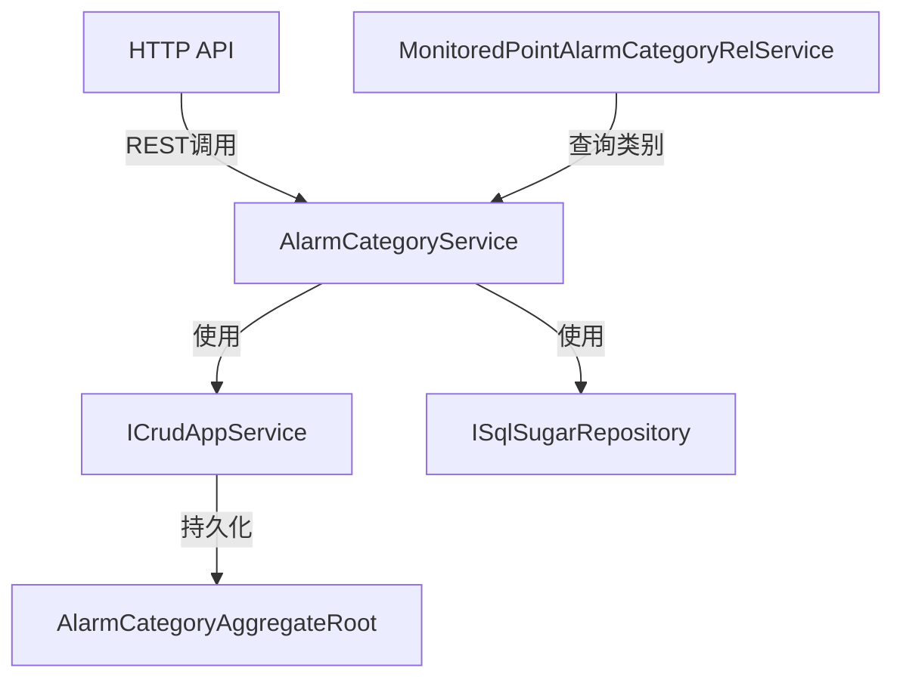

# AlarmCategoryService

## 概述

告警分类服务，负责告警类别的 CRUD 操作和查询，提供按类型查询的接口。

**位置**：`module/ast-intellisub/Ast.IntelliSub.Application/Services/AlarmCategoryService.cs`
**层**：Application
**模块**：ast-intellisub
**依赖注入**：Scoped

---

## 架构位置



## 核心职责

1. 告警类别的创建、更新、删除操作
2. 告警类别列表查询
3. 按类型查询告警类别
4. 告警类别下拉选项提供
5. 类别排序管理

## 主要接口

### 基础 CRUD（继承自 ICrudAppService）

```csharp
/// <summary>
/// 创建告警类别
/// </summary>
Task<AlarmCategoryDto> CreateAsync(AlarmCategoryCreateUpdateDto input);

/// <summary>
/// 更新告警类别
/// </summary>
Task<AlarmCategoryDto> UpdateAsync(Guid id, AlarmCategoryCreateUpdateDto input);

/// <summary>
/// 删除告警类别
/// </summary>
Task DeleteAsync(Guid id);

/// <summary>
/// 获取告警类别详情
/// </summary>
Task<AlarmCategoryDto> GetAsync(Guid id);

/// <summary>
/// 获取告警类别列表
/// </summary>
Task<PagedResultDto<AlarmCategoryDto>> GetListAsync(AlarmCategoryGetListInputDto input);
```

### 特殊查询接口

```csharp
/// <summary>
/// 获取所有告警类别（用于下拉选择）
/// </summary>
Task<List<AlarmCategoryDto>> GetAllAsync();

/// <summary>
/// 根据类型获取告警类别
/// </summary>
Task<List<AlarmCategoryDto>> GetByTypeAsync(AlarmCategoryTypeEnum type);
```

---

## 数据处理流程

### 创建告警类别

```
前端请求
  ↓
[验证名称唯一性]
  ↓
[验证类型有效性]
  ↓
[创建类别记录]
  ↓
[返回创建结果]
```

### 按类型查询

```
前端请求
  ↓
[按类型过滤]
  ↓
[按排序字段排序]
  ↓
[返回类别列表]
```

---

## 依赖服务

| 服务 | 用途 |
|------|------|
| `ISqlSugarRepository<AlarmCategoryAggregateRoot, Guid>` | 告警类别数据访问 |

---

## 相关实体

### AlarmCategoryAggregateRoot

```csharp
public class AlarmCategoryAggregateRoot : FullAuditedAggregateRoot<Guid>
{
    public string Name { get; set; }
    public AlarmCategoryTypeEnum Type { get; set; }
    public string? Description { get; set; }
    public int? OrderNum { get; set; }
}
```

### AlarmCategoryTypeEnum

```csharp
public enum AlarmCategoryTypeEnum
{
    Temperature = 0,        // 温度告警
    Vibration = 1,          // 振动告警
    Noise = 2,              // 噪声告警
    PartialDischarge = 3,   // 局放告警
    Environmental = 4,      // 环境告警
    Equipment = 5           // 设备告警
}
```

---

## 相关 DTO

### AlarmCategoryDto

```csharp
public class AlarmCategoryDto
{
    public Guid Id { get; set; }
    public string Name { get; set; }
    public AlarmCategoryTypeEnum Type { get; set; }
    public string? Description { get; set; }
    public int? OrderNum { get; set; }
    public DateTime CreationTime { get; set; }
}
```

### AlarmCategoryCreateUpdateDto

```csharp
public class AlarmCategoryCreateUpdateDto
{
    public string Name { get; set; }
    public AlarmCategoryTypeEnum Type { get; set; }
    public string? Description { get; set; }
    public int? OrderNum { get; set; }
}
```

### AlarmCategoryGetListInputDto

```csharp
public class AlarmCategoryGetListInputDto
{
    public string? Filter { get; set; }
    public AlarmCategoryTypeEnum? Type { get; set; }
    public int MaxResultCount { get; set; } = 10;
    public int SkipCount { get; set; } = 0;
}
```

---

## 告警类别类型

### 温度告警（Temperature）

- 温度过高
- 温度过低
- 温差过大
- 温度变化率异常

### 振动告警（Vibration）

- 振动幅值超标
- 振动频率异常
- 加速度超标

### 噪声告警（Noise）

- 噪声超标
- 异常声音

### 局放告警（PartialDischarge）

- 局放超标
- 局放趋势异常

### 环境告警（Environmental）

- 湿度异常
- 气压异常
- 气体浓度异常

### 设备告警（Equipment）

- 设备离线
- 设备故障
- 通信异常

---

## 使用场景

### 前端下拉选择

```typescript
// 获取所有告警类别用于下拉选择
const categories = await alarmCategoryService.getAllAsync();

// 渲染下拉选项
<select>
  {categories.map(cat => (
    <option key={cat.id} value={cat.id}>
      {cat.name}
    </option>
  ))}
</select>
```

### 按类型筛选

```typescript
// 只获取温度告警类别
const tempCategories = await alarmCategoryService.getByTypeAsync(
  AlarmCategoryTypeEnum.Temperature
);

// 返回: [高温告警, 低温告警, 温差告警, ...]
```

---

## 配置项

无特定配置项，使用数据库配置。

---

## 注意事项

### 唯一性

- 同一类型下类别名称建议唯一
- 创建时不强制检查，但建议避免重复

### 排序

- 使用 `OrderNum` 字段控制显示顺序
- 查询时按 `OrderNum` 升序排序
- 未设置排序时按创建时间排序

### 级联删除

- 删除类别前应检查是否有关联的点位
- 建议使用软删除保留历史数据

### 权限控制

- 创建/更新/删除需要管理员权限
- 查询接口对所有认证用户开放

---

## 预置类别

系统通常预置以下告警类别：

| 类型 | 类别名称 | 说明 |
|------|----------|------|
| Temperature | 高温告警 | 温度超过上限 |
| Temperature | 低温告警 | 温度低于下限 |
| Temperature | 温差告警 | 温差超过阈值 |
| Vibration | 振动超标 | 振动幅值超过限值 |
| Noise | 噪声超标 | 噪声超过限值 |
| PartialDischarge | 局放超标 | 局放超过限值 |
| Environmental | 湿度异常 | 湿度超出范围 |
| Equipment | 设备离线 | 设备失去连接 |

---

## 相关文档

- [[MonitoredPointAlarmCategoryRelService]] - 点位告警分类关联服务
- [[AlarmRecordService]] - 告警记录服务
- [[设备告警流程]] - 告警处理流程

---

**状态**：🟡 学习中
