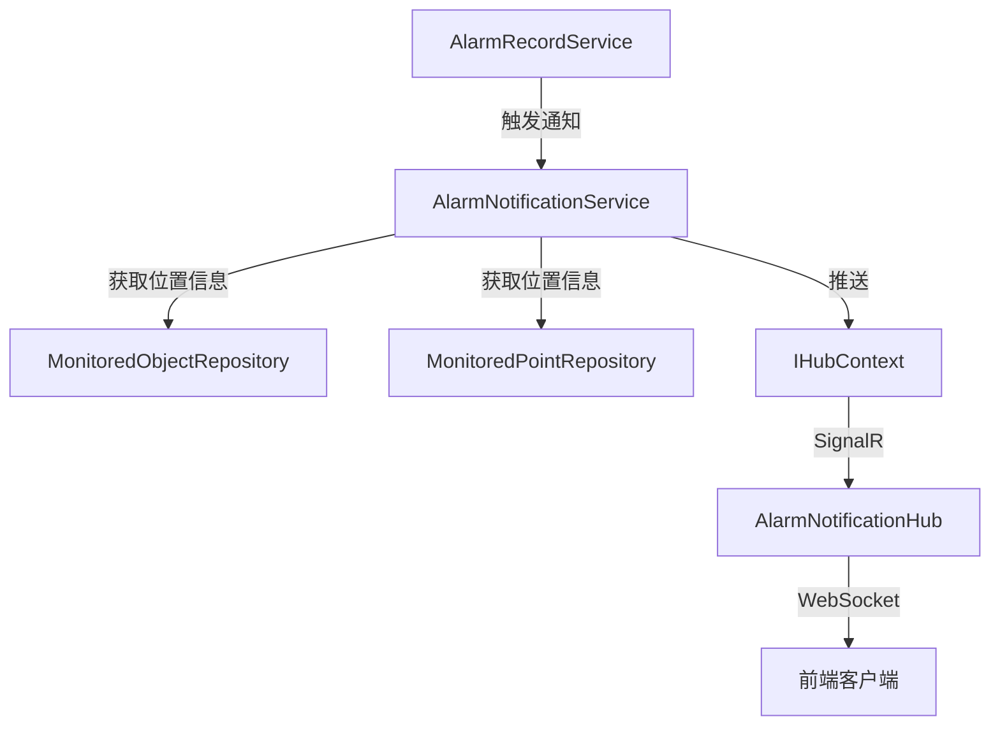

# AlarmNotificationService

## 概述

告警通知服务，负责将告警信息通过 SignalR 实时推送到前端客户端。

**位置**：`module/ast-intellisub/Ast.IntelliSub.Application/Services/AlarmNotificationService.cs`
**层**：Application
**模块**：ast-intellisub
**依赖注入**：Transient

---

## 架构位置



## 核心职责

1. 发送告警通知到前端
2. 获取监测对象位置信息
3. 获取监测点位位置信息
4. 构建告警通知数据
5. 统计未处理告警数量

## 主要接口

### 通知发送

```csharp
/// <summary>
/// 发送告警通知
/// </summary>
Task SendAlarmNotificationAsync(AlarmNotificationInputDto alarmNotificationInput);
```

### 位置信息查询

```csharp
/// <summary>
/// 获取监测对象位置信息
/// </summary>
Task<List<LocationInfoDto>> GetMonitoredObjectLocationsAsync(Guid monitoredObjectId);

/// <summary>
/// 获取点位位置信息
/// </summary>
Task<List<LocationInfoDto>> GetPointLocationsAsync(Guid monitoredPointId);
```

---

## 数据处理流程

### 发送告警通知

```
接收告警输入
  ↓
[查询未处理告警数量]
  ↓
[获取监测对象位置]
  ↓
[获取点位位置]
  ↓
[构建通知数据]
  ↓
[通过 SignalR Hub 推送]
  ↓
[广播到所有连接的客户端]
```

### 位置信息构建

```
监测对象ID
  ↓
[查询监测对象]
  ↓
[递归向上查找父级]
  ↓
[构建位置层级]
  ↓
[返回位置路径]
```

---

## 依赖服务

| 服务 | 用途 |
|------|------|
| `ISqlSugarRepository<AlarmRecordAggregateRoot, Guid>` | 告警记录数据访问 |
| `ISqlSugarRepository<MonitoredObjectAggregateRoot, Guid>` | 监测对象数据访问 |
| `ISqlSugarRepository<MonitoredPointEntity, Guid>` | 监测点位数据访问 |
| `ISqlSugarRepository<MonitoredItemEntity, Guid>` | 监测项数据访问 |
| `IHubContext<AlarmNotificationHub>` | SignalR Hub 上下文 |

---

## 相关实体

### LocationInfoDto

```csharp
public class LocationInfoDto
{
    public Guid Id { get; set; }
    public string Name { get; set; }
    public LocationTypeEnum Type { get; set; }
    public Guid? ParentId { get; set; }
}

public enum LocationTypeEnum
{
    Substation = 0,      // 变电站
    Room = 1,            // 房间
    Device = 2,          // 设备
    Component = 3,       // 部件
    Point = 4            // 点位
}
```

---

## 相关 DTO

### AlarmNotificationInputDto

```csharp
public class AlarmNotificationInputDto
{
    public Guid? MonitoredObjectId { get; set; }
    public Guid? MonitoredPointId { get; set; }
    public Guid? MonitoredItemId { get; set; }
    public AlarmLevelEnum Level { get; set; }
    public string Message { get; set; }
}
```

### AlarmNotificationDto

```csharp
public class AlarmNotificationDto
{
    public string NotificationType { get; set; } = "AlarmNotification";
    public AlarmNotificationDataDto Data { get; set; }
}

public class AlarmNotificationDataDto
{
    public int UnprocessedAlarmCount { get; set; }
    public CurrentAlarmInfoDto CurrentAlarm { get; set; }
}
```

### CurrentAlarmInfoDto

```csharp
public class CurrentAlarmInfoDto
{
    public Guid? MonitoredObjectId { get; set; }
    public string? MonitoredObjectName { get; set; }
    public Guid? MonitoredPointId { get; set; }
    public string? MonitoredPointName { get; set; }
    public AlarmLevelEnum Level { get; set; }
    public string Message { get; set; }
    public List<LocationInfoDto> Locations { get; set; }
    public DateTime AlarmTime { get; set; }
}
```

---

## SignalR Hub 配置

### AlarmNotificationHub

```csharp
public class AlarmNotificationHub : Hub
{
    private readonly ILogger<AlarmNotificationHub> _logger;
    private readonly AlarmHubOptions _options;

    public override async Task OnConnectedAsync()
    {
        // 检查认证状态
        if (_options.RequireAuthentication)
        {
            if (!Context.User?.Identity?.IsAuthenticated ?? true)
            {
                throw new HubException("身份认证失败");
            }
        }
        
        await base.OnConnectedAsync();
    }

    public async Task SendAlarmNotification(AlarmNotificationDto notification)
    {
        await Clients.All.SendAsync("ReceiveAlarmNotification", notification);
    }
}
```

### Hub 配置

```csharp
// Startup配置
app.MapHub<AlarmNotificationHub>("/hubs/alarmNotification", options =>
{
    options.Transports = HttpTransportType.WebSockets;
});
```

---

## 前端连接示例

### JavaScript 客户端

```javascript
// 建立连接
const connection = new signalR.HubConnectionBuilder()
    .withUrl("/hubs/alarmNotification")
    .withAutomaticReconnect()
    .build();

// 接收告警通知
connection.on("ReceiveAlarmNotification", (notification) => {
    console.log("收到告警通知:", notification);
    
    // 显示告警弹窗
    showAlarmDialog(notification);
    
    // 更新告警计数
    updateAlarmCount(notification.Data.UnprocessedAlarmCount);
});

// 启动连接
connection.start().catch(err => console.error(err));
```

---

## 配置项

### AlarmHubOptions

```json
{
  "AlarmHub": {
    "RequireAuthentication": true,
    "EnablePersistentConnection": true,
    "HeartbeatInterval": 30,
    "DisconnectTimeout": 60
  }
}
```

### appsettings.json

```json
{
  "SignalR": {
    "EnableDetailedErrors": false,
    "Hubs": {
      "AlarmNotificationHub": {
        "EnableClientReconnect": true,
        "ReconnectInterval": 5000
      }
    }
  }
}
```

---

## 注意事项

### 认证控制

- 默认要求客户端认证
- 可通过配置禁用认证（开发环境）
- 使用 JWT Token 进行认证

### 连接管理

- 自动重连机制
- 心跳检测连接状态
- 异常断开日志记录

### 性能考虑

- 位置信息按需加载
- 使用广播而非单播提高效率
- 未处理告警数量缓存

### 错误处理

- 推送失败不影响告警保存
- 记录推送失败日志
- 客户端重连机制

---

## 通知数据结构

### 完整通知示例

```json
{
  "notificationType": "AlarmNotification",
  "data": {
    "unprocessedAlarmCount": 15,
    "currentAlarm": {
      "monitoredObjectId": "guid",
      "monitoredObjectName": "1号主变压器",
      "monitoredPointId": "guid",
      "monitoredPointName": "温度测点",
      "level": 2,
      "message": "温度超过告警阈值",
      "locations": [
        { "id": "guid", "name": "XX变电站", "type": 0 },
        { "id": "guid", "name": "主变室", "type": 1 },
        { "id": "guid", "name": "1号主变压器", "type": 2 }
      ],
      "alarmTime": "2026-06-03T10:30:00Z"
    }
  }
}
```

---

## 相关文档

- [[AlarmRecordService]] - 告警记录服务
- [[设备告警流程]] - 完整告警处理流程
- [[SignalR 文档]] - SignalR 实时通信

---

**状态**：🟡 学习中
