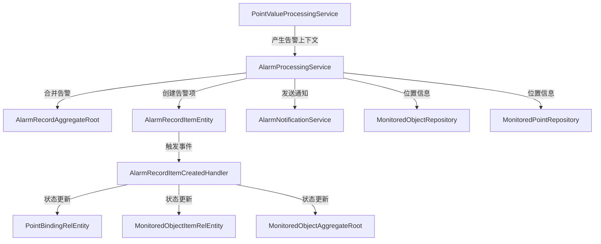
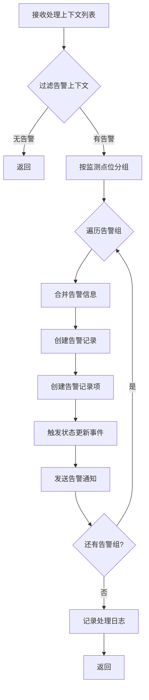
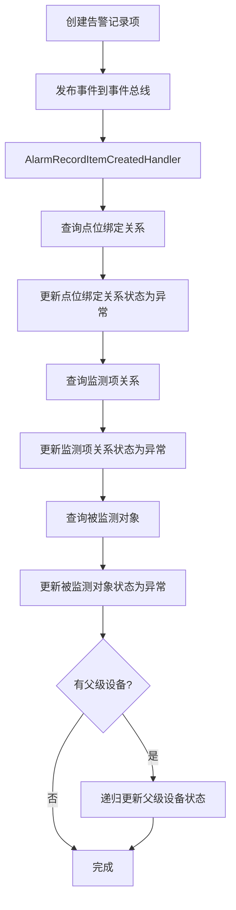

# AlarmProcessingService

## 概述

告警处理服务（AlarmProcessingService），负责告警记录的创建、合并和告警项管理，是告警处理流程的核心服务。

**位置**：`module/ast-intellisub/Ast.IntelliSub.Application/Services/AlarmProcessingService.cs`
**层**：Application
**模块**：ast-intellisub
**依赖注入**：Transient

---

## 架构位置



## 核心职责

1. **告警合并处理** - 将同一监测点位的多个告警上下文合并为一条告警记录
2. **告警记录创建** - 创建告警记录实体并持久化到数据库
3. **告警项管理** - 创建告警记录项并触发状态更新事件
4. **告警通知** - 触发告警通知发送到前端
5. **异常处理** - 确保单个告警组处理失败不影响其他告警组

---

## 主要接口

### 处理合并告警

```csharp
/// <summary>
/// 处理合并告警
/// 将产生告警的上下文按监测点位分组，每组合并为一条告警记录
/// </summary>
/// <param name="processingContexts">点位值处理上下文列表</param>
Task ProcessMergedAlarmsAsync(List<ProcessingContext> processingContexts);
```

**功能说明**：
- 过滤出产生告警的上下文（`IsAlarm == true`）
- 按监测点位ID分组
- 每组合并为一条告警记录
- 创建告警记录项并触发状态更新链
- 单个告警组处理失败不影响其他告警组

**调用链**：
```
PointValueProcessingService.ExecuteStrategiesAsync
  → AlarmProcessingService.ProcessMergedAlarmsAsync
    → AlarmProcessingService.MergeAlarms
    → AlarmProcessingService.CreateAlarmRecordAsync
    → AlarmProcessingService.CreateAlarmRecordItemsAsync
    → AlarmNotificationService.SendAlarmNotificationAsync
    → LocalEventBus.PublishAsync(AlarmRecordItemCreatedEventArgs)
```

### 合并告警

```csharp
/// <summary>
/// 合并多个告警上下文为一个告警记录DTO
/// </summary>
/// <param name="alarmContexts">同一监测点位的告警上下文列表</param>
/// <returns>合并后的告警记录DTO</returns>
AlarmRecordDto MergeAlarms(List<ProcessingContext> alarmContexts);
```

**合并规则**：
- **监测对象**：取第一个上下文的监测对象ID
- **监测点位**：取第一个上下文的监测点位ID
- **告警内容**：合并所有告警项内容，用分号分隔
- **告警级别**：取所有告警项中的最高级别
- **处理状态**：默认为未处理（`AlarmStatusEnum.Unprocessed`）
- **告警时间**：当前时间

### 创建告警记录

```csharp
/// <summary>
/// 直接创建告警记录
/// </summary>
/// <param name="alarmDto">告警记录DTO</param>
/// <returns>创建的告警记录实体</returns>
private Task<AlarmRecordAggregateRoot> CreateAlarmRecordAsync(AlarmRecordDto alarmDto);
```

**功能说明**：
- 验证监测对象和监测点位存在性
- 创建告警记录实体
- 插入数据库
- 发送告警通知

### 创建告警记录项

```csharp
/// <summary>
/// 创建告警记录项
/// </summary>
/// <param name="alarmRecordId">告警记录ID</param>
/// <param name="alarmContexts">告警上下文列表</param>
Task CreateAlarmRecordItemsAsync(Guid alarmRecordId, List<ProcessingContext> alarmContexts);
```

**功能说明**：
- 遍历所有告警上下文和告警信息项
- 为每个告警项创建告警记录项实体
- 插入数据库
- 触发告警记录项创建事件（启动状态更新链）

---

## 数据处理流程

### 告警合并处理流程



### 状态更新链流程



---

## 依赖服务

| 服务 | 用途 |
|------|------|
| `ISqlSugarRepository<AlarmRecordAggregateRoot, Guid>` | 告警记录数据访问 |
| `ISqlSugarRepository<AlarmRecordItemEntity, Guid>` | 告警记录项数据访问 |
| `ISqlSugarRepository<MonitoredObjectAggregateRoot, Guid>` | 监测对象数据访问 |
| `ISqlSugarRepository<MonitoredPointEntity, Guid>` | 监测点位数据访问 |
| `IAlarmNotificationService` | 告警通知服务 |
| `ILocalEventBus` | 本地事件总线 |
| `ILogger<AlarmProcessingService>` | 日志记录 |

---

## 相关实体

### AlarmRecordAggregateRoot

```csharp
public class AlarmRecordAggregateRoot : Entity<Guid>, IAggregateRoot
{
    public Guid MonitoredObjectId { get; set; }          // 被监测对象ID
    public Guid MonitoredPointId { get; set; }           // 监测点位ID
    public string AlarmContent { get; set; }              // 告警内容
    public AlarmLevelEnum AlarmLevel { get; set; }        // 告警级别
    public AlarmStatusEnum ProcessingStatus { get; set; } // 处理状态
    public DateTime AlarmTime { get; set; }              // 告警时间
    public string Remarks { get; set; }                  // 备注
    public DateTime CreationTime { get; set; }           // 创建时间
}
```

### AlarmRecordItemEntity

```csharp
public class AlarmRecordItemEntity : Entity<Guid>
{
    public Guid AlarmRecordId { get; set; }              // 告警记录ID
    public Guid PointBindingRelId { get; set; }          // 点位绑定关系ID
    public Guid AstPointId { get; set; }                 // 属性点位ID
    public Guid BindingItemStrategyRelId { get; set; }   // 绑定项策略关系ID
    public DateTime Ts { get; set; }                     // 数据采集时间戳
    public string GroupId { get; set; }                  // 数据组ID
    public string AlarmContent { get; set; }             // 告警内容
    public AlarmLevelEnum AlarmLevel { get; set; }       // 告警级别
    public string AlarmCategoryName { get; set; }        // 告警类别名称
    public DateTime AlarmTime { get; set; }             // 告警时间
    public DateTime CreationTime { get; set; }          // 创建时间
}
```

---

## 相关枚举

### AlarmLevelEnum

```csharp
public enum AlarmLevelEnum
{
    Normal = 0,      // 正常
    Warning = 1,     // 预警
    Alarm = 2        // 告警
}
```

### AlarmStatusEnum

```csharp
public enum AlarmStatusEnum
{
    Unprocessed = 0,     // 未处理
    Processing = 1,      // 处理中
    Processed = 2,       // 已处理
    Ignored = 3          // 已忽略
}
```

### CommonStatusEnum

```csharp
public enum CommonStatusEnum
{
    Normal = 0,      // 正常
    Abnormal = 1     // 异常
}
```

---

## 告警合并示例

### 输入告警上下文

```csharp
// 同一监测点位的3个告警上下文
var contexts = new List<ProcessingContext>
{
    // 告警1：温度过高
    new ProcessingContext { 
        AlarmInfo = new AlarmInfoDto { 
            AlarmInfoItems = new List<AlarmInfoItemDto> {
                new AlarmInfoItemDto { 
                    Level = AlarmLevelEnum.Alarm, 
                    Content = "温度超过告警阈值80°C" 
                }
            }
        }
    },
    
    // 告警2：温度上升率过快
    new ProcessingContext { 
        AlarmInfo = new AlarmInfoDto { 
            AlarmInfoItems = new List<AlarmInfoItemDto> {
                new AlarmInfoItemDto { 
                    Level = AlarmLevelEnum.Warning, 
                    Content = "温度上升率超过5°C/min" 
                }
            }
        }
    },
    
    // 告警3：三相不平衡
    new ProcessingContext { 
        AlarmInfo = new AlarmInfoDto { 
            AlarmInfoItems = new List<AlarmInfoItemDto> {
                new AlarmInfoItemDto { 
                    Level = AlarmLevelEnum.Warning, 
                    Content = "三相电流不平衡度超过10%" 
                }
            }
        }
    }
};
```

### 合并后的告警记录

```csharp
var mergedAlarm = new AlarmRecordDto
{
    MonitoredObjectId = Guid.Parse("..."),  // 监测对象ID
    MonitoredPointId = Guid.Parse("..."),    // 监测点位ID
    AlarmContent = "温度超过告警阈值80°C;温度上升率超过5°C/min;三相电流不平衡度超过10%",
    AlarmLevel = AlarmLevelEnum.Alarm,       // 取最高级别：告警
    ProcessingStatus = AlarmStatusEnum.Unprocessed,
    AlarmTime = DateTime.Now
};
```

---

## 事件发布

### AlarmRecordItemCreatedEventArgs

```csharp
public class AlarmRecordItemCreatedEventArgs
{
    public AlarmRecordItemDto AlarmRecordItem { get; set; }
}
```

**事件处理流程**：
1. 创建告警记录项后发布事件
2. `AlarmRecordItemCreatedHandler` 订阅事件
3. 更新点位绑定关系状态为异常
4. 更新监测项关系状态为异常
5. 更新被监测对象状态为异常
6. 递归更新父级设备状态

---

## 性能优化

### 1. 分组处理

- 按监测点位分组，减少数据库操作次数
- 每个告警组独立处理，失败不影响其他组

### 2. 异常隔离

- 单个告警项创建失败继续处理其他告警项
- 单个告警组处理失败继续处理其他告警组
- 确保告警处理流程的稳定性

### 3. 性能监控

- 记录处理耗时
- 处理时间超过5秒记录警告
- 可能存在数据库锁等待

### 4. 数据库优化

- 一次性查询监测对象和点位信息
- 批量插入告警记录项
- 避免N+1查询问题

---

## 错误处理

### 异常处理策略

```csharp
try
{
    // 处理告警组
    var mergedAlarm = MergeAlarms(groupAlarmContexts);
    await CreateAlarmRecordAsync(mergedAlarm);
    await CreateAlarmRecordItemsAsync(alarmRecord.Id, groupAlarmContexts);
}
catch (Exception ex)
{
    // 记录错误但不抛出异常
    _logger.LogError(ex, $"处理告警组失败: 监测点位ID {group.Key}");
    // 继续处理其他告警组
}
```

### 常见异常

| 异常 | 原因 | 处理 |
|------|------|------|
| InvalidOperationException | 监测对象或点位不存在 | 记录错误日志，跳过当前告警组 |
| DbUpdateConcurrencyException | 数据库并发冲突 | 记录错误日志，跳过当前告警组 |
| Exception | 其他未预期异常 | 记录错误日志，跳过当前告警组 |

---

## 日志记录

### 调试日志

```csharp
_logger.LogDebug($"[告警合并] 开始处理 {totalGroups} 个监测点位的告警");
_logger.LogDebug($"成功处理告警组: 监测点位ID {group.Key}，包含 {groupAlarmContexts.Count} 个上下文");
_logger.LogDebug($"成功创建告警记录项: 告警记录ID={alarmRecordId}, 策略ID={strategyId}");
```

### 信息日志

```csharp
_logger.LogInformation($"[告警合并] 成功处理 {processedGroups}/{totalGroups} 个监测点位的告警，耗时 {duration:F0}ms");
_logger.LogInformation($"告警记录项创建完成: 告警记录ID {alarmRecordId}，总共 {totalItems} 项，成功 {successItems} 项");
```

### 警告日志

```csharp
_logger.LogWarning($"合并告警失败，监测点位ID: {group.Key}");
_logger.LogWarning($"告警记录 {alarmRecordId} 的所有告警项都创建失败，请检查策略配置和绑定关系");
_logger.LogWarning($"[性能警告] 告警合并处理耗时过长: {duration:F0}ms");
```

### 错误日志

```csharp
_logger.LogError(ex, $"处理告警组失败: 监测点位ID {group.Key}");
_logger.LogError(ex, $"创建单个告警记录项失败: 告警记录ID {alarmRecordId}");
_logger.LogError(ex, $"处理合并告警失败，输入上下文数量: {processingContexts?.Count ?? 0}");
```

---

## 配置项

### appsettings.json

```json
{
  "AlarmProcessing": {
    "MaxProcessingTimeMs": 5000,
    "EnablePerformanceLogging": true,
    "LogLevel": "Debug"
  }
}
```

---

## 注意事项

### 数据一致性

- 创建告警记录前验证监测对象和点位存在性
- 告警记录项必须关联到有效的告警记录
- 状态更新链采用事件驱动，确保最终一致性

### 性能考虑

- 大量告警时分组处理，避免一次性加载所有数据
- 监控处理耗时，及时发现性能问题
- 数据库锁等待可能导致处理时间过长

### 错误处理

- 单个告警组失败不影响其他告警组
- 记录详细的错误日志供排查
- 不抛出异常，确保数据入库流程不受影响

### 告警级别

- 告警级别取最高值（Alarm > Warning > Normal）
- 只有预警和告警级别才创建告警记录
- 正常级别不产生告警记录

---

## 相关文档

- [[AlarmRecordService]] - 告警记录服务
- [[AlarmNotificationService]] - 告警通知服务
- [[AlarmRecordItemCreatedHandler]] - 告警记录项创建事件处理器
- [[PointValueProcessingService]] - 点位值处理服务
- [[ProcessingContext]] - 处理上下文
- [[AlarmInfoDto]] - 告警信息DTO
- [[告警处理流程]] - 完整告警处理流程

---

**状态**：🟡 学习中
