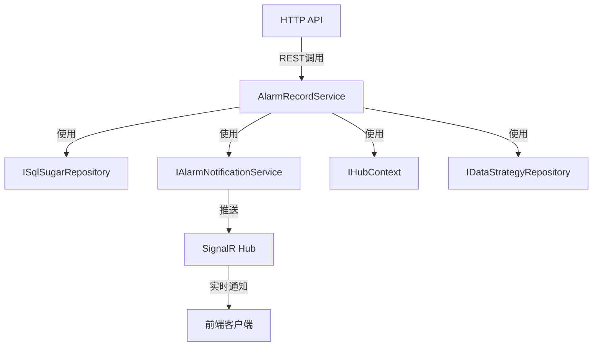

# AlarmRecordService

## 概述

告警记录服务，负责告警记录的创建、查询、统计和通知推送。

**位置**：`module/ast-intellisub/Ast.IntelliSub.Application/Services/AlarmRecordService.cs`
**层**：Application
**模块**：ast-intellisub
**依赖注入**：Scoped

---

## 架构位置



## 核心职责

1. 告警记录的 CRUD 操作
2. 告警统计（按级别、状态、设备、趋势）
3. 告警详情查询（含位置信息）
4. 实时告警推送
5. 告警处理状态管理
6. 告警与监测点位的关联

## 主要接口

### 基础 CRUD

```csharp
/// <summary>
/// 创建告警记录
/// </summary>
Task<AlarmRecordDto> CreateAsync(AlarmRecordDto input);

/// <summary>
/// 更新告警记录
/// </summary>
Task<AlarmRecordDto> UpdateAsync(Guid id, AlarmRecordUpdateDto input);

/// <summary>
/// 删除告警记录
/// </summary>
Task DeleteAsync(Guid id);

/// <summary>
/// 获取告警详情
/// </summary>
Task<AlarmDetailDto> GetAlarmDetail(Guid id);
```

### 统计接口

```csharp
/// <summary>
/// 按告警级别统计
/// </summary>
Task<List<AlarmLevelStatisticsDto>> GetStatisticsByLevelAsync(AlarmStatisticsByLevelRequestDto input);

/// <summary>
/// 按处理状态统计
/// </summary>
Task<List<AlarmStatusStatisticsDto>> GetStatisticsByStatusAsync(AlarmStatisticsByStatusRequestDto input);

/// <summary>
/// 获取告警设备TOP统计
/// </summary>
Task<List<AlarmTopDevicesDto>> GetTopDevicesAsync(AlarmTopDevicesRequestDto input);

/// <summary>
/// 获取告警趋势统计
/// </summary>
Task<List<AlarmTrendDto>> GetTrendAsync(AlarmTrendRequestDto input);
```

---

## 数据处理流程

### 创建告警记录

```
告警触发
  ↓
[验证监测点位]
  ↓
[查询数据策略]
  ↓
[获取数据值]
  ↓
[判断告警条件]
  ↓
[创建告警记录]
  ↓
[保存告警记录]
  ↓
[发送告警通知]
  ↓
[SignalR 推送到前端]
```

### 告警通知流程

```
告警创建
  ↓
[获取未处理告警数量]
  ↓
[获取监测对象位置信息]
  ↓
[获取点位位置信息]
  ↓
[构建通知数据]
  ↓
[通过 SignalR Hub 推送]
  ↓
[前端接收并显示]
```

---

## 依赖服务

| 服务 | 用途 |
|------|------|
| `ISqlSugarRepository<AlarmRecordAggregateRoot, Guid>` | 告警记录数据访问 |
| `ISqlSugarRepository<MonitoredObjectAggregateRoot, Guid>` | 监测对象数据访问 |
| `ISqlSugarRepository<MonitoredPointEntity, Guid>` | 监测点位数据访问 |
| `IAlarmNotificationService` | 告警通知服务 |
| `IHubContext<AlarmNotificationHub>` | SignalR Hub 上下文 |
| `IPointDataRepository` | 点位数据访问 |

---

## 相关实体

### AlarmRecordAggregateRoot

```csharp
public class AlarmRecordAggregateRoot : FullAuditedAggregateRoot<Guid>
{
    public Guid? MonitoredObjectId { get; set; }
    public Guid? MonitoredPointId { get; set; }
    public Guid? MonitoredItemId { get; set; }
    public AlarmLevelEnum Level { get; set; }
    public AlarmStatusEnum ProcessingStatus { get; set; }
    public string? Message { get; set; }
    public DateTime? AlarmTime { get; set; }
    public DateTime? ProcessedTime { get; set; }
    public string? Processor { get; set; }
}
```

### AlarmLevelEnum

```csharp
public enum AlarmLevelEnum
{
    Info = 0,       // 提示
    Warning = 1,    // 警告
    Critical = 2,   // 严重
    Emergency = 3   // 紧急
}
```

### AlarmStatusEnum

```csharp
public enum AlarmStatusEnum
{
    Unprocessed = 0,    // 未处理
    Processing = 1,     // 处理中
    Processed = 2,      // 已处理
    Ignored = 3         // 已忽略
}
```

---

## 相关 DTO

### AlarmRecordDto

```csharp
public class AlarmRecordDto
{
    public Guid Id { get; set; }
    public Guid? MonitoredObjectId { get; set; }
    public Guid? MonitoredPointId { get; set; }
    public AlarmLevelEnum Level { get; set; }
    public AlarmStatusEnum ProcessingStatus { get; set; }
    public string? Message { get; set; }
    public DateTime? AlarmTime { get; set; }
    public DateTime? ProcessedTime { get; set; }
}
```

### AlarmDetailDto

```csharp
public class AlarmDetailDto : AlarmRecordDto
{
    public MonitoredObjectDto? MonitoredObject { get; set; }
    public MonitoredPointDto? MonitoredPoint { get; set; }
    public MonitoredItemDto? MonitoredItem { get; set; }
    public List<LocationInfoDto> Locations { get; set; }
}
```

### AlarmTrendDto

```csharp
public class AlarmTrendDto
{
    public DateTime Date { get; set; }
    public List<AlarmLevelCount> Levels { get; set; }
    public int Total { get; set; }
}
```

---

## 统计功能

### 按级别统计

```csharp
// 返回示例
[
  { Level: "Critical", Count: 5 },
  { Level: "Warning", Count: 15 },
  { Level: "Info", Count: 30 }
]
```

### 按状态统计

```csharp
// 返回示例
[
  { Status: "Unprocessed", Count: 10 },
  { Status: "Processing", Count: 5 },
  { Status: "Processed", Count: 35 }
]
```

### 趋势统计

- 按日期分组统计
- 按告警级别细分
- 支持时间范围查询

---

## 配置项

### AlarmHubOptions

```json
{
  "AlarmHub": {
    "RequireAuthentication": true,
    "EnablePersistentConnection": true
  }
}
```

---

## 注意事项

### 告警去重

- 同一点位短时间内重复告警会进行合并
- 使用告警级别、点位ID、时间作为去重依据

### 告警通知

- 所有告警通过 SignalR 实时推送
- 支持多个客户端同时接收
- 未认证客户端可配置连接权限

### 性能优化

- 统计查询使用聚合函数减少数据传输
- 分页查询告警列表
- 位置信息按需加载

### 数据清理

- 支持定期归档历史告警记录
- 保留近期告警用于快速查询

---

## 连续告警机制

项目支持"连续五次告警才告警"的机制：

```csharp
// 检查是否连续达到阈值
if (alarmCount >= 5)
{
    // 触发正式告警
    await CreateAlarmRecordAsync(point, level);
}
```

---

## 相关文档

- [[AlarmNotificationService]] - 告警通知服务
- [[AlarmCategoryService]] - 告警分类服务
- [[AlarmProcessingService]] - 告警处理服务
- [[设备告警流程]] - 完整告警处理流程

---

**状态**：🟡 学习中
