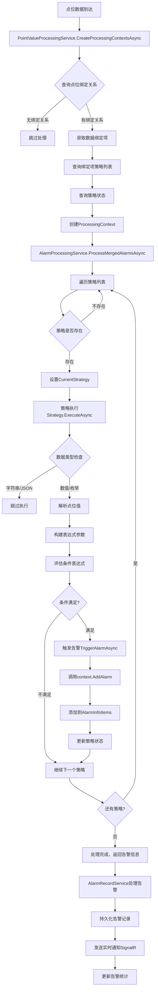

# 告警策略系统总览

## 概述

告警策略系统是智能变电站监控系统的核心组件，负责实时监测点位数据，根据预定义的规则和条件触发告警。该系统采用策略模式设计，支持多种告警策略类型，通过灵活的条件表达式实现复杂的告警逻辑。

**核心价值：**
- **实时监测**：持续监控传感器数据，及时发现异常情况
- **灵活配置**：支持多种条件表达式和告警级别
- **分级告警**：区分预警和告警，实现分级响应
- **状态持久化**：维护策略执行状态，支持历史数据对比
- **可扩展性**：基于策略模式，易于添加新的告警策略类型

## 策略类型

### 1. 单条件告警策略 (ConditionAlarmStrategy)

**适用场景：** 简单阈值判断、单一条件告警

**核心特性：**
- 基于单一条件表达式进行告警判断
- 支持数值和枚举类型点位
- 支持历史基准对比（FirstValue）
- 支持多点位联合判断

**配置选项：**

```csharp
public class ConditionAlarmOptions
{
    /// <summary>
    /// 告警条件表达式（支持$前缀参数）
    /// 示例："$value > 80"
    /// </summary>
    public string Condition { get; set; }

    /// <summary>
    /// 告警内容模板
    /// 示例："{PropertyName}数值超标，当前值{Value}"
    /// </summary>
    public string Template { get; set; } = "{PropertyName}数值超标";

    /// <summary>
    /// 告警级别（正常/预警/告警）
    /// </summary>
    public AlarmLevelEnum AlarmLevel { get; set; } = AlarmLevelEnum.Warning;

    /// <summary>
    /// 告警类别名称（支持{EnumName}占位符）
    /// </summary>
    public string? AlarmCategoryName { get; set; }
}
```

**使用示例：**

```json
{
  "strategyType": "ConditionAlarmStrategy",
  "parameters": {
    "condition": "$value > 80",
    "template": "温度过高告警，当前值{Value}℃",
    "alarmLevel": 2,
    "alarmCategoryName": "温度告警"
  }
}
```

### 2. 多条件告警策略 (MultiConditionAlarmStrategy)

**适用场景：** 需要区分预警和告警级别的复杂告警场景

**核心特性：**
- 分别配置预警和告警条件
- 支持不同级别使用不同的告警模板
- 灵活的阈值设置，实现梯度告警

**配置选项：**

```csharp
public class MultiConditionAlarmOptions
{
    /// <summary>
    /// 预警条件表达式
    /// 示例："$value > 60"
    /// </summary>
    public string? WarningCondition { get; set; }

    /// <summary>
    /// 告警条件表达式
    /// 示例："$value > 80"
    /// </summary>
    public string? AlarmCondition { get; set; }

    /// <summary>
    /// 预警内容模板
    /// </summary>
    public string WarningTemplate { get; set; } = "{PropertyName}数值预警";

    /// <summary>
    /// 告警内容模板
    /// </summary>
    public string AlarmTemplate { get; set; } = "{PropertyName}数值告警";

    /// <summary>
    /// 告警类别名称
    /// </summary>
    public string? AlarmCategoryName { get; set; }
}
```

**使用示例：**

```json
{
  "strategyType": "MultiConditionAlarmStrategy",
  "parameters": {
    "warningCondition": "$value > 60",
    "alarmCondition": "$value > 80",
    "warningTemplate": "温度预警，当前值{Value}℃",
    "alarmTemplate": "温度告警，当前值{Value}℃",
    "alarmCategoryName": "温度告警"
  }
}
```

### 3. 温升速率告警策略 (TemperatureRiseRateAlarmStrategy)

**适用场景：** 监测温度变化速率，预防热失控

**核心特性：**
- 计算温度变化速率（℃/分钟）
- 基于历史数据计算平均温升
- 可配置温升速率阈值

**使用示例：**

```json
{
  "strategyType": "TemperatureRiseRateAlarmStrategy",
  "parameters": {
    "riseRateThreshold": 5.0,
    "historyDataMinutes": 10,
    "template": "温升速率过快，{RiseRate}℃/分钟"
  }
}
```

### 4. 三相不平衡告警策略 (ThreePhaseUnbalanceAlarmStrategy)

**适用场景：** 电力系统三相平衡监测

**核心特性：**
- 计算三相不平衡度
- 支持多种不平衡计算方法
- 适用于电力设备健康监测

### 5. 声纹告警策略 (VoiceprintAlarmStrategy)

**适用场景：** 基于声纹分析的设备故障告警

**核心特性：**
- 集成声纹识别结果
- 支持多种告警类型
- 可配置告警阈值

## 核心组件

### 1. AlarmConditionEvaluationManager - 告警条件评估管理器

**职责：** 条件表达式解析和评估

**核心功能：**
- 从条件表达式中提取参数名称
- 构建表达式参数字典
- 使用 DynamicExpresso 进行表达式求值
- 支持多种数据类型（数值、枚举）

**关键方法：**

```csharp
/// 从条件表达式中提取参数名称
public HashSet<string> ExtractParameterNames(string condition)

/// 构建表达式参数
public async Task<Dictionary<string, object>> BuildParametersAsync(
    ProcessingContext context, 
    string condition, 
    FirstValueCacheRef firstValueCache)

/// 评估条件表达式
public async Task<bool> EvaluateConditionAsync(
    string condition, 
    Dictionary<string, object> parameters)
```

**性能优化：**
- 使用静态单例 Interpreter 实例，所有实例共享同一个表达式树缓存
- DynamicExpresso.Interpreter 是线程安全的，可在多线程环境中共享

### 2. DataStrategyService - 数据策略服务

**职责：** 管理数据处理和告警策略的生命周期

**核心功能：**
- 策略的创建、更新、删除
- 策略配置管理
- 策略类名唯一性验证

**API 端点：**
- `POST /api/app/ast-intellisub/data-strategy` - 创建策略
- `PUT /api/app/ast-intellisub/data-strategy/{id}` - 更新策略
- `DELETE /api/app/ast-intellisub/data-strategy/{id}` - 删除策略
- `GET /api/app/ast-intellisub/data-strategy` - 获取策略列表

### 3. StrategyStateService - 策略状态服务

**职责：** 管理策略执行状态的持久化和查询

**核心功能：**
- 策略状态的存储和检索
- 批量获取策略状态
- 状态清理功能

**API 端点：**
- `GET /api/app/ast-intellisub/strategy-state` - 获取策略状态列表
- `GET /api/app/ast-intellisub/strategy-state/{id}` - 获取单个策略状态
- `PUT /api/app/ast-intellisub/strategy-state/clear-all` - 清除所有策略状态
- `PUT /api/app/ast-intellisub/strategy-state/clear-by-binding-rel-ids` - 按绑定关系清除状态

**状态信息：**

```csharp
public class StrategyStateEntity
{
    public Guid Id { get; set; }
    public Guid BindingItemStrategyRelId { get; set; }
    public Guid PointBindingRelId { get; set; }
    public string StrategyState { get; set; }  // JSON格式的策略状态
    public DateTime CreationTime { get; set; }
    public DateTime? LastUpdateTime { get; set; }
}
```

### 4. BindingItemStrategyRelService - 绑定项策略关联服务

**职责：** 管理数据绑定项与策略的关联关系

**核心功能：**
- 绑定项与策略的关联管理
- 关联关系的创建、更新、删除
- 支持一个绑定项关联多个策略

**API 端点：**
- `POST /api/app/ast-intellisub/binding-item-strategy-rel` - 创建关联
- `PUT /api/app/ast-intellisub/binding-item-strategy-rel/{id}` - 更新关联
- `DELETE /api/app/ast-intellisub/binding-item-strategy-rel/{id}` - 删除关联
- `GET /api/app/ast-intellisub/binding-item-strategy-rel` - 获取关联列表

### 5. AlarmCategoryService - 告警类别服务

**职责：** 管理告警类别，实现告警分类

**核心功能：**
- 告警类别的创建和管理
- 支持按类型查询告警类别
- 告警类别名称唯一性验证

**API 端点：**
- `POST /api/app/ast-intellisub/alarm-category` - 创建告警类别
- `PUT /api/app/ast-intellisub/alarm-category/{id}` - 更新告警类别
- `GET /api/app/ast-intellisub/alarm-category/by-type?type={type}` - 按类型查询
- `GET /api/app/ast-intellisub/alarm-category/all` - 获取所有类别

### 6. AlarmRecordService - 告警记录服务

**职责：** 告警记录的创建、查询和管理

**核心功能：**
- 告警记录的持久化
- 告警记录的多维度查询
- 告警统计功能
- 实时告警推送（SignalR）

**API 端点：**
- `POST /api/app/ast-intellisub/alarm-record` - 创建告警记录
- `GET /api/app/ast-intellisub/alarm-record` - 获取告警记录列表
- `PUT /api/app/ast-intellisub/alarm-record/{id}` - 更新告警记录
- `GET /api/app/ast-intellisub/alarm-record/statistics` - 告警统计

### 7. PointValueProcessingService - 点位值处理服务

**职责：** 协调整个点位数据处理流程

**核心功能：**
- 创建处理上下文（ProcessingContext）
- 获取绑定项的策略列表
- 协调策略执行
- 收集聚合告警信息

## 告警处理流程

### 完整流程图



### 处理上下文 (ProcessingContext)

**核心数据结构：**

```csharp
public class ProcessingContext
{
    /// <summary>
    /// 当前点位值
    /// </summary>
    public MqPointValueItemDto PointVal { get; set; }

    /// <summary>
    /// 点位绑定关系
    /// </summary>
    public PointBindingRelDto PointBindingRel { get; set; }

    /// <summary>
    /// 数据绑定项
    /// </summary>
    public DataBindingItemDto DataBindingItem { get; set; }

    /// <summary>
    /// 监控对象项关系
    /// </summary>
    public MonitoredObjectItemRelDto ItemRel { get; set; }

    /// <summary>
    /// 策略列表
    /// </summary>
    public List<BIStrategyRelDto> Strategies { get; set; }

    /// <summary>
    /// 批量点位值列表（用于多点位联合判断）
    /// </summary>
    public List<MqPointValueItemDto> BatchPointValList { get; set; }

    /// <summary>
    /// 当前执行的策略
    /// </summary>
    public BIStrategyRelDto CurrentStrategy { get; set; }

    /// <summary>
    /// 告警信息
    /// </summary>
    public AlarmInfoDto AlarmInfo { get; set; }

    /// <summary>
    /// 数据丢弃标志
    /// </summary>
    public bool IsDiscarded { get; set; }

    /// <summary>
    /// 丢弃原因
    /// </summary>
    public string DiscardReason { get; set; }

    /// <summary>
    /// 添加告警信息
    /// </summary>
    public void AddAlarm(AlarmLevelEnum level, string content, string? alarmCategoryName = null)
}
```

## 策略配置示例

### 示例1：简单温度告警

```json
{
  "name": "主变压器温度告警",
  "className": "ConditionAlarmStrategy",
  "strategyType": "Alarm",
  "description": "监测主变压器温度，超过80度触发告警",
  "parameters": {
    "condition": "$value > 80",
    "template": "主变压器温度过高，当前值{Value}℃，请及时检查",
    "alarmLevel": 2,
    "alarmCategoryName": "温度告警"
  }
}
```

### 示例2：梯度温度告警

```json
{
  "name": "主变压器梯度温度告警",
  "className": "MultiConditionAlarmStrategy",
  "strategyType": "Alarm",
  "description": "温度超过60度预警，超过80度告警",
  "parameters": {
    "warningCondition": "$value > 60",
    "alarmCondition": "$value > 80",
    "warningTemplate": "主变压器温度预警，当前值{Value}℃",
    "alarmTemplate": "主变压器温度告警，当前值{Value}℃",
    "alarmCategoryName": "温度告警"
  }
}
```

### 示例3：相对变化告警

```json
{
  "name": "相对基准值告警",
  "className": "ConditionAlarmStrategy",
  "strategyType": "Alarm",
  "description": "当前值超过首次值的5倍时触发告警",
  "parameters": {
    "condition": "$value > $firstValue * 5",
    "template": "{PropertyName}数值异常增长，当前值{Value}，首次值{FirstValue}",
    "alarmLevel": 2,
    "alarmCategoryName": "异常增长告警"
  }
}
```

### 示例4：多点位联合告警

```json
{
  "name": "多点位温度联合告警",
  "className": "ConditionAlarmStrategy",
  "strategyType": "Alarm",
  "description": "多个温度点位同时超过阈值时触发告警",
  "parameters": {
    "condition": "$jxa_temperature > 80 && $jxb_temperature > 80",
    "template": "多个温度点位同时超标，JXA温度{Value}℃，JXB温度{jxb_temperature}℃",
    "alarmLevel": 2,
    "alarmCategoryName": "多点温度告警"
  }
}
```

### 示例5：枚举状态告警

```json
{
  "name": "开关状态异常告警",
  "className": "ConditionAlarmStrategy",
  "strategyType": "Alarm",
  "description": "开关状态异常时触发告警",
  "parameters": {
    "condition": "$value != 1",
    "template": "{PropertyName}状态异常，状态为{EnumName}",
    "alarmLevel": 2,
    "alarmCategoryName": "状态告警-{EnumName}"
  }
}
```

### 示例6：温升速率告警

```json
{
  "name": "主变压器温升速率告警",
  "className": "TemperatureRiseRateAlarmStrategy",
  "strategyType": "Alarm",
  "description": "温升速率超过5℃/分钟时触发告警",
  "parameters": {
    "riseRateThreshold": 5.0,
    "historyDataMinutes": 10,
    "minHistoryCount": 3,
    "template": "主变压器温升速率过快，{RiseRate}℃/分钟，请检查冷却系统"
  }
}
```

## 条件表达式语法

### 支持的参数类型

| 参数 | 类型 | 说明 | 示例 |
|------|------|------|------|
| `$value` | double | 当前点位的数值 | `$value > 80` |
| `$firstValue` | double? | 当前点位在历史数据中的第一个值 | `$value > $firstValue * 5` |
| `$属性名称` | double | BatchPointValList中其他点位的属性值 | `$jxa_temperature > 100 && $jxb_temperature > 200` |

### 支持的运算符

| 类别 | 运算符 | 说明 | 示例 |
|------|--------|------|------|
| 比较运算 | `>`, `<`, `>=`, `<=`, `==`, `!=` | 数值比较 | `$value > 80` |
| 逻辑运算 | `&&`, `\|\|`, `!` | 逻辑组合 | `$value > 80 && $value < 100` |
| 算术运算 | `+`, `-`, `*`, `/`, `%` | 数学运算 | `$value > $firstValue * 1.5` |

### 模板占位符

| 占位符 | 说明 | 示例 |
|--------|------|------|
| `{Value}` | 当前点位值 | `"当前值{Value}"` |
| `{PropertyName}` | 属性名称 | `"{PropertyName}数值超标"` |
| `{ShortName}` | 属性简称 | `"{ShortName}异常"` |
| `{AlarmLevel}` | 告警级别 | `"告警级别：{AlarmLevel}"` |
| `{Condition}` | 条件表达式 | `"触发条件：{Condition}"` |
| `{FirstValue}` | 首次值（如果使用） | `"首次值{FirstValue}"` |
| `{EnumName}` | 枚举名称（仅枚举类型） | `"状态为{EnumName}"` |

## 策略执行状态

### 单条件告警策略状态

```csharp
public class ConditionAlarmState
{
    /// <summary>
    /// 告警触发总次数
    /// </summary>
    public int AlarmCount { get; set; } = 0;

    /// <summary>
    /// 缓存的首次值（用于FirstValue参数）
    /// </summary>
    public double? FirstValue { get; set; } = null;
}
```

### 多条件告警策略状态

```csharp
public class MultiConditionAlarmState
{
    /// <summary>
    /// 预警触发总次数
    /// </summary>
    public int WarningCount { get; set; } = 0;

    /// <summary>
    /// 告警触发总次数
    /// </summary>
    public int AlarmCount { get; set; } = 0;

    /// <summary>
    /// 缓存的首次值（用于FirstValue参数）
    /// </summary>
    public double? FirstValue { get; set; } = null;
}
```

### 温升速率告警策略状态

```csharp
public class TemperatureRiseRateAlarmState
{
    /// <summary>
    /// 当前温升速率（℃/分钟）
    /// </summary>
    public double CurrentRiseRate { get; set; } = 0;

    /// <summary>
    /// 告警触发总次数
    /// </summary>
    public int AlarmCount { get; set; } = 0;

    /// <summary>
    /// 最后更新时间
    /// </summary>
    public DateTime LastUpdateTime { get; set; }

    /// <summary>
    /// 历史温度数据（用于计算温升速率）
    /// </summary>
    public List<TemperatureRecord> HistoryData { get; set; } = new List<TemperatureRecord>();
}
```

## 告警级别

```csharp
public enum AlarmLevelEnum
{
    /// <summary>
    /// 正常
    /// </summary>
    Normal = 0,

    /// <summary>
    /// 预警
    /// </summary>
    Warning = 1,

    /// <summary>
    /// 告警
    /// </summary>
    Alarm = 2
}
```

## 性能优化

### 1. 表达式树缓存

使用静态单例 `Interpreter` 实例，所有策略实例共享同一个表达式树缓存：

```csharp
private static readonly Interpreter _sharedInterpreter = new Interpreter();
```

**优势：**
- 避免重复编译相同的条件表达式
- 提高表达式评估性能
- 线程安全，可在多线程环境中使用

### 2. 首次值缓存

使用 `FirstValueCacheRef` 结构体缓存首次值，避免重复查询数据库：

```csharp
public struct FirstValueCacheRef
{
    public double? Value;
}
```

### 3. 批量查询

策略状态服务支持批量查询，减少数据库访问次数：

```csharp
public async Task<List<StrategyStateBatchResultDto>> GetBatchByBindingRelationAsync(
    List<Guid> bindingItemStrategyRelIds, 
    Guid pointBindingRelId)
```

## 相关文档

- [[DataStrategyService]] - 数据策略管理服务
- [[StrategyStateService]] - 策略状态管理服务
- [[AlarmCategoryService]] - 告警类别管理服务
- [[AlarmRecordService]] - 告警记录管理服务
- [[AlarmConditionEvaluationManager]] - 告警条件评估管理器
- [[PointValueProcessingService]] - 点位值处理服务

## 附录

### 完整的策略配置示例

```json
{
  "name": "主变压器综合告警策略",
  "className": "MultiConditionAlarmStrategy",
  "strategyType": "Alarm",
  "description": "综合监测主变压器温度和温升速率",
  "parameters": {
    "warningCondition": "$value > 60 || $riseRate > 3",
    "alarmCondition": "$value > 80 || $riseRate > 5",
    "warningTemplate": "主变压器预警：温度{Value}℃，温升速率{RiseRate}℃/分钟",
    "alarmTemplate": "主变压器告警：温度{Value}℃，温升速率{RiseRate}℃/分钟",
    "alarmCategoryName": "主变压器告警"
  }
}
```

### 告警信息结构

```csharp
public class AlarmInfoDto
{
    public Guid PointBindingRelId { get; set; }
    public string Property { get; set; }
    public List<AlarmInfoItemDto> AlarmInfoItems { get; set; } = new();
}

public class AlarmInfoItemDto
{
    public AlarmLevelEnum Level { get; set; }
    public string Content { get; set; }
    public Guid DataStrategyId { get; set; }
    public Guid BindingItemStrategyRelId { get; set; }
    public Guid PointBindingRelId { get; set; }
    public Guid AstPointId { get; set; }
    public DateTime Ts { get; set; }
    public string? GroupId { get; set; }
    public string? AlarmCategoryName { get; set; }
}
```

---

**文档版本：** v1.0  
**最后更新：** 2026-06-03  
**维护者：** IntelliSubstation Team
