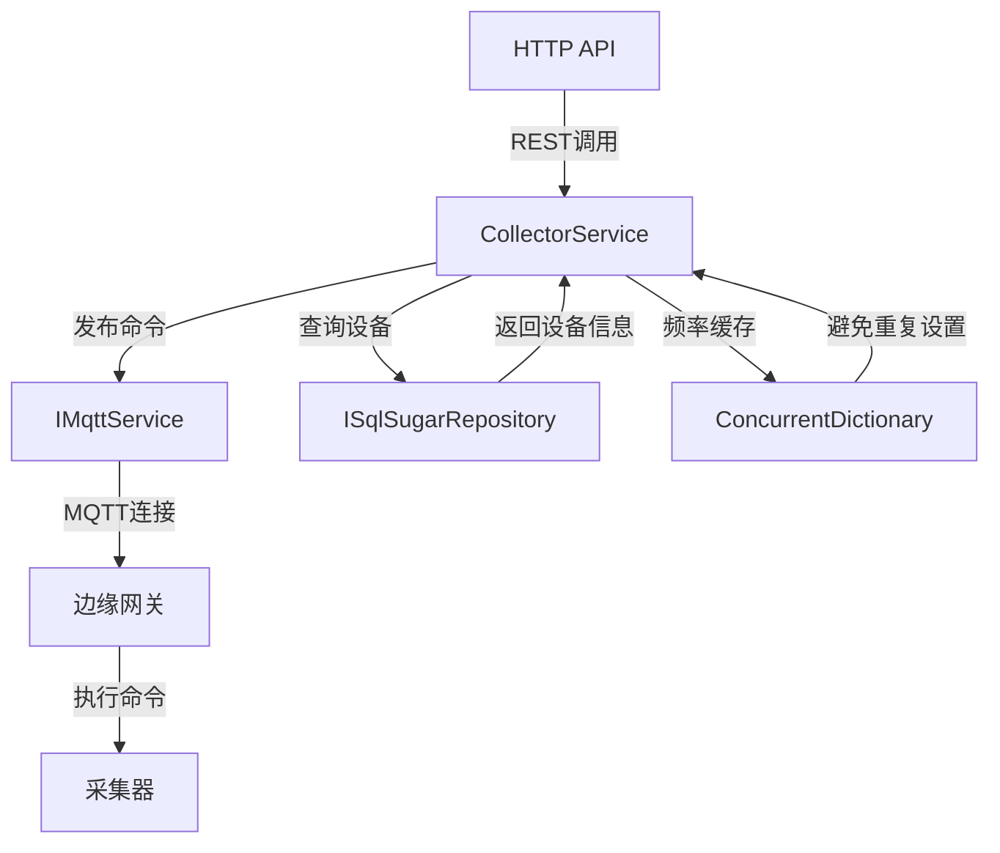
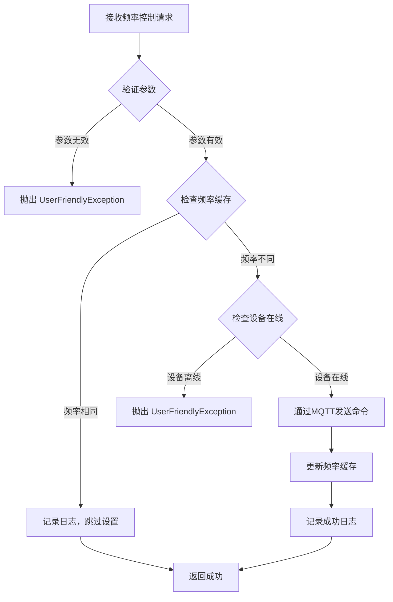
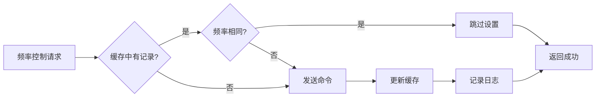
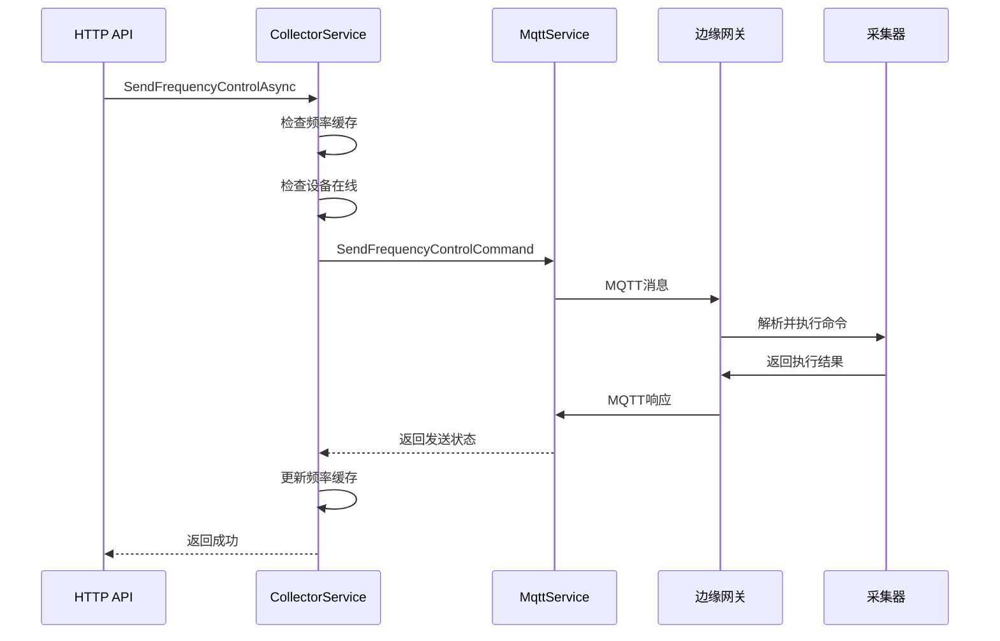

# CollectorService

## 概述

采集器控制服务（CollectorService），负责与边缘网关通信，发送采集频率控制命令和检查设备在线状态，包含防抖动机制避免重复设置相同频率。

**位置**：`module/ast-intellisub/Ast.IntelliSub.Application/Services/CollectorService.cs`
**层**：Application
**模块**：ast-intellisub
**依赖注入**：Singleton

---

## 架构位置



## 核心职责

1. **发送采集频率控制命令** - 向边缘网关发送频率调整命令
2. **检查设备在线状态** - 验证设备是否在线可控制
3. **防抖动机制** - 缓存最后设置的频率，避免重复设置
4. **MQTT 消息发布** - 通过 MQTT 服务与网关通信
5. **网关通信管理** - 管理与边缘网关的通信

---

## 主要接口

### 发送频率控制命令

```csharp
/// <summary>
/// 发送采集频率控制命令
/// </summary>
/// <param name="deviceId">设备ID</param>
/// <param name="sensorKey">传感器标识</param>
/// <param name="frequency">采集频率（毫秒）</param>
/// <returns>是否发送成功</returns>
Task<bool> SendFrequencyControlAsync(string deviceId, string sensorKey, int frequency);
```

**功能说明**：
- 验证设备ID、传感器标识和频率参数
- 检查设备是否在线
- 使用频率缓存避免重复设置相同频率
- 通过 MQTT 发送控制命令到网关
- 更新频率缓存

**调用链**：
```
Controller API
  → CollectorService.SendFrequencyControlAsync
    → CollectorService.IsDeviceOnlineAsync
    → IMqttService.SendFrequencyControlCommand
    → ConcurrentDictionary.Set
```

### 检查设备在线状态

```csharp
/// <summary>
/// 检查设备是否在线
/// </summary>
/// <param name="deviceId">设备ID</param>
/// <returns>是否在线</returns>
Task<bool> IsDeviceOnlineAsync(string deviceId);
```

**功能说明**：
- 验证设备ID参数
- 检查设备在线状态（当前实现返回 true，待完善）
- 记录调试日志

---

## 数据处理流程

### 发送频率控制命令流程



### 频率缓存机制



---

## 依赖服务

| 服务 | 用途 |
|------|------|
| `ILogger<CollectorService>` | 日志记录 |
| `IMqttService` | MQTT 服务 |
| `IServiceScopeFactory` | 服务作用域工厂（用于访问 Repository） |

---

## 核心特性

### 频率缓存（防抖动机制）

**目的**：避免重复设置相同频率，减少不必要的 MQTT 消息发送

**实现**：
```csharp
/// <summary>
/// 传感器最后设置的频率缓存
/// Key格式：{deviceId}:{sensorKey}
/// </summary>
private readonly ConcurrentDictionary<string, int> _lastSetFrequency = new();
```

**缓存键格式**：`{deviceId}:{sensorKey}`

**缓存逻辑**：
1. 检查缓存中是否存在当前设备的频率设置
2. 如果缓存中的频率与目标频率相同，跳过设置
3. 如果频率不同或缓存中没有记录，发送命令并更新缓存

**优势**：
- 减少 MQTT 消息发送次数
- 避免网关频繁接收相同命令
- 提高系统响应速度

### 服务作用域管理

**原因**：作为单例服务，需要使用作用域来访问瞬态 Repository

**实现**：
```csharp
public CollectorService(
    ILogger<CollectorService> logger,
    IMqttService mqttService,
    IServiceScopeFactory serviceScopeFactory)  // 注入 ScopeFactory
{
    _logger = logger;
    _mqttService = mqttService;
    _serviceScopeFactory = serviceScopeFactory;
}

// 使用 Scope 访问 Repository
using var scope = _serviceScopeFactory.CreateScope();
var deviceRepository = scope.ServiceProvider
    .GetRequiredService<ISqlSugarRepository<DeviceEntity, string>>();
```

---

## 相关实体

### DeviceEntity

```csharp
public class DeviceEntity : Entity<string>
{
    public string Name { get; set; }                 // 设备名称
    public string GatewayId { get; set; }           // 网关ID
    public DeviceStatusEnum Status { get; set; }    // 设备状态
    public DateTime? LastHeartbeatTime { get; set; } // 最后心跳时间
}
```

---

## MQTT 命令格式

### 频率控制命令

```json
{
  "command": "setFrequency",
  "deviceId": "device-001",
  "sensorKey": "temp-sensor-01",
  "frequency": 5000,
  "timestamp": "2026-06-03T10:30:00Z"
}
```

### Topic 结构

```
下行命令：
/{gatewayId}/command/{deviceId}

上行数据：
/{gatewayId}/data/{deviceId}/{sensorKey}
```

---

## 采集频率控制

### 默认频率

```csharp
/// <summary>
/// 默认采集频率（毫秒）
/// </summary>
private const int DEFAULT_FREQUENCY = 180000;  // 3分钟
```

### 频率等级

| 场景 | 频率（毫秒） | 说明 |
|------|--------------|------|
| 低功耗 | 180000 | 3分钟（默认） |
| 正常监测 | 10000 | 10秒一次 |
| 告警监测 | 5000 | 5秒一次 |
| 实时监测 | 1000 | 1秒一次 |

### 使用示例

```csharp
// 设置正常监测频率
await collectorService.SendFrequencyControlAsync(
    deviceId: "device-001",
    sensorKey: "temp-sensor-01",
    frequency: 10000
);

// 设置告警监测频率
await collectorService.SendFrequencyControlAsync(
    deviceId: "device-001",
    sensorKey: "temp-sensor-01",
    frequency: 5000
);

// 重复设置相同频率（会被缓存拦截）
await collectorService.SendFrequencyControlAsync(
    deviceId: "device-001",
    sensorKey: "temp-sensor-01",
    frequency: 5000  // 与上次相同，跳过设置
);
```

---

## 设备在线状态判断

### 当前实现

```csharp
public async Task<bool> IsDeviceOnlineAsync(string deviceId)
{
    if (string.IsNullOrWhiteSpace(deviceId))
    {
        return false;
    }

    try
    {
        // TODO: 替换为实际的设备状态检测
        // （如心跳检测、MQTT连接状态等）
        var isOnline = true;

        _logger.LogDebug("设备在线状态检查：{DeviceId} -> {IsOnline}",
            deviceId, isOnline);

        return isOnline;
    }
    catch (Exception ex)
    {
        _logger.LogError(ex, "检查设备在线状态时发生异常，设备ID：{DeviceId}",
            deviceId);
        return false;
    }
}
```

### 待完善功能

- 检查设备最后心跳时间
- 检查 MQTT 连接状态
- 检查网关报告的设备状态

---

## MQTT 通信流程

### 发布命令



### 消息确认

- MQTT QoS 1：至少一次送达
- 等待网关响应确认
- 超时重发机制

---

## 配置项

### MQTT Options

```json
{
  "Mqtt": {
    "Server": "localhost",
    "Port": 1883,
    "ClientId": "IntelliSub-Collector",
    "Username": "",
    "Password": "",
    "EnablePersistentSession": true,
    "ProtocolVersion": "V311",
    "TimeoutSeconds": 30
  }
}
```

### Collector Options

```json
{
  "Collector": {
    "DefaultFrequencyMs": 180000,
    "MinFrequencyMs": 1000,
    "MaxFrequencyMs": 600000,
    "EnableFrequencyCaching": true,
    "CacheExpirationMinutes": 60
  }
}
```

---

## 注意事项

### 命令发送

- 验证设备存在性
- 检查设备在线状态（待完善）
- 使用频率缓存避免重复设置
- 记录命令发送日志

### 频率限制

- 频率必须大于 0
- 建议最小频率不低于 1000ms
- 建议最大频率不超过 600000ms（10分钟）
- 避免过于频繁的频率调整

### 错误处理

- 设备不存在时抛出 `UserFriendlyException`
- 设备离线时抛出 `UserFriendlyException`
- 频率参数无效时抛出 `UserFriendlyException`
- 记录详细错误日志供排查

### 性能考虑

- 使用频率缓存减少 MQTT 消息发送
- 使用服务作用域访问 Repository
- 异步操作避免阻塞主线程
- 单例模式保持缓存状态

### 频率缓存管理

- 缓存键格式：`{deviceId}:{sensorKey}`
- 缓存值：最后设置的频率（毫秒）
- 缓存生命周期：应用程序生命周期
- 缓存清理：当前未实现自动清理

---

## 异常处理

### 常见异常

| 异常 | 原因 | 处理 |
|------|------|------|
| UserFriendlyException (400) | 设备ID为空 | 抛出异常，返回错误 |
| UserFriendlyException (400) | 传感器标识为空 | 抛出异常，返回错误 |
| UserFriendlyException (400) | 频率小于等于0 | 抛出异常，返回错误 |
| UserFriendlyException (404) | 设备不存在 | 抛出异常，返回错误 |
| UserFriendlyException (422) | 设备离线 | 抛出异常，返回错误 |
| Exception (500) | 其他未预期异常 | 记录错误日志，包装为 UserFriendlyException |

---

## 日志记录

### 调试日志

```csharp
_logger.LogDebug("开始发送频率控制命令，设备ID：{DeviceId}，传感器：{SensorKey}，频率：{Frequency}毫秒",
    deviceId, sensorKey, frequency);

_logger.LogDebug("频率控制检查：设备={DeviceId}，传感器={SensorKey}，目标频率={Frequency}毫秒，缓存中的频率={LastFrequency}毫秒",
    deviceId, sensorKey, frequency, cachedFreq);

_logger.LogDebug("设备在线状态检查：{DeviceId} -> {IsOnline}", deviceId, isOnline);
```

### 信息日志

```csharp
_logger.LogInformation("传感器{DeviceId}:{SensorKey}频率未变化({Frequency}毫秒)，跳过重复设置",
    deviceId, sensorKey, frequency);

_logger.LogInformation("频率控制命令发送成功，设备ID：{DeviceId}，传感器：{SensorKey}，频率：{Frequency}毫秒，已更新缓存",
    deviceId, sensorKey, frequency);
```

### 警告日志

```csharp
_logger.LogWarning("设备{DeviceId}离线，无法发送控制命令", deviceId);
```

### 错误日志

```csharp
_logger.LogError(ex, "发送频率控制命令时发生异常，设备ID：{DeviceId}，传感器：{SensorKey}",
    deviceId, sensorKey);

_logger.LogError(ex, "检查设备在线状态时发生异常，设备ID：{DeviceId}", deviceId);
```

---

## 相关文档

- [[MqttService]] - MQTT 服务
- [[MqttMessageBackgroundService]] - MQTT 消息后台服务
- [[DeviceService]] - 设备服务
- [[GatewayService]] - 网关服务
- [[采集器控制流程]] - 完整采集器控制流程

---

**状态**：🟡 学习中
