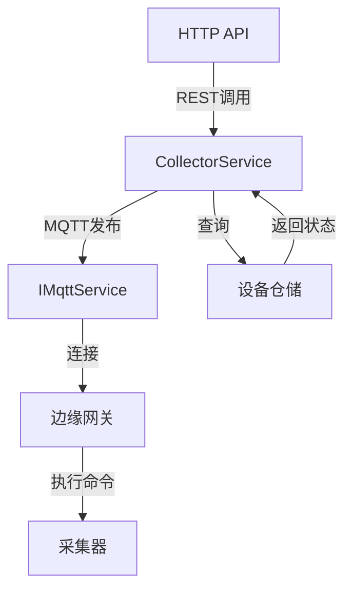
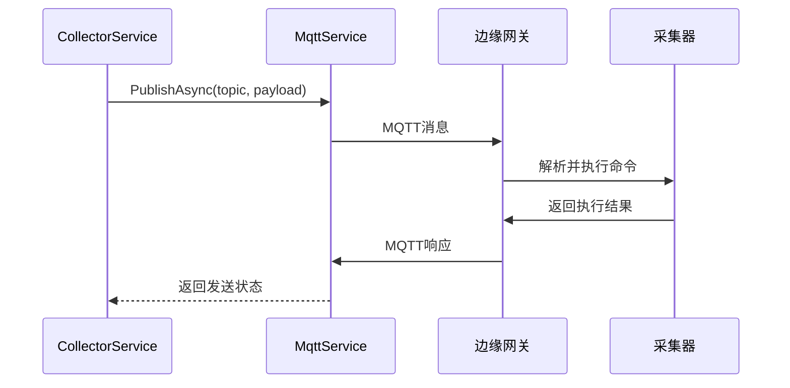

# CollectorService

## 概述

告警采集服务（CollectorService），负责与边缘网关通信，发送采集频率控制命令和检查设备在线状态。

**位置**：`module/ast-intellisub/Ast.IntelliSub.Application/Services/CollectorService.cs`
**层**：Application
**模块**：ast-intellisub
**依赖注入**：Singleton

---

## 架构位置



## 核心职责

1. 发送采集频率控制命令到边缘网关
2. 检查设备在线状态
3. MQTT 消息发布
4. 网关通信管理

## 主要接口

### 频率控制

```csharp
/// <summary>
/// 发送采集频率控制命令
/// </summary>
/// <param name="deviceId">设备ID</param>
/// <param name="sensorKey">传感器标识</param>
/// <param name="frequency">采集频率（毫秒）</param>
/// <returns>是否发送成功</returns>
Task<bool> SendFrequencyControlAsync(string deviceId, string sensorKey, int frequency);
```

### 在线状态检查

```csharp
/// <summary>
/// 检查设备是否在线
/// </summary>
/// <param name="deviceId">设备ID</param>
/// <returns>是否在线</returns>
Task<bool> IsDeviceOnlineAsync(string deviceId);
```

---

## 数据处理流程

### 发送频率控制命令

```
前端请求
  ↓
[验证设备存在]
  ↓
[构建MQTT命令]
  ↓
[发布到网关Topic]
  ↓
[网关接收并执行]
  ↓
[返回发送结果]
```

### 检查设备在线状态

```
前端请求
  ↓
[查询设备记录]
  ↓
[检查最后心跳时间]
  ↓
[计算在线状态]
  ↓
[返回在线状态]
```

---

## 依赖服务

| 服务 | 用途 |
|------|------|
| `IMqttService` | MQTT 服务 |
| `ILogger<CollectorService>` | 日志记录 |
| `IServiceScopeFactory` | 服务作用域工厂 |

---

## MQTT 命令格式

### 频率控制命令

```json
{
  "command": "setFrequency",
  "deviceId": "device-001",
  "sensorKey": "temp-sensor-01",
  "frequency": 5000,
  "timestamp": "2026-06-03T10:30:00Z"
}
```

### Topic 结构

```
下行命令：
/{gatewayId}/command/{deviceId}

上行数据：
/{gatewayId}/data/{deviceId}/{sensorKey}
```

---

## 相关实体

### DeviceEntity

```csharp
public class DeviceEntity : Entity<string>
{
    public string Name { get; set; }
    public string GatewayId { get; set; }
    public DeviceStatusEnum Status { get; set; }
    public DateTime? LastHeartbeatTime { get; set; }
}
```

### DeviceStatusEnum

```csharp
public enum DeviceStatusEnum
{
    Normal = 0,      // 正常
    Offline = 1,      // 离线
    Fault = 2         // 故障
}
```

---

## 采集频率控制

### 频率等级

| 场景 | 频率（毫秒） | 说明 |
|------|--------------|------|
| 正常监测 | 10000 | 10秒一次 |
| 告警监测 | 5000 | 5秒一次 |
| 实时监测 | 1000 | 1秒一次 |
| 低功耗 | 60000 | 60秒一次 |

### 使用示例

```csharp
// 设置正常监测频率
await collectorService.SendFrequencyControlAsync(
    deviceId: "device-001",
    sensorKey: "temp-sensor-01",
    frequency: 10000
);

// 设置告警监测频率
await collectorService.SendFrequencyControlAsync(
    deviceId: "device-001",
    sensorKey: "temp-sensor-01",
    frequency: 5000
);
```

---

## 设备在线状态判断

### 判断逻辑

```csharp
public async Task<bool> IsDeviceOnlineAsync(string deviceId)
{
    // 查询设备
    var device = await _deviceRepository.FindAsync(d => d.Id == deviceId);
    if (device == null) return false;

    // 检查最后心跳时间
    var now = DateTime.Now;
    var heartbeatTimeout = TimeSpan.FromMinutes(5); // 5分钟超时

    return device.LastHeartbeatTime.HasValue &&
           (now - device.LastHeartbeatTime.Value) < heartbeatTimeout;
}
```

### 超时配置

```json
{
  "Collector": {
    "HeartbeatTimeoutMinutes": 5,
    "OfflineThresholdMinutes": 10
  }
}
```

---

## MQTT 通信流程

### 发布命令



### 消息确认

- MQTT QoS 1：至少一次送达
- 等待网关响应确认
- 超时重发机制

---

## 配置项

### MQTT Options

```json
{
  "Mqtt": {
    "Server": "localhost",
    "Port": 1883,
    "ClientId": "IntelliSub-Collector",
    "Username": "",
    "Password": "",
    "EnablePersistentSession": true,
    "ProtocolVersion": "V311",
    "TimeoutSeconds": 30
  }
}
```

### Collector Options

```json
{
  "Collector": {
    "HeartbeatTimeoutMinutes": 5,
    "CommandTimeoutSeconds": 10,
    "MaxRetryAttempts": 3,
    "RetryIntervalMs": 1000
  }
}
```

---

## 注意事项

### 命令发送

- 验证设备存在性
- 检查网关连接状态
- 处理发送失败情况
- 记录命令发送日志

### 频率限制

- 避免过于频繁的频率调整
- 最小频率建议不低于 1000ms
- 最大频率不超过 60000ms

### 错误处理

- 网关离线时返回失败
- 设备不存在时返回失败
- 记录失败日志供排查

### 性能考虑

- 使用 MQTT 异步通信
- 批量命令发送优化
- 缓存设备在线状态

---

## 异常处理

### 常见异常

| 异常 | 原因 | 处理 |
|------|------|------|
| DeviceNotFound | 设备不存在 | 返回 false |
| GatewayOffline | 网关离线 | 返回 false，记录日志 |
| Timeout | 命令超时 | 重试或返回失败 |
| InvalidFrequency | 频率值无效 | 验证参数范围 |

---

## 相关文档

- [[MqttService]] - MQTT 服务
- [[MqttMessageBackgroundService]] - MQTT 消息后台服务
- [[DeviceService]] - 设备服务
- [[GatewayService]] - 网关服务

---

**状态**：🟡 学习中
