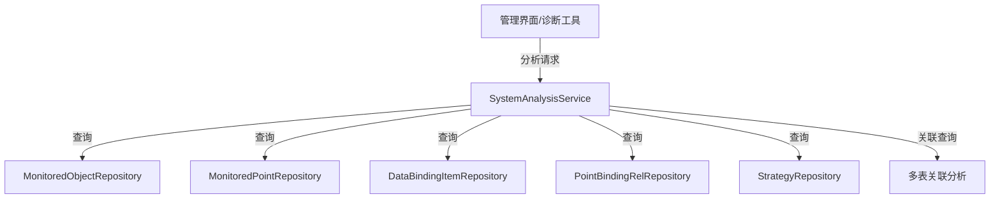
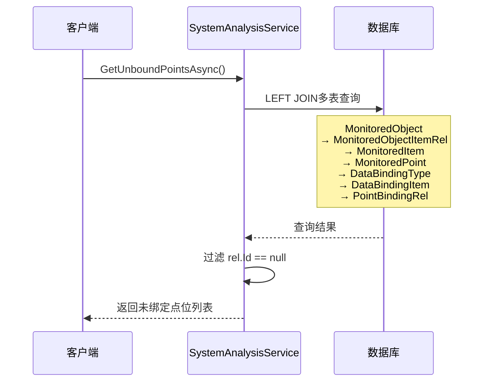
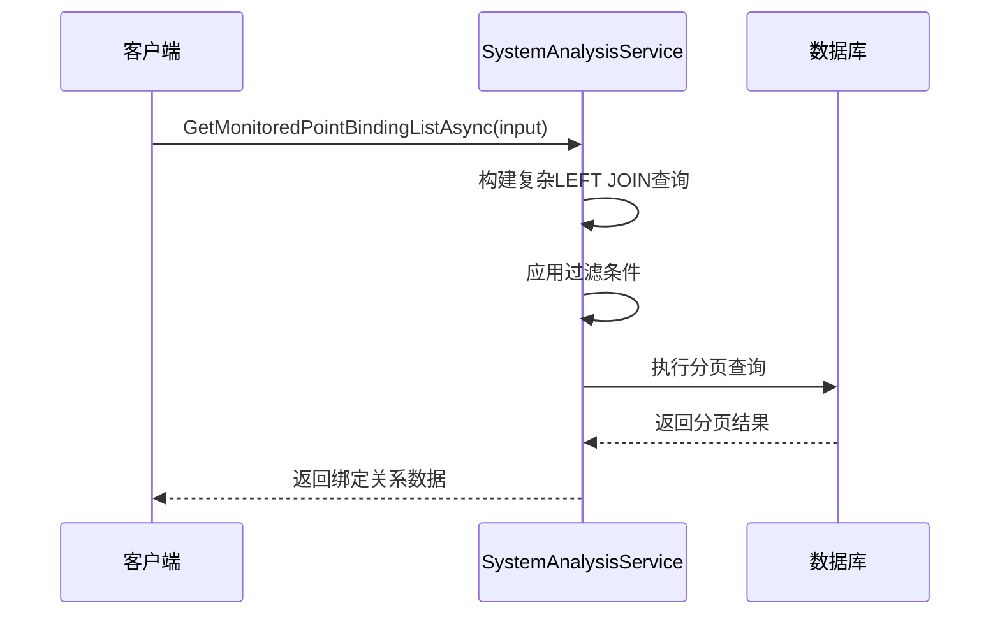
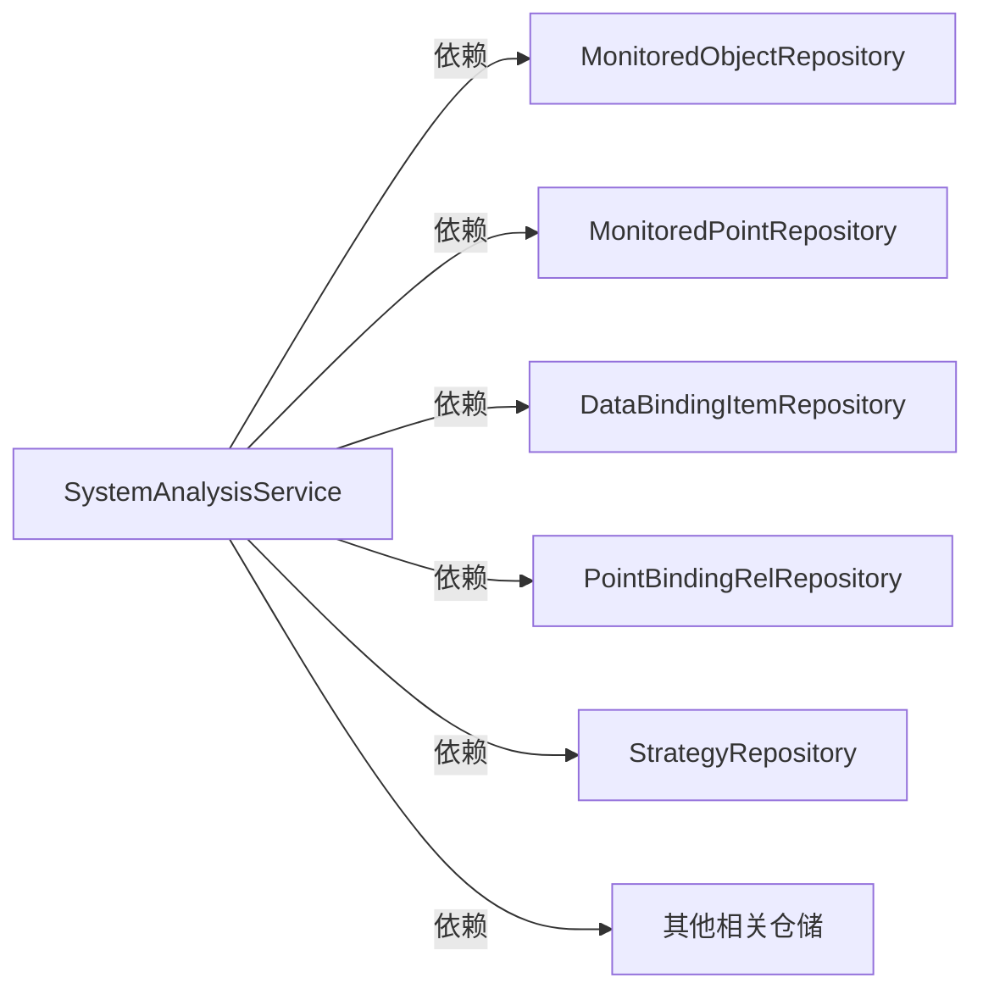

# SystemAnalysisService

## 概述

系统分析服务，提供系统配置和绑定关系的诊断分析功能。该服务用于分析监测点位绑定、策略绑定等系统配置情况，帮助发现和解决配置问题。

**位置**：`module/ast-intellisub/Ast.IntelliSub.Application/Services/SystemAnalysisService.cs`
**层**：Application
**模块**：ast-intellisub
**依赖注入**：Transient

---

## 架构位置



## 核心职责

1. 监测点位绑定关系分析
2. 数据绑定配置分析
3. 策略绑定情况分析
4. 未绑定点位诊断
5. 系统配置完整性检查

## 主要接口

### 获取未绑定点位

```csharp
/// 获取未绑定属性点位的监测点位列表
Task<List<UnboundPointDto>> GetUnboundPointsAsync();
```

**功能**：查询存在监测点位但未绑定属性点位的配置

**返回信息**：
- `MonitoredPointId`: 监测点位ID
- `MonitoredPointName`: 监测点位名称
- `MonitoredItemId`: 监测项ID
- `MonitoredItemName`: 监测项名称
- `DataBindingTypeId`: 数据绑定类型ID
- `DataBindingTypeName`: 数据绑定类型名称
- `DataBindingItemId`: 数据绑定项ID
- `DataBindingItemName`: 数据绑定项名称
- `DataBindingItemProperty`: 数据绑定项属性
- `MonitoredObjectId`: 监测对象ID
- `MonitoredObjectName`: 监测对象名称

### 监测点位绑定查询

```csharp
/// 分页查询监测点位绑定数据
Task<PagedResultDto<MonitoredPointBindingDto>> GetMonitoredPointBindingListAsync(
    MonitoredPointBindingGetListInputDto input);
```

**查询条件**：
- `SubstationId`: 变电站ID
- `Category`: 监测对象类型
- `MonitoredObjectName`: 监测对象名称（模糊搜索）
- `MonitoredPointName`: 监测点位名称（模糊搜索）
- `DataBindingTypeName`: 数据绑定类型名称（模糊搜索）
- `DataBindingItemName`: 数据绑定项名称（模糊搜索）
- `AstPointProperty`: 属性点位属性（模糊搜索）

**返回字段**：完整的绑定关系链路
- 监测对象 → 监测对象类型 → 监测项关系 → 监测项
- → 监测点位 → 数据绑定类型 → 数据绑定项
- → 点位绑定关系 → 属性点位 → 传感器 → 设备

### 策略绑定查询

```csharp
/// 分页查询策略绑定情况
Task<PagedResultDto<StrategyBindingDto>> GetStrategyBindingListAsync(
    StrategyBindingGetListInputDto input);
```

**查询条件**：
- `DataBindingItemName`: 数据绑定项名称（模糊搜索）
- `MonitoredPointName`: 监测点位名称（模糊搜索）
- `StrategyType`: 策略类型
- `StrategyClassName`: 策略类名（模糊搜索）
- `StrategyName`: 策略名称（模糊搜索）

**返回字段**：
- 监测项 → 监测点位 → 数据绑定类型 → 数据绑定项
- → 绑定项策略关系 → 数据策略

---

## 分析类型

### 1. 绑定完整性分析

分析监测点位到属性点位的完整绑定链路：

```
监测对象 (MonitoredObject)
  ↓ 1:N
监测对象项关系 (MonitoredObjectItemRel)
  ↓ N:1
监测项 (MonitoredItem)
  ↓ 1:N
监测点位 (MonitoredPoint)
  ↓ N:1
数据绑定类型 (DataBindingType)
  ↓ 1:N
数据绑定项 (DataBindingItem)
  ↓ N:N
点位绑定关系 (PointBindingRel)
  ↓ N:1
属性点位 (AstPoint)
```

### 2. 未绑定诊断

识别以下配置问题：
- 监测点位存在但无对应数据绑定项
- 数据绑定项存在但未绑定到属性点位
- 绑定关系链路中断

### 3. 策略覆盖分析

分析数据策略的绑定情况：
- 哪些数据绑定项已绑定策略
- 策略类型分布
- 策略参数配置

---

## 数据流

### 未绑定点位查询



### 监测点位绑定查询



---

## SQL查询逻辑

### 未绑定点位查询核心逻辑

```csharp
var unboundPoints = await _monitoredObjectRepository._DbQueryable
    .LeftJoin<MonitoredObjectItemRelEntity>((obj, objItemRel) => obj.Id == objItemRel.MonitoredObjectId)
    .LeftJoin<MonitoredItemEntity>((obj, objItemRel, item) => objItemRel.MonitoredItemId == item.Id)
    .LeftJoin<MonitoredPointEntity>((obj, objItemRel, item, point) => item.Id == point.MonitoredItemId)
    .LeftJoin<DataBindingTypeAggregateRoot>((obj, objItemRel, item, point, bindingType) => 
        point.DataBindingTypeId == bindingType.Id)
    .LeftJoin<DataBindingItemEntity>((obj, objItemRel, item, point, bindingType, bindingItem) => 
        bindingType.Id == bindingItem.DataBindingTypeId)
    .LeftJoin<PointBindingRelEntity>((obj, objItemRel, item, point, bindingType, bindingItem, rel) => 
        objItemRel.Id == rel.MonitoredObjectItemRelId && 
        point.Id == rel.MonitoredPointId && 
        bindingItem.Id == rel.DataBindingItemId)
    .Where((obj, objItemRel, item, point, bindingType, bindingItem, rel) => 
        point.Id != null && bindingItem.Id != null && rel.Id == null)
    .Select(/* 映射到DTO */)
    .ToListAsync();
```

**关键点**：通过 `rel.Id == null` 识别未绑定的组合。

---

## 依赖服务

### 核心仓储依赖

```csharp
public class SystemAnalysisService : ApplicationService, ISystemAnalysisService
{
    private readonly ISqlSugarRepository<MonitoredObjectAggregateRoot, Guid> _monitoredObjectRepository;
    private readonly ISqlSugarRepository<MonitoredObjectTypeEntity, Guid> _monitoredObjectTypeRepository;
    private readonly ISqlSugarRepository<MonitoredObjectItemRelEntity, Guid> _monitoredObjectItemRelRepository;
    private readonly ISqlSugarRepository<MonitoredItemEntity, Guid> _monitoredItemRepository;
    private readonly ISqlSugarRepository<MonitoredPointEntity, Guid> _monitoredPointRepository;
    private readonly ISqlSugarRepository<DataBindingTypeAggregateRoot, Guid> _dataBindingTypeRepository;
    private readonly ISqlSugarRepository<DataBindingItemEntity, Guid> _dataBindingItemRepository;
    private readonly ISqlSugarRepository<PointBindingRelEntity, Guid> _pointBindingRelRepository;
    private readonly ISqlSugarRepository<AstPointEntity, Guid> _astPointRepository;
    private readonly ISqlSugarRepository<SensorEntity, Guid> _sensorRepository;
    private readonly ISqlSugarRepository<DeviceEntity, string> _deviceRepository;
    private readonly ISqlSugarRepository<BindingItemStrategyRelEntity, Guid> _bindingItemStrategyRelRepository;
    private readonly ISqlSugarRepository<DataStrategyEntity, Guid> _dataStrategyRepository;
}
```

### 依赖图



---

## 使用场景

### 1. 系统配置诊断

管理员定期检查系统配置完整性：

```csharp
// 获取所有未绑定的点位
var unboundPoints = await _systemAnalysisService.GetUnboundPointsAsync();

if (unboundPoints.Any())
{
    Console.WriteLine($"发现 {unboundPoints.Count} 个未绑定点位：");
    foreach (var point in unboundPoints)
    {
        Console.WriteLine($"- {point.MonitoredObjectName} / {point.MonitoredPointName}");
    }
}
```

### 2. 变电站配置审计

查询特定变电站的绑定情况：

```csharp
var query = new MonitoredPointBindingGetListInputDto
{
    SubstationId = substationId,
    SkipCount = 0,
    MaxResultCount = 100
};

var bindings = await _systemAnalysisService.GetMonitoredPointBindingListAsync(query);

Console.WriteLine($"变电站 {substationId} 共有 {bindings.TotalCount} 个绑定关系");
```

### 3. 策略覆盖分析

分析数据策略的绑定情况：

```csharp
var query = new StrategyBindingGetListInputDto
{
    StrategyType = StrategyTypeEnum.Threshold,
    SkipCount = 0,
    MaxResultCount = 50
};

var strategies = await _systemAnalysisService.GetStrategyBindingListAsync(query);

Console.WriteLine($"阈值策略绑定数量: {strategies.TotalCount}");
```

---

## 权限控制

```csharp
[Authorize]
public class SystemAnalysisService : ApplicationService, ISystemAnalysisService
{
    // 需要登录认证
}
```

---

## 错误处理

### 异常类型

| 错误场景 | 异常类型 | HTTP状态码 |
|----------|----------|------------|
| 数据库查询失败 | Exception | 500 |
| 无效的查询参数 | UserFriendlyException | 400 |
| 权限不足 | AbpAuthorizationException | 403 |

### 日志记录

```csharp
_logger.LogInformation("开始查询未绑定属性点位的监测点位");
_logger.LogInformation("查询完成，找到 {Count} 个未绑定属性点位的监测点位", count);
_logger.LogError(ex, "查询未绑定属性点位失败");
```

---

## 性能考虑

1. **复杂查询优化**：使用LEFT JOIN一次性获取完整关系链
2. **分页查询**：大数据量场景下使用分页避免内存溢出
3. **索引建议**：在关联字段上建立索引
   - `MonitoredObjectItemRel.MonitoredObjectId`
   - `MonitoredPoint.MonitoredItemId`
   - `PointBindingRel.MonitoredObjectItemRelId`

---

## 相关组件

- [[MonitoredPointEntity]] - 监测点位实体
- [[DataBindingItemEntity]] - 数据绑定项实体
- [[PointBindingRelEntity]] - 点位绑定关系实体
- [[DataStrategyEntity]] - 数据策略实体
- [[MonitoredPointBindingDto]] - 监测点位绑定DTO
- [[StrategyBindingDto]] - 策略绑定DTO

## 参考资料

- [ABP Application Services](https://docs.abp.io/en/abp/latest/Application-Services)
- [SqlSugar Documentation](https://www.donet5.com/)
- 项目源码：`module/ast-intellisub/Ast.IntelliSub.Application/Services/`

---
**状态**：🟢 已完成
