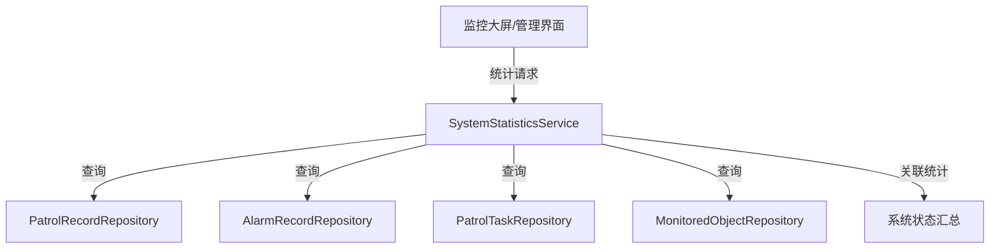
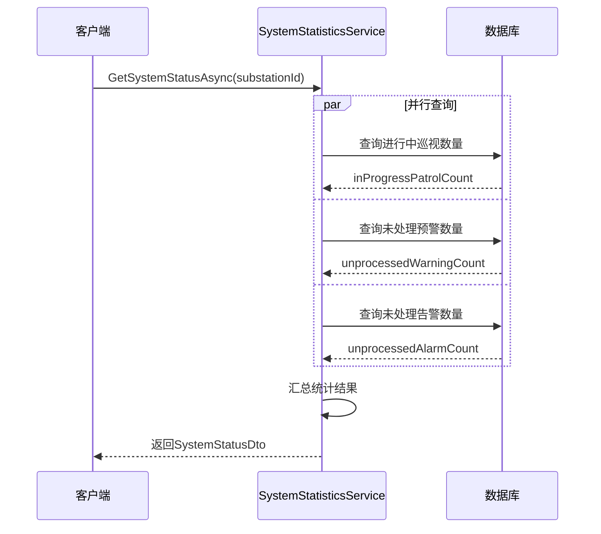
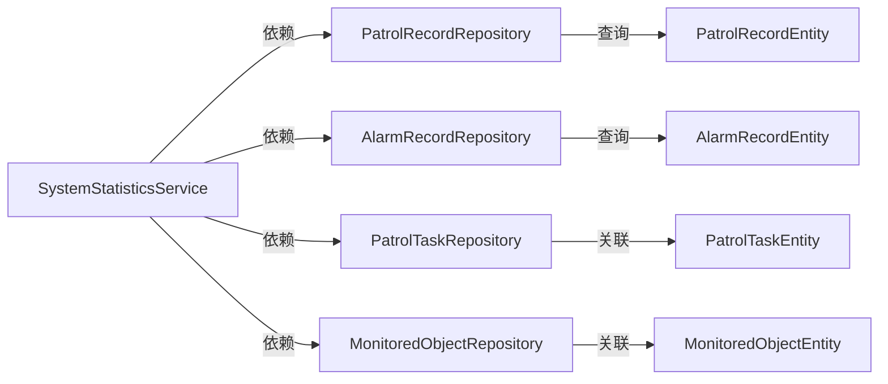

# SystemStatisticsService

## 概述

系统统计服务，提供系统运行状态的实时统计信息。该服务用于监控巡视任务、告警记录等关键业务指标，为系统状态监控和决策支持提供数据支撑。

**位置**：`module/ast-intellisub/Ast.IntelliSub.Application/Services/SystemStatisticsService.cs`
**层**：Application
**模块**：ast-intellisub
**依赖注入**：Transient

---

## 架构位置



## 核心职责

1. 系统运行状态统计
2. 巡视任务进度监控
3. 告警记录统计
4. 变电站级别的状态聚合

## 主要接口

### 获取系统状态

```csharp
/// 获取系统状态统计
Task<SystemStatusDto> GetSystemStatusAsync(Guid substationId);
```

**参数**：
- `substationId` (Guid): 变电站ID

**返回信息**：

| 字段 | 类型 | 说明 |
|------|------|------|
| `InProgressPatrolCount` | int | 进行中的巡视数量 |
| `UnprocessedWarningCount` | int | 未处理预警数量 |
| `UnprocessedAlarmCount` | int | 未处理告警数量 |

---

## 统计维度

### 1. 巡视任务统计

**统计指标**：进行中的巡视数量

**统计逻辑**：
```csharp
var inProgressPatrolCount = await _patrolRecordRepository._DbQueryable
    .LeftJoin<PatrolTaskAggregateRoot>((record, task) => record.PatrolTaskId == task.Id)
    .Where((record, task) => record.Status == PatrolStatusEnum.InProgress 
                          && task.SubstationId == substationId 
                          && !task.IsDeleted)
    .CountAsync();
```

**关联条件**：
- 巡视记录状态 = `InProgress`
- 巡视任务所属变电站 = 指定变电站
- 巡视任务未删除

### 2. 告警统计

#### 预警统计

**统计指标**：未处理的预警数量

**统计逻辑**：
```csharp
var unprocessedWarningCount = await _alarmRecordRepository._DbQueryable
    .LeftJoin<MonitoredObjectAggregateRoot>((alarm, obj) => alarm.MonitoredObjectId == obj.Id)
    .Where((alarm, obj) => alarm.ProcessingStatus == AlarmStatusEnum.Unprocessed 
                        && alarm.AlarmLevel == AlarmLevelEnum.Warning
                        && obj.SubstationId == substationId)
    .CountAsync();
```

**关联条件**：
- 告警处理状态 = `Unprocessed`
- 告警级别 = `Warning`
- 监测对象所属变电站 = 指定变电站

#### 告警统计

**统计指标**：未处理的告警数量

**统计逻辑**：
```csharp
var unprocessedAlarmCount = await _alarmRecordRepository._DbQueryable
    .LeftJoin<MonitoredObjectAggregateRoot>((alarm, obj) => alarm.MonitoredObjectId == obj.Id)
    .Where((alarm, obj) => alarm.ProcessingStatus == AlarmStatusEnum.Unprocessed 
                        && alarm.AlarmLevel == AlarmLevelEnum.Alarm
                        && obj.SubstationId == substationId)
    .CountAsync();
```

**关联条件**：
- 告警处理状态 = `Unprocessed`
- 告警级别 = `Alarm`
- 监测对象所属变电站 = 指定变电站

---

## 数据流



---

## 依赖服务

### 核心仓储依赖

```csharp
public class SystemStatisticsService : ApplicationService, ISystemStatisticsService
{
    private readonly ISqlSugarRepository<PatrolRecordEntity, Guid> _patrolRecordRepository;
    private readonly ISqlSugarRepository<AlarmRecordAggregateRoot, Guid> _alarmRecordRepository;
    private readonly ISqlSugarRepository<PatrolTaskAggregateRoot, Guid> _patrolTaskRepository;
    private readonly ISqlSugarRepository<MonitoredObjectAggregateRoot, Guid> _monitoredObjectRepository;
}
```

### 依赖图



---

## 使用场景

### 1. 监控大屏实时状态

在大屏监控界面展示系统状态：

```csharp
var substationId = Guid.Parse("...");

// 获取系统状态
var status = await _systemStatisticsService.GetSystemStatusAsync(substationId);

// 展示状态
Console.WriteLine($"进行中巡视: {status.InProgressPatrolCount}");
Console.WriteLine($"未处理预警: {status.UnprocessedWarningCount}");
Console.WriteLine($"未处理告警: {status.UnprocessedAlarmCount}");

// 计算告警指数
var totalIssues = status.UnprocessedWarningCount + status.UnprocessedAlarmCount;
var healthScore = totalIssues == 0 ? 100 : Math.Max(0, 100 - totalIssues * 10);
Console.WriteLine($"健康评分: {healthScore}");
```

### 2. 首页状态卡片

在系统首页展示各变电站状态：

```csharp
// 获取所有变电站
var substations = await _substationRepository.GetListAsync();

foreach (var substation in substations)
{
    var status = await _systemStatisticsService.GetSystemStatusAsync(substation.Id);
    
    // 构建状态卡片
    var card = new SubstationStatusCard
    {
        Name = substation.Name,
        InProgressPatrols = status.InProgressPatrolCount,
        UnprocessedWarnings = status.UnprocessedWarningCount,
        UnprocessedAlarms = status.UnprocessedAlarmCount
    };
    
    statusCards.Add(card);
}
```

### 3. 定时状态通知

定时检查系统状态并发送通知：

```csharp
// 后台任务
public class SystemStatusCheckJob
{
    public async Task ExecuteAsync()
    {
        var substations = await _substationRepository.GetListAsync();
        
        foreach (var substation in substations)
        {
            var status = await _systemStatisticsService.GetSystemStatusAsync(substation.Id);
            
            // 检查是否有未处理的紧急告警
            if (status.UnprocessedAlarmCount > 5)
            {
                await _notificationService.SendAlert(
                    substation.Name, 
                    $"存在 {status.UnprocessedAlarmCount} 个未处理告警"
                );
            }
        }
    }
}
```

---

## 权限控制

```csharp
[Authorize]
public class SystemStatisticsService : ApplicationService, ISystemStatisticsService
{
    // 需要登录认证
}
```

---

## 错误处理

### 异常类型

| 错误场景 | 异常类型 | HTTP状态码 |
|----------|----------|------------|
| 变电站不存在 | UserFriendlyException | 404 |
| 数据库查询失败 | Exception | 500 |

### 错误处理示例

```csharp
try
{
    var status = await _systemStatisticsService.GetSystemStatusAsync(substationId);
}
catch (UserFriendlyException ex)
{
    // 业务错误处理
    _logger.LogError(ex, "获取系统状态失败: {Message}", ex.Message);
    return new SystemStatusDto(); // 返回空状态
}
catch (Exception ex)
{
    // 系统错误处理
    _logger.LogError(ex, "获取系统状态异常");
    throw;
}
```

### 日志记录

```csharp
_logger.LogDebug("开始获取变电站系统状态统计: {SubstationId}", substationId);
_logger.LogDebug("变电站系统状态统计获取完成: 变电站{SubstationId}, 进行中巡视{InProgressPatrolCount}个, 未处理预警{UnprocessedWarningCount}个, 未处理告警{UnprocessedAlarmCount}个", ...);
_logger.LogError(ex, "获取变电站系统状态统计失败: 变电站{SubstationId}, {Message}", ...);
```

---

## 性能考虑

1. **查询优化**：使用LEFT JOIN一次性获取关联数据
2. **索引建议**：在统计字段上建立索引
   - `PatrolRecord.Status`
   - `PatrolTask.SubstationId`
   - `AlarmRecord.ProcessingStatus`
   - `AlarmRecord.AlarmLevel`
   - `MonitoredObject.SubstationId`

3. **缓存策略**：对于实时性要求不高的场景，可以考虑缓存统计结果

---

## 扩展性

### 可能的扩展

1. **多维度统计**
   - 按时间段统计（日/周/月）
   - 按设备类型统计
   - 按告警类型统计

2. **趋势分析**
   - 告警趋势
   - 巡视完成率趋势
   - 设备健康度趋势

3. **报表导出**
   - 统计报表生成
   - 数据导出功能

---

## 相关组件

- [[PatrolRecordEntity]] - 巡视记录实体
- [[AlarmRecordEntity]] - 告警记录实体
- [[PatrolTaskEntity]] - 巡视任务实体
- [[MonitoredObjectEntity]] - 监测对象实体
- [[SystemStatusDto]] - 系统状态DTO

## 参考资料

- [ABP Application Services](https://docs.abp.io/en/abp/latest/Application-Services)
- [SqlSugar Documentation](https://www.donet5.com/)
- 项目源码：`module/ast-intellisub/Ast.IntelliSub.Application/Services/`

---
**状态**：🟢 已完成
