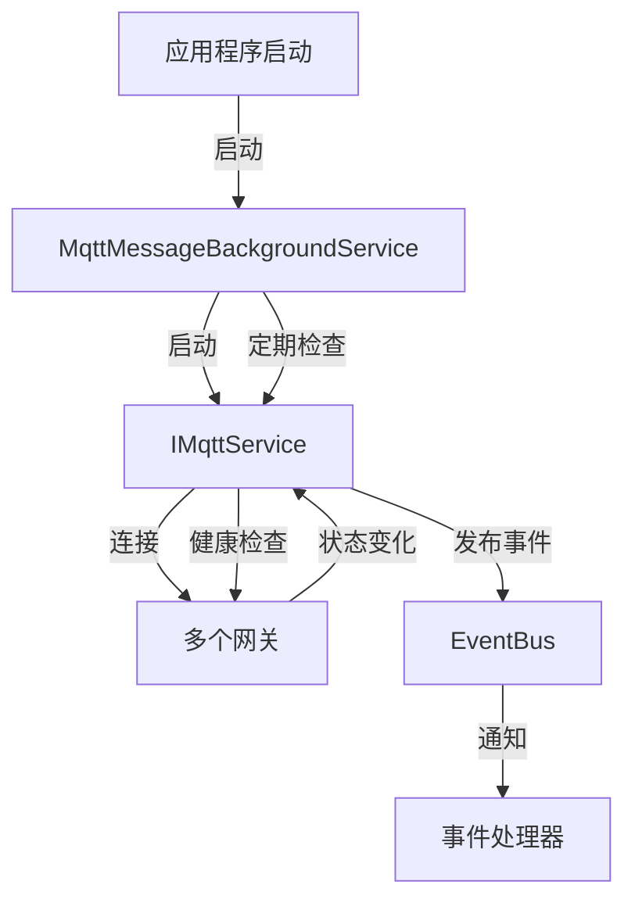

# MqttMessageBackgroundService

## 概述

MQTT 消息后台服务，负责启动和管理 MQTT 服务，执行健康检查和自动重连。

**位置**：`module/ast-intellisub/Ast.IntelliSub.Application/Services/MqttMessageBackgroundService.cs`
**层**：Application
**模块**：ast-intellisub
**生命周期**：BackgroundService（托管服务）

---

## 架构位置



## 核心职责

1. 启动 MQTT 服务（带重试机制）
2. 定期健康检查
3. 网关连接状态监控
4. 自动重连管理
5. 服务优雅关闭

## 主要方法

### 服务启动

```csharp
/// <summary>
/// 启动后台服务
/// </summary>
public override async Task StartAsync(CancellationToken cancellationToken)
```

### 服务执行

```csharp
/// <summary>
/// 执行后台服务主循环
/// </summary>
protected override async Task ExecuteAsync(CancellationToken stoppingToken)
```

### 健康检查

```csharp
/// <summary>
/// 运行健康检查循环
/// </summary>
private async Task RunHealthCheckLoopAsync(CancellationToken stoppingToken)
```

### 启动重试

```csharp
/// <summary>
/// 启动MQTT服务（带重试机制）
/// </summary>
private async Task StartMqttServiceWithRetryAsync(CancellationToken cancellationToken)
```

---

## 数据处理流程

### 服务启动流程

```
应用程序启动
  ↓
[MqttMessageBackgroundService.StartAsync]
  ↓
[启动 MQTT 服务（带重试）]
  ↓
[最大重试5次，间隔30秒]
  ↓
[启动成功]
  ↓
[进入健康检查循环]
```

### 健康检查流程

```
健康检查循环
  ↓
[等待2分钟]
  ↓
[检查所有网关状态]
  ↓
[记录在线/离线状态]
  ↓
[发布状态变化事件]
  ↓
[继续下一次检查]
```

---

## 依赖服务

| 服务 | 用途 |
|------|------|
| `IMqttService` | MQTT 服务接口 |
| `ILogger<MqttMessageBackgroundService>` | 日志记录 |

---

## 重试机制

### 启动重试策略

```csharp
private async Task StartMqttServiceWithRetryAsync(CancellationToken cancellationToken)
{
    var retryCount = 0;
    const int maxRetries = 5;

    while (!cancellationToken.IsCancellationRequested)
    {
        try
        {
            _logger.LogInformation("正在启动MQTT服务...");
            await _mqttService.StartAsync(cancellationToken);
            
            _logger.LogInformation("MQTT服务启动成功");
            return; // 成功则退出
        }
        catch (Exception ex)
        {
            retryCount++;
            if (retryCount >= maxRetries)
            {
                _logger.LogError(ex, "MQTT服务启动失败，已达最大重试次数");
                throw;
            }

            _logger.LogWarning(ex, "MQTT服务启动失败，30秒后重试 ({retryCount}/{maxRetries})");
            await Task.Delay(TimeSpan.FromSeconds(30), cancellationToken);
        }
    }
}
```

### 重试配置

| 参数 | 值 | 说明 |
|------|-----|------|
| 最大重试次数 | 5 | 启动失败时最多重试5次 |
| 重试间隔 | 30秒 | 每次重试间隔30秒 |
| 健康检查间隔 | 2分钟 | 每2分钟检查一次网关状态 |

---

## 健康检查

### 检查逻辑

```csharp
private async Task RunHealthCheckLoopAsync(CancellationToken stoppingToken)
{
    while (!stoppingToken.IsCancellationRequested)
    {
        try
        {
            // 等待检查间隔
            await Task.Delay(_healthCheckInterval, stoppingToken);

            // 执行健康检查
            await RunHealthCheckAsync(stoppingToken);
        }
        catch (OperationCanceledException)
        {
            // 正常取消，退出循环
            break;
        }
        catch (Exception ex)
        {
            _logger.LogError(ex, "健康检查执行异常");
        }
    }
}
```

### 检查内容

- MQTT 连接状态
- 网关在线/离线状态
- 消息收发统计
- 错误日志统计

---

## 配置项

### 健康检查配置

```csharp
// 健康检查间隔（分钟）
private readonly TimeSpan _healthCheckInterval = TimeSpan.FromMinutes(2);

// 启动重试间隔（秒）
private readonly TimeSpan _startupRetryInterval = TimeSpan.FromSeconds(30);
```

### appsettings.json

```json
{
  "BackgroundService": {
    "MqttMessage": {
      "HealthCheckIntervalMinutes": 2,
      "StartupRetryIntervalSeconds": 30,
      "MaxStartupRetries": 5,
      "EnableHealthCheck": true
    }
  }
}
```

---

## 服务生命周期

### 启动阶段

```
1. 应用程序启动
   ↓
2. 托管服务启动
   ↓
3. MqttMessageBackgroundService.StartAsync
   ↓
4. ExecuteAsync 开始执行
   ↓
5. 启动 MQTT 服务（带重试）
   ↓
6. 进入健康检查循环
```

### 运行阶段

```
1. 定期健康检查
   ↓
2. 监控网关状态
   ↓
3. 处理连接变化
   ↓
4. 记录运行日志
```

### 停止阶段

```
1. 应用程序关闭
   ↓
2. 收到取消信号
   ↓
3. 健康检查循环退出
   ↓
4. 停止 MQTT 服务
   ↓
5. 服务优雅关闭
```

---

## 注意事项

### 启动失败处理

- 最多重试 5 次
- 超过重试次数后抛出异常
- 记录详细错误日志

### 健康检查异常

- 捕获异常但不退出循环
- 记录错误日志
- 继续下一次检查

### 资源清理

- 接收到取消信号时优雅退出
- 断开所有网关连接
- 释放 MQTT 客户端资源

### 日志记录

- 启动/停止日志
- 重试日志
- 健康检查结果日志
- 异常错误日志

---

## 事件通知

### 网关状态变化

```csharp
// 网关连接事件
private void OnGatewayConnected(Guid gatewayId)
{
    _logger.LogInformation("网关 {GatewayId} 已连接", gatewayId);
}

// 网关断开事件
private void OnGatewayDisconnected(Guid gatewayId)
{
    _logger.LogWarning("网关 {GatewayId} 已断开", gatewayId);
}
```

---

## 监控指标

### 关键指标

| 指标 | 说明 |
|------|------|
| 服务运行时间 | 从启动到现在的运行时长 |
| 健康检查次数 | 执行健康检查的总次数 |
| 网关连接数 | 当前连接的网关数量 |
| 重试次数 | 启动重试的次数 |

---

## 相关文档

- [[IMqttService]] - MQTT 服务接口
- [[MqttService]] - MQTT 服务实现
- [[MqttGatewayClient]] - MQTT 网关客户端
- [[CollectorService]] - 采集器服务
- [[设备管理服务]] - 设备管理相关文档

---

**状态**：🟡 学习中
