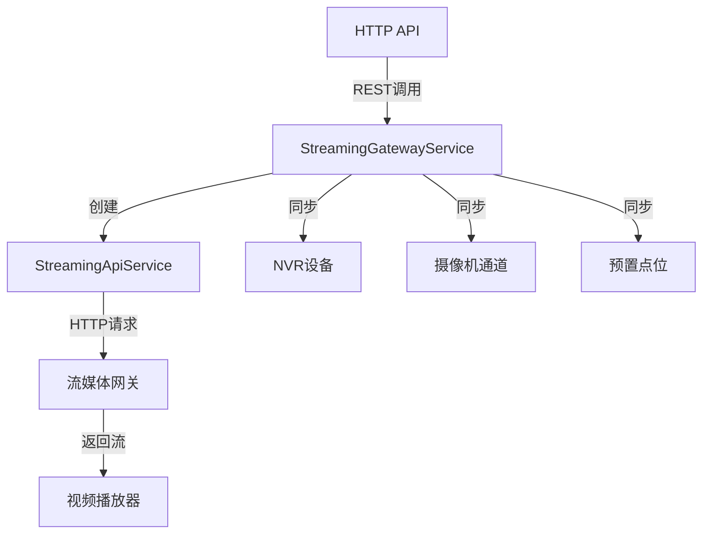

# StreamingGatewayService

## 概述

流媒体网关服务，负责管理流媒体 API 服务实例，提供视频播放、录像回放、云台控制等功能。

**位置**：`module/ast-intellisub/Ast.IntelliSub.Application/Services/StreamingGatewayService.cs`
**层**：Application
**模块**：ast-intellisub
**依赖注入**：Transient

---

## 架构位置



## 核心职责

1. 获取或创建 StreamingApiService 实例
2. 视觉网关设备同步
3. NVR 设备管理
4. 摄像机通道同步
5. 预置点位同步
6. 流媒体服务实例管理

## 主要接口

### 服务获取

```csharp
/// <summary>
/// 获取或创建StreamingApiService实例
/// </summary>
Task<IStreamingApiService> GetStreamingServiceAsync(Guid? gatewayId = null, Guid? substationId = null);

/// <summary>
/// 根据NVR ID获取或创建StreamingApiService实例
/// </summary>
Task<IStreamingApiService> GetStreamingServiceByNvrIdAsync(string nvrId);
```

### 同步接口

```csharp
/// <summary>
/// 同步视觉网关设备
/// </summary>
Task<bool> SyncVisualGatewayAsync(Guid gatewayId);
```

---

## 数据处理流程

### 获取流媒体服务

```
请求流媒体服务
  ↓
[查询指定的视觉网关]
  ↓
[从网关配置创建服务实例]
  ↓
[设置认证凭据]
  ↓
[返回服务实例]
```

### 同步视觉网关

```
触发同步
  ↓
[获取流媒体服务实例]
  ↓
[同步NVR设备]
  ↓
[同步摄像机通道]
  ↓
[同步预置点位]
  ↓
[更新设备状态]
  ↓
[返回同步结果]
```

---

## 依赖服务

| 服务 | 用途 |
|------|------|
| `ISqlSugarRepository<NvrEntity, string>` | NVR 设备数据访问 |
| `ISqlSugarRepository<DeviceEntity, string>` | 设备数据访问 |
| `ISqlSugarRepository<SensorEntity, Guid>` | 传感器数据访问 |
| `ISqlSugarRepository<GatewayAggregateRoot, Guid>` | 网关数据访问 |
| `ILocalEventBus` | 本地事件总线 |
| `ISensorSyncService` | 传感器同步服务 |

---

## 相关实体

### NvrEntity

```csharp
public class NvrEntity : DeviceEntity
{
    public int ChannelCount { get; set; }
    public string? Manufacturer { get; set; }
    public bool IsVirtual { get; set; }
}
```

### GatewayAggregateRoot

```csharp
public class GatewayAggregateRoot : FullAuditedAggregateRoot<Guid>
{
    public string Name { get; set; }
    public string Url { get; set; }
    public GatewayTypeEnum Type { get; set; }
    public string? Username { get; set; }
    public string? Password { get; set; }
    public Guid SubstationId { get; set; }
}

public enum GatewayTypeEnum
{
    Data = 0,      // 数据网关
    Vision = 1     // 视觉网关
}
```

---

## 流媒体服务实例

### StreamingApiService 接口

```csharp
public interface IStreamingApiService
{
    // 登录
    Task LoginAsync(string username, string password);

    // 设备管理
    Task<PagedResult<Device>> GetDevicesAsync(int page, int count, string? query = null);
    Task<Device> GetDeviceInfoAsync(string deviceId);
    Task SyncDeviceChannelsAsync(string deviceId);

    // 通道管理
    Task<PagedResult<Channel>> GetChannelsAsync(string deviceId, int page, int count);
    Task<List<Channel>> GetAllChannelsAsync(string deviceId);

    // 视频播放
    Task<ApiStreamContent> StartPlaybackAsync(string deviceId, string channelId);
    Task StopPlaybackAsync(string deviceId, string channelId);

    // 云台控制
    Task ControlPtzAsync(string deviceId, string channelId, string command,
        int horizonSpeed, int verticalSpeed, int zoomSpeed);

    // 预置位
    Task<List<Preset>> GetPresetsAsync(string deviceId, string channelId);
    Task CallPresetAsync(string deviceId, string channelId, int presetId);

    // 录像回放
    Task<MediaInfo> QueryRecordingsAsync(string deviceId, string channelId,
        DateTime startTime, DateTime endTime);
    Task<ApiStreamContent> StartRecordingPlaybackAsync(string deviceId, string channelId,
        DateTime startTime, DateTime endTime);
    Task StopRecordingPlaybackAsync(string deviceId, string channelId);

    // 截图
    Task<byte[]> CaptureSnapshotAsync(string deviceId, string channelId,
        string? presetId = null);
}
```

---

## 同步流程

### NVR 设备同步

```csharp
private async Task SyncNvrDevicesAsync(IStreamingApiService streamingService, GatewayAggregateRoot gateway)
{
    // 分页获取远程设备
    int page = 1;
    const int pageSize = 50;
    bool hasMore = true;

    while (hasMore)
    {
        var devicesResult = await streamingService.GetDevicesAsync(page, pageSize);

        foreach (var device in devicesResult.List)
        {
            // 查找现有设备
            var existingNvr = await _nvrRepository.FindAsync(n => n.Id == device.DeviceId);

            if (existingNvr == null)
            {
                // 创建新NVR
                var nvr = new NvrEntity
                {
                    Name = device.Name,
                    HostAddress = device.Ip,
                    ChannelCount = device.ChannelCount,
                    Status = device.OnLine ? DeviceStatusEnum.Normal : DeviceStatusEnum.Offline,
                    GatewayId = gateway.Id
                };
                nvr.SetId(device.DeviceId);
                await _nvrRepository.InsertAsync(nvr);
            }
            else
            {
                // 更新现有NVR
                existingNvr.Name = device.Name;
                existingNvr.Status = device.OnLine ? DeviceStatusEnum.Normal : DeviceStatusEnum.Offline;
                await _nvrRepository.UpdateAsync(existingNvr);
            }
        }

        hasMore = devicesResult.HasMore;
        page++;
    }
}
```

### 摄像机通道同步

```csharp
private async Task SyncCameraChannelsAsync(IStreamingApiService streamingService, NvrEntity nvr)
{
    // 分页获取通道
    int page = 1;
    const int pageSize = 50;
    bool hasMore = true;

    while (hasMore)
    {
        var channelsResult = await streamingService.GetChannelsAsync(nvr.Id, page, pageSize);

        foreach (var channel in channelsResult.List)
        {
            // 查找现有设备
            var existingCamera = await _deviceRepository.FindAsync(d =>
                d.DeviceId == channel.ChannelId && d.NvrId == nvr.Id);

            if (existingCamera == null)
            {
                // 创建新摄像机
                var camera = new DeviceEntity
                {
                    Id = Guid.NewGuid().ToString(),
                    Name = channel.Name,
                    DeviceId = channel.ChannelId,
                    NvrId = nvr.Id,
                    Type = "Camera",
                    Status = channel.OnLine ? DeviceStatusEnum.Normal : DeviceStatusEnum.Offline
                };
                await _deviceRepository.InsertAsync(camera);
            }
        }

        hasMore = channelsResult.HasMore;
        page++;
    }
}
```

### 预置点位同步

```csharp
private async Task SyncPresetPointsAsync(IStreamingApiService streamingService,
    DeviceEntity camera, NvrEntity nvr)
{
    // 获取预置位
    var presets = await streamingService.GetPresetsAsync(nvr.Id, camera.DeviceId);

    foreach (var preset in presets)
    {
        // 查找现有传感器
        var existingSensor = await _sensorRepository.FindAsync(s =>
            s.DeviceId == camera.Id && s.PresetId == preset.PresetId);

        if (existingSensor == null)
        {
            // 创建新传感器
            var sensor = new SensorEntity
            {
                SensorKey = preset.PresetId.ToString(),
                Name = preset.Name,
                DeviceId = camera.Id,
                PresetId = preset.PresetId,
                IsEnabled = true
            };
            await _sensorRepository.InsertAsync(sensor);
        }
    }
}
```

---

## 配置项

### StreamingApiOptions

```json
{
  "StreamingApi": {
    "BaseAddress": "http://192.168.1.100:80",
    "DefaultUsername": "admin",
    "DefaultPassword": "admin123",
    "TimeoutSeconds": 30,
    "AutoLogin": true,
    "EnablePersistentSession": true
  }
}
```

### Gateway 配置

```json
{
  "Gateway": {
    "SyncIntervalMinutes": 60,
    "EnableAutoSync": true,
    "SyncPageSize": 50
  }
}
```

---

## 注意事项

### 服务实例管理

- 按 NVR ID 管理服务实例
- 同一 NVR 复用服务实例
- 服务实例缓存管理

### 认证管理

- 从网关配置获取认证凭据
- 自动登录机制
- Token 过期自动重登录

### 同步策略

- 增量同步，只同步变化数据
- 分页处理，避免内存溢出
- 错误处理，单个设备失败不影响整体

### 性能优化

- 批量操作使用事务
- 分页查询限制单次数据量
- 缓存服务实例减少创建开销

---

## 错误处理

### 常见异常

| 异常 | 原因 | 处理 |
|------|------|------|
| GatewayNotFound | 网关不存在 | 抛出友好异常 |
| NvrNotFound | NVR 不存在 | 记录日志，跳过 |
| AuthenticationFailed | 认证失败 | 检查凭据，抛出异常 |
| TimeoutError | 请求超时 | 重试或记录日志 |

---

## 相关文档

- [[IStreamingApiService]] - 流媒体 API 服务接口
- [[StreamingApiService]] - 流媒体 API 服务实现
- [[MediaService]] - 媒体服务
- [[DeviceService]] - 设备服务
- [[SensorService]] - 传感器服务

---

**状态**：🟡 学习中
