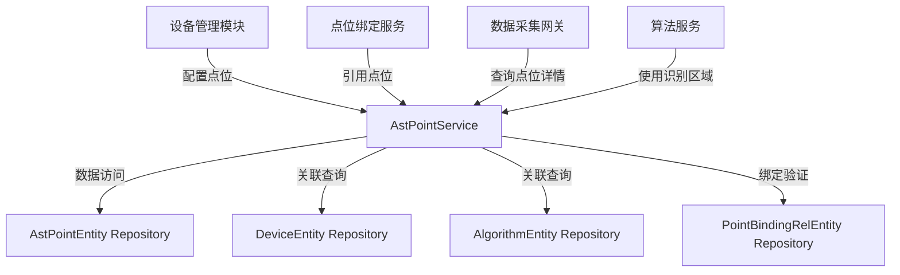

# AstPointService

## 概述

点位管理服务，负责管理传感器点位和识别区域点位。传感器点位用于采集设备的实时数据，识别区域点位用于计算机视觉算法的图像识别。此服务是数据采集链路的核心环节。

**位置**：`module/ast-intellisub/Ast.IntelliSub.Application/Services/AstPointService.cs`
**层**：Application
**模块**：ast-intellisub
**依赖注入**：Scoped

---

## 架构位置



## 核心职责

1. **点位管理**：创建、更新、删除传感器点位和识别区域点位
2. **点位验证**：确保点位的唯一性和有效性
3. **识别区域管理**：专门处理计算机视觉算法的识别区域配置
4. **数据查询**：支持多种查询方式，包括按设备、传感器、算法查询
5. **统计服务**：提供点位的统计信息

## 关键接口

```csharp
// 创建点位
public override Task<AstPointDto> CreateAsync(AstPointCreateUpdateDto input);

// 更新点位
public override Task<AstPointDto> UpdateAsync(Guid id, AstPointCreateUpdateDto input);

// 删除点位（需先解除绑定）
public override Task DeleteAsync(Guid id);

// 获取点位列表
public override Task<PagedResultDto<AstPointDto>> GetListAsync(AstPointGetListInputDto input);

// 获取传感器点位列表
public Task<List<AstPointDto>> GetPointsBySensorAsync(GetPointsBySensorInputDto input);

// 获取点位详细信息（包含网关和传感器信息）
public Task<AstPointDetailDto> GetPointDetailAsync(Guid pointId);

// 批量获取点位详细信息
public Task<List<AstPointDetailDto>> GetPointDetailsAsync(GetPointDetailsRequestDto input);

// 根据算法ID获取识别区域点位
public Task<List<AstPointDto>> GetRecognitionAreaPointsByAlgorithmAsync(Guid algorithmId);

// 获取设备点位统计信息
public Task<AstPointStatisticsDto> GetPointStatisticsByDeviceAsync(string deviceId);

// 创建识别区域点位
public Task<AstPointDto> CreateRecAreaAsync(CreateRecAreaDto input);

// 更新识别区域点位
public Task<AstPointDto> UpdateRecAreaAsync(Guid id, UpdateRecAreaDto input);
```

## 依赖注入配置

```csharp
// 服务通过 ABP 自动注册机制注入
public class AstPointService : YiCrudAppService<
    AstPointEntity, 
    AstPointDto,
    Guid, 
    AstPointGetListInputDto, 
    AstPointCreateUpdateDto>, 
    IAstPointService
{
    private readonly ISqlSugarRepository<AstPointEntity, Guid> _repository;
    private readonly ISqlSugarRepository<DeviceEntity, string> _deviceRepository;
    private readonly ISqlSugarRepository<AlgorithmEntity, Guid> _algorithmRepository;
    private readonly ISqlSugarRepository<PointBindingRelEntity, Guid> _pointBindingRelRepository;
    private readonly ILogger<AstPointService> _logger;
}
```

## 数据流

```
传感器点位创建
  → 验证设备存在性
    → 验证点位唯一性
      → 创建点位记录
        → 返回点位信息

识别区域点位创建
  → 验证设备存在性
    → 验证算法存在性
      → 验证识别区域数据格式
        → 创建识别区域点位
          → 返回点位信息（包含算法信息）

数据采集查询
  → 查询点位详细信息
    → 关联设备和传感器信息
      → 返回完整的点位上下文信息
```

## 重要方法

### `CreateAsync()`

**作用**：创建传感器点位或识别区域点位

**调用链**：
```
客户端.POST /api/app/ast-intellisub/ast-points
  → AstPointService.CreateAsync()
    → DeviceRepository.GetAsync() [验证设备]
    → Repository.CheckUnique() [验证点位唯一性]
    → ValidateRecognitionAreaPoint() [验证识别区域点位]
    → Repository.InsertAsync() [创建点位]
```

**业务逻辑**：
1. 验证设备是否存在
2. 验证点位唯一性（设备ID + 传感器Key + 属性名）
3. 如果是识别区域点位，验证特殊字段
4. 创建点位记录

### `ValidateRecognitionAreaPoint()`

**作用**：验证识别区域点位的特殊字段

**验证规则**：
1. 识别区域点位必须指定算法ID
2. 必须提供识别区域坐标数据
3. 识别区域数据必须是有效的JSON格式
4. 传感器Key不能为空（应为预置位号）
5. 传感器属性点位不应设置算法ID和识别区域数据

### `GetPointDetailAsync()`

**作用**：获取点位详细信息，包含网关和传感器信息

**调用链**：
```
数据采集网关.GET /api/app/ast-intellisub/ast-points/{id}/detail
  → AstPointService.GetPointDetailAsync()
    → Repository.LeftJoin<DeviceEntity>() [关联设备]
    → Repository.LeftJoin<SensorEntity>() [关联传感器]
    → Repository.Select() [组装详情]
```

**返回信息**：
- 点位ID（`PointId`）
- 网关ID（`GatewayId`）
- 设备ID（`DeviceId`）
- 传感器ID（`SensorId`）
- 传感器Key（`SensorKey`）

### `GetPointDetailsAsync()`

**作用**：批量获取点位详细信息

**使用场景**：数据采集网关批量查询点位信息，提高查询效率

**查询逻辑**：
1. 一次性查询所有点位
2. 关联设备和传感器信息
3. 返回完整的点位上下文信息列表

### `CreateRecAreaAsync()`

**作用**：专门用于创建识别区域点位

**调用链**：
```
客户端.POST /api/app/ast-intellisub/ast-points/rec-area
  → AstPointService.CreateRecAreaAsync()
    → DeviceRepository.GetAsync() [验证设备]
    → AlgorithmRepository.GetAsync() [验证算法]
    → Repository.CheckUnique() [验证点位唯一性]
    → ValidateRecAreaJson() [验证识别区域数据格式]
    → Repository.InsertAsync() [创建识别区域点位]
```

**特殊处理**：
- 类型固定为 `AstPointTypeEnum.RecognitionArea`
- 单位和值类型从算法配置继承
- 创建记录详细的日志信息

### `DeleteAsync()`

**作用**：删除点位，需先解除绑定关系

**删除验证**：
1. 验证点位是否存在
2. 检查是否存在绑定关系
3. 如果存在绑定，抛出异常提示先解除绑定

**错误提示**：
```
该点位已被绑定到监测点位，无法删除。请先解除绑定关系后再删除。
```

### `GetPointStatisticsByDeviceAsync()`

**作用**：获取设备的点位统计信息

**统计内容**：
- 总点位数量
- 按类型统计（传感器点位、识别区域点位）
- 按值类型统计（整型、浮点型、字符串等）
- 传感器数量（按SensorKey去重）

## 源码片段

### 关键实现：识别区域点位验证

```csharp
// 文件路径: module/ast-intellisub/Ast.IntelliSub.Application/Services/AstPointService.cs:116-163
private void ValidateRecognitionAreaPoint(AstPointCreateUpdateDto input)
{
    // 当类型为识别区域点位时的特殊验证
    if (input.Type == AstPointTypeEnum.RecognitionArea)
    {
        // 验证算法ID是否提供
        if (!input.AlgorithmId.HasValue)
        {
            throw new UserFriendlyException("识别区域点位必须指定算法ID");
        }

        // 验证识别区域数据格式
        if (string.IsNullOrEmpty(input.RecArea))
        {
            throw new UserFriendlyException("识别区域点位必须提供识别区域坐标数据");
        }

        // 简单验证RecArea是否为有效的JSON格式
        try
        {
            System.Text.Json.JsonDocument.Parse(input.RecArea);
        }
        catch (System.Text.Json.JsonException)
        {
            throw new UserFriendlyException("识别区域坐标数据格式无效，必须为有效的JSON格式");
        }

        // 根据数据库设计文档，device_id应该为摄像头国标通道ID
        // sensor_key应该为预置位号preset_no
        if (string.IsNullOrEmpty(input.SensorKey))
        {
            throw new UserFriendlyException("识别区域点位的传感器key不能为空，应为预置位号");
        }
    }
    else
    {
        // 传感器属性点位的验证
        if (input.AlgorithmId.HasValue)
        {
            _logger.LogWarning("传感器属性点位不应该设置算法ID，将被忽略");
        }

        if (!string.IsNullOrEmpty(input.RecArea))
        {
            _logger.LogWarning("传感器属性点位不应该设置识别区域数据，将被忽略");
        }
    }
}
```

### 关键实现：获取点位详细信息

```csharp
// 文件路径: module/ast-intellisub/Ast.IntelliSub.Application/Services/AstPointService.cs:228-251
public async Task<AstPointDetailDto> GetPointDetailAsync(Guid pointId)
{
    // 查询点位信息，同时关联设备和传感器表
    var detail = await _repository._DbQueryable
        .LeftJoin<DeviceEntity>((p, d) => p.DeviceId == d.Id)
        .LeftJoin<SensorEntity>((p, d, s) => p.DeviceId == s.DeviceId && p.SensorKey == s.SensorKey)
        .Where((p, d, s) => p.Id == pointId)
        .Select((p, d, s) => new AstPointDetailDto
        {
            PointId = p.Id,
            GatewayId = d.GatewayId,
            DeviceId = p.DeviceId,
            SensorId = s.Id,
            SensorKey = p.SensorKey
        })
        .FirstAsync();

    if (detail == null)
    {
        throw new UserFriendlyException("点位不存在");
    }

    return detail;
}
```

### 关键实现：创建识别区域点位

```csharp
// 文件路径: module/ast-intellisub/Ast.IntelliSub.Application/Services/AstPointService.cs:361-423
public async Task<AstPointDto> CreateRecAreaAsync(CreateRecAreaDto input)
{
    // 验证设备是否存在
    var device = await _deviceRepository.GetAsync(input.DeviceId);
    if (device == null)
    {
        throw new UserFriendlyException("设备不存在");
    }

    // 验证算法是否存在
    var algorithm = await _algorithmRepository.GetAsync(input.AlgorithmId);
    if (algorithm == null)
    {
        throw new UserFriendlyException("算法不存在");
    }

    // 验证点位唯一性
    var exists = await _repository._DbQueryable
        .AnyAsync(x => x.DeviceId == input.DeviceId && 
                      x.SensorKey == input.SensorKey && 
                      x.Property == input.Property);
    if (exists)
    {
        throw new UserFriendlyException("该点位已存在");
    }

    // 验证识别区域数据格式
    try
    {
        System.Text.Json.JsonDocument.Parse(input.RecArea);
    }
    catch (System.Text.Json.JsonException)
    {
        throw new UserFriendlyException("识别区域坐标数据格式无效，必须为有效的JSON格式");
    }

    // 创建识别区域点位实体
    var entity = new AstPointEntity
    {
        DeviceId = input.DeviceId,
        SensorKey = input.SensorKey,
        Property = input.Property,
        Name = input.Name,
        Unit = algorithm.Unit ?? string.Empty,
        ValueType = algorithm.ValueType,
        Type = AstPointTypeEnum.RecognitionArea, // 固定为识别区域点位
        AlgorithmId = input.AlgorithmId,
        RecArea = input.RecArea,
        CreationTime = DateTime.Now,
        SrcPointId = string.Empty // 识别区域点位可以设置为空
    };

    entity.SetId(Guid.NewGuid());

    // 插入到数据库
    await _repository.InsertAsync(entity);

    _logger.LogInformation("创建识别区域点位成功: {DeviceId}-{SensorKey}-{Property}, 算法: {AlgorithmName}", 
        input.DeviceId, input.SensorKey, input.Property, algorithm.Name);

    // 返回DTO
    return entity.Adapt<AstPointDto>();
}
```

### 关键实现：删除验证

```csharp
// 文件路径: module/ast-intellisub/Ast.IntelliSub.Application/Services/AstPointService.cs:509-532
public override async Task DeleteAsync(Guid id)
{
    // 验证点位是否存在
    var astPoint = await _repository.GetAsync(id);
    if (astPoint == null)
    {
        throw new UserFriendlyException("点位不存在");
    }

    // 检查是否存在绑定关系
    var hasBindings = await _pointBindingRelRepository._DbQueryable
        .AnyAsync(x => x.AstPointId == id);

    if (hasBindings)
    {
        throw new UserFriendlyException("该点位已被绑定到监测点位，无法删除。请先解除绑定关系后再删除。");
    }

    // 删除点位
    await base.DeleteAsync(id);

    _logger.LogInformation("删除点位成功: ID={PointId}, {DeviceId}-{SensorKey}-{Property}", 
        id, astPoint.DeviceId, astPoint.SensorKey, astPoint.Property);
}
```

## 权限控制

```csharp
// ABP 权限定义（通过 [Authorize] 特性全局授权）
[Authorize]
public class AstPointService : YiCrudAppService<...>
{
    // 所有方法都需要用户认证
}

// 非Action方法（内部调用，不暴露为HTTP端点）
[NonAction]
public override async Task<AstPointDto> CreateAsync(AstPointCreateUpdateDto input)

[NonAction]
public override Task<AstPointDto> GetAsync(Guid id)

[NonAction]
public override async Task<AstPointDto> UpdateAsync(Guid id, AstPointCreateUpdateDto input)
```

## 相关组件

- [[DeviceService]] - 设备管理（依赖项）
- [[AlgorithmService]] - 算法管理（依赖项）
- [[PointBindingRelService]] - 点位绑定关系服务（调用方）
- [[MonitoredPointService]] - 监测点位服务（调用方）
- [[AstPointEntity]] - 点位实体
- [[AstPointDto]] - 数据传输对象

## 业务规则

### 点位类型

**传感器点位（SensorProperty）**：
- 用于采集设备的实时数据
- 由设备ID、传感器Key、属性名唯一确定
- 不应设置算法ID和识别区域数据

**识别区域点位（RecognitionArea）**：
- 用于计算机视觉算法的图像识别
- 必须指定算法ID
- 必须提供识别区域坐标数据（JSON格式）
- 设备ID为摄像头国标通道ID
- 传感器Key为预置位号

### 点位唯一性
- 同一设备ID + 传感器Key + 属性名的组合只能存在一个点位
- 创建和更新时都会进行唯一性验证

### 删除约束
- 点位被绑定到监测点位时不允许删除
- 必须先解除绑定关系才能删除点位

### 识别区域数据格式
- 必须是有效的JSON格式
- 用于描述识别区域的坐标信息

## 数据结构

### AstPointDto
```csharp
public class AstPointDto
{
    public Guid Id { get; set; }
    public string DeviceId { get; set; }
    public string SensorKey { get; set; }
    public string Property { get; set; }
    public string Name { get; set; }
    public string Unit { get; set; }
    public string ValueType { get; set; }
    public AstPointTypeEnum Type { get; set; }
    public Guid? AlgorithmId { get; set; }
    public string RecArea { get; set; }
    public string SrcPointId { get; set; }
    public DateTime CreationTime { get; set; }
}
```

### AstPointDetailDto
```csharp
public class AstPointDetailDto
{
    public Guid PointId { get; set; }
    public string GatewayId { get; set; }
    public string DeviceId { get; set; }
    public Guid SensorId { get; set; }
    public string SensorKey { get; set; }
}
```

### AstPointStatisticsDto
```csharp
public class AstPointStatisticsDto
{
    public string DeviceId { get; set; }
    public int TotalCount { get; set; }
    public Dictionary<AstPointTypeEnum, int> TypeCounts { get; set; }
    public Dictionary<string, int> ValueTypeCounts { get; set; }
    public int SensorCount { get; set; }
}
```

## 学习笔记

### 难点理解

1. **点位类型区分**：传感器点位和识别区域点位的用途和验证规则不同
2. **点位唯一性**：由设备ID + 传感器Key + 属性名共同确定
3. **识别区域数据**：JSON格式的坐标数据，用于描述计算机视觉的识别范围
4. **删除约束**：点位被绑定后不能删除，保证数据完整性

### 疑题

1. **识别区域数据格式**：需要明确识别区域坐标数据的具体JSON结构
2. **算法继承机制**：识别区域点位从算法配置继承单位和值类型
3. **批量操作支持**：当前服务不支持批量创建点位，如需要可以扩展

## 参考资料

- [ABP Framework 应用服务文档](https://docs.abp.io/docs/abp/latest/Application-Services)
- 项目源码：`module/ast-intellisub/Ast.IntelliSub.Application/Services/AstPointService.cs`
- 相关实体：`module/ast-intellisub/Ast.IntelliSub.Domain/Entities/AstPointEntity.cs`
- 相关枚举：`module/ast-intellisub/Ast.IntelliSub.Domain.Shared/Enums/AstPointTypeEnum.cs`

---
**状态**：✅ 完成