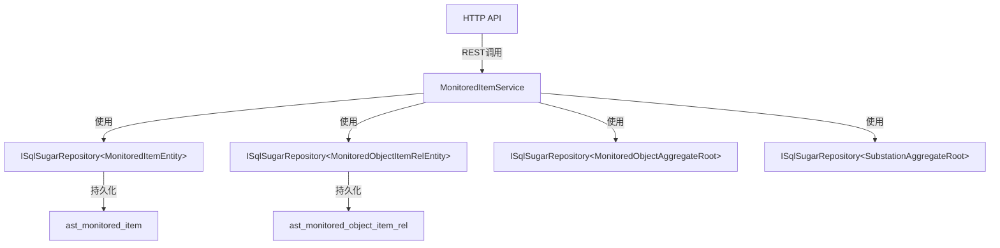

# MonitoredItemService

## 概述

监测项服务，管理设备的监测特征项（如温度、湿度、振动等监测指标）的 CRUD 操作，并提供站点维度的监测项查询功能。

**位置**：`module/ast-intellisub/Ast.IntelliSub.Application/Services/MonitoredItemService.cs`
**层**：Application
**模块**：ast-intellisub
**依赖注入**：Scoped

---

## 架构位置



## 核心职责

1. 监测项的创建、更新、删除操作
2. 监测项列表查询（分页）
3. 所有监测项列表获取
4. 根据站点 ID 获取监测项列表
5. 根据监测对象 ID 获取关联监测项列表
6. 监测项与监测对象的关联关系维护

## 主要接口

### 基础 CRUD

```csharp
/// <summary>
/// 创建监测项
/// </summary>
/// <exception cref="UserFriendlyException">当监测项名称重复时抛出异常</exception>
[OperLog("创建监测项", OperEnum.Insert)]
Task<MonitoredItemDto> CreateAsync(MonitoredItemCreateUpdateDto input);

/// <summary>
/// 更新监测项
/// </summary>
/// <exception cref="UserFriendlyException">当监测项名称重复时抛出异常</exception>
[OperLog("更新监测项", OperEnum.Update)]
Task<MonitoredItemDto> UpdateAsync(Guid id, MonitoredItemCreateUpdateDto input);

/// <summary>
/// 删除监测项
/// </summary>
/// <exception cref="UserFriendlyException">
/// 当监测项被设备使用时抛出异常
/// 当监测项存在监测点位时抛出异常
/// </exception>
[OperLog("删除监测项", OperEnum.Delete)]
Task DeleteAsync(IEnumerable<Guid> id);
```

### 查询接口

```csharp
/// <summary>
/// 获取监测项列表（分页）
/// </summary>
/// <param name="input">查询参数，支持关键字搜索</param>
Task<PagedResultDto<MonitoredItemDto>> GetListAsync(MonitoredItemGetListInputDto input);

/// <summary>
/// 获取所有监测项列表
/// </summary>
/// <returns>按排序号排序的监测项列表</returns>
Task<List<MonitoredItemDto>> GetAllListAsync();

/// <summary>
/// 根据站点ID获取监测项列表
/// </summary>
/// <param name="substationId">站点ID</param>
/// <returns>该站点下所有设备关联的监测项列表（去重）</returns>
Task<List<MonitoredObjectItemListDto>> GetListBySubStationId(Guid substationId);

/// <summary>
/// 根据监测对象ID获取监测项列表
/// </summary>
/// <param name="input">包含监测对象ID的请求参数</param>
/// <returns>该监测对象关联的监测项列表</returns>
/// <exception cref="UserFriendlyException">监测对象不存在或无权限访问时抛出</exception>
Task<List<MonitoredObjectItemListDto>> GetItemListAsync(MonitoredObjectItemListRequestDto input);
```

---

## 数据处理流程

### 创建监测项

```
前端请求
  ↓
[验证名称唯一性]
  ↓
[自动设置排序号]（如果未指定）
  ↓
[创建监测项记录]
  ↓
[返回创建结果]
```

### 更新监测项

```
前端请求
  ↓
[验证名称唯一性]（排除自身）
  ↓
[保持原有排序号]（如果未提供）
  ↓
[同步更新关联关系表中的名称]
  ↓
[更新监测项记录]
  ↓
[返回更新结果]
```

### 删除监测项

```
前端请求
  ↓
[验证监测项存在]
  ↓
[检查是否存在监测点位]
  ↓
[检查是否绑定监测设备]
  ↓
[删除监测项和对象的关联关系]
  ↓
[删除监测项记录]
```

### 根据站点获取监测项

```
前端请求（站点ID）
  ↓
[验证站点存在]
  ↓
[查询站点下所有监测对象]
  ↓
[LeftJoin 监测项关系表]
  ↓
[LeftJoin 监测项表]
  ↓
[按监测项排序号排序]
  ↓
[去重处理]（按监测项ID分组）
  ↓
[返回监测项列表]
```

---

## 依赖服务

| 服务 | 用途 |
|------|------|
| `ISqlSugarRepository<MonitoredItemEntity, Guid>` | 监测项数据访问 |
| `ISqlSugarRepository<MonitoredObjectItemRelEntity, Guid>` | 监测项与监测对象关联关系数据访问 |
| `ISqlSugarRepository<MonitoredObjectAggregateRoot, Guid>` | 监测对象数据访问 |
| `ISqlSugarRepository<SubstationAggregateRoot, Guid>` | 站点数据访问 |
| `ISqlSugarRepository<SubstationUserEntity, Guid>` | 站点用户权限数据访问 |
| `ILogger<MonitoredItemService>` | 日志记录 |

---

## 相关实体

### MonitoredItemEntity

```csharp
[SugarTable("ast_monitored_item")]
public class MonitoredItemEntity : Entity<Guid>
{
    public string Name { get; set; }              // 显示名称
    public string? Description { get; set; }       // 描述
    public int? OrderNum { get; set; }            // 排序号
    public string? Icon { get; set; }             // 图标
    public bool IsDisplay { get; set; } = true;   // 是否在界面上展示
}
```

### MonitoredObjectItemRelEntity

监测项与监测对象的关联关系表，用于记录设备使用了哪些监测项。

---

## 相关 DTO

### MonitoredItemDto

```csharp
public class MonitoredItemDto : EntityDto<Guid>
{
    public string Name { get; set; }               // 名称
    public string Description { get; set; }        // 描述
    public int? OrderNum { get; set; }             // 排序号
    public string Icon { get; set; }               // 图标
    public bool IsDisplay { get; set; } = true;    // 是否在界面上展示
}
```

### MonitoredObjectItemListDto

```csharp
public class MonitoredObjectItemListDto
{
    public Guid? MonitoredItemId { get; set; }           // 监测项ID
    public string Name { get; set; }                      // 监测项名称（来自关系表）
    public string Description { get; set; }              // 描述
    public int? OrderNum { get; set; }                    // 排序号
    public Guid? MonitoredObjectItemRelId { get; set; }   // 关联关系ID
    public string Icon { get; set; }                      // 图标
    public bool? Status { get; set; }                     // 状态（仅 GetItemListAsync）
}
```

---

## 权限控制

服务使用 `[Authorize]` 特性进行权限控制，所有操作需要用户认证。

### 站点权限验证

- `GetItemListAsync` 方法会验证用户对监测对象所属站点的访问权限
- 使用 `SubstationUserEntity` 表检查用户是否具有站点访问权限

---

## 配置项

无特定配置项，依赖全局 ABP 配置。

---

## 注意事项

### 创建验证

1. **名称唯一性**：监测项名称在全局范围内必须唯一
2. **排序号自动生成**：如果创建时未指定排序号，自动设置为当前最大排序号 + 1

### 更新验证

1. **名称唯一性**：验证名称唯一性时排除自身
2. **排序号保持**：如果前端未传递排序号，保持原有的排序号不变
3. **关联关系同步**：更新监测项名称时，同步更新所有关联关系表中的名称

### 删除验证

1. **监测点位检查**：如果监测项下存在监测点位，无法删除
2. **设备绑定检查**：如果监测项已经绑定监测设备，无法删除
3. **关联关系清理**：删除前先清理监测项与对象的关联关系

### 查询优化

1. **站点查询**：`GetListBySubStationId` 使用 LeftJoin 关联三张表，并在内存中进行去重处理
2. **排序**：所有查询默认按 `OrderNum` 排序
3. **权限验证**：`GetItemListAsync` 方法包含完整的用户权限验证逻辑

### 业务逻辑

1. **去重处理**：`GetListBySubStationId` 返回的监测项列表按 `MonitoredItemId` 分组去重，避免重复
2. **关联关系**：监测项通过 `MonitoredObjectItemRelEntity` 与监测对象建立多对多关系
3. **名称来源**：查询结果中的 `Name` 字段来自关联关系表，支持为不同设备定制监测项显示名称

---

## 相关文档

- [[Modules/ast-intellisub/变电站监视范围概览]] - 监测项/监测点定义与种子数据说明
- [[MonitoredObjectService]] - 监测对象服务
- [[MonitoredPointService]] - 监测点位服务
- [[设备管理服务]] - 设备管理相关文档
- [[监测项配置流程]] - 监测项配置和绑定流程

---

**状态**：🟡 学习中
