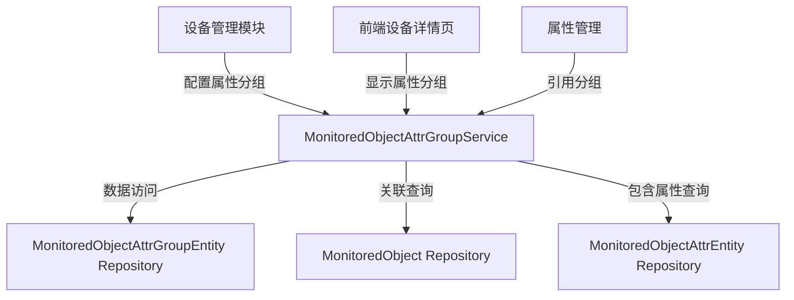

# MonitoredObjectAttrGroupService

## 概述

管理监测对象的静态属性分组，用于组织和管理设备的基本信息。属性分组帮助将设备的多个静态属性按功能分类管理，提高信息的组织性和可维护性。

**位置**：`module/ast-intellisub/Ast.IntelliSub.Application/Services/MonitoredObjectAttrGroupService.cs`
**层**：Application
**模块**：ast-intellisub
**依赖注入**：Scoped

---

## 架构位置



## 核心职责

1. **分组管理**：创建、更新、删除属性分组
2. **属性组织**：将设备的静态属性按分组进行组织和管理
3. **排序控制**：支持通过 `OrderNum` 字段控制分组显示顺序
4. **级联验证**：删除分组前验证是否存在关联的属性

## 关键接口

```csharp
// 创建属性分组
public override Task<MonitoredObjectAttrGroupDto> CreateAsync(MonitoredObjectAttrGroupCreateUpdateDto input);

// 更新属性分组
public override Task<MonitoredObjectAttrGroupDto> UpdateAsync(Guid id, MonitoredObjectAttrGroupCreateUpdateDto input);

// 删除属性分组（需先删除关联的属性）
public override Task DeleteAsync(Guid id);

// 获取属性分组列表（包含分组下的属性）
public override Task<PagedResultDto<MonitoredObjectAttrGroupDto>> GetListAsync(MonitoredObjectAttrGroupGetListInputDto input);
```

## 依赖注入配置

```csharp
// 服务通过 ABP 自动注册机制注入
public class MonitoredObjectAttrGroupService : YiCrudAppService<
    MonitoredObjectAttrGroupEntity,
    MonitoredObjectAttrGroupDto,
    MonitoredObjectAttrGroupDto,
    Guid,
    MonitoredObjectAttrGroupGetListInputDto,
    MonitoredObjectAttrGroupCreateUpdateDto,
    MonitoredObjectAttrGroupCreateUpdateDto>,
    IMonitoredObjectAttrGroupService
```

## 数据流

```
客户端请求获取属性分组
  → 查询属性分组列表（按 OrderNum 排序）
    → 批量查询分组下的所有属性（按 Description 排序）
      → 将属性分配到对应分组
        → 返回包含属性的分组列表
```

## 重要方法

### `CreateAsync()`

**作用**：创建属性分组

**调用链**：
```
客户端.POST /api/app/ast-intellisub/monitored-object-attr-groups
  → MonitoredObjectAttrGroupService.CreateAsync()
    → MonitoredObjectRepository.GetAsync() [验证监测对象]
    → Repository.CheckNameUnique() [验证名称唯一性]
    → Repository.InsertAsync() [创建分组]
```

**业务逻辑**：
1. 验证监测对象是否存在
2. 验证分组名称在同一监测对象下唯一
3. 创建分组记录并返回

### `DeleteAsync()`

**作用**：删除属性分组，需先删除关联的属性

**调用链**：
```
客户端.DELETE /api/app/ast-intellisub/monitored-object-attr-groups/{id}
  → MonitoredObjectAttrGroupService.DeleteAsync()
    → AttrRepository.AnyAsync() [检查是否存在关联属性]
    → Repository.DeleteAsync() [删除分组]
```

**删除验证**：
1. 检查分组下是否存在关联的属性
2. 如果存在属性，抛出异常提示先删除属性
3. 只有在分组为空时才允许删除

### `GetListAsync()`

**作用**：获取属性分组列表，包含分组下的所有属性

**查询特点**：
- 按分组查询（必须指定监测对象ID）
- 分组按 `OrderNum` 升序排序，然后按创建时间排序
- 属性按 `Description` 字段升序排序
- 支持分页查询

**优化查询逻辑**：
1. 查询分组数据并分页
2. 一次性查询所有分组的属性（避免 N+1 查询）
3. 将属性分配到对应的分组

## 源码片段

### 关键实现：创建属性分组

```csharp
// 文件路径: module/ast-intellisub/Ast.IntelliSub.Application/Services/MonitoredObjectAttrGroupService.cs:60-78
[OperLog("创建监测对象属性分组", OperEnum.Insert)]
public override async Task<MonitoredObjectAttrGroupDto> CreateAsync(MonitoredObjectAttrGroupCreateUpdateDto input)
{
    // 验证监测对象是否存在
    var monitoredObject = await _monitoredObjectRepository.GetAsync(input.MonitoredObjectId);
    if (monitoredObject == null)
    {
        throw new UserFriendlyException("监测对象不存在");
    }

    // 验证分组名称在同一对象下唯一
    var exists = await _repository._DbQueryable
        .AnyAsync(x => x.Name == input.Name && x.MonitoredObjectId == input.MonitoredObjectId);
    if (exists)
    {
        throw new UserFriendlyException($"属性分组名称 {input.Name} 已存在");
    }

    return await base.CreateAsync(input);
}
```

### 关键实现：删除验证

```csharp
// 文件路径: module/ast-intellisub/Ast.IntelliSub.Application/Services/MonitoredObjectAttrGroupService.cs:108-119
[OperLog("删除监测对象属性分组", OperEnum.Delete)]
public override async Task DeleteAsync(Guid id)
{
    // 检查是否有关联的属性
    var hasAttrs = await _attrRepository._DbQueryable
        .AnyAsync(x => x.MonitoredObjectAttrGroupId == id);
    if (hasAttrs)
    {
        throw new UserFriendlyException("请先删除分组下的属性");
    }

    await base.DeleteAsync(id);
}
```

### 关键实现：优化查询逻辑

```csharp
// 文件路径: module/ast-intellisub/Ast.IntelliSub.Application/Services/MonitoredObjectAttrGroupService.cs:126-181
public override async Task<PagedResultDto<MonitoredObjectAttrGroupDto>> GetListAsync(MonitoredObjectAttrGroupGetListInputDto input)
{
    // 1. 构建分组查询
    var query = _repository._DbQueryable
        .Where(x => x.MonitoredObjectId == input.MonitoredObjectId);

    // 2. 查询总数
    RefAsync<int> total = 0;

    // 3. 查询分组数据
    var groups = await query
        .OrderBy(x => new { x.OrderNum,x.CreationTime })  // 按序号升序排序，然后按排创建时间排序
        .Select(x => new MonitoredObjectAttrGroupDto
        {
            Id = x.Id,
            Name = x.Name,
            MonitoredObjectId = x.MonitoredObjectId,
            OrderNum = x.OrderNum,
            Icon = x.Icon
        })
        .ToPageListAsync(input.SkipCount, input.MaxResultCount, total);

    if (groups.Any())
    {
        // 4. 获取所有分组的ID
        var groupIds = groups.Select(x => x.Id).ToList();

        // 5. 一次性查询所有属性，按description字段正向排序
        var attributes = await _attrRepository._DbQueryable
            .Where(x => groupIds.Contains(x.MonitoredObjectAttrGroupId))
            .OrderBy(x => x.Description)
            .Select(x => new MonitoredObjectAttrDto
            {
                Id = x.Id,
                Name = x.Name,
                Val = x.Val,
                StrVal = x.StrVal,
                ValueType = x.ValueType,
                Description = x.Description,
                MonitoredObjectAttrGroupId = x.MonitoredObjectAttrGroupId,
            })
            .ToListAsync();

        // 6. 将属性分配到对应的分组，按description字段正向排序
        foreach (var group in groups)
        {
            group.Attributes = attributes
                .Where(x => x.MonitoredObjectAttrGroupId == group.Id)
                .OrderBy(x => x.Description)
                .ToList();
        }
    }

    return new PagedResultDto<MonitoredObjectAttrGroupDto>(total, groups);
}
```

## 权限控制

```csharp
// ABP 权限定义（通过 [Authorize] 特性全局授权）
[Authorize]
public class MonitoredObjectAttrGroupService : YiCrudAppService<...>
{
    // 所有方法都需要用户认证
}

// 操作日志记录
[OperLog("创建监测对象属性分组", OperEnum.Insert)]
public override async Task<MonitoredObjectAttrGroupDto> CreateAsync(...)

[OperLog("更新监测对象属性分组", OperEnum.Update)]
public override async Task<MonitoredObjectAttrGroupDto> UpdateAsync(...)

[OperLog("删除监测对象属性分组", OperEnum.Delete)]
public override async Task DeleteAsync(...)
```

## 相关组件

- [[MonitoredObjectAttrService]] - 属性管理（调用方）
- [[MonitoredObjectService]] - 监测对象管理（依赖项）
- [[MonitoredObjectAttrGroupEntity]] - 属性分组实体
- [[MonitoredObjectAttrEntity]] - 属性实体
- [[MonitoredObjectAttrGroupDto]] - 数据传输对象

## 业务规则

### 分组名称唯一性
- 分组名称在同一监测对象下必须唯一
- 创建和更新时都会进行唯一性验证

### 删除约束
- 分组下存在属性时不允许删除
- 必须先删除分组下的所有属性，然后才能删除分组

### 排序规则
- 分组按 `OrderNum` 升序排序，然后按创建时间排序
- 属性按 `Description` 字段升序排序

### 查询优化
- 使用批量查询避免 N+1 查询问题
- 一次性查询所有分组的属性，然后在内存中分配

## 数据结构

### MonitoredObjectAttrGroupDto
```csharp
public class MonitoredObjectAttrGroupDto
{
    public Guid Id { get; set; }
    public string Name { get; set; }
    public Guid MonitoredObjectId { get; set; }
    public int OrderNum { get; set; }
    public string Icon { get; set; }
    
    // 包含的属性列表
    public List<MonitoredObjectAttrDto> Attributes { get; set; }
}
```

### MonitoredObjectAttrDto
```csharp
public class MonitoredObjectAttrDto
{
    public Guid Id { get; set; }
    public string Name { get; set; }
    public string Val { get; set; }
    public string StrVal { get; set; }
    public string ValueType { get; set; }
    public string Description { get; set; }
    public Guid MonitoredObjectAttrGroupId { get; set; }
}
```

## 学习笔记

### 难点理解

1. **分组的作用**：属性分组用于组织设备的静态属性，如"基本信息"、"技术参数"、"运行状态"等，便于前端展示和管理
2. **查询优化**：使用批量查询避免 N+1 查询问题，提高查询性能
3. **删除约束**：强制用户先删除属性才能删除分组，避免数据不一致

### 疑问

1. **图标支持**：当前 `Icon` 字段的使用方式和图标格式需要进一步明确
2. **属性排序**：属性按 `Description` 排序的合理性，是否支持自定义排序

## 参考资料

- [ABP Framework 应用服务文档](https://docs.abp.io/docs/abp/latest/Application-Services)
- 项目源码：`module/ast-intellisub/Ast.IntelliSub.Application/Services/MonitoredObjectAttrGroupService.cs`
- 相关实体：`module/ast-intellisub/Ast.IntelliSub.Domain/Entities/MonitoredObjectAttrGroupEntity.cs`

---
**状态**：✅ 完成